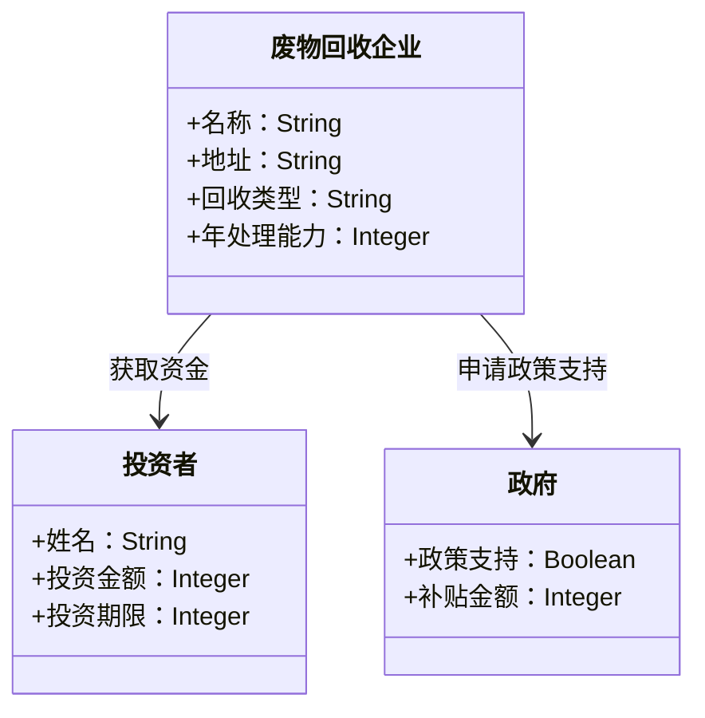
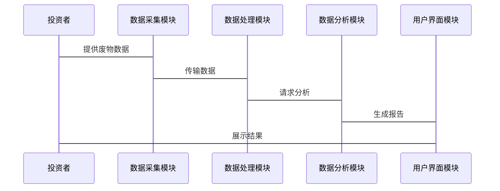

                 


# 循环经济模式下的废物回收企业投资

## 关键词
循环经济，废物回收，投资分析，资源化利用，可持续发展

## 摘要
本文探讨了循环经济模式下废物回收企业的投资机会和策略。通过分析循环经济的基本概念、废物回收的现状及问题，详细讲解了循环经济模式的核心概念与联系，构建了一个基于循环经济的投资评估模型，并通过系统分析与架构设计，提出了一个支持循环经济模式的废物回收系统。最后，通过实际案例分析和最佳实践，为投资者提供了实用的建议和未来的发展方向。

---

## 第1章 循环经济模式与废物回收概述

### 1.1 循环经济的基本概念

#### 1.1.1 循环经济的定义与内涵
循环经济是以资源节约和循环利用为核心的发展模式，强调通过减少资源消耗、提高资源利用效率和实现废弃物资源化，构建可持续发展的经济体系。其核心在于“减量化、再利用、再循环”原则，即“3R”原则。

#### 1.1.2 循环经济的核心原则
1. **减量化（Reduce）**：通过减少资源的消耗和产品的生产，降低废物的产生量。
2. **再利用（Reuse）**：延长产品的使用寿命，通过维修、翻新等方式实现资源的重复利用。
3. **再循环（Recycle）**：将废弃物转化为新的资源，实现资源的循环利用。

#### 1.1.3 循环经济与可持续发展的关系
循环经济是实现可持续发展的重要途径。通过减少资源消耗和环境污染，循环经济不仅有助于经济增长，还能保护环境，为子孙后代创造更好的生活环境。

### 1.2 废物回收的现状与问题

#### 1.2.1 全球废物产生与处理现状
全球每年产生的废物量巨大，且呈增长趋势。根据统计，2020年全球废物产生量约为21亿吨，其中只有不到50%的废物得到了有效处理。

#### 1.2.2 废物回收行业面临的挑战
1. **成本问题**：废物回收的前期投入较大，且回收过程中可能面临二次污染和资源浪费的问题。
2. **技术限制**：部分废弃物的回收技术尚不成熟，导致回收效率低下。
3. **政策支持不足**：在一些地区，废物回收行业的政策支持力度不够，导致企业难以盈利。

#### 1.2.3 废物回收对环境的影响
废物回收可以减少对自然资源的依赖，降低环境污染，同时还能节约能源，减少碳排放。

### 1.3 循环经济模式下的废物回收

#### 1.3.1 循环经济模式的特点
1. **闭环性**：循环经济模式强调资源的闭环流动，确保资源在各个环节中得到充分利用。
2. **资源化利用**：通过技术创新，将废弃物转化为高附加值的产品，实现资源的高效利用。
3. **可持续性**：循环经济模式注重长期发展的可持续性，避免短期行为对环境造成破坏。

#### 1.3.2 废物回收在循环经济中的地位
废物回收是循环经济中的重要环节，是实现资源循环利用的关键。通过废物回收，企业可以降低原材料的依赖，减少生产成本，同时还能为环境保护做出贡献。

#### 1.3.3 废物资源化利用的潜力
随着技术的进步，越来越多的废弃物可以通过资源化利用转化为新的资源。例如，塑料废弃物可以转化为再生塑料，废金属可以重新冶炼成金属材料等。

---

## 第2章 循环经济模式下的废物回收企业投资分析

### 2.1 废物回收行业的投资驱动因素

#### 2.1.1 环境压力与政策支持
随着环境问题的加剧，各国政府纷纷出台相关政策，鼓励废物回收和资源化利用。例如，中国的《固体废物污染环境防治法》明确规定了废物回收的责任和义务。

#### 2.1.2 技术进步与成本下降
近年来，废物回收技术取得了显著进步。例如，智能分拣技术的应用提高了回收效率，降低了回收成本。此外，新型材料技术的发展也为废弃物的资源化利用提供了更多可能性。

#### 2.1.3 市场需求的增长
随着消费者环保意识的增强，对可再生产品的需求不断增加。这为废物回收企业提供了更多的市场机会。

### 2.2 废物回收企业的商业模式

#### 2.2.1 收购-处理-销售模式
企业通过收购废料，进行加工处理，再将处理后的材料出售给下游企业。这种模式简单易行，但利润空间有限。

#### 2.2.2 资源化利用模式
企业通过技术创新，将废弃物转化为高附加值的产品。例如，废塑料可以转化为再生塑料，废纸可以转化为再造纸。

#### 2.2.3 共享经济模式
通过共享经济模式，企业可以与上下游企业合作，共同分担资源回收和利用的成本，实现共赢。

### 2.3 循环经济模式下的投资机会

#### 2.3.1 废物资源化利用的市场潜力
随着技术的进步和市场需求的增长，废弃物资源化利用的市场潜力巨大。例如，再生塑料市场预计在未来几年内增长迅速。

#### 2.3.2 技术创新带来的投资机会
技术创新是推动废物回收行业发展的关键。例如，智能分拣技术、新型材料技术等都为投资者提供了新的机会。

#### 2.3.3 政策支持下的投资趋势
政策支持为废物回收行业提供了良好的发展环境。例如，政府通过税收优惠、补贴等方式，鼓励企业投资废物回收项目。

---

## 第3章 循环经济模式的核心概念与联系

### 3.1 循环经济模式的核心概念

#### 3.1.1 资源流动的闭环性
循环经济模式强调资源的闭环流动，确保资源在各个环节中得到充分利用，避免浪费。

#### 3.1.2 废物资源化利用
通过技术创新，将废弃物转化为高附加值的产品，实现资源的高效利用。

#### 3.1.3 投资回报模型
建立一个科学的投资回报模型，帮助企业评估废物回收项目的经济效益。

### 3.2 核心概念的属性特征对比

| 概念         | 属性       | 特征                               |
|--------------|------------|------------------------------------|
| 资源流动     | 闭环性     | 资源在各个环节中循环流动           |
| 废物资源化利用 | 可再生性   | 废弃物可以转化为新的资源         |
| 投资回报模型 | 经济效益   | 通过模型评估项目盈利能力           |

### 3.3 实体关系图

```mermaid
erDiagram
    actor 投资者
    actor 政府
    actor 消费者
    actor 企业
    database 废物资源
    database 资源流动
    database 投资回报

    投资者 --> 废物资源 : 收购
    投资者 --> 资源流动 : 投资
    投资者 --> 投资回报 : 评估
    政府 --> 资源流动 : 支持政策
    企业 --> 废物资源 : 处理
    消费者 --> 资源流动 : 需求
```

---

## 第4章 投资评估模型的算法原理

### 4.1 投资评估模型的设计

#### 4.1.1 模型的目标
建立一个科学的投资评估模型，帮助企业评估废物回收项目的经济效益和环境效益。

#### 4.1.2 模型的输入
1. 投资成本
2. 运营成本
3. 收益预测
4. 投资期限
5. 折现率

### 4.2 投资评估模型的数学公式

净现值（Net Present Value，NPV）计算公式：
$$ NPV = \sum_{t=0}^{n} \frac{C_t}{(1 + r)^t} $$
其中，\( C_t \) 是第 \( t \) 年的净现金流，\( r \) 是折现率，\( n \) 是投资期限。

内部收益率（Internal Rate of Return，IRR）计算公式：
$$ NPV = 0 = \sum_{t=0}^{n} \frac{C_t}{(1 + IRR)^t} $$

### 4.3 投资评估模型的实现

```python
def calculate_npv(cash_flows, discount_rate):
    npv = sum(c / (1 + discount_rate) ** t for t, c in enumerate(cash_flows))
    return npv

def calculate_irr(cash_flows):
    from scipy import optimize
    def npv_func(irr):
        return sum(c / (1 + irr) ** t for t, c in enumerate(cash_flows)) - 1
    irr = optimize.root_scalar(npv_func, method='newton', x0=0.1)
    return irr.root

# 示例数据
cash_flows = [-100, 50, 60, 70]
discount_rate = 0.1

npv = calculate_npv(cash_flows, discount_rate)
print("净现值(Net Present Value)：", npv)

irr = calculate_irr(cash_flows)
print("内部收益率(Internal Rate of Return)：", irr)
```

---

## 第5章 系统分析与架构设计

### 5.1 系统功能设计

#### 5.1.1 领域模型


#### 5.1.2 系统架构设计
```mermaid
containerDiagram
    container 废物回收系统 {
        component 数据采集模块 {
            数据采集
        }
        component 数据处理模块 {
            数据清洗
        }
        component 数据分析模块 {
            投资评估
        }
        component 用户界面模块 {
            报告生成
        }
    }
```

#### 5.1.3 接口设计


---

## 第6章 项目实战

### 6.1 环境安装

```bash
pip install numpy pandas matplotlib
```

### 6.2 核心代码实现

```python
import numpy as np
import pandas as pd

def investment_analysis(initial_investment, annual_cash_flows, discount_rate, period):
    npv = np.npv(discount_rate, annual_cash_flows, initial_investment)
    irr = np.irr(annual_cash_flows + (initial_investment,))
    return npv, irr

# 示例数据
initial_investment = -1000
annual_cash_flows = [500, 600, 700]
discount_rate = 0.1
period = 3

npv, irr = investment_analysis(initial_investment, annual_cash_flows, discount_rate, period)
print("净现值(Net Present Value)：", npv)
print("内部收益率(Internal Rate of Return)：", irr)
```

### 6.3 案例分析

假设某废物回收企业计划投资一个年处理能力为1000吨的塑料回收项目，初始投资为500万元，年处理成本为100万元，年收益为600万元，投资期限为5年，折现率为10%。计算其净现值和内部收益率。

---

## 第7章 最佳实践

### 7.1 投资的关键点

1. **技术选择**：选择成熟且高效的回收技术，确保项目的可行性。
2. **政策支持**：密切关注政策变化，充分利用政府的优惠政策。
3. **市场需求**：了解目标市场的需求，确保项目的可持续性。

### 7.2 小结

循环经济模式下的废物回收企业投资具有广阔的发展前景。通过科学的投资评估模型和系统的架构设计，企业可以有效降低投资风险，提高投资回报率。

### 7.3 注意事项

1. **风险评估**：在投资前，需对市场、技术和政策风险进行充分评估。
2. **持续创新**：随着技术的进步和市场需求的变化，企业需不断创新，保持竞争优势。

### 7.4 拓展阅读

1. 《循环经济与可持续发展》
2. 《废物资源化利用技术》
3. 《投资评估模型与应用》

---

## 作者

作者：AI天才研究院/AI Genius Institute & 禅与计算机程序设计艺术/Zen And The Art of Computer Programming

---

以上是《循环经济模式下的废物回收企业投资》的技术博客文章，希望对您有所帮助！

