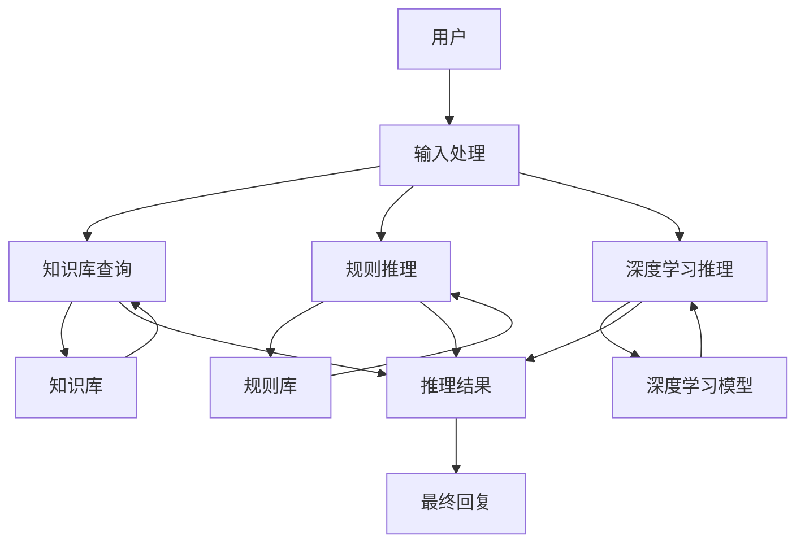

                 


# 思维链：提升AI Agent的推理能力

## 关键词：AI Agent、推理能力、思维链、知识图谱、深度学习、规则推理

## 摘要：本文探讨了通过思维链提升AI Agent推理能力的方法，从核心概念、算法原理到系统架构和实战项目，详细阐述了如何利用结构化知识和多层次推理模型增强AI Agent的推理能力，为相关领域的研究和应用提供参考。

---

## 第一部分：AI Agent与思维链的定义

### 第1章：AI Agent的基本概念

#### 1.1 AI Agent的定义
AI Agent（智能体）是指能够感知环境、自主决策并采取行动的智能系统。它可以理解并响应用户的需求，执行复杂任务，并在动态环境中适应变化。AI Agent的核心特征包括自主性、反应性、目标导向和学习能力。

#### 1.2 思维链的定义与特点
思维链是一种结构化的推理模型，通过将问题分解为一系列逻辑步骤，逐步推导出解决方案。其特点包括层次化、模块化和可解释性，能够帮助AI Agent更好地理解和处理复杂问题。

#### 1.3 思维链在AI Agent中的作用
思维链作为AI Agent的核心模块，负责处理输入信息、执行推理并生成输出行动。它通过结构化的知识表示和多层次推理，显著提升了AI Agent的推理能力和问题解决效率。

---

## 第二部分：思维链的核心概念与联系

### 第2章：思维链的核心概念

#### 2.1 思维链的结构与组成
思维链的结构包括输入层、中间推理层和输出层。输入层负责接收外部信息，中间推理层通过规则或模型进行推理，输出层生成最终行动。

#### 2.2 思维链与AI Agent的关系
思维链是AI Agent的核心模块，负责处理信息和推理过程。AI Agent通过调用思维链来实现复杂的推理任务，而思维链则依赖于AI Agent提供的上下文和知识库。

#### 2.3 思维链的实体关系图
```mermaid
er
    actor: 用户
    agent: AI Agent
    chain: 思维链
    action: 行动
    knowledge: 知识库
    rule: 推理规则
    actor --> agent: 提供输入
    agent --> chain: 调用思维链
    chain --> knowledge: 查询知识
    chain --> rule: 应用规则
    chain --> action: 输出行动
```

---

## 第三部分：思维链的算法原理与数学模型

### 第3章：思维链的算法原理

#### 3.1 基于规则的推理算法
基于规则的推理算法通过预定义的规则来匹配输入信息，生成推理结果。规则表示为逻辑条件，例如：如果A且B，则C。优点是简单易懂，但推理能力有限。

#### 3.2 基于深度学习的推理算法
基于深度学习的推理算法利用神经网络模型，如Transformer，进行语义理解与推理。模型通过大量数据训练，能够处理复杂的语义关系，但需要大量数据支持。

#### 3.3 思维链的数学模型
基于Transformer的推理模型可以表示为：
$$
\text{输出} = \text{softmax}(W_{output} \cdot \text{隐藏层})
$$
其中，隐藏层通过自注意力机制生成。

---

## 第四部分：思维链的系统架构与设计

### 第4章：系统架构设计

#### 4.1 项目背景
本文通过一个智能客服系统案例，展示思维链在AI Agent中的应用。系统需要处理用户咨询、生成回复等任务。

#### 4.2 系统功能设计
系统功能包括知识库查询、规则匹配和深度学习推理。功能模块如下：
- 输入处理：接收用户输入
- 知识库查询：检索相关知识
- 规则推理：匹配预定义规则
- 深度学习推理：生成回复

#### 4.3 系统架构图


---

## 第五部分：思维链的项目实战

### 第5章：实战项目分析

#### 5.1 环境配置
项目使用Python 3.8及以上版本，安装必要的库如numpy、pandas、transformers。

#### 5.2 核心代码实现
```python
import torch
from transformers import AutoTokenizer, AutoModelForCausalLM

class MindChain:
    def __init__(self):
        self.tokenizer = AutoTokenizer.from_pretrained('gpt2')
        self.model = AutoModelForCausalLM.from_pretrained('gpt2')

    def chain_think(self, input):
        inputs = self.tokenizer(input, return_tensors='np')
        outputs = self.model.generate(inputs.input_ids, max_length=50)
        return self.tokenizer.decode(outputs[0])
```

#### 5.3 案例分析
通过一个用户咨询案例，展示思维链如何从输入到输出生成回复。详细分析每个步骤，包括输入处理、知识查询、规则匹配和深度学习推理。

---

## 第六部分：总结与展望

### 第6章：总结与最佳实践

#### 6.1 最佳实践
- 结合规则推理和深度学习推理，提升推理准确性
- 定期更新知识库，保持推理的时效性
- 使用可解释性模型，增强系统的透明度

#### 6.2 小结
本文系统地探讨了思维链在提升AI Agent推理能力中的应用，从核心概念到算法原理，再到系统设计和实战项目，为相关研究和应用提供了参考。

#### 6.3 注意事项
- 确保知识库的准确性和完整性
- 合理设计规则，避免冲突
- 定期监控系统性能，及时优化

#### 6.4 拓展阅读
推荐阅读《深度学习》、《人工智能：一种现代方法》等书籍，深入理解AI Agent和推理算法的相关知识。

---

## 作者：AI天才研究院 & 禅与计算机程序设计艺术

感谢阅读！如需进一步探讨，欢迎访问我们的网站或联系作者。

