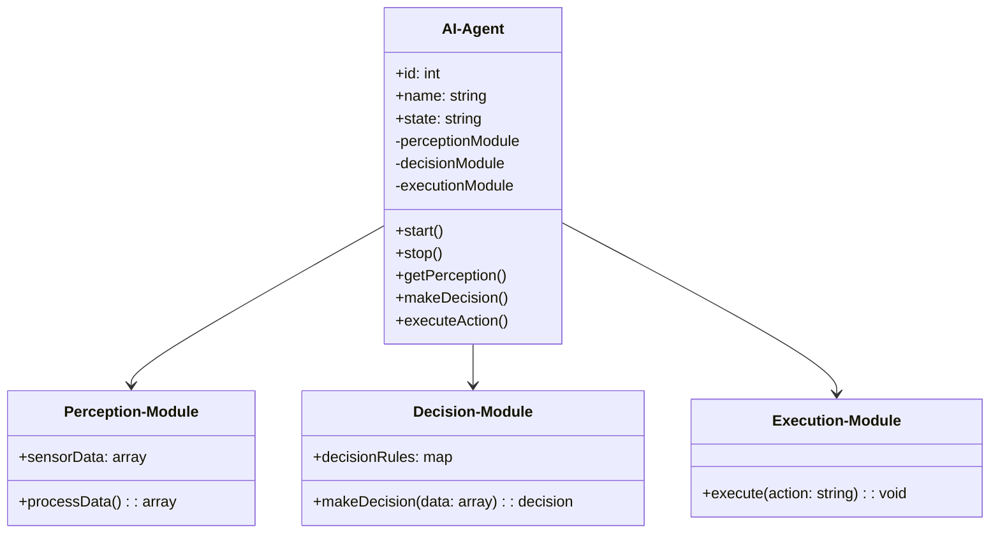
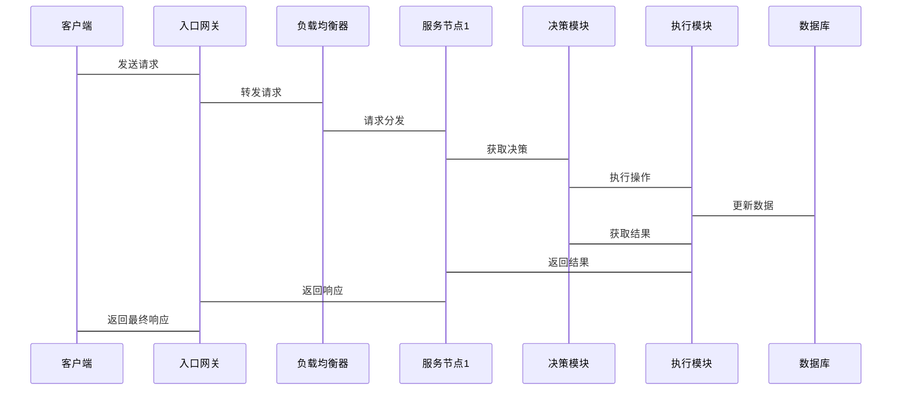

                 


# 性能优化：提升AI Agent的响应速度

> **关键词**：AI Agent、性能优化、响应速度、算法优化、系统架构、多线程、分布式计算

> **摘要**：本文详细探讨了提升AI Agent响应速度的性能优化方法，涵盖了从核心概念到系统架构设计，再到算法优化和项目实战的各个方面。通过分析AI Agent的体系结构，讨论了计算效率、内存管理和网络优化的核心原理，并提供了具体的优化策略和实际案例，帮助读者掌握性能优化的核心技巧。

---

## 引言

随着AI技术的飞速发展，AI Agent（智能体）在各个领域的应用越来越广泛。然而，AI Agent的响应速度直接影响用户体验和系统性能。本文旨在通过系统性的分析和实践，探讨如何优化AI Agent的性能，从而提升其响应速度。

---

## 第1章：AI Agent的核心概念

### 1.1 AI Agent的基本概念

AI Agent是一种能够感知环境并采取行动以实现目标的智能实体。它可以分为以下几类：

1. **简单反射型Agent**：基于当前感知做出反应，不依赖历史信息。
2. **基于模型的反射型Agent**：利用内部模型进行决策，考虑历史信息。
3. **目标驱动型Agent**：根据目标选择行动，可能涉及多步推理。
4. **效用驱动型Agent**：通过最大化效用函数来优化决策。

AI Agent的应用场景包括自动驾驶、智能助手、机器人控制等。

### 1.2 性能优化的目标

- **用户体验**：减少响应时间，提高交互流畅性。
- **系统性能**：降低资源消耗，提升吞吐量。
- **业务价值**：提高系统可用性，增强竞争力。

---

## 第2章：性能优化的核心原理

### 2.1 计算效率的提升

#### 并行计算与串行计算的区别

- **串行计算**：任务按顺序执行，依赖前一步骤的结果。
- **并行计算**：任务分解为多个子任务，同时执行，提高效率。

#### 多线程与多进程的优缺点

- **多线程**：共享内存，资源消耗低，适合I/O密集型任务。
- **多进程**：独立内存空间，适合CPU密集型任务，但资源消耗较高。

#### GPU加速的基本原理

GPU通过并行计算能力，显著加速大规模数据处理任务，特别适用于图形渲染和深度学习。

### 2.2 内存管理的优化

#### 内存泄漏的定义与危害

- **内存泄漏**：未释放分配的内存，导致资源耗尽，最终引发系统崩溃。

#### 内存分配的优化策略

- 使用智能指针或自动内存管理技术，如Python的垃圾回收机制。

#### 内存碎片的处理方法

- 使用内存池技术，减少碎片产生，提高内存利用率。

### 2.3 网络传输的优化

#### 网络延迟的定义与影响

- **网络延迟**：数据包在传输过程中的延迟，直接影响响应速度。

#### 数据压缩与解压缩的原理

- 使用压缩算法（如gzip）减少数据传输量，提升传输速度。

#### 数据分片与负载均衡的实现

- 将数据分成多个部分，分别传输，利用负载均衡技术分配到不同的服务器，提高吞吐量。

---

## 第3章：AI Agent的体系结构

### 3.1 AI Agent的组成模块

AI Agent通常由以下模块组成：

1. **感知模块**：负责接收和处理外部输入，如传感器数据。
2. **决策模块**：基于感知信息进行推理和决策。
3. **执行模块**：根据决策结果执行具体操作。

### 3.2 各模块之间的关系

- **感知与决策的交互流程**：感知模块将数据传递给决策模块，决策模块根据数据做出决策。
- **决策与执行的协同机制**：决策模块将决策结果传递给执行模块，执行模块负责具体操作。
- **模块间通信的优化策略**：使用高效的通信协议，减少数据传输延迟。

### 3.3 体系结构的优缺点分析

- **分层架构**：结构清晰，易于维护，但可能增加模块间的通信开销。
- **微服务架构**：高度可扩展，但可能增加系统复杂性和维护成本。
- **混合架构**：结合分层和微服务架构的优点，适用于复杂场景。

---

## 第4章：性能优化的算法原理

### 4.1 常见的优化算法

#### 贪心算法

- **贪心算法**：在每一步选择中，都做出在当前状态下最好或最优（即最有利）的选择，从而希望导致结果是全局最好或最优的选择。
- **示例**：最小生成树的Kruskal算法和Prim算法。

#### 分支限界算法

- **分支限界法**：在问题分解后，逐个探索可能的分支，使用边界条件剪枝，避免不必要的计算。
- **示例**：旅行商问题（TSP）的求解。

#### 动态规划算法

- **动态规划**：将问题分解为更小的子问题，记录子问题的解，避免重复计算。
- **示例**：背包问题的求解。

### 4.2 算法优化策略

- **选择合适的算法**：根据问题特点选择最优算法。
- **优化数据结构**：使用高效的数据结构，减少操作时间。
- **并行化算法**：将算法分解为多个部分，利用多核处理器进行并行计算。

---

## 第5章：系统架构设计

### 5.1 系统功能设计

#### 领域模型设计

- **领域模型**：用类图表示系统中的实体及其关系，帮助设计人员理解系统结构。

#### 领域模型Mermaid类图



### 5.2 系统架构设计

#### 系统架构Mermaid图


### 5.3 系统接口设计

- **API接口**：定义清晰的RESTful API，确保模块间高效通信。
- **通信协议**：选择高效的协议，如gRPC，减少传输延迟。

### 5.4 系统交互Mermaid序列图



---

## 第6章：项目实战

### 6.1 环境搭建

- **工具安装**：安装必要的开发工具，如Python、Git、虚拟机等。
- **依赖管理**：使用pip管理Python包，确保版本兼容。

### 6.2 核心实现源代码

以下是一个简单的AI Agent优化案例：

```python
import threading
import time

class PerceptionModule:
    def __init__(self):
        self.data = []

    def process_data(self):
        # 模拟数据处理
        self.data = [i for i in range(1000)]
        return self.data

class DecisionModule:
    def __init__(self):
        self.data = None

    def make_decision(self, data):
        self.data = data
        # 模拟决策过程
        return "execute_action"

class ExecutionModule:
    def __init__(self):
        pass

    def execute_action(self):
        # 模拟执行操作
        time.sleep(0.1)
        print("Action executed.")

class AI-Agent:
    def __init__(self):
        self.perception = PerceptionModule()
        self.decision = DecisionModule()
        self.execution = ExecutionModule()

    def run(self):
        data = self.perception.process_data()
        decision = self.decision.make_decision(data)
        self.execution.execute_action()

if __name__ == "__main__":
    agent = AI-Agent()
    agent.run()
```

### 6.3 性能分析与优化

通过分析代码，发现主要的性能瓶颈在于数据处理和决策过程。通过并行化数据处理和优化决策算法，可以显著提升性能。

---

## 第7章：测试与调优

### 7.1 性能测试

使用工具如JMeter进行压力测试，模拟大量请求，观察系统的响应时间和吞吐量。

### 7.2 调优策略

- **线程池优化**：合理配置线程池大小，避免资源耗尽。
- **数据库优化**：使用索引和查询优化，减少数据库访问时间。
- **缓存机制**：引入缓存技术，减少重复计算。

---

## 第8章：案例分析与总结

### 8.1 案例分析

通过一个具体的优化案例，分析优化前后的性能变化，验证优化策略的有效性。

### 8.2 优化经验总结

- **理论与实践结合**：理解优化原理，结合实际场景进行调整。
- **监控与分析**：使用监控工具实时分析系统性能，找出瓶颈。
- **持续优化**：根据监控结果，持续优化系统，提升性能。

### 8.3 未来研究方向

- **边缘计算**：将计算能力部署在边缘设备，减少数据传输延迟。
- **自适应优化算法**：根据系统状态动态调整优化策略。

---

## 结论

性能优化是提升AI Agent响应速度的关键。通过系统性地分析和实践，我们可以掌握多种优化方法，如并行计算、内存管理和算法优化。未来，随着技术的发展，AI Agent的性能优化将更加智能化和自动化，为用户提供更高效的智能服务。

---

## 作者

作者：AI天才研究院/AI Genius Institute & 禅与计算机程序设计艺术 /Zen And The Art of Computer Programming

