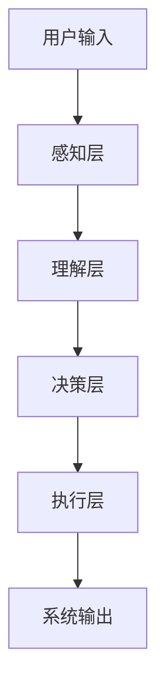

                 


# 情境感知AI Agent：适应动态环境

> **关键词**：情境感知AI Agent、动态环境、自适应学习、实时决策、多模态数据、人工智能系统架构  
> 
> **摘要**：情境感知AI Agent是一种能够在动态环境中感知、理解和适应环境变化的智能体。本文从背景、核心概念、算法原理、系统架构、项目实战、优化与挑战、未来趋势等方面，全面探讨情境感知AI Agent的理论与实践。通过具体案例和数学模型，详细分析其在智能助手、自动驾驶等领域的应用，并总结其在动态环境中的优势与挑战。

---

## 第一部分: 情境感知AI Agent基础

### 第1章: 情境感知AI Agent的背景与定义

#### 1.1 情境感知的概念与技术基础
情境感知是一种智能技术，旨在通过感知环境中的动态信息，理解上下文，并据此做出适应性决策。其技术基础包括传感器数据处理、语义分析、多模态数据融合等。

| **概念**       | **描述**                                                                 |
|----------------|--------------------------------------------------------------------------|
| 感知层         | 通过传感器、摄像头等设备采集环境数据。                                       |
| 理解层         | 对感知数据进行语义分析，理解环境的上下文。                                   |
| 决策层         | 根据理解结果生成适应性决策。                                                 |

#### 1.2 AI Agent的基本概念
AI Agent是一种能够感知环境、自主决策并执行任务的智能体。情境感知AI Agent在传统AI Agent的基础上，增加了对动态环境的适应能力。

| **类型**       | **特点**                                                                 |
|----------------|--------------------------------------------------------------------------|
| 反应式AI Agent  | 基于当前感知做出实时反应，适用于动态环境。                                   |
| 生成式AI Agent  | 基于生成模型（如GPT）生成多样化决策，适用于需要创造性的场景。                 |

#### 1.3 情境感知的应用场景
情境感知AI Agent广泛应用于智能助手、自动驾驶、智慧城市等领域。

| **领域**       | **应用案例**                                                             |
|----------------|--------------------------------------------------------------------------|
| 智能助手       | 根据用户的位置和时间推荐服务。                                               |
| 自动驾驶       | 基于实时交通状况调整驾驶策略。                                             |
| 智慧城市       | 根据人流密度调整公共设施的资源配置。                                         |

#### 1.4 情境感知的挑战与研究现状
动态环境中的不确定性、多模态数据的融合、算法的实时性等问题是当前研究的热点。

---

## 第二部分: 情境感知AI Agent的核心概念与原理

### 第2章: 情境感知模型与决策机制

#### 2.1 情境感知模型的构建
情境感知模型包括感知层、理解层和预测层。

##### 2.1.1 感知层：环境数据的采集与处理
- **传感器数据处理**：通过摄像头、麦克风等设备采集环境数据。
- **数据预处理**：去噪、特征提取等。

##### 2.1.2 理解层：语义分析与上下文推理
- **语义分析**：使用NLP技术理解文本含义。
- **上下文推理**：基于历史数据推断当前情境。

##### 2.1.3 预测层：未来状态的预测与评估
- **状态预测**：基于当前状态预测未来可能的状态。
- **风险评估**：评估不同预测结果的风险。

#### 2.2 决策机制的设计
决策机制是情境感知AI Agent的核心，包括基于情境的决策框架和多目标优化。

##### 2.2.1 基于情境的决策框架
- **情境特征提取**：提取与决策相关的特征。
- **决策规则**：根据特征生成决策规则。

##### 2.2.2 多目标优化与权衡
- **目标函数**：定义优化目标。
- **权衡策略**：在多个目标之间进行权衡。

#### 2.3 自适应学习与进化
自适应学习是情境感知AI Agent的重要能力，包括在线学习与增量训练。

##### 2.3.1 在线学习与增量训练
- **在线学习**：在实时数据流中更新模型。
- **增量训练**：逐步优化模型参数。

##### 2.3.2 知识更新与模型优化
- **知识库更新**：根据新数据更新知识库。
- **模型优化**：使用优化算法（如强化学习）改进模型性能。

---

## 第三部分: 情境感知AI Agent的算法原理

### 第3章: 情境感知模型的数学基础

#### 3.1 概率论与统计推断
概率论是情境感知的核心数学工具，用于处理不确定性。

##### 3.1.1 贝叶斯定理
贝叶斯定理用于计算条件概率，公式如下：
$$ P(A|B) = \frac{P(B|A)P(A)}{P(B)} $$

##### 3.1.2 马尔可夫链
马尔可夫链用于建模状态转移过程，适用于时间序列数据。

#### 3.2 优化理论与强化学习
强化学习是动态环境下决策优化的重要方法。

##### 3.2.1 Q-learning算法
Q-learning是一种经典的强化学习算法，公式如下：
$$ Q(s, a) = r + \gamma \max_{a'} Q(s', a') $$

##### 3.2.2 近端策略优化（PPO）
PPO是一种高效的强化学习算法，适用于高维状态空间。

---

## 第四部分: 情境感知AI Agent的系统架构与设计

### 第4章: 系统架构与接口设计

#### 4.1 系统架构设计
情境感知AI Agent的系统架构包括感知层、决策层和执行层。

##### 4.1.1 感知层
- **功能**：采集环境数据。
- **模块**：传感器、数据预处理。

##### 4.1.2 决策层
- **功能**：生成决策。
- **模块**：情境模型、决策算法。

##### 4.1.3 执行层
- **功能**：执行决策。
- **模块**：执行机构、反馈机制。

#### 4.2 接口设计
- **输入接口**：接收环境数据。
- **输出接口**：输出决策结果。

##### 4.2.1 系统交互流程图


---

## 第五部分: 情境感知AI Agent的项目实战

### 第5章: 项目实战与案例分析

#### 5.1 智能助手项目
##### 5.1.1 环境配置
- **工具**：Python、TensorFlow、Keras。
- **数据集**：公开对话数据集。

##### 5.1.2 核心代码实现
```python
class ContextualAgent:
    def __init__(self):
        self.model = load_model('contextual_model.h5')
    
    def perceive(self, input_data):
        # 数据预处理
        processed_data = preprocess(input_data)
        return processed_data
    
    def decide(self, context):
        # 基于上下文生成决策
        decision = self.model.predict(context)
        return decision
    
    def execute(self, action):
        # 执行动作
        execute_action(action)
```

##### 5.1.3 功能模块解读
- **感知模块**：处理输入数据。
- **决策模块**：生成决策。
- **执行模块**：执行决策。

---

## 第六部分: 情境感知AI Agent的优化与挑战

### 第6章: 系统优化与挑战

#### 6.1 系统优化
- **算法优化**：改进强化学习算法。
- **资源优化**：减少计算资源消耗。

#### 6.2 挑战与解决方案
- **数据安全**：加密处理敏感数据。
- **隐私保护**：采用匿名化技术。

---

## 第七部分: 情境感知AI Agent的未来趋势与总结

### 第7章: 未来趋势与总结

#### 7.1 未来趋势
- **多模态数据融合**：结合视觉、听觉等多种数据源。
- **边缘计算**：在边缘设备上进行实时处理。

#### 7.2 总结
情境感知AI Agent在动态环境中的应用前景广阔，但仍需解决实时性、数据安全等问题。

---

**作者：AI天才研究院 & 禅与计算机程序设计艺术**

