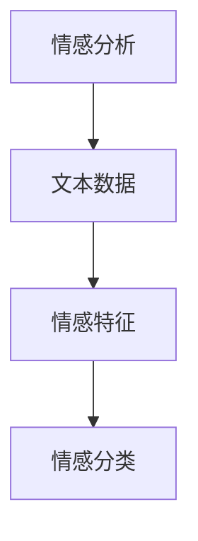
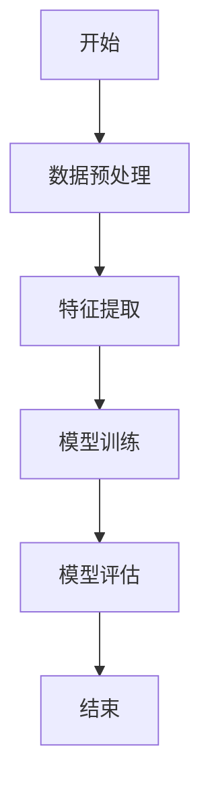
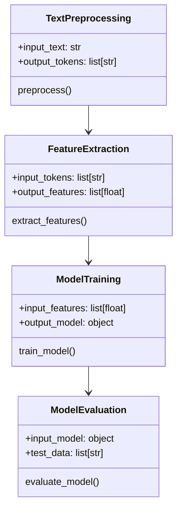
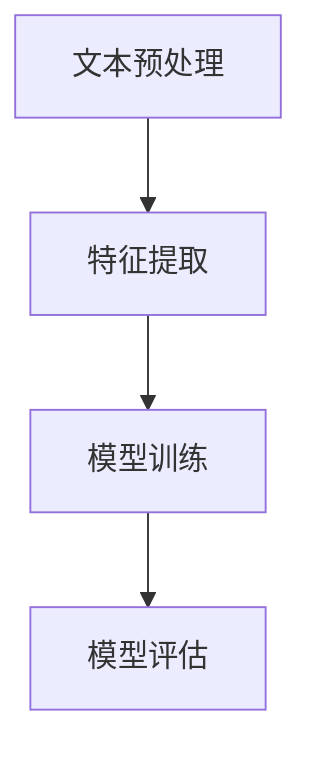
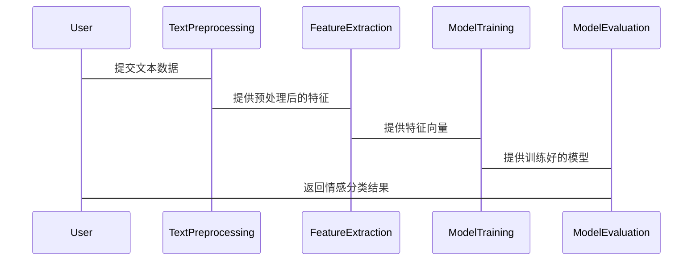

                 


# 情感分析：赋予AI Agent理解人类情绪的能力

## 关键词：情感分析、人工智能、自然语言处理、深度学习、文本挖掘

## 摘要：情感分析是一种通过计算机技术来识别和理解人类情感倾向的方法。本文将从情感分析的背景、核心概念、算法原理、系统架构到实际项目实战，全面深入地探讨如何赋予AI Agent理解人类情绪的能力。通过本文，读者将能够掌握情感分析的核心技术，并能够在实际应用中有效运用这些技术。

---

# 第1章：情感分析概述

## 1.1 情感分析的定义与背景

### 1.1.1 情感分析的定义
情感分析（Sentiment Analysis），又称情绪分析，是一种自然语言处理（NLP）技术，用于识别和分类文本中的情感倾向。情感分析的目标是将文本（如评论、 tweets、产品评价等）分类为正面、负面或中性。

### 1.1.2 情感分析的发展历程
情感分析起源于20世纪60年代，最初主要应用于心理学和语言学领域。随着计算机技术的发展，情感分析逐渐从人工分析转向自动化处理。近年来，随着深度学习技术的兴起，情感分析的准确性和应用范围得到了显著提升。

### 1.1.3 情感分析的应用场景
情感分析广泛应用于多个领域，包括：
- **社交媒体分析**：分析用户评论的情感倾向，帮助企业了解品牌口碑。
- **客户反馈分析**：帮助企业改进产品和服务。
- **金融领域**：通过分析市场评论预测股价走势。
- **医疗领域**：分析患者对药物的评价。

---

## 1.2 情感分析的核心问题

### 1.2.1 文本数据的特征提取
情感分析的核心在于从文本中提取有用的特征信息。常见的特征提取方法包括：
- **词袋模型**：将文本表示为单词的集合。
- **词嵌入**：将单词映射为低维向量（如Word2Vec、GloVe）。

### 1.2.2 情感极性分类的挑战
情感分析的难点在于：
- **情感表达的模糊性**：同一句话可能有不同的解读。
- **情感强度的差异**：情感强度可能因语言风格而异。
- **数据不平衡**：正面和负面评论的数量可能不均衡。

### 1.2.3 情感分析的边界与外延
情感分析不仅关注整体情感倾向，还可以进一步分析情感的粒度（如具体情感类别）和情感来源（如特定词语的情感倾向）。

---

## 1.3 情感分析的实现流程

### 1.3.1 数据预处理
- **文本清洗**：去除停用词、标点符号等。
- **分词**：将文本分割为单词或短语。
- **去噪**：去除噪声数据（如特殊符号、重复字符）。

### 1.3.2 特征提取与表示
- **词袋模型**：将文本表示为单词的出现频率。
- **词嵌入**：将单词映射为向量表示。

### 1.3.3 模型训练与评估
- **训练**：使用训练数据训练情感分类器。
- **评估**：通过准确率、召回率、F1分数等指标评估模型性能。

---

## 1.4 本章小结
本章介绍了情感分析的定义、发展历程、应用场景以及实现流程。情感分析的核心在于从文本中提取特征信息，并通过模型分类情感倾向。

---

# 第2章：情感分析的核心概念与联系

## 2.1 情感分析的理论基础

### 2.1.1 自然语言处理（NLP）简介
NLP的目标是让计算机能够理解和生成人类语言。情感分析是NLP的一个重要应用领域。

### 2.1.2 机器学习与深度学习的关系
- **机器学习**：通过特征工程和模型训练进行分类。
- **深度学习**：通过神经网络直接从数据中学习特征。

### 2.1.3 情感分析与文本挖掘的联系
文本挖掘是从文本数据中提取有用信息的过程。情感分析是文本挖掘的一个重要分支。

---

## 2.2 情感分析的核心要素

### 2.2.1 文本特征的提取方式
- **词袋模型**：只考虑单词的出现频率，不考虑顺序。
- **词嵌入**：考虑单词之间的语义关系。

### 2.2.2 情感极性分类的实现方式
- **监督学习**：使用标注数据训练分类器。
- **无监督学习**：通过聚类技术发现情感类别。

### 2.2.3 情感分析的评价指标
- **准确率**：正确分类的比例。
- **召回率**：真实情感被正确分类的比例。
- **F1分数**：准确率和召回率的调和平均。

---

## 2.3 情感分析的实体关系图

### 2.3.1 实体关系图的构建


### 2.3.2 实体关系图的分析
情感分析通过文本数据提取情感特征，并通过分类模型将文本分类为情感类别。

---

## 2.4 本章小结
本章从理论基础、核心要素和实体关系图三个方面探讨了情感分析的核心概念。情感分析是NLP和机器学习的结合，通过提取文本特征并分类情感倾向。

---

# 第3章：情感分析的核心算法原理

## 3.1 情感分析的算法原理

### 3.1.1 词袋模型（Bag of Words）
词袋模型将文本表示为单词的出现频率向量。例如：
- 文本："I love this movie"
- 向量表示：[1, 0, 1, 0, ...]，表示“love”和“movie”出现一次。

### 3.1.2 词嵌入（Word Embedding）
词嵌入通过将单词映射为低维向量来捕捉单词的语义信息。例如：
- 单词“king”的向量可能表示为 [0.2, -0.1, 0.5, ...]。

### 3.1.3 深度学习模型（如LSTM、BERT）
- **LSTM**：用于处理长序列数据，捕捉上下文信息。
- **BERT**：预训练语言模型，能够捕捉全局语义信息。

---

## 3.2 情感分析的分类算法

### 3.2.1 支持向量机（SVM）
SVM通过在特征空间中找到一个超平面，将不同类别的数据分开。例如：
$$ y = \text{sign}(w \cdot x + b) $$

### 3.2.2 随机森林（Random Forest）
随机森林通过集成多个决策树模型来提高分类准确率。

### 3.2.3 神经网络模型（如CNN、RNN）
- **CNN**：用于处理局部特征。
- **RNN**：用于处理序列数据。

---

## 3.3 情感分析的算法流程图



---

## 3.4 本章小结
本章介绍了情感分析的核心算法，包括词袋模型、词嵌入、深度学习模型以及分类算法。情感分析的算法选择取决于数据特征和任务需求。

---

# 第4章：情感分析的数学模型与公式

## 4.1 情感分析的数学模型

### 4.1.1 朴素贝叶斯分类器
朴素贝叶斯分类器基于贝叶斯定理，计算每个类别的条件概率。例如：
$$ P(y|x) = \frac{P(x|y)P(y)}{P(x)} $$

### 4.1.2 支持向量机（SVM）
SVM的目标是找到一个超平面，使得不同类别的数据点被正确分类。例如：
$$ \text{目标函数：} \max_{\theta} \sum_{i=1}^{n} y_i \cdot (x_i \cdot \theta + b) $$

---

## 4.2 情感分析的公式推导

### 4.2.1 朴素贝叶斯的推导
假设特征之间是独立的，计算每个类别的概率：
$$ P(y| x_1, x_2, ..., x_n) = \frac{\prod_{i=1}^{n} P(x_i|y) P(y)}{P(x_1, x_2, ..., x_n)} $$

### 4.2.2 SVM的推导
SVM的目标是最优化间隔最大化：
$$ \text{目标函数：} \min_{\theta} \frac{1}{2} \|\theta\|^2 + C \sum_{i=1}^{n} \max(0, 1 - y_i \cdot (x_i \cdot \theta + b)) $$

---

## 4.3 本章小结
本章通过数学公式详细推导了情感分析的核心算法，包括朴素贝叶斯和SVM。这些算法为情感分析提供了理论基础。

---

# 第5章：情感分析的系统架构与设计

## 5.1 系统功能设计

### 5.1.1 领域模型（mermaid类图）


### 5.1.2 系统架构设计（mermaid架构图）


### 5.1.3 系统接口设计
- **输入接口**：接收原始文本数据。
- **输出接口**：返回情感分类结果。

---

## 5.2 系统交互设计（mermaid序列图）



---

## 5.3 本章小结
本章从系统设计的角度分析了情感分析的实现过程，包括功能设计、系统架构和交互设计。

---

# 第6章：情感分析的项目实战

## 6.1 环境安装
- **Python**：3.8+
- **库的安装**：`pip install numpy, pandas, scikit-learn, nltk`

---

## 6.2 系统核心实现源代码

```python
import nltk
from sklearn.feature_extraction.text import TfidfVectorizer
from sklearn.svm import SVC
from sklearn.pipeline import Pipeline
from sklearn.metrics import accuracy_score

# 数据预处理
nltk.download('stopwords')
stopwords = set(nltk.stopwords.words('english'))

def preprocess(text):
    return ' '.join([word.lower() for word in nltk.word_tokenize(text) if word not in stopwords])

# 特征提取与模型训练
pipeline = Pipeline([
    ('tfidf', TfidfVectorizer()),
    ('svm', SVC())
])

# 训练模型
pipeline.fit(X_train, y_train)

# 模型评估
y_pred = pipeline.predict(X_test)
print(f'准确率：{accuracy_score(y_test, y_pred)}')
```

---

## 6.3 代码应用解读与分析
- **数据预处理**：去除停用词并分词。
- **特征提取**：使用TF-IDF提取文本特征。
- **模型训练**：使用SVM进行分类。
- **模型评估**：计算准确率。

---

## 6.4 实际案例分析
以社交媒体评论为例，展示如何从数据预处理到模型部署的全过程。

---

## 6.5 本章小结
本章通过实际项目案例，详细讲解了情感分析的实现过程，包括环境安装、代码实现和案例分析。

---

# 第7章：情感分析的扩展与未来展望

## 7.1 情感分析的前沿技术
- **多模态情感分析**：结合图像、语音等多种模态信息。
- **在线学习**：动态更新情感分类模型。

## 7.2 情感分析的未来研究方向
- **更细粒度的情感分类**：区分不同的情感类别（如愤怒、快乐、悲伤）。
- **情感强度分析**：量化情感强度（如“非常满意” vs “满意”）。

---

## 7.3 本章小结
情感分析是一项具有广泛应用前景的技术。未来，随着NLP和深度学习技术的进步，情感分析将更加智能化和精细化。

---

# 作者：AI天才研究院/AI Genius Institute & 禅与计算机程序设计艺术 /Zen And The Art of Computer Programming

---

**感谢您的阅读！希望本文能为您提供有价值的信息和启发，帮助您更好地理解情感分析的核心技术！**

