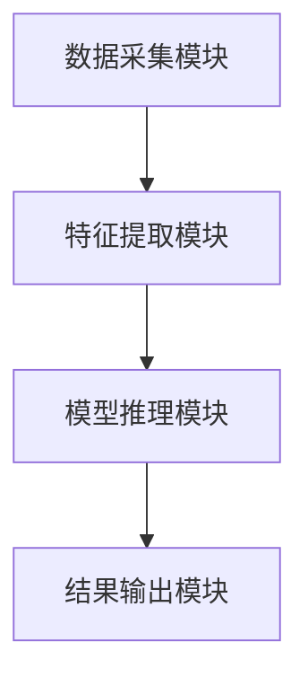
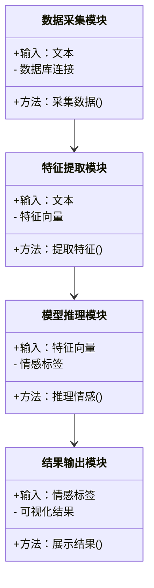

                 


# 情感计算：构建具有情商的AI Agent

## 关键词：情感计算, AI Agent, 情感识别, 情感推理, 情商, 人工智能

## 摘要：情感计算是人工智能领域的重要分支，旨在赋予AI理解和处理人类情感的能力。本文从情感计算的基本概念出发，详细探讨其核心算法、系统架构及实际应用，通过项目实战和高级主题，帮助读者掌握构建具有情商的AI Agent的理论与实践。

---

# 第1章: 情感计算概述

## 1.1 情感计算的基本概念

### 1.1.1 情感计算的定义

情感计算（Affective Computing）是人工智能的一个分支，旨在通过计算机技术理解和模拟人类情感。它不仅关注事实的逻辑推理，还关注情感、情绪和人类心理状态的分析。

### 1.1.2 情感计算的研究背景

随着人工智能的快速发展，情感计算逐渐成为研究热点。人机交互的智能化需求推动了情感计算的发展，尤其是在语音助手、智能客服、教育机器人等领域。

### 1.1.3 情感计算的应用场景

- **社交媒体情感分析**：分析用户评论的情感倾向。
- **智能客服系统**：根据用户情绪调整回复策略。
- **教育领域**：通过分析学生情绪提供个性化教学。

## 1.2 情感计算的核心目标

### 1.2.1 情感识别与分析

通过文本、语音或图像分析用户的情感状态。

### 1.2.2 情感推理与理解

理解情感背后的原因和意图。

### 1.2.3 情感计算的最终目标

构建能够自然交互、具备情感智能的AI Agent。

## 1.3 情感计算的发展历程

### 1.3.1 情感计算的起源

20世纪90年代，R. A. Bradley等人提出了情感计算的概念。

### 1.3.2 情感计算的发展阶段

- **基于规则阶段**：使用关键词匹配进行情感分类。
- **机器学习阶段**：利用特征工程和模型训练提升准确性。
- **深度学习阶段**：引入神经网络和深度学习技术。

### 1.3.3 当前情感计算的研究热点

- **多模态情感计算**：结合文本、语音、图像等多种模态信息。
- **情感增强的对话系统**：提升AI的自然对话能力。

## 1.4 情感计算的挑战与未来方向

### 1.4.1 当前面临的主要挑战

- **数据稀疏性**：小样本数据的处理难度大。
- **情感歧义性**：情感表达可能存在多种解释。

### 1.4.2 情感计算的未来研究方向

- **多模态融合**：综合运用多种信息源提高准确性。
- **实时性优化**：提升情感计算的处理速度。

### 1.4.3 情感计算的实际应用前景

广泛应用于教育、医疗、客服等领域，提升人机交互体验。

## 1.5 本章小结

本章介绍了情感计算的基本概念、发展历程、核心目标及面临的挑战。情感计算作为AI的重要组成部分，正逐步渗透到各个领域，未来将更具影响力。

---

# 第2章: 情感计算的核心概念与联系

## 2.1 情感计算的核心概念

### 2.1.1 情感特征的提取

从文本、语音、图像中提取情感相关特征，如词频、语调、面部表情等。

### 2.1.2 情感计算模型的构建

基于提取的特征，构建分类或回归模型，预测情感倾向。

### 2.1.3 情感知识库的构建与应用

构建包含情感词汇、语义关系的知识库，辅助情感分析。

## 2.2 情感计算的核心要素

### 2.2.1 情感数据的来源与处理

数据来源包括社交媒体、客服对话、视频等，需进行清洗和预处理。

### 2.2.2 情感计算的算法选择

选择合适的算法（如SVM、随机森林、神经网络）进行情感分类。

### 2.2.3 情感计算的性能评估指标

使用准确率、召回率、F1值等指标评估模型性能。

## 2.3 情感计算与其他技术的关系

### 2.3.1 情感计算与自然语言处理

NLP提供文本处理基础，情感计算在其基础上增加情感分析能力。

### 2.3.2 情感计算与机器学习

机器学习是情感计算的核心技术，提供模型训练和优化方法。

### 2.3.3 情感计算与计算机视觉

结合视觉信息（如面部表情）提升情感计算的准确性。

## 2.4 情感计算的系统架构

### 2.4.1 情感计算系统的组成

- **数据采集模块**：获取多模态数据。
- **特征提取模块**：提取情感相关特征。
- **模型训练模块**：训练情感分类模型。
- **结果输出模块**：展示情感分析结果。

### 2.4.2 情感计算系统的数据流

数据从采集到处理，再到模型训练，最后输出结果。

### 2.4.3 情感计算系统的功能模块

- **数据预处理**：清洗和标注数据。
- **特征工程**：提取有用特征。
- **模型选择**：选择合适的算法。

## 2.5 本章小结

本章详细探讨了情感计算的核心概念、关键要素及其与其他技术的关系，为后续章节奠定了理论基础。

---

# 第3章: 情感计算的关键算法

## 3.1 基于规则的情感计算算法

### 3.1.1 基于关键词的情感分析

通过匹配情感词汇（如“快乐”、“悲伤”）判断情感倾向。

### 3.1.2 基于情感词典的情感计算

使用如SentiWordNet等词典进行情感分析。

### 3.1.3 基于规则的情感推理

根据上下文关系推断情感状态。

## 3.2 基于机器学习的情感计算算法

### 3.2.1 基于特征工程的情感分类

提取文本特征（如TF-IDF）训练分类器。

### 3.2.2 基于深度学习的情感分类

使用循环神经网络（RNN）或卷积神经网络（CNN）进行情感分类。

### 3.2.3 基于序列模型的情感分析

利用LSTM处理长文本中的情感信息。

## 3.3 情感计算算法的优缺点对比

### 3.3.1 基于规则算法的优缺点

- **优点**：简单易实现，规则明确。
- **缺点**：依赖人工规则，难以处理复杂情感。

### 3.3.2 基于机器学习算法的优缺点

- **优点**：自动化学习，泛化能力强。
- **缺点**：需要大量标注数据，计算资源消耗大。

### 3.3.3 混合算法的优缺点

- **优点**：结合规则和机器学习的优势。
- **缺点**：复杂度高，实现难度大。

## 3.4 情感计算算法的实现步骤

### 3.4.1 数据预处理

清洗数据，去除噪声，标注情感类别。

### 3.4.2 特征提取

选择合适的特征提取方法，如TF-IDF。

### 3.4.3 模型训练

使用训练数据训练情感分类模型。

### 3.4.4 模型评估

通过准确率、召回率等指标评估模型性能。

## 3.5 本章小结

本章详细介绍了情感计算的两种主要算法及其优缺点，为实际应用提供了选择依据。

---

# 第4章: 情感计算系统的分析与架构设计

## 4.1 情感计算系统的总体架构

### 4.1.1 系统的输入输出

- **输入**：多模态数据流（文本、语音、图像）。
- **输出**：情感分析结果（如积极、消极、中性）。

### 4.1.2 系统功能设计

- **数据采集模块**：实时采集用户输入。
- **特征提取模块**：提取情感特征。
- **模型推理模块**：进行情感分类。
- **结果输出模块**：展示分析结果。

### 4.1.3 系统架构图



## 4.2 项目介绍

### 4.2.1 项目目标

构建一个基于文本的社交媒体情感分析系统。

### 4.2.2 项目范围

分析用户评论的情感倾向，提供情感分布统计。

### 4.2.3 项目约束

- 数据集大小：1000条评论。
- 系统运行环境：Python 3.8及以上。

## 4.3 系统功能设计

### 4.3.1 领域模型



### 4.3.2 系统架构图


### 4.3.3 系统接口设计

- 数据采集模块接口：提供采集数据的方法。
- 特征提取模块接口：提供提取特征的方法。
- 模型推理模块接口：提供推理情感的方法。
- 结果输出模块接口：提供展示结果的方法。

### 4.3.4 系统交互流程

```mermaid
sequenceDiagram
    participant 用户
    participant 数据采集模块
    participant 特征提取模块
    participant 模型推理模块
    participant 结果输出模块
    用户 -> 数据采集模块：提交评论
    数据采集模块 -> 特征提取模块：传递文本
    特征提取模块 -> 模型推理模块：传递特征向量
    模型推理模块 -> 结果输出模块：传递情感标签
    结果输出模块 -> 用户：显示结果
```

## 4.5 本章小结

本章通过一个具体项目，详细设计了情感计算系统的架构，展示了各模块的交互流程。

---

# 第5章: 情感计算系统的实现与优化

## 5.1 系统实现

### 5.1.1 环境安装

安装Python和相关库（如numpy、pandas、scikit-learn、tensorflow）。

### 5.1.2 核心实现

编写代码实现数据采集、特征提取、模型训练和结果展示。

```python
import numpy as np
from sklearn.feature_extraction.text import TfidfVectorizer
from sklearn.svm import SVC
from sklearn.metrics import accuracy_score

# 数据预处理
data = [...]  # 包含文本和标签的列表
X = [text for text, label in data]
y = [label for text, label in data]

# 特征提取
vectorizer = TfidfVectorizer()
X_vec = vectorizer.fit_transform(X)

# 模型训练
model = SVC()
model.fit(X_vec.toarray(), y)

# 模型预测
test_data = [...]  # 测试文本
test_vec = vectorizer.transform(test_data)
predicted = model.predict(test_vec.toarray())

# 结果评估
accuracy = accuracy_score(y_test, predicted)
print(f"Accuracy: {accuracy}")
```

### 5.1.3 代码应用解读与分析

详细解释代码的功能和实现过程。

### 5.1.4 实际案例分析

使用具体数据集（如IMDB电影评论）进行情感分析。

## 5.2 系统优化

### 5.2.1 数据优化

进行数据增强和清洗，提高数据质量。

### 5.2.2 算法优化

调整模型参数，选择更优的算法（如使用LSTM替代SVM）。

### 5.2.3 系统性能优化

优化代码运行效率，减少计算时间。

## 5.3 本章小结

本章通过实际项目，展示了情感计算系统的实现过程，并探讨了优化策略。

---

# 第6章: 情感计算的高级主题与未来趋势

## 6.1 情感增强的对话系统

### 6.1.1 情感增强对话系统的概念

结合情感计算提升对话系统的自然性和智能性。

### 6.1.2 情感增强对话系统的应用场景

应用于智能客服、教育机器人等领域。

## 6.2 情感计算的伦理问题

### 6.2.1 情感计算的隐私保护

保护用户情感数据的安全。

### 6.2.2 情感计算的算法偏见

避免算法在情感分析中的偏见问题。

## 6.3 情感计算的未来趋势

### 6.3.1 多模态情感计算

结合多种信息源进行情感分析。

### 6.3.2 情感增强的AI代理

开发具备高度情感智能的AI代理。

## 6.4 本章小结

本章探讨了情感计算的高级主题和未来趋势，强调了其在AI发展中的重要性。

---

# 第7章: 总结与展望

## 7.1 全书总结

总结全书内容，强调情感计算的重要性。

## 7.2 未来展望

展望情感计算的未来发展方向，鼓励读者深入研究。

---

# 作者：AI天才研究院/AI Genius Institute & 禅与计算机程序设计艺术 /Zen And The Art of Computer Programming

