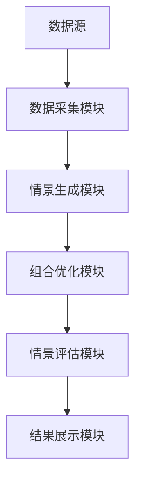

                 


# 情景分析：评估不同市场环境下的组合表现

> 关键词：情景分析, 投资组合, 市场风险, 资产配置, 数学模型

> 摘要：情景分析是一种评估投资组合在不同市场环境下的表现的有效方法，本文将详细探讨其核心概念、数学模型、系统架构及实际应用。

---

## 第1章: 情景分析概述

### 1.1 情景分析的定义与背景

#### 1.1.1 投资组合管理中的问题背景
在金融领域，投资组合管理的目标是在不同市场条件下实现收益与风险的最佳平衡。然而，市场环境的变化可能导致组合表现的显著波动，因此需要一种系统化的方法来评估和应对这些变化。

#### 1.1.2 情景分析的定义与目的
情景分析是一种通过构建不同市场情景，评估投资组合在这些情景下的表现的方法。其目的是帮助投资者了解组合在不同市场条件下的潜在表现，并做出更明智的投资决策。

#### 1.1.3 情景分析的核心要素与边界
情景分析的核心要素包括市场因子、资产回报、组合权重和风险度量。其边界在于限定市场情景的范围和假设条件。

### 1.2 情景分析的核心概念

#### 1.2.1 情景分析的原理与机制
情景分析通过构建多个市场情景，计算组合在每个情景下的收益和风险，进而评估组合的稳健性。

#### 1.2.2 情景分析的关键属性对比
| 属性 | 波动率分析 | 压力测试 | 情景分析 |
|------|----------|----------|----------|
| 目标 | 评估资产波动性 | 评估极端情况下的损失 | 评估不同市场条件下的表现 |
| 方法 | 基于历史波动 | 极限情景 | 模拟多种市场情景 |

#### 1.2.3 情景分析与相关概念的联系
情景分析与波动率分析、压力测试等方法密切相关，但更注重全面评估不同市场条件下的组合表现。

---

## 第2章: 情景分析的数学模型与算法

### 2.1 情景分析的数学基础

#### 2.1.1 资产回报的分布模型
假设资产回报服从正态分布，用均值和标准差来描述。

#### 2.1.2 多因素模型与情景生成
使用多因素模型生成不同市场情景，例如：
- 市场收益增长10%
- 市场收益下降5%
- 利率上升2%

### 2.2 投资组合优化的数学模型

#### 2.2.1 均值-方差优化模型
$$\text{目标：} \min_w \sigma^2$$
$$\text{约束：} \sum_{i=1}^n w_i = 1, \quad w_i \geq 0$$

#### 2.2.2 资本资产定价模型（CAPM）
$$E(R_i) = R_f + \beta_i (E(R_m) - R_f)$$

#### 2.2.3 风险中性定价模型
$$E(S_T) = S_0 e^{\mu T}$$

### 2.3 情景分析的核心算法实现

#### 2.3.1 多因素情景生成算法
1. 确定影响市场的因子。
2. 生成各因子的变化情景。
3. 组合各因子变化，得到资产回报。

#### 2.3.2 投资组合优化算法
1. 构建情景下的资产收益矩阵。
2. 应用优化算法求解最优权重。

#### 2.3.3 情景评估与排序算法
1. 计算组合在各情景下的收益和风险。
2. 对情景进行排序，评估组合的稳健性。

---

## 第3章: 情景分析的系统架构与接口设计

### 3.1 系统架构设计

#### 3.1.1 系统功能模块划分
- 数据采集模块
- 情景生成模块
- 组合优化模块
- 情景评估模块

#### 3.1.2 系统架构图（Mermaid）


### 3.2 系统接口设计

#### 3.2.1 数据接口定义
- 输入：资产列表、市场数据
- 输出：数据清洗后的结果

#### 3.2.2 情景生成接口
- 输入：市场因子、变化幅度
- 输出：资产回报矩阵

#### 3.2.3 情景评估接口
- 输入：组合权重、情景矩阵
- 输出：收益和风险指标

---

## 第4章: 情景分析的项目实战

### 4.1 项目环境与工具安装

#### 4.1.1 开发环境搭建
- 安装Python、Jupyter Notebook
- 安装相关库：NumPy, Pandas, Scipy

#### 4.1.2 数据获取与处理
- 使用Yahoo Finance获取市场数据
- 数据清洗和预处理

### 4.2 核心代码实现

#### 4.2.1 情景生成代码
```python
import numpy as np

# 生成情景
n_factors = 3
n_assets = 5
factors = np.random.multivariate_normal([0, 0, 0], np.eye(n_factors), n_assets)
```

#### 4.2.2 投资组合优化代码
```python
from scipy.optimize import minimize

def portfolio_optimization(returns):
    n = len(returns.columns)
    def objective(weights):
        return np.dot(weights.T, np.dot(returns.cov(), weights))
    cons = ({'type': 'eq', 'fun': lambda w: np.sum(w) - 1})
    bounds = [(0, 1)] * n
    result = minimize(objective, np.ones(n)/n, constraints=cons, bounds=bounds)
    return result.x

weights = portfolio_optimization(returns)
```

#### 4.2.3 情景评估代码
```python
def evaluate_portfolio(weights, scenarios):
    returns = np.dot(weights, scenarios.T)
    risks = np.std(returns)
    return returns.mean(), risks.mean()

mean_return, mean_risk = evaluate_portfolio(weights, scenarios)
```

---

## 第5章: 情景分析的最佳实践与小结

### 5.1 最佳实践

#### 5.1.1 数据选择与处理
- 使用高质量的历史数据
- 考虑市场因子的相关性

#### 5.1.2 模型选择与调优
- 根据实际情况选择情景生成方法
- 定期更新模型参数

#### 5.1.3 结果解释与应用
- 综合考虑收益和风险
- 结合市场环境动态调整

### 5.2 小结

情景分析是一种强大的工具，通过系统化的方法评估投资组合在不同市场环境下的表现。本文详细探讨了其核心概念、数学模型、系统架构及实际应用，为投资者提供了理论和实践的指导。

---

作者：AI天才研究院 & 禅与计算机程序设计艺术

