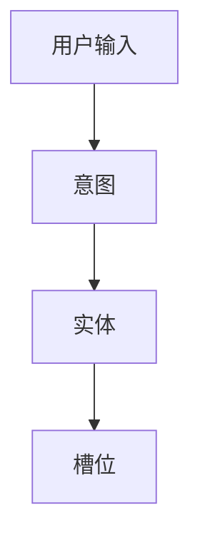
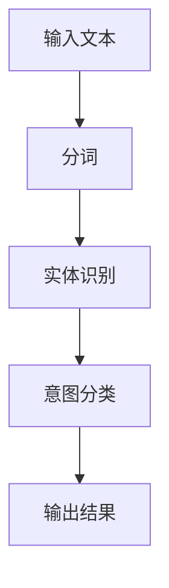
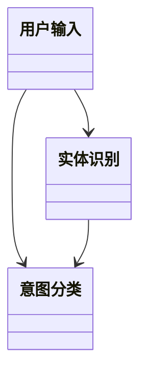
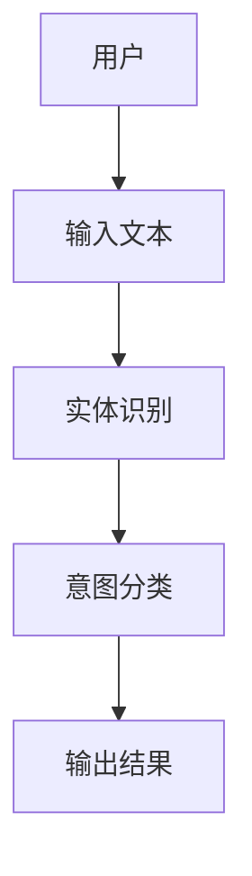
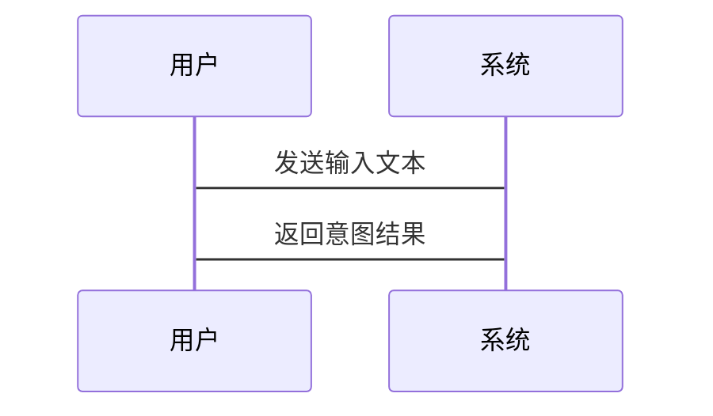

                 


# 意图识别：准确把握用户需求的关键

> 关键词：意图识别，自然语言处理，机器学习，深度学习，实体识别，槽位填充，意图分类

> 摘要：意图识别是自然语言处理中的核心任务，旨在准确理解用户的深层需求。本文从意图识别的基本概念、算法原理、系统架构到项目实战，全面解析如何准确把握用户需求的关键。通过详细分析不同算法的优劣，结合实际案例，为读者提供从理论到实践的完整指南。

---

# 第一部分：意图识别概述与背景

## 第1章：意图识别概述

### 1.1 意图识别的定义与背景

#### 1.1.1 什么是意图识别
意图识别（Intention Recognition）是自然语言处理（NLP）领域的重要任务，旨在理解用户通过语言表达的深层需求或目标。它是通过分析用户的输入文本，确定用户的意图类别，并提取相关的实体信息，从而为后续的系统响应提供依据。

#### 1.1.2 意图识别的发展历史
意图识别的研究可以追溯到20世纪90年代，随着NLP技术的发展，意图识别逐渐从基于规则的方法向统计学习和深度学习方法转变。近年来，随着深度学习的兴起，意图识别的准确率和性能得到了显著提升。

#### 1.1.3 意图识别的应用场景
意图识别广泛应用于智能客服、语音助手、聊天机器人、搜索引擎等领域。例如，在智能客服中，意图识别可以帮助系统快速理解用户的问题，提供精准的解决方案。

### 1.2 意图识别的核心概念

#### 1.2.1 意图、实体与槽位
- **意图（Intention）**：用户通过语言表达的主要目标或需求，例如“查询天气”、“预订酒店”。
- **实体（Entity）**：与意图相关的具体信息，例如时间、地点、人物等。
- **槽位（Slot）**：实体的具体位置或角色，例如“时间”槽位可以是“明天”或“周末”。

#### 1.2.2 意图识别的边界与外延
意图识别的边界在于如何准确区分不同意图类别，并提取相关的实体信息。其外延则包括与意图识别相关的技术，如情感分析、对话管理等。

#### 1.2.3 意图识别的核心要素组成
意图识别的核心要素包括输入文本、意图类别、实体信息和槽位填充。这些要素共同构成了意图识别的基本框架。

---

## 第2章：意图识别的核心概念与联系

### 2.1 意图识别的核心原理

#### 2.1.1 基于规则的意图识别
基于规则的方法通过预定义的关键词和规则匹配用户的输入文本，确定意图类别。例如，当用户输入“今天天气怎么样？”时，系统匹配“天气”相关的关键词，确定意图是查询天气。

#### 2.1.2 基于统计学习的意图识别
基于统计学习的方法利用机器学习算法，如朴素贝叶斯、支持向量机（SVM）等，通过训练数据学习意图分类模型。例如，使用TF-IDF特征提取，训练一个朴素贝叶斯分类器，对输入文本进行意图分类。

#### 2.1.3 基于深度学习的意图识别
基于深度学习的方法利用神经网络模型，如循环神经网络（RNN）、Transformer等，通过端到端的训练方式，直接从输入文本中学习意图表示。例如，使用BERT模型进行意图分类。

### 2.2 意图识别的核心概念对比

#### 2.2.1 不同意图识别方法的对比分析
| 方法             | 优点                          | 缺点                          |
|------------------|-------------------------------|-------------------------------|
| 基于规则         | 实现简单，适用于规则明确的场景 | 难以处理复杂或模糊的场景       |
| 基于统计学习     | 能处理更多样化的数据           | 需要大量标注数据，计算复杂      |
| 基于深度学习     | 高准确性，能处理复杂场景         | 需要大量计算资源，实现复杂      |

#### 2.2.2 实体识别与意图识别的关联
实体识别是意图识别的重要组成部分。例如，在用户输入“预订北京明天的机票”中，实体识别会提取“北京”和“明天”，而意图识别则确定用户的意图是“预订机票”。

#### 2.2.3 槽位填充与意图分类的关系
槽位填充是意图识别的延伸，它为意图分类提供更细粒度的信息。例如，在“查询天气”的意图下，槽位填充可能包括“时间”和“地点”。

### 2.3 意图识别的ER实体关系图



---

## 第3章：意图识别的算法原理

### 3.1 基于规则的意图识别算法

#### 3.1.1 规则的定义与特点
基于规则的意图识别通过预定义的关键词和规则匹配用户的输入文本。例如，规则可以定义为：如果输入中包含“天气”，则意图是“查询天气”。

#### 3.1.2 规则的匹配流程
1. 输入文本分词。
2. 匹配预定义的关键词或短语。
3. 根据匹配结果确定意图类别。

#### 3.1.3 规则的优缺点分析
- **优点**：实现简单，适用于规则明确的场景。
- **缺点**：难以处理复杂或模糊的场景，需要不断优化规则。

### 3.2 基于统计学习的意图识别算法

#### 3.2.1 统计学习的基本原理
基于统计学习的意图识别通过训练数据学习意图分类模型。常用算法包括朴素贝叶斯、SVM等。

#### 3.2.2 基于朴素贝叶斯的意图识别
使用TF-IDF特征提取，训练一个朴素贝叶斯分类器，对输入文本进行意图分类。

#### 3.2.3 基于SVM的意图识别
使用SVM算法，通过支持向量将输入文本映射到高维空间，进行意图分类。

### 3.3 基于深度学习的意图识别算法

#### 3.3.1 神经网络的基本原理
基于深度学习的意图识别利用神经网络模型，如RNN、Transformer等，通过端到端的方式学习意图表示。

#### 3.3.2 基于RNN的意图识别
使用循环神经网络对输入文本进行序列建模，提取上下文信息，进行意图分类。

#### 3.3.3 基于Transformer的意图识别
使用Transformer模型进行意图分类，通过自注意力机制捕捉文本中的全局信息。

### 3.4 意图识别的算法流程图



---

## 第4章：意图识别的数学模型与公式

### 4.1 基于条件概率的意图识别

#### 4.1.1 条件概率公式
$$ P(y|x) = \frac{P(x|y)P(y)}{P(x)} $$

#### 4.1.2 案例分析：计算特定意图的概率
假设输入文本是“订机票去北京”，意图是“订机票”。根据条件概率公式，计算该输入文本属于“订机票”意图的概率。

### 4.2 基于向量空间的意图表示

#### 4.2.1 向量空间模型
将文本表示为向量空间中的点，通过向量相似度计算意图的相似性。

#### 4.2.2 余弦相似度公式
$$ \cos\theta = \frac{\vec{A} \cdot \vec{B}}{|\vec{A}||\vec{B}|} $$

#### 4.2.3 案例分析：计算意图向量的相似度
假设意图向量A是“订机票”，意图向量B是“查询天气”，计算它们的余弦相似度。

### 4.3 基于深度学习的损失函数

#### 4.3.1 交叉熵损失函数
$$ \text{Loss} = -\sum_{i=1}^{n} y_i \log(p_i) + (1-y_i)\log(1-p_i) $$

#### 4.3.2 案例分析：计算损失函数
假设输入文本的标签是“订机票”（y=1），预测概率p=0.8，计算交叉熵损失。

---

## 第5章：意图识别的系统分析与架构设计

### 5.1 系统功能设计

#### 5.1.1 领域模型
使用Mermaid绘制领域模型类图，展示意图识别系统的主要组件及其关系。



#### 5.1.2 系统架构设计
使用Mermaid绘制系统架构图，展示系统的整体结构和各组件之间的关系。



#### 5.1.3 系统交互流程
使用Mermaid绘制交互流程图，展示用户与系统之间的交互过程。



---

## 第6章：意图识别的项目实战

### 6.1 环境安装与配置

#### 6.1.1 安装Python环境
使用Anaconda安装Python 3.8及以上版本。

#### 6.1.2 安装必要的库
安装以下库：
- `nltk`
- `scikit-learn`
- `tensorflow`

### 6.2 系统核心实现源代码

#### 6.2.1 基于朴素贝叶斯的意图分类代码

```python
from sklearn.feature_extraction.text import TfidfVectorizer
from sklearn.naive_bayes import MultinomialNB
from sklearn.pipeline import Pipeline

# 数据准备
texts = ["今天天气怎么样", "我需要预订机票去北京", "请给我推荐附近的餐厅"]
labels = ["查询天气", "预订机票", "推荐餐厅"]

# 创建管道
pipeline = Pipeline([
    ('tfidf', TfidfVectorizer()),
    ('clf', MultinomialNB())
])

# 训练模型
pipeline.fit(texts, labels)

# 预测
print(pipeline.predict(["我需要预订机票去北京"]))
```

#### 6.2.2 基于Transformer的意图分类代码

```python
import tensorflow as tf
from tensorflow import keras

# 数据准备
texts = ["今天天气怎么样", "我需要预订机票去北京", "请给我推荐附近的餐厅"]
labels = ["查询天气", "预订机票", "推荐餐厅"]

# 创建数据集
tokenizer = keras.preprocessing.text.Tokenizer()
tokenizer.fit_on_texts(texts)
sequences = tokenizer.texts_to_sequences(texts)

# 嵌入层
embedding_dim = 100
model = keras.Sequential()
model.add(keras.layers.Embedding(len(tokenizer.word_index)+1, embedding_dim))
model.add(keras.layers.GlobalAveragePooling1D())
model.add(keras.layers.Dense(3, activation="softmax"))

# 编译模型
model.compile(loss="sparse_categorical_crossentropy", optimizer="adam", metrics=["accuracy"])

# 训练模型
model.fit(sequences, labels, epochs=10, batch_size=32)
```

---

## 第7章：意图识别的最佳实践与总结

### 7.1 小结

意图识别是自然语言处理中的核心任务，通过准确理解用户的输入文本，确定用户的深层需求。本文从意图识别的基本概念、算法原理、系统架构到项目实战，全面解析了意图识别的关键技术。

### 7.2 注意事项

- 数据质量：意图识别的效果依赖于高质量的标注数据。
- 模型选择：根据具体场景选择合适的意图识别算法。
- 实体识别：实体识别是意图识别的重要组成部分，需要与意图分类紧密结合。

### 7.3 拓展阅读

- 《自然语言处理入门》
- 《深度学习实战》
- 《意图识别与对话管理》

---

作者：AI天才研究院/AI Genius Institute & 禅与计算机程序设计艺术 /Zen And The Art of Computer Programming

