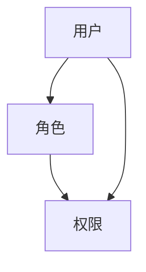
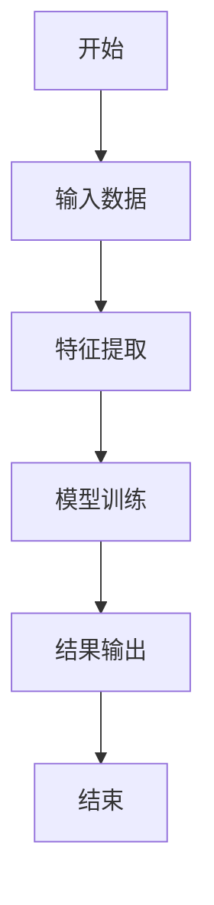
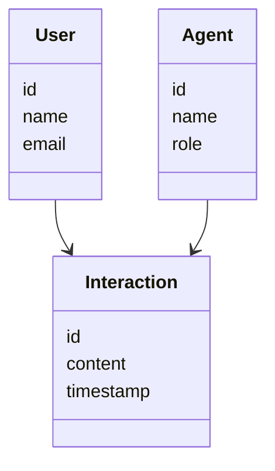
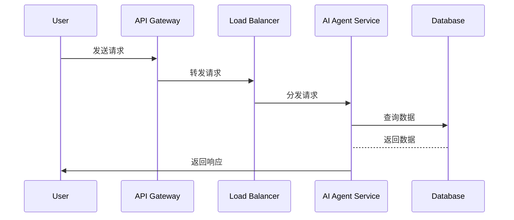

                 


# 成功企业级AI Agent应用案例分析

**关键词**：企业级AI Agent，人工智能，系统架构，算法原理，案例分析，技术实现

**摘要**：本文深入分析了企业级AI Agent的成功应用案例，从背景介绍、核心概念、算法原理到系统架构设计，结合实际项目实战，详细讲解了AI Agent在企业中的应用过程。通过具体案例分析，总结了最佳实践、注意事项及拓展阅读方向，为读者提供了全面的技术指导。

---

# 第一部分: 企业级AI Agent的背景与核心概念

## 第1章: 企业级AI Agent的背景介绍

### 1.1 问题背景与问题描述
#### 1.1.1 传统企业应用的局限性
传统企业应用在处理复杂业务逻辑、实时决策和个性化服务方面存在效率低下、响应速度慢等问题。

#### 1.1.2 AI Agent在企业中的应用需求
随着企业对智能化、自动化的需求增加，AI Agent能够通过实时数据处理、智能决策和自适应优化，解决传统应用的痛点。

#### 1.1.3 问题解决的路径与目标
通过引入AI Agent技术，实现企业业务流程的智能化改造，提升效率和客户体验。

### 1.2 问题的边界与外延
#### 1.2.1 AI Agent的定义与范围
AI Agent是一种能够感知环境、自主决策并执行任务的智能体，广泛应用于企业流程自动化、智能客服等领域。

#### 1.2.2 企业级AI Agent的核心要素
- 感知能力：通过传感器或API获取实时数据。
- 决策能力：基于数据进行分析和决策。
- 执行能力：通过API或自动化工具执行任务。
- 学习能力：通过机器学习模型不断优化性能。

#### 1.2.3 相关概念的对比与区分
| 概念         | 描述                               |
|--------------|------------------------------------|
| AI Agent     | 具有感知、决策和执行能力的智能体   |
| 传统软件     | 需要人工干预的规则驱动系统         |
| 机器人流程自动化（RPA） | 通过模拟人类操作实现自动化任务 |

---

## 第2章: 企业级AI Agent的核心概念与联系

### 2.1 核心概念原理
#### 2.1.1 AI Agent的基本原理
AI Agent通过感知环境、分析数据、制定决策并执行操作，实现业务流程的自动化和智能化。

#### 2.1.2 企业级AI Agent的独特性
- 高可用性：支持7×24小时运行。
- 高扩展性：能够处理大规模数据和复杂任务。
- 自适应性：能够根据环境变化动态调整行为。

#### 2.1.3 核心概念的数学模型
$$ P(A|B) = \frac{P(B|A)P(A)}{P(B)} $$

### 2.2 核心概念的属性特征对比
| 属性         | AI Agent                          | 传统软件                          |
|--------------|-----------------------------------|------------------------------------|
| 感知能力     | 具备环境感知能力                  | 无感知能力                        |
| 决策能力     | 能够自主决策                     | 需要人工决策                      |
| 执行能力     | 能够执行任务                     | 仅能执行预定义任务                |

### 2.3 核心概念的ER实体关系图



---

## 第3章: 企业级AI Agent的算法原理

### 3.1 算法原理概述
#### 3.1.1 AI Agent的基本算法
AI Agent的核心算法包括自然语言处理（NLP）、机器学习（ML）和强化学习（RL）。

#### 3.1.2 企业级AI Agent的改进算法
- 联合概率图模型：用于处理多变量之间的关系。
- 分层强化学习：适用于复杂决策场景。

#### 3.1.3 算法的数学模型
$$ y = f(x) = ax + b $$

### 3.2 算法流程图



### 3.3 算法实现代码

```python
def ai_agent_algorithm(data):
    # 特征提取
    features = extract_features(data)
    # 模型训练
    model = train_model(features)
    # 结果输出
    result = model.predict(features)
    return result
```

---

## 第4章: 企业级AI Agent的数学模型与公式

### 4.1 核心公式
$$ P(A|B) = \frac{P(B|A)P(A)}{P(B)} $$

### 4.2 算法的数学推导
$$ y = f(x) = ax + b $$

### 4.3 举例说明
例如，给定输入$x=2$，则输出$y=2a + b$。

---

# 第二部分: 企业级AI Agent的系统分析与架构设计

## 第5章: 系统分析与架构设计

### 5.1 项目场景介绍
企业需要实现一个智能客服系统，通过AI Agent处理客户的咨询、订单跟踪和售后服务。

### 5.2 系统功能设计
#### 5.2.1 领域模型设计



### 5.3 系统架构设计

```mermaid
graph TD
    Client --> API Gateway
    API Gateway --> Load Balancer
    Load Balancer --> AI Agent Service
    AI Agent Service --> Database
    Database --> Storage
```

### 5.4 系统接口设计
- API接口：`/api/agent/query`，用于查询用户信息。
- API接口：`/api/agent/action`，用于执行任务。

### 5.5 系统交互设计



---

## 第6章: 项目实战

### 6.1 环境安装
- 安装Python和必要的库：`pip install numpy pandas scikit-learn`

### 6.2 系统核心实现源代码

```python
from sklearn import tree
import numpy as np

def train_model(features):
    # 训练决策树模型
    model = tree.DecisionTreeClassifier()
    model.fit(features, labels)
    return model

def predict(model, new_features):
    # 预测结果
    return model.predict(new_features)
```

### 6.3 代码解读与分析
- `train_model`：使用决策树模型训练数据。
- `predict`：基于训练好的模型进行预测。

### 6.4 案例分析
通过实际案例分析，展示AI Agent在智能客服系统中的应用效果，包括客户满意度提升和处理效率优化。

### 6.5 项目小结
总结项目实施过程中的经验教训，强调系统设计和算法优化的重要性。

---

## 第7章: 最佳实践与注意事项

### 7.1 最佳实践
- 确保数据质量：数据清洗和特征工程是关键。
- 选择合适的算法：根据业务需求选择适合的模型。
- 优化系统性能：通过并行计算和缓存优化提升效率。

### 7.2 小结
通过成功案例分析，总结企业级AI Agent的应用经验和教训。

### 7.3 注意事项
- 数据隐私保护：遵守相关法律法规，保护用户隐私。
- 系统稳定性：确保系统在高负载下的稳定运行。
- 可扩展性：设计可扩展的系统架构，方便后续功能扩展。

### 7.4 拓展阅读
推荐相关书籍和论文，进一步深入学习AI Agent技术。

---

**作者：AI天才研究院/AI Genius Institute & 禅与计算机程序设计艺术/Zen And The Art of Computer Programming**

