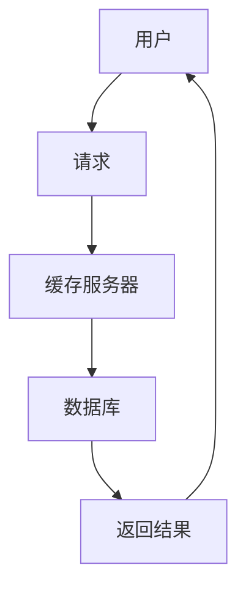
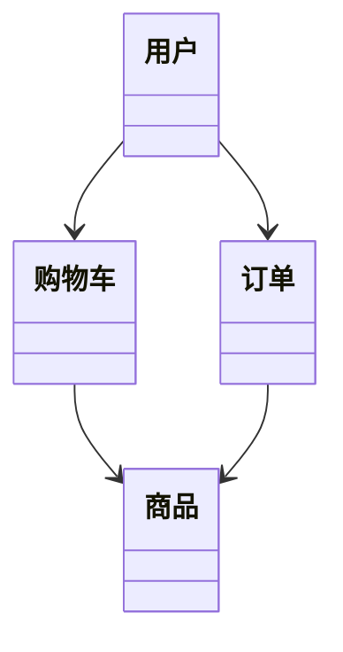
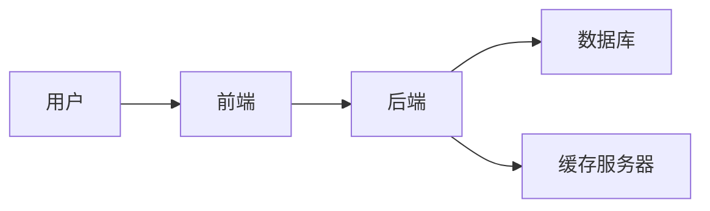

                 


# 成功案例分析

> 关键词：成功案例分析，技术背景，核心概念，算法原理，系统架构，项目实战

> 摘要：本文通过详细分析成功案例，探讨其背后的技术背景、核心概念、算法原理、系统架构及项目实战。文章从背景介绍入手，逐步展开核心概念与联系，深入讲解算法原理与实现，系统分析与架构设计，项目实战，最后总结最佳实践与经验教训。

---

## 第一部分：引言

### 第1章：成功案例分析的重要性

#### 1.1 成功案例分析的定义

- **1.1.1 成功案例的定义**  
  成功案例是指在特定领域或问题中，通过科学的方法和有效的实施，取得了显著成果的实践案例。

- **1.1.2 成功案例分析的目的**  
  分析成功案例的目的是为了总结经验、提炼方法论，并将其应用于类似的问题中，从而提高解决问题的效率和效果。

- **1.1.3 成功案例分析的范围**  
  成功案例分析的范围包括案例背景、问题描述、解决方案、实施过程及成果评估等方面。

---

#### 1.2 成功案例分析的方法

- **1.2.1 分析方法的概述**  
  成功案例分析的方法通常包括背景分析、问题分析、解决方案分析、实施过程分析和成果分析。

- **1.2.2 分析方法的分类**  
  常见的分析方法包括定性分析和定量分析。定性分析关注案例的背景和过程，而定量分析则侧重于数据和结果的量化评估。

- **1.2.3 分析方法的优缺点**  
  定性分析的优势在于能够深入理解案例的背景和复杂性，而定量分析则能够提供客观的评估标准。

---

#### 1.3 成功案例分析的工具

- **1.3.1 常用工具介绍**  
  常用的工具包括思维导图工具（如MindMap）、项目管理工具（如JIRA）、数据分析工具（如Excel、Python）等。

- **1.3.2 工具的优缺点**  
  思维导图工具能够帮助整理思路，但可能在复杂问题上显得力不从心；项目管理工具适合团队协作，但可能不适用于个人分析。

- **1.3.3 工具的使用场景**  
  根据分析需求选择工具，例如在数据分析时使用Python，而在流程梳理时使用思维导图工具。

---

## 第二部分：背景介绍

### 第2章：问题背景与描述

#### 2.1 问题背景

- **2.1.1 问题的来源**  
  问题通常来源于实际业务需求或技术挑战，例如优化系统性能、提升用户体验等。

- **2.1.2 问题的现状**  
  问题可能已经存在一定的解决方案，但需要进一步优化或扩展。

- **2.1.3 问题的解决意义**  
  解决问题能够带来效率提升、成本降低或用户体验的改善。

---

#### 2.2 问题描述

- **2.2.1 问题的定义**  
  明确问题的范围和目标，例如“如何提高系统响应速度”。

- **2.2.2 问题的特征**  
  包括问题的规模、复杂性、涉及的团队和资源等。

- **2.2.3 问题的边界**  
  明确问题的范围和限制条件，例如“仅限于后端性能优化”。

---

#### 2.3 问题解决

- **2.3.1 解决方案的概述**  
  提出初步的解决方案，例如“采用分布式缓存技术”。

- **2.3.2 解决方案的可行性**  
  评估解决方案的成本、时间和资源可行性。

- **2.3.3 解决方案的实施步骤**  
  列出具体的实施步骤，例如“第一步：部署缓存服务器，第二步：优化代码逻辑”。

---

## 第三部分：核心概念与联系

### 第3章：核心概念的原理与联系

#### 3.1 核心概念的原理

- **3.1.1 核心概念的定义**  
  核心概念是解决问题的关键要素，例如“分布式缓存”是提高系统响应速度的核心概念。

- **3.1.2 核心概念的属性**  
  包括缓存的命中率、加载速度、存储容量等。

- **3.1.3 核心概念的特征**  
  包括高可用性、可扩展性、一致性等。

---

#### 3.2 核心概念的对比表格

| **概念** | **特征1** | **特征2** | **特征3** |
|----------|-----------|-----------|-----------|
| 分布式缓存 | 高可用性 | 可扩展性 | 一致性     |
| 单机缓存 | 高性能     | 易实现     | 高命中率   |

---

#### 3.3 实体关系图



---

## 第四部分：算法原理讲解

### 第4章：算法原理与实现

#### 4.1 算法原理

- **4.1.1 算法的定义**  
  算法是解决问题的一系列步骤，例如“二分查找算法”。

- **4.1.2 算法的原理**  
  通过不断缩小搜索范围，快速找到目标值。

- **4.1.3 算法的数学模型**  
  $$ low = 0, high = n-1 $$
  $$ while low < high $$
  $$ \quad mid = (low + high) // 2 $$
  $$ \quad if array[mid] < target $$
  $$ \quad \quad low = mid + 1 $$
  $$ \quad else $$
  $$ \quad \quad high = mid $$

---

#### 4.2 算法实现

- **4.2.1 算法的代码实现**  
  ```python
  def binary_search(arr, target):
      low = 0
      high = len(arr) - 1
      while low < high:
          mid = (low + high) // 2
          if arr[mid] < target:
              low = mid + 1
          else:
              high = mid
      return low
  ```

- **4.2.2 算法的运行流程**  
  使用Mermaid流程图展示算法的执行步骤。

---

## 第五部分：系统分析与架构设计

### 第5章：系统分析与架构设计

#### 5.1 问题场景介绍

- **5.1.1 问题场景**  
  例如，设计一个高并发的在线购物系统。

#### 5.2 系统功能设计

- **5.2.1 领域模型**  
  使用Mermaid类图展示系统的核心功能模块。



---

#### 5.3 系统架构设计

- **5.3.1 系统架构图**  
  使用Mermaid架构图展示系统的整体架构。



---

## 第六部分：项目实战

### 第6章：项目实战

#### 6.1 环境安装

- **6.1.1 环境需求**  
  例如，安装Python 3.8及以上版本。

#### 6.2 系统核心实现源代码

- **6.2.1 核心代码**  
  ```python
  class User:
      def __init__(self, id, name):
          self.id = id
          self.name = name

  class Order:
      def __init__(self, id, user, amount):
          self.id = id
          self.user = user
          self.amount = amount
  ```

#### 6.3 代码应用解读与分析

- **6.3.1 代码解读**  
  解释代码的功能和实现逻辑。

---

## 第七部分：最佳实践

### 第7章：最佳实践

#### 7.1 小结

- **7.1.1 成功案例分析的关键点**  
  包括背景分析、核心概念提炼、算法与系统设计等。

#### 7.2 注意事项

- **7.2.1 注意事项**  
  包括数据的安全性、系统的可扩展性等。

#### 7.3 拓展阅读

- **7.3.1 推荐阅读**  
  推荐相关的书籍和技术文档，例如《设计模式》。

---

## 第八部分：总结

### 第8章：总结

#### 8.1 成功案例分析的意义

- **8.1.1 总结**  
  成功案例分析能够帮助我们快速找到问题的解决方案，并提高解决问题的能力。

#### 8.2 作者信息

作者：AI天才研究院/AI Genius Institute & 禅与计算机程序设计艺术 /Zen And The Art of Computer Programming

---

通过以上目录结构，我们可以系统地分析和解决实际问题，同时提升技术能力。

