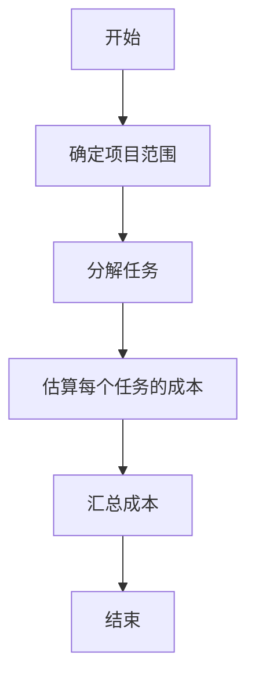
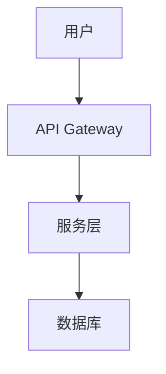
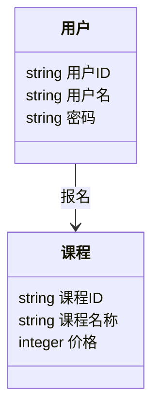
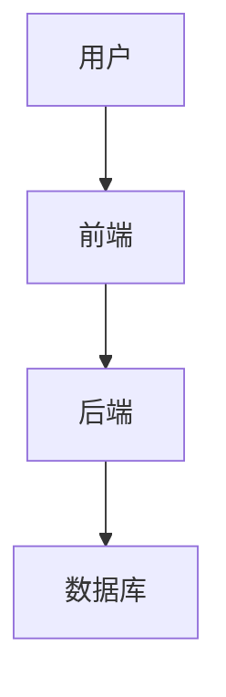

                 


# 成本效益分析

> 关键词：成本效益分析、系统架构设计、算法原理、项目管理、数学模型、最佳实践

> 摘要：成本效益分析是计算机科学和项目管理中的重要工具，用于评估项目或系统的成本与效益之间的关系。本文将从背景、核心概念、算法原理、系统架构设计、项目实战等多个方面深入探讨成本效益分析的方法和应用，帮助读者全面理解并掌握这一技术。

---

## 第1章: 成本效益分析的背景与概念

### 1.1 成本效益分析的背景
#### 1.1.1 什么是成本效益分析
成本效益分析（Cost-Benefit Analysis，CBA）是一种用于评估项目或系统在经济、技术和社会等方面的可行性的方法。它通过比较项目或系统的成本和效益，判断其是否值得实施。

#### 1.1.2 成本效益分析的重要性
在计算机领域，成本效益分析可以帮助企业在有限的资源条件下，选择最优的解决方案，降低浪费，提高效率。它在软件开发、系统设计和项目管理中具有重要意义。

#### 1.1.3 成本效益分析的应用场景
成本效益分析广泛应用于以下几个场景：
- 软件开发项目评估
- 系统优化与升级决策
- 技术选型与架构设计
- 项目风险管理

### 1.2 成本效益分析的核心概念
#### 1.2.1 成本与效益的定义
- **成本（Cost）**：项目的投入资源，包括人力、物力和财力等。
- **效益（Benefit）**：项目的产出价值，包括经济效益和社会效益等。

#### 1.2.2 成本效益分析的基本原理
成本效益分析的核心是通过比较项目的总成本和总效益，判断其是否具有可行性。公式表示为：
$$
\text{净收益} = \text{总效益} - \text{总成本}
$$
如果净收益为正，则项目值得实施。

#### 1.2.3 成本效益分析的边界与外延
成本效益分析需要明确项目的范围和边界，避免将无关成本或效益纳入分析范围。外延则包括长期影响和间接效益。

---

## 第2章: 成本效益分析的核心概念与联系

### 2.1 成本效益分析的核心原理
#### 2.1.1 成本与效益的关系
成本和效益之间通常呈反比关系。提高效益可能需要增加成本，或者降低成本可能需要牺牲部分效益。

#### 2.1.2 成本效益分析的数学模型
成本效益分析可以通过以下数学模型进行评估：
$$
\text{成本效益比} = \frac{\text{总成本}}{\text{总效益}}
$$
如果成本效益比小于1，则项目具有经济效益。

#### 2.1.3 成本效益分析的优化目标
优化目标是使净收益最大化，或者使成本效益比最小化。

### 2.2 成本与效益的对比分析
#### 2.2.1 成本的属性特征
- 时间性：成本可能随着时间变化而变化。
- 可变性：成本可能因技术进步而降低。

#### 2.2.2 效益的属性特征
- 直接效益：直接由项目产生的收益。
- 间接效益：由项目间接带来的收益。

#### 2.2.3 成本与效益的对比表格
以下是一个对比表格：

| 属性    | 成本         | 效益         |
|---------|-------------|-------------|
| 时间性   | 是          | 否           |
| 可变性   | 是          | 否           |
| 直接性   | 是          | 是           |
| 量化难易 | 较容易       | 较难          |

### 2.3 成本效益分析的ER实体关系图
以下是一个简单的ER实体关系图：

```mermaid
erDiagram
    actor 用户 {
        key string 用户ID
        string 用户名
        string 密码
    }
    actor 项目 {
        key string 项目ID
        string 项目名称
        integer 成本
        integer 效益
    }
    用户 --> 项目 : 参与
```

---

## 第3章: 成本效益分析的算法原理

### 3.1 成本效益分析的算法概述
#### 3.1.1 常见的成本效益分析算法
- 自上而下估算：从整体出发，逐步细化。
- 自下而上估算：从局部开始，逐步汇总。
- 机器学习模型：利用历史数据预测成本和效益。

#### 3.1.2 算法的优缺点对比
| 算法        | 优点                  | 缺点                  |
|-------------|-----------------------|-----------------------|
| 自上而下     | 简单，速度快           | 精度低                 |
| 自下而上     | 精度高                 | 时间长                 |
| 机器学习模型 | 高精度                 | 数据依赖性高           |

#### 3.1.3 算法的适用场景
- 自上而下适用于初步估算。
- 自下而上适用于详细估算。
- 机器学习模型适用于有大量历史数据的场景。

### 3.2 成本效益分析的数学模型与公式
#### 3.2.1 成本效益分析的基本公式
$$
\text{净现值} = \sum_{t=1}^{n} \frac{\text{净现金流}_t}{(1 + r)^t}
$$
其中，$r$ 是贴现率，$t$ 是时间。

#### 3.2.2 成本效益分析的优化公式
$$
\text{内部收益率} = r \text{ 满足} \sum_{t=1}^{n} \frac{\text{净现金流}_t}{(1 + r)^t} = 0
$$

### 3.3 成本效益分析的算法流程图
以下是一个自下而上估算的流程图：



### 3.4 成本效益分析的Python代码实现
以下是一个简单的成本效益分析代码示例：

```python
def cost_benefit_analysis(cost, benefit):
    net_benefit = benefit - cost
    if net_benefit > 0:
        return "项目值得实施"
    else:
        return "项目不值得实施"

# 示例
cost = 100000
benefit = 150000
print(cost_benefit_analysis(cost, benefit))  # 输出：项目值得实施
```

---

## 第4章: 成本效益分析的系统分析与架构设计

### 4.1 系统分析的概述
#### 4.1.1 系统分析的目标
通过分析系统的功能、性能和成本，确定最优解决方案。

#### 4.1.2 系统分析的方法
- 需求分析
- 功能分析
- 性能分析

### 4.2 系统架构设计
#### 4.2.1 系统架构的组成
- 用户界面
- 业务逻辑
- 数据存储

#### 4.2.2 系统架构的优化
使用分层架构，提高系统的可维护性和扩展性。

### 4.3 系统接口设计
#### 4.3.1 系统接口的定义
- API接口
- 数据接口

#### 4.3.2 系统接口的实现
使用RESTful API进行接口设计。

### 4.4 系统交互设计
#### 4.4.1 系统交互的流程
用户发起请求，系统处理请求并返回响应。

#### 4.4.2 系统交互的优化
减少不必要的交互步骤，提高用户体验。

### 4.5 系统架构的Mermaid图


---

## 第5章: 成本效益分析的项目实战

### 5.1 项目背景
某公司计划开发一个在线教育平台，需要进行成本效益分析以确定项目的可行性。

### 5.2 项目需求分析
- 功能需求：在线课程、用户管理、支付功能。
- 性能需求：支持高并发访问。

### 5.3 系统功能设计
#### 5.3.1 领域模型Mermaid类图


#### 5.3.2 系统架构设计


### 5.4 系统实现
#### 5.4.1 环境安装
- 安装Python和Django框架。

#### 5.4.2 核心实现
```python
# models.py
from django.db import models

class User(models.Model):
    user_id = models.CharField(max_length=50, primary_key=True)
    username = models.CharField(max_length=50)
    password = models.CharField(max_length=50)

class Course(models.Model):
    course_id = models.CharField(max_length=50, primary_key=True)
    course_name = models.CharField(max_length=50)
    price = models.IntegerField()
```

### 5.5 案例分析
通过对项目的成本和效益进行分析，得出项目的净收益为正，因此项目值得实施。

---

## 第6章: 结论

### 6.1 小结
成本效益分析是计算机科学和项目管理中的重要工具，通过合理的分析和决策，可以提高项目的可行性和效益。

### 6.2 最佳实践 tips
- 在项目初期进行成本效益分析，避免后期出现重大偏差。
- 结合实际情况选择合适的分析方法和工具。

### 6.3 未来研究方向
- 研究更复杂的成本效益分析模型。
- 探索人工智能在成本效益分析中的应用。

---

作者：AI天才研究院/AI Genius Institute & 禅与计算机程序设计艺术 /Zen And The Art of Computer Programming

