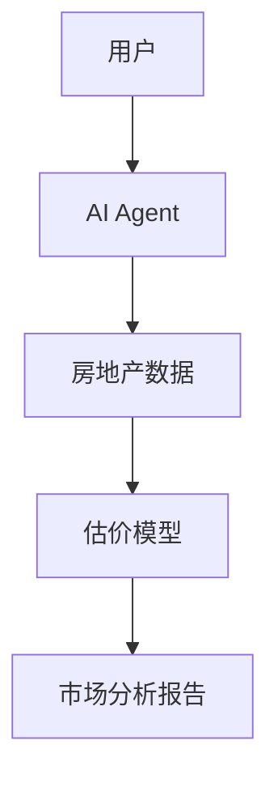
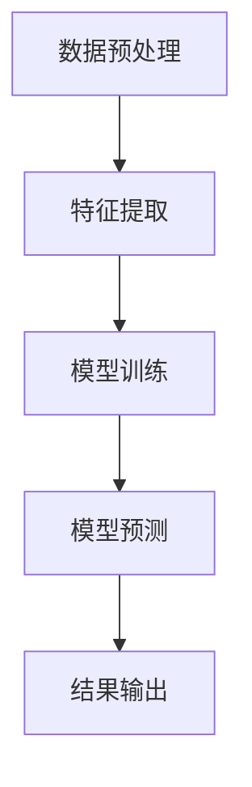
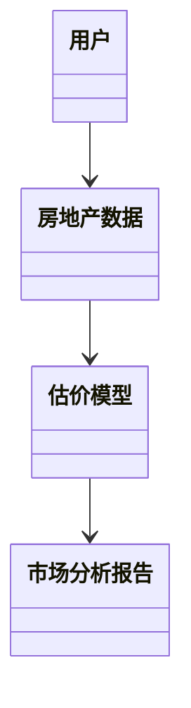
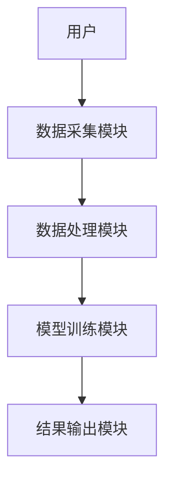

                 


# 房地产AI Agent：智能估价与市场分析

> 关键词：房地产AI Agent，智能估价，市场分析，机器学习，深度学习，系统架构

> 摘要：本文详细探讨了房地产AI Agent在智能估价与市场分析中的应用。通过分析其核心概念、算法原理、系统架构，结合实际项目案例，为读者提供全面的技术解读。

---

## 第一部分: 房地产AI Agent的背景与核心概念

### 第1章: 房地产AI Agent概述

#### 1.1 房地产AI Agent的定义与背景

房地产AI Agent是一种结合人工智能技术的智能系统，用于房地产市场的估价和分析。随着房地产市场的复杂化，传统的估价方法逐渐显露出局限性，尤其是在数据量庞大、市场波动频繁的情况下。AI Agent通过整合机器学习、深度学习等技术，能够快速处理大量数据，提供精准的估价和市场趋势分析。

**背景分析**  
房地产市场的数据量庞大且复杂，包括房价、地理位置、房屋特征、交易历史等多种因素。传统的估价方法依赖于人工经验，容易受到主观因素的影响，且难以在短时间内处理大量数据。AI Agent的出现，解决了这些问题，为房地产市场提供了高效、精准的解决方案。

**问题描述**  
房地产估价的关键问题在于如何准确预测房价，并识别市场趋势。传统方法难以应对数据量大、变量多、市场波动快的挑战。AI Agent通过自动化数据处理和模型训练，能够快速适应市场变化，提供实时的估价和分析。

**解决方法**  
AI Agent利用机器学习和深度学习算法，构建预测模型，分析市场趋势，为用户提供精准的估价和市场分析报告。同时，AI Agent能够实时更新数据，确保估价的准确性和及时性。

**边界与外延**  
AI Agent的核心功能包括智能估价、市场分析和数据处理。其外延功能则包括市场风险评估、投资建议等。

#### 1.2 房地产AI Agent的核心功能

**智能估价模块**  
通过机器学习模型，对房屋进行定价，考虑多种因素如地理位置、房屋特征、交易历史等。

**市场分析模块**  
分析市场趋势，预测房价走势，帮助用户做出投资决策。

**数据采集与处理模块**  
从多种数据源采集房地产数据，并进行清洗、预处理，为模型训练提供高质量的数据。

---

### 第2章: 房地产AI Agent的核心概念与联系

#### 2.1 AI Agent的基本原理

**AI Agent的定义与特点**  
AI Agent是一种能够感知环境并采取行动以实现目标的智能实体。在房地产领域，AI Agent通过数据处理、模型训练和结果输出，帮助用户完成估价和市场分析任务。

**房地产领域的AI Agent应用**  
在房地产领域，AI Agent主要用于智能估价、市场分析和数据处理。通过自动化数据处理和模型训练，AI Agent能够快速适应市场变化，提供精准的解决方案。

#### 2.2 核心概念的属性特征对比

**数据特征对比表**

| 特征     | 传统估价方法 | AI Agent估价方法 |
|----------|--------------|------------------|
| 数据量   | 小           | 大               |
| 数据类型 | 主观         | 客观             |
| 处理时间 | 长           | 短               |

**算法特征对比表**

| 算法类型     | 传统方法 | AI Agent方法 |
|--------------|----------|--------------|
| 线性回归     | 适用     | 适用          |
| 支持向量机   | 适用     | 适用          |
| 随机森林     | 不适用    | 适用          |

#### 2.3 ER实体关系图



---

### 第3章: 房地产AI Agent的算法原理

#### 3.1 机器学习算法基础

**线性回归模型**  
线性回归是一种简单而有效的回归算法，适用于数据线性可分的情况。

$$y = \beta_0 + \beta_1x + \epsilon$$

**支持向量机模型**  
支持向量机（SVM）适用于小样本数据，能够处理高维数据。

**随机森林模型**  
随机森林是一种集成学习方法，能够处理复杂的数据关系。

#### 3.2 深度学习算法应用

**神经网络模型**  
神经网络模型能够处理复杂的非线性关系。

**卷积神经网络模型**  
CNN适用于图像处理和特征提取。

**循环神经网络模型**  
RNN适用于时间序列数据分析。

#### 3.3 算法流程图



---

## 第4章: 房地产AI Agent的数学模型与公式

### 4.1 线性回归模型

**线性回归公式**

$$y = \beta_0 + \beta_1x + \epsilon$$

其中，$\beta_0$是截距，$\beta_1$是斜率，$\epsilon$是误差项。

### 4.2 神经网络模型

**神经网络结构**

$$a^{[l]} = g(a^{[l-1]}W^{[l]} + b^{[l]})$$

其中，$g$是激活函数，$W$是权重矩阵，$b$是偏置向量。

---

## 第5章: 房地产AI Agent的系统分析与架构设计

### 5.1 问题场景介绍

房地产AI Agent需要解决的主要问题包括数据量大、变量多、市场波动频繁等。AI Agent通过自动化数据处理和模型训练，能够快速适应市场变化，提供精准的估价和分析。

### 5.2 系统功能设计

**领域模型图**



### 5.3 系统架构设计

**系统架构图**



---

## 第6章: 房地产AI Agent的项目实战

### 6.1 环境安装

需要安装Python、机器学习库（如Scikit-learn、TensorFlow）和数据处理库（如Pandas）。

### 6.2 系统核心实现

**代码示例**

```python
import pandas as pd
from sklearn.linear_model import LinearRegression

# 数据加载
data = pd.read_csv('房地产数据.csv')

# 特征提取
X = data[['面积', '位置', '房龄']]
y = data['价格']

# 模型训练
model = LinearRegression()
model.fit(X, y)

# 预测
print(model.predict([[100, '市中心', 10]]))
```

### 6.3 案例分析

通过实际案例分析，展示AI Agent在房地产估价和市场分析中的应用效果。例如，使用AI Agent预测某区域的房价走势，并与实际数据进行对比，验证模型的准确性。

---

## 第7章: 最佳实践与总结

### 7.1 最佳实践

在实际应用中，建议结合多种算法，定期更新模型，并确保数据的实时性和准确性。

### 7.2 小结

本文详细探讨了房地产AI Agent的核心概念、算法原理和系统架构，通过实际案例分析展示了其在智能估价和市场分析中的应用价值。

### 7.3 注意事项

在使用AI Agent时，需要注意数据隐私和模型的实时更新，确保系统的稳定性和准确性。

### 7.4 拓展阅读

推荐阅读《机器学习实战》、《深度学习入门》等相关书籍，深入了解AI Agent在房地产领域的更多应用场景。

---

## 作者

作者：AI天才研究院/AI Genius Institute  
& 禅与计算机程序设计艺术/Zen And The Art of Computer Programming

