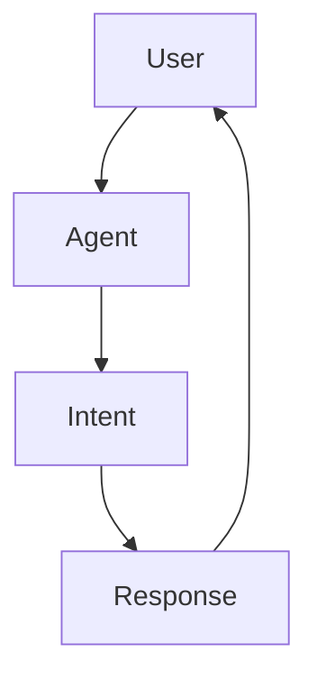
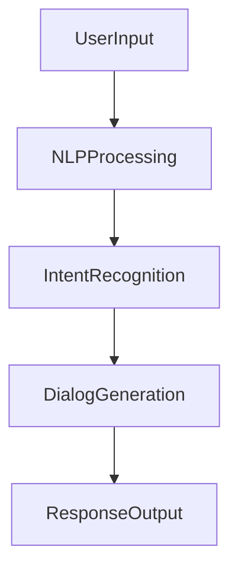
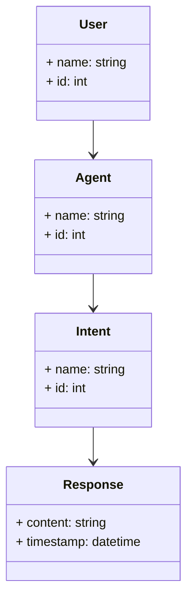
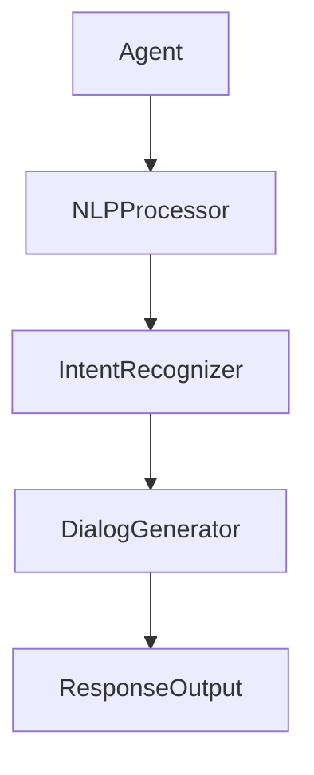
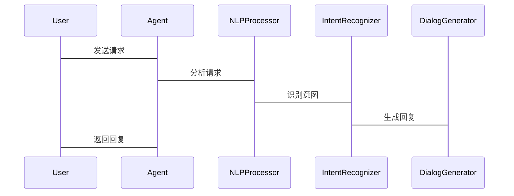

                 


# 打造用户友好的AI Agent交互界面

## 关键词：AI Agent，交互界面，自然语言处理，意图识别，对话生成，系统架构设计

## 摘要：  
本文旨在探讨如何设计和实现用户友好的AI Agent交互界面。通过分析AI Agent的核心概念、算法原理、系统架构设计以及实际项目实现，本文详细阐述了打造高效、智能且易于使用的AI交互界面的关键步骤和最佳实践。

---

# 第1章: AI Agent交互界面的背景与概念

## 1.1 AI Agent的基本概念  
### 1.1.1 什么是AI Agent  
AI Agent（人工智能代理）是指能够感知环境、自主决策并执行任务的智能实体。它通过自然语言处理、机器学习等技术，与用户进行交互，帮助用户完成各种任务。  

### 1.1.2 AI Agent的核心功能与特点  
- **感知环境**：通过传感器或用户输入获取信息。  
- **自主决策**：基于获取的信息进行分析和判断。  
- **执行任务**：通过执行动作或输出结果来实现目标。  
- **持续学习**：通过反馈不断优化自身性能。  

### 1.1.3 AI Agent与传统交互界面的区别  
传统交互界面（如按钮、菜单）依赖用户的点击操作，而AI Agent交互界面通过自然语言处理技术，支持用户以语言对话的方式完成任务，更加智能化和便捷化。  

## 1.2 AI Agent的发展背景  
### 1.2.1 人工智能技术的进步  
近年来，人工智能技术的飞速发展为AI Agent的实现提供了强大的技术支持，尤其是自然语言处理和深度学习领域的突破。  

### 1.2.2 自然语言处理技术的成熟  
自然语言处理技术的进步使得AI Agent能够更准确地理解用户的意图，并生成自然流畅的回复。  

### 1.2.3 用户需求的变化与多样化  
随着用户对智能化服务需求的增加，传统的交互方式已无法满足用户的多样化需求，AI Agent交互界面因此应运而生。  

## 1.3 AI Agent交互界面的技术优势  
### 1.3.1 提高用户体验的潜力  
AI Agent交互界面能够通过个性化的服务和智能化的响应，显著提升用户体验。  

### 1.3.2 实现人机交互的自然化  
通过自然语言处理技术，AI Agent能够实现更接近人类自然对话的交互方式。  

### 1.3.3 支持多模态交互的可能性  
AI Agent交互界面可以支持文本、语音、图像等多种交互方式，满足用户的多样化需求。  

## 1.4 用户需求与AI Agent交互界面的设计目标  
### 1.4.1 用户需求的多样性  
用户在使用AI Agent时，可能需要完成多种任务，如信息查询、任务调度、情感交流等。  

### 1.4.2 设计目标的明确化  
设计目标应围绕用户体验、功能实现、性能优化等方面展开。  

### 1.4.3 用户体验的核心要素  
包括易用性、响应速度、准确性、情感共鸣等。  

## 1.5 本章小结  
本章从背景和概念入手，详细阐述了AI Agent的基本概念、发展背景及其交互界面的技术优势，为后续章节的深入分析奠定了基础。

---

# 第2章: AI Agent交互界面的核心概念与联系  

## 2.1 核心概念原理  
### 2.1.1 自然语言处理在交互中的作用  
自然语言处理技术是AI Agent交互界面的核心，它负责理解用户输入的文本并生成相应的回复。  

### 2.1.2 意图识别的原理与实现  
意图识别是通过分析用户的语言内容，确定用户的意图和需求。  

### 2.1.3 对话生成的机制与流程  
对话生成是基于意图识别的结果，生成符合用户需求的回复内容。  

## 2.2 核心概念属性特征对比  
| 概念         | 属性特征                     |  
|--------------|------------------------------|  
| 自然语言处理 | 分词、语义理解、语法分析       |  
| 意图识别     | 基于规则/机器学习/深度学习     |  
| 对话生成     | 基于模板/生成模型/强化学习     |  

## 2.3 ER实体关系图架构  


## 2.4 本章小结  
本章通过分析AI Agent交互界面的核心概念及其之间的关系，构建了完整的概念体系，为后续的算法实现提供了理论基础。

---

# 第3章: AI Agent交互界面的算法原理  

## 3.1 自然语言处理算法  
### 3.1.1 分词算法  
分词算法将用户的输入文本分割成词语或短语，以便后续处理。  

### 3.1.2 语义理解算法  
语义理解算法通过分析词语之间的关系，理解文本的深层含义。  

### 3.1.3 语法分析算法  
语法分析算法用于分析句子的结构，确定句子的主语、谓语等语法成分。  

## 3.2 意图识别算法  
### 3.2.1 基于规则的意图识别  
基于预定义的规则，识别用户的意图。例如，通过关键词匹配判断用户的需求。  

### 3.2.2 基于机器学习的意图识别  
使用机器学习算法（如SVM、随机森林）训练模型，识别用户的意图。  

### 3.2.3 基于深度学习的意图识别  
使用深度学习模型（如LSTM、BERT）进行意图识别，具有更高的准确率。  

## 3.3 对话生成算法  
### 3.3.1 基于模板的对话生成  
通过预定义的模板生成回复内容，适用于简单场景。  

### 3.3.2 基于生成模型的对话生成  
使用生成模型（如GPT）生成回复内容，具有更高的灵活性和创造性。  

### 3.3.3 基于强化学习的对话生成  
通过强化学习优化对话生成策略，提高回复的准确性和自然性。  

## 3.4 算法流程图  


## 3.5 本章小结  
本章详细讲解了自然语言处理和意图识别的核心算法及其在AI Agent交互界面中的应用，为后续的系统设计奠定了算法基础。

---

# 第4章: AI Agent交互界面的系统架构设计  

## 4.1 问题场景介绍  
AI Agent交互界面需要支持多种交互方式，并能够快速响应用户的需求。  

## 4.2 系统功能设计  
### 4.2.1 领域模型设计  


### 4.2.2 系统架构设计  


### 4.2.3 系统接口设计  
- 用户输入接口：支持文本输入和语音输入。  
- 响应输出接口：支持文本输出和语音输出。  

### 4.2.4 系统交互设计  


## 4.3 本章小结  
本章通过系统架构设计，明确了AI Agent交互界面的核心组件及其交互流程，为实际项目的开发提供了指导。

---

# 第5章: AI Agent交互界面的项目实战  

## 5.1 环境安装  
- 安装Python和相关库（如TensorFlow、NLTK）。  

## 5.2 核心代码实现  
```python
# 示例代码：意图识别
import tensorflow as tf
from tensorflow.keras import layers

model = tf.keras.Sequential()
model.add(layers.Embedding(input_dim=1000, output_dim=50))
model.add(layers.LSTM(64))
model.add(layers.Dense(1, activation='sigmoid'))

model.compile(optimizer='adam', loss='binary_crossentropy', metrics=['accuracy'])
model.fit(X_train, y_train, epochs=10, batch_size=32)
```

## 5.3 代码应用解读与分析  
- 代码实现意图识别模型的训练和评估。  

## 5.4 实际案例分析  
以一个简单的信息查询任务为例，展示AI Agent交互界面的实现过程。  

## 5.5 本章小结  
本章通过实际项目的实现，帮助读者理解AI Agent交互界面的开发流程和关键步骤。

---

# 第6章: 打造用户友好的AI Agent交互界面的最佳实践  

## 6.1 设计原则  
- 以用户为中心，注重用户体验。  
- 简单易用，降低学习成本。  
- 支持多模态交互，满足多样化需求。  

## 6.2 注意事项  
- 确保系统的健壮性，避免出现错误。  
- 定期更新模型，提升识别准确率。  
- 保护用户隐私，遵守相关法律法规。  

## 6.3 拓展阅读  
推荐一些优秀的AI Agent相关书籍和论文，供读者进一步学习。  

## 6.4 本章小结  
本章总结了打造用户友好的AI Agent交互界面的关键要点和注意事项，为读者提供了实践指导。

---

# 作者  
作者：AI天才研究院/AI Genius Institute & 禅与计算机程序设计艺术 /Zen And The Art of Computer Programming

