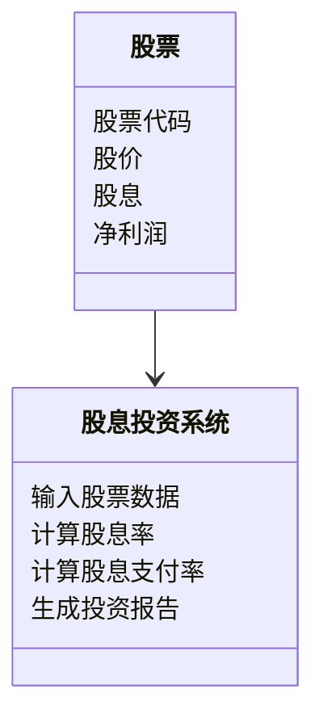
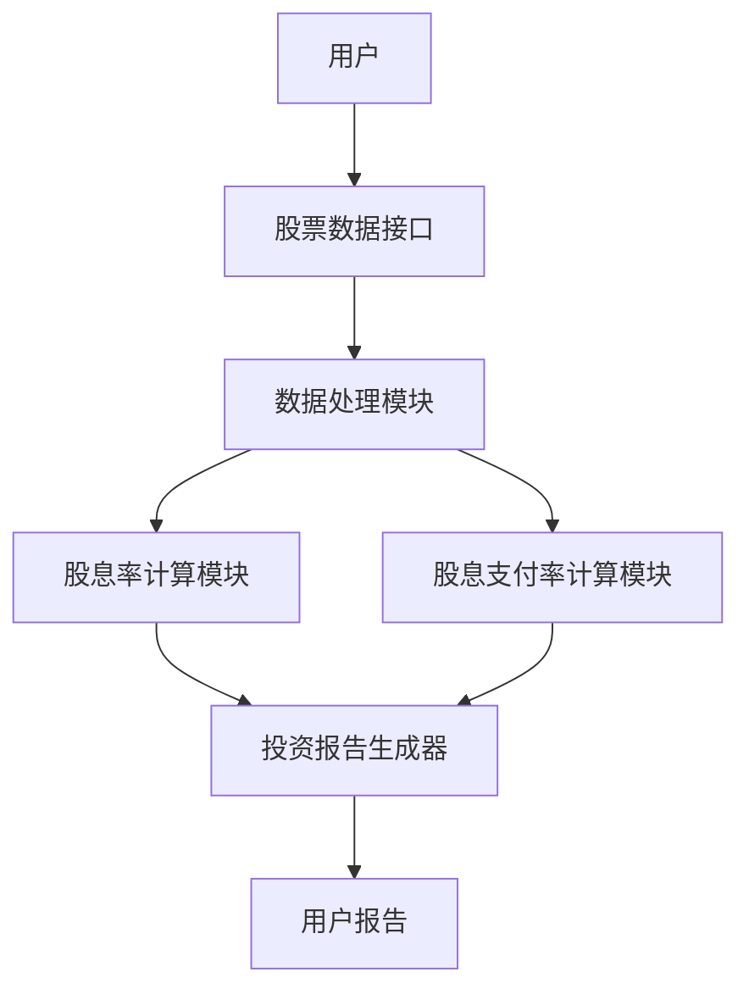
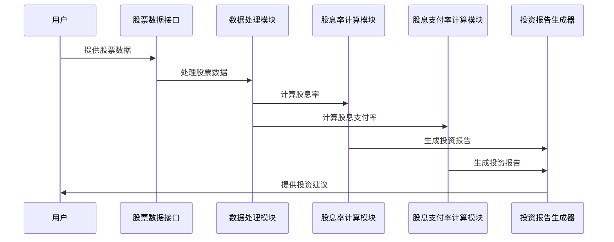

                 


# 托马斯罗的股息投资策略

> 关键词：股息投资，股息率，股息支付率，股息增长模型，投资策略，股票分析

> 摘要：  
托马斯罗的股息投资策略是一种以股息为核心的投资方法，通过分析股息率、股息支付率和股息增长模型，结合市场环境和公司基本面，选择具有稳定或高股息回报的股票。本文详细阐述了股息投资的背景、核心概念、算法原理、数学模型、系统架构、项目实战以及最佳实践，帮助读者全面理解并掌握这一投资策略。

---

## 目录

1. [托马斯罗的股息投资策略概述](#托马斯罗的股息投资策略概述)
2. [股息投资的核心概念与联系](#股息投资的核心概念与联系)
3. [股息投资的算法原理](#股息投资的算法原理)
4. [股息投资的数学模型](#股息投资的数学模型)
5. [股息投资的系统架构](#股息投资的系统架构)
6. [股息投资的项目实战](#股息投资的项目实战)
7. [股息投资的最佳实践](#股息投资的最佳实践)

---

## 1. 托马斯罗的股息投资策略概述

### 1.1 股息投资的基本概念

股息是公司分配给股东的利润部分，通常以每股形式发放。股息投资是指投资者通过购买股票，以获取股息收入为核心目标的投资方式。

#### 1.1.1 什么是股息
股息是公司从净利润中分配给股东的金额，通常以每股股息（Dividends Per Share, DPS）的形式发放。股息可以以现金、股票或其他资产形式支付，但最常见的是现金股息。

#### 1.1.2 股息投资的定义
股息投资是一种以获取股息收入为主要目标的投资策略。投资者通过分析股息率、股息支付率和股息增长能力，选择具有稳定或高股息回报的股票。

#### 1.1.3 股息投资的特点
- **稳定性**：股息收入相对稳定，尤其是来自成熟公司的股息。
- **防御性**：股息投资在市场低迷时表现较好，适合风险厌恶型投资者。
- **复利效应**：通过再投资股息，可以实现收益的复利增长。

### 1.2 股息投资的意义

股息投资不仅提供稳定的收入来源，还能在长期复利效应下实现资产增值。与资本利得相比，股息投资的风险较低，适合长期投资者。

#### 1.2.1 股息投资的优势
- **稳定收入**：股息收入通常比资本利得更稳定。
- **税收优惠**：部分国家对股息收入的税率较低。
- **复利效应**：通过再投资股息，可以实现收益的滚雪球效应。

#### 1.2.2 股息投资的风险
- **市场风险**：股票价格波动会影响股息收入。
- **公司风险**：公司盈利状况不佳可能减少或取消股息支付。

#### 1.2.3 股息投资的适用场景
- **长期投资**：适合希望长期持有股票的投资者。
- **防御性投资**：在市场低迷时，股息收入提供一定的稳定性。

### 1.3 股息投资与其他投资方式的对比

#### 1.3.1 股票投资 vs 股息投资
股票投资主要关注资本利得，而股息投资注重股息收入。两者可以结合使用，但股息投资更注重长期稳定的收益。

#### 1.3.2 债券投资 vs 股息投资
债券投资的收益是固定的利息，风险较低；股息投资的收益不稳定，但潜在收益较高。

#### 1.3.3 其他投资方式的对比分析
股息投资与其他投资方式的对比可以帮助投资者选择适合自己的投资策略。

---

## 2. 股息投资的核心概念与联系

### 2.1 股息投资的核心概念

#### 2.1.1 股息率的定义与计算
股息率是衡量股票股息收入与股价比例的重要指标，计算公式为：
$$
\text{股息率} = \frac{\text{每股股息}}{\text{股价}} \times 100\%
$$

#### 2.1.2 股息支付率的定义与计算
股息支付率是公司实际支付的股息与净利润的比例，计算公式为：
$$
\text{股息支付率} = \frac{\text{股息总额}}{\text{净利润}} \times 100\%
$$

#### 2.1.3 股息增长模型的定义与应用
股息增长模型用于预测股息的未来增长，常用的是戈登增长模型：
$$
\text{股价} = \frac{\text{股息}_t}{\text{折现率} - \text{股息增长率}}
$$

### 2.2 股息投资的核心原理

#### 2.2.1 股息投资的基本原理
通过分析股息率、股息支付率和股息增长能力，选择具有稳定或高股息回报的股票。

#### 2.2.2 股息投资的数学模型
使用戈登增长模型等股息增长模型，评估股票的内在价值。

#### 2.2.3 股息投资的决策流程
1. 计算股息率和股息支付率。
2. 评估公司的盈利能力和股息增长能力。
3. 结合市场环境和行业趋势，选择优质股。

---

## 3. 股息投资的算法原理

### 3.1 股息投资的筛选算法

#### 3.1.1 算法步骤
1. 计算股息率：$$\text{股息率} = \frac{\text{每股股息}}{\text{股价}}$$
2. 评估股息支付率：$$\text{股息支付率} = \frac{\text{股息总额}}{\text{净利润}}$$
3. 筛选股息率高且股息支付率合理的股票。

#### 3.1.2 算法实现
使用Python编写股息投资筛选算法：

```python
import pandas as pd

def calculate_dividend_yield(dividends, price):
    return (dividends / price) * 100

def calculate_dividend_payout(dividends, net_income):
    return (dividends / net_income) * 100

# 示例数据
data = {
    '股票代码': ['A', 'B', 'C'],
    '股息': [2, 3, 1],
    '股价': [20, 30, 10],
    '净利润': [10, 15, 5]
}

df = pd.DataFrame(data)

# 计算股息率和股息支付率
df['股息率'] = df.apply(lambda x: calculate_dividend_yield(x['股息'], x['股价']), axis=1)
df['股息支付率'] = df.apply(lambda x: calculate_dividend_payout(x['股息'], x['净利润']), axis=1)

print(df)
```

#### 3.1.3 算法优化
通过引入更多的财务指标和市场数据，优化股息投资筛选算法。

---

## 4. 股息投资的数学模型

### 4.1 股息增长模型

#### 4.1.1 戈登增长模型
戈登增长模型用于预测股息的未来增长：
$$
\text{股价} = \frac{\text{股息}_t}{\text{折现率} - \text{股息增长率}}
$$

#### 4.1.2 股息增长模型的应用
通过模型预测股票的未来股息，评估其投资价值。

### 4.2 股息支付率模型

#### 4.2.1 股息支付率模型的公式
$$
\text{股息支付率} = \frac{\text{股息总额}}{\text{净利润}}
$$

#### 4.2.2 股息支付率模型的应用
评估公司的股息支付能力，选择股息支付率合理的股票。

---

## 5. 股息投资的系统架构

### 5.1 系统功能设计

#### 5.1.1 领域模型


#### 5.1.2 系统架构


### 5.2 系统接口设计

#### 5.2.1 系统接口
- 输入接口：股票代码、股价、股息、净利润。
- 输出接口：股息率、股息支付率、投资建议。

#### 5.2.2 接口交互


---

## 6. 股息投资的项目实战

### 6.1 环境安装

#### 6.1.1 安装Python和相关库
安装Python和Pandas库：
```bash
pip install pandas
```

### 6.2 系统核心实现

#### 6.2.1 股息投资筛选系统
编写Python代码实现股息投资筛选：
```python
import pandas as pd

def calculate_dividend_yield(dividends, price):
    return (dividends / price) * 100

def calculate_dividend_payout(dividends, net_income):
    return (dividends / net_income) * 100

# 示例数据
data = {
    '股票代码': ['A', 'B', 'C'],
    '股息': [2, 3, 1],
    '股价': [20, 30, 10],
    '净利润': [10, 15, 5]
}

df = pd.DataFrame(data)

# 计算股息率和股息支付率
df['股息率'] = df.apply(lambda x: calculate_dividend_yield(x['股息'], x['股价']), axis=1)
df['股息支付率'] = df.apply(lambda x: calculate_dividend_payout(x['股息'], x['净利润']), axis=1)

print(df)
```

### 6.3 应用解读与分析

#### 6.3.1 实际案例分析
以某公司为例，分析其股息率和股息支付率，评估其投资价值。

---

## 7. 股息投资的最佳实践

### 7.1 小结
托马斯罗的股息投资策略通过分析股息率、股息支付率和股息增长模型，选择具有稳定或高股息回报的股票，实现长期稳定的收益。

### 7.2 注意事项
- **分散投资**：避免过度集中于单一股票或行业。
- **持续监控**：定期评估股票的股息支付能力和市场环境变化。

### 7.3 拓展阅读
- 推荐书籍：《股息投资实战》
- 推荐网站：Yahoo Finance、Morningstar

---

## 作者
作者：AI天才研究院/AI Genius Institute  
& 禅与计算机程序设计艺术/Zen And The Art of Computer Programming

