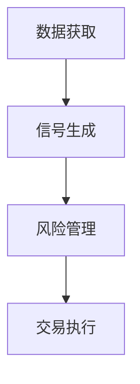

                 


# 技术分析在高波动市场中的应用

## 关键词：
技术分析, 高波动市场, 交易策略, 风险管理, 数学模型

## 摘要：
技术分析是一种通过研究历史市场数据来预测未来价格走势的方法，尤其适用于高波动市场。本文从技术分析的基本概念、核心工具、数学模型、系统架构、实战案例以及风险管理等方面展开详细讨论。通过实际案例和数学模型的分析，本文为读者提供了在高波动市场中应用技术分析的完整指南。

---

# 第1章: 技术分析的定义与核心概念

## 1.1 技术分析的定义
### 1.1.1 技术分析的定义
技术分析是一种通过研究历史价格数据、交易量和其他市场数据，来预测未来价格走势的方法。它基于以下假设：市场行为反映所有信息、价格走势具有趋势性、历史会重复。

### 1.1.2 技术分析的核心要素
- **价格（Price）**：市场的直接反映，是技术分析的核心。
- **时间（Time）**：技术分析依赖于时间序列数据，分析价格随时间的变化规律。
- **交易量（Volume）**：辅助判断价格走势的强度和趋势的延续性。

### 1.1.3 技术分析与基本面分析的区别
- **基本面分析**：关注企业的内在价值，如财务报表、行业地位等。
- **技术分析**：关注市场交易行为和价格走势，不考虑基本面因素。

---

## 1.2 技术分析的假设与理论基础
### 1.2.1 技术分析的三大假设
1. 市场行为反映所有信息。
2. 价格走势具有趋势性。
3. 历史会重复。

### 1.2.2 技术分析的理论基础
技术分析的理论基础包括道氏理论、艾略特波浪理论和江恩理论等。

### 1.2.3 技术分析的哲学基础
技术分析认为，市场的参与者是理性的，市场的价格波动是随机的，但可以通过技术指标预测未来走势。

---

## 1.3 技术分析在高波动市场中的特点
### 1.3.1 高波动市场的定义
高波动市场是指价格波动剧烈、市场参与者情绪化、市场流动性不稳定、价格走势难以预测的市场环境。

### 1.3.2 技术分析在高波动市场中的适用性
技术分析在高波动市场中具有较高的适用性，因为高波动市场中价格走势往往表现出明显的趋势性和形态特征。

### 1.3.3 技术分析在高波动市场中的挑战
- 高波动市场的价格走势难以预测。
- 技术指标在高波动市场中可能出现虚假信号。

---

## 1.4 本章小结
本章主要介绍了技术分析的基本定义、核心要素和在高波动市场中的特点。技术分析是一种通过研究历史价格数据来预测未来价格走势的方法，尤其适用于高波动市场。

---

# 第2章: 技术分析的核心工具与指标

## 2.1 K线图的解读
### 2.1.1 K线图的基本构成
K线图由开盘价、收盘价、最高价和最低价组成，反映了市场的买卖力量变化。

### 2.1.2 K线图的类型与意义
- **阳线**：收盘价高于开盘价，表示买方力量占优。
- **阴线**：收盘价低于开盘价，表示卖方力量占优。

### 2.1.3 K线图的常见形态
- **锤子线**：表示底部反转信号。
- **十字星线**：表示市场犹豫，可能反转。

---

## 2.2 移动平均线（MA）
### 2.2.1 移动平均线的定义
移动平均线是将一定周期内的价格数据求平均值，用以平滑价格波动。

### 2.2.2 移动平均线的计算公式
$$ MA_n = \frac{p_t + p_{t-1} + \cdots + p_{t-n+1}}{n} $$

### 2.2.3 移动平均线的应用策略
- **趋势判断**：MA作为价格走势的支撑或阻力线。
- **信号生成**：短期MA与长期MA交叉作为买卖信号。

---

## 2.3 相对强弱指数（RSI）
### 2.3.1 RSI的定义与计算公式
$$ RSI = \frac{100 \times \text{平均上涨幅度}}{\text{平均上涨幅度} + \text{平均下跌幅度}} $$

### 2.3.2 RSI的应用策略
- **超买超卖信号**：RSI大于70为超买，小于30为超卖。
- **趋势确认**：RSI与价格走势背离。

---

## 2.4 威尔德的相对强度（RS）
### 2.4.1 RS的定义与计算公式
$$ RS = \frac{\text{上涨幅度}}{\text{下跌幅度}} $$

### 2.4.2 RS的应用策略
- **趋势判断**：RS大于1表示上涨趋势，小于1表示下跌趋势。

---

## 2.5 本章小结
本章介绍了技术分析的核心工具，包括K线图、移动平均线、RSI和RS。这些工具在高波动市场中可以帮助交易者识别趋势、判断超买超卖和确认形态。

---

# 第3章: 技术分析的核心原理与数学模型

## 3.1 移动平均收敛散度（MACD）
### 3.1.1 MACD的定义与计算公式
$$ MACD = \text{短期EMA} - \text{长期EMA} $$

### 3.1.2 MACD的计算步骤
1. 计算短期EMA和长期EMA。
2. 计算两者的差值。

### 3.1.3 MACD的应用策略
- **趋势判断**：MACD为正表示上涨趋势，为负表示下跌趋势。
- **信号生成**：MACD与信号线交叉作为买卖信号。

---

## 3.2 指数平滑异同平均线（RSI）
### 3.2.1 RSI的定义与计算公式
$$ RSI = \frac{100 \times \text{平均上涨幅度}}{\text{平均上涨幅度} + \text{平均下跌幅度}} $$

### 3.2.2 RSI的应用策略
- **超买超卖信号**：RSI大于70为超买，小于30为超卖。

---

## 3.3 布林格带（Bollinger Bands）
### 3.3.1 Bollinger Bands的定义与计算公式
$$ BOL = \text{MA} \pm k \times \text{标准差} $$

### 3.3.2 Bollinger Bands的应用策略
- **价格突破**：价格突破上轨或下轨为买卖信号。
- **形态识别**：价格在布林带之间波动，可能形成收敛或发散形态。

---

## 3.4 本章小结
本章通过数学模型和公式，详细讲解了技术分析的核心指标，包括MACD、RSI和布林格带。这些指标在高波动市场中可以帮助交易者识别趋势、判断超买超卖和确认形态。

---

# 第4章: 高波动市场中的技术分析系统架构

## 4.1 系统架构设计
- **数据获取模块**：从交易所获取历史数据。
- **信号生成模块**：应用技术指标生成买卖信号。
- **风险管理模块**：根据信号和市场状况调整头寸。

### 系统架构图


---

## 4.2 算法实现
### 4.2.1 数据获取
```python
import pandas as pd
import yfinance as yf

data = yf.download('BTC-USD', start='2020-01-01', end='2023-01-01')
```

### 4.2.2 信号生成
```python
def generate_signal(data):
    data['MA20'] = data['Close'].rolling(20).mean()
    data['MA5'] = data['Close'].rolling(5).mean()
    data['Signal'] = 0
    data['Signal'][(data['MA5'] > data['MA20'])] = 1
    data['Signal'][(data['MA5'] < data['MA20'])] = -1
    return data
```

---

## 4.3 本章小结
本章通过系统架构和算法实现，详细讲解了如何在高波动市场中应用技术分析。从数据获取到信号生成，再到风险管理，构建了一个完整的交易系统。

---

# 第5章: 技术分析在高波动市场中的实战案例

## 5.1 案例分析：比特币价格预测
### 5.1.1 环境配置
```python
import pandas as pd
import numpy as np
import yfinance as yf
import matplotlib.pyplot as plt
```

### 5.1.2 数据获取
```python
data = yf.download('BTC-USD', start='2020-01-01', end='2023-01-01')
```

### 5.1.3 策略实现
```python
data['MA20'] = data['Close'].rolling(20).mean()
data['MA5'] = data['Close'].rolling(5).mean()
data['Signal'] = 0
data['Signal'][(data['MA5'] > data['MA20'])] = 1
data['Signal'][(data['MA5'] < data['MA20'])] = -1
```

### 5.1.4 信号生成
```python
data['Position'] = data['Signal'].shift(1)
data['Return'] = data['Close'].pct_change() * data['Position']
```

### 5.1.5 结果分析
```python
print(data['Return'].cumsum().plot())
```

---

## 5.2 本章小结
本章通过比特币价格预测的实战案例，展示了如何在高波动市场中应用技术分析策略。通过实际操作和结果分析，帮助读者理解技术分析在实际交易中的应用。

---

# 第6章: 技术分析在高波动市场中的风险管理与优化

## 6.1 风险管理的基本原则
### 6.1.1 风险控制的定义
风险控制是指通过合理配置资产和交易策略，降低交易中的潜在损失。

### 6.1.2 风险控制的策略
- **止损**：设定最大亏损比例。
- **分散投资**：避免过度集中。

---

## 6.2 技术分析策略优化
### 6.2.1 策略优化的定义
策略优化是指通过调整参数和策略组合，提高交易系统的表现。

### 6.2.2 策略优化的方法
- **参数优化**：通过回测调整参数。
- **策略组合**：结合多个技术指标提高信号准确性。

---

## 6.3 策略回测与优化
### 6.3.1 回测分析
```python
def backtest(data, strategy):
    returns = []
    for i in range(len(data)):
        returns.append(strategy(data.iloc[:i+1]))
    return returns
```

### 6.3.2 优化分析
```python
def optimize(data, strategy):
    best_params = None
    best_return = 0
    for params in possible_params:
        return = backtest(data, strategy(params))
        if return > best_return:
            best_return = return
            best_params = params
    return best_params, best_return
```

---

## 6.4 本章小结
本章讨论了技术分析在高波动市场中的风险管理与策略优化。通过合理的风险控制和策略优化，可以帮助交易者在高波动市场中提高交易系统的稳定性。

---

# 作者：AI天才研究院/AI Genius Institute & 禅与计算机程序设计艺术 /Zen And The Art of Computer Programming

