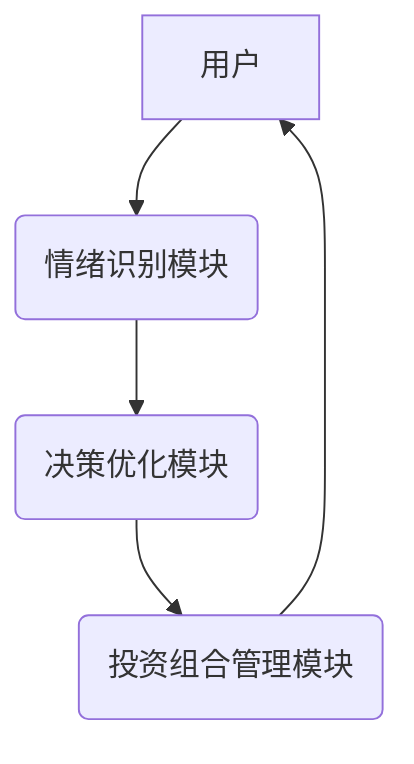
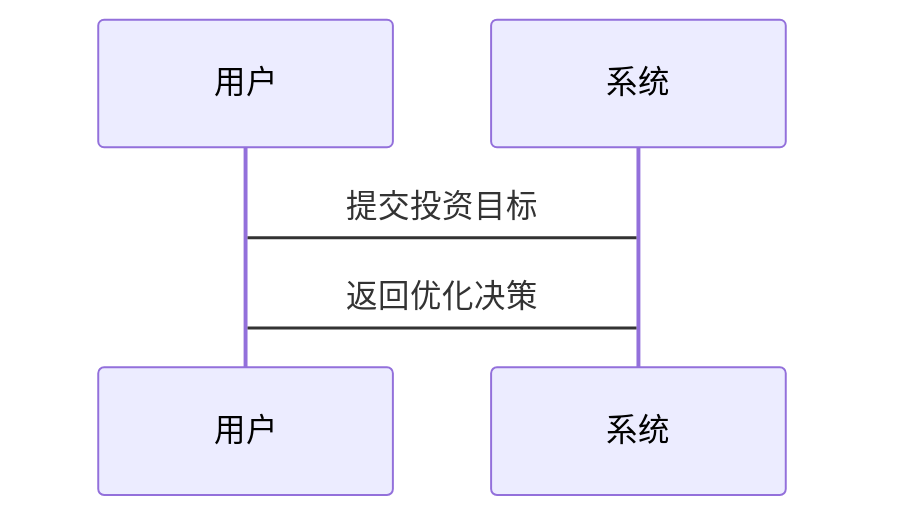

                 


# 投资心理学：克服情绪化决策的方法

> **关键词**：投资心理学、情绪化决策、行为金融学、决策优化、心理认知

> **摘要**：本文深入探讨了投资心理学中情绪化决策的成因及其对投资绩效的影响，通过理论分析和实际案例，提出了克服情绪化决策的具体方法。文章从情绪识别与管理、理性决策培养、长期投资策略制定等方面展开，结合算法与系统架构设计，提供了一套科学的投资决策支持系统，帮助投资者实现更理性的决策过程。

---

## 第1章: 投资心理学概述

### 1.1 投资心理学的核心概念

#### 1.1.1 投资心理学的定义
投资心理学是研究投资者在金融市场中的心理活动及其对决策影响的学科。它结合了心理学、金融学和行为学，旨在揭示投资者在决策过程中的情绪、认知偏差和行为模式。

#### 1.1.2 情绪化决策的定义与特征
情绪化决策是指投资者在决策过程中受到情绪因素主导，而非理性分析的决策方式。其特征包括：非理性、冲动性、情绪波动性和自我欺骗性。

#### 1.1.3 投资心理学的研究范围与方法
研究范围包括投资者心理、市场行为、决策过程等；研究方法涉及实验法、案例分析、数据分析等。

### 1.2 投资心理学的背景与重要性

#### 1.2.1 投资领域中的情绪化问题
投资者在面对市场波动时，常常会受到贪婪和恐惧情绪的驱动，导致错误决策。

#### 1.2.2 投资心理学在现代金融中的作用
通过理解投资者心理，机构可以设计更有效的投资策略和风险管理措施。

#### 1.2.3 全球投资心理学研究现状
当前研究集中在认知偏差、行为矫正和情绪管理技术等方面，但仍需进一步深入。

### 1.3 投资心理学的基本理论框架

#### 1.3.1 理性决策与情绪决策的对比
理性决策基于逻辑分析，情绪决策受情感驱动。

#### 1.3.2 投资决策中的认知偏差
常见认知偏差包括确认偏差、过度自信和从众心理等。

#### 1.3.3 行为金融学的基本理论
行为金融学通过分析投资者行为，揭示市场非理性现象的原因。

---

## 第2章: 情绪化决策的成因与表现

### 2.1 情绪化决策的成因分析

#### 2.1.1 生理因素对情绪的影响
大脑的杏仁核和前额叶皮层在情绪处理中起关键作用。

#### 2.1.2 心理因素对决策的影响
认知偏差和心理预期影响投资决策。

#### 2.1.3 环境因素对情绪决策的干扰
市场波动和外部信息干扰投资者情绪。

### 2.2 情绪化决策的表现形式

#### 2.2.1 过度乐观与过度悲观
投资者在牛市中过于乐观，熊市中过于悲观。

#### 2.2.2 从众心理与羊群效应
投资者盲目跟随市场趋势，忽视独立分析。

#### 2.2.3 投资者情绪周期性波动
市场情绪呈现周期性波动，影响市场走势。

### 2.3 情绪化决策对投资绩效的影响

#### 2.3.1 情绪化决策导致的常见错误
追涨杀跌、过度交易和忽视风险。

#### 2.3.2 情绪化决策对投资组合的影响
情绪化决策可能导致资产配置不合理和投资回报下降。

#### 2.3.3 情绪化决策与市场波动的关系
情绪化决策加剧市场波动，影响市场稳定性。

---

## 第3章: 克服情绪化决策的核心方法

### 3.1 理性决策的培养与训练

#### 3.1.1 理性思维的定义与特征
理性决策基于事实和逻辑，避免情绪干扰。

#### 3.1.2 理性决策训练的方法与技巧
通过冥想、正念练习和逻辑训练提升理性思维能力。

#### 3.1.3 理性决策与情绪化决策的对比分析
理性决策更注重长期收益，情绪化决策受短期情绪驱动。

### 3.2 投资决策中的情绪管理策略

#### 3.2.1 情绪识别与监控方法
通过自我觉察和情绪记录工具识别情绪状态。

#### 3.2.2 情绪调节与控制技巧
使用深呼吸、运动和社交活动缓解负面情绪。

#### 3.2.3 情绪管理工具与应用
利用情绪日记、冥想APP和投资决策日志等工具管理情绪。

### 3.3 长期投资策略的制定与执行

#### 3.3.1 长期投资策略的定义与特点
以价值投资为核心，注重长期收益，忽略短期波动。

#### 3.3.2 长期投资策略的制定步骤
明确投资目标、选择优质资产、制定资产配置方案。

#### 3.3.3 长期投资策略的执行与调整
定期评估投资组合，根据市场变化进行适度调整。

---

## 第4章: 投资决策支持系统的算法与实现

### 4.1 情绪识别算法

#### 4.1.1 情绪识别的定义与方法
通过自然语言处理和机器学习技术识别文本中的情绪倾向。

#### 4.1.2 情绪分类算法
使用支持向量机（SVM）和随机森林（Random Forest）进行分类。

#### 4.1.3 情绪识别的Python代码实现
```python
from sklearn.svm import SVC
from sklearn.model_selection import train_test_split
import pandas as pd

# 加载数据集
data = pd.read_csv('sentiment_data.csv')

# 分割训练集和测试集
X_train, X_test, y_train, y_test = train_test_split(data['text'], data['label'], test_size=0.2)

# 训练模型
model = SVC()
model.fit(X_train, y_train)

# 预测和评估
accuracy = model.score(X_test, y_test)
print(f"模型准确率：{accuracy}")
```

### 4.2 决策优化算法

#### 4.2.1 决策优化的定义与方法
通过强化学习优化投资策略，减少情绪化决策的影响。

#### 4.2.2 强化学习算法实现
使用Q-learning算法模拟投资决策过程。

#### 4.2.3 强化学习的Python代码实现
```python
import numpy as np

# 定义状态和动作空间
states = ['bull', 'bear']
actions = ['buy', 'sell', 'hold']

# 初始化Q表
Q = {state: {action: 0 for action in actions} for state in states}

# 定义奖励函数
def reward_function(current_state, action, next_state):
    if next_state == 'bull' and action == 'buy':
        return 1
    elif next_state == 'bear' and action == 'sell':
        return 1
    else:
        return -0.1

# Q-learning算法
for episode in range(1000):
    state = np.random.choice(states)
    action = np.random.choice(actions)
    next_state = np.random.choice(states)
    reward = reward_function(state, action, next_state)
    Q[state][action] += reward

print(Q)
```

### 4.3 数学模型与公式

#### 4.3.1 情绪影响下的投资决策模型
$$ P(\text{选择投资}) = f(\text{情绪强度}, \text{风险偏好}) $$

#### 4.3.2 基于强化学习的决策优化模型
$$ Q(s, a) = Q(s, a) + \alpha (r + \gamma \max Q(s', a') - Q(s, a)) $$

---

## 第5章: 系统架构与交互设计

### 5.1 投资决策支持系统架构

#### 5.1.1 系统功能设计
- 情绪识别模块
- 决策优化模块
- 投资组合管理模块

#### 5.1.2 系统架构设计


#### 5.1.3 系统接口设计
- API接口：`/api/emotion/detect`、`/api/decision/optimize`

#### 5.1.4 系统交互流程


---

## 第6章: 项目实战与案例分析

### 6.1 项目实战

#### 6.1.1 环境安装
安装必要的Python库，如`scikit-learn`、`pandas`和`mermaid`。

#### 6.1.2 核心代码实现
实现情绪识别和决策优化算法，测试模型性能。

#### 6.1.3 案例分析
分析实际投资案例，评估系统性能和效果。

### 6.2 项目总结

#### 6.2.1 项目成果
成功开发投资决策支持系统，提升投资决策的理性化水平。

#### 6.2.2 项目经验
强调理论与实践结合的重要性，以及持续优化系统的重要性。

---

## 第7章: 投资心理学的实践与总结

### 7.1 投资心理学的实践意义

#### 7.1.1 投资者自我提升
通过情绪管理和理性训练，提升投资决策能力。

#### 7.1.2 机构投资策略优化
结合投资心理学理论，优化机构投资策略。

### 7.2 投资心理学的未来展望

#### 7.2.1 技术与心理学的结合
人工智能和大数据技术将进一步应用于投资心理学研究。

#### 7.2.2 投资者教育的重要性
加强投资者教育，提升整体市场理性水平。

---

## 作者：AI天才研究院 & 禅与计算机程序设计艺术

