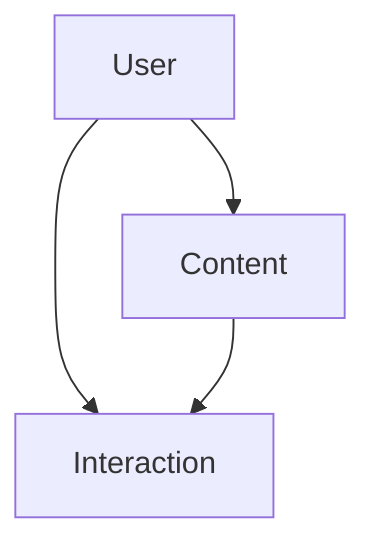

                 


```markdown
# 投资理财教育平台的集成

> 关键词：投资理财教育，平台集成，推荐算法，系统架构，项目实战

> 摘要：本文详细探讨了投资理财教育平台的集成过程，从背景分析到系统架构设计，再到项目实战，全面解析了如何构建一个高效、智能的投资理财教育平台。通过介绍推荐算法、系统架构设计、项目实现等核心内容，为读者提供了从理论到实践的完整指南。

## 第一部分: 投资理财教育平台的背景与需求

### 第1章: 投资理财教育平台的背景与需求

#### 1.1 投资理财教育的重要性
- 1.1.1 投资理财教育的核心概念
  - 投资理财的基本原理
  - 教育的目标与意义
- 1.1.2 当前投资理财教育的主要问题
  - 现有教育模式的局限性
  - 学习者的常见困扰
- 1.1.3 投资理财教育平台的必要性
  - 提供个性化学习路径
  - 解决传统教育的不足

#### 1.2 投资理财教育平台的定义与目标
- 1.2.1 投资理财教育平台的定义
  - 平台的功能与服务范围
- 1.2.2 平台的核心目标
  - 提供高质量的投资理财教育资源
  - 个性化学习体验
- 1.2.3 平台的用户群体与服务范围
  - 面向人群分析
  - 服务范围界定

#### 1.3 投资理财教育平台的集成需求
- 1.3.1 集成的主要内容
  - 教育资源的整合
  - 技术架构的搭建
- 1.3.2 集成的目标与优势
  - 提高学习效率
  - 优化用户体验
- 1.3.3 集成的边界与限制
  - 功能边界
  - 技术限制

### 第2章: 投资理财教育平台的核心概念与联系

#### 2.1 核心概念原理
- 2.1.1 投资理财教育的核心要素
  - 知识点的分类
  - 学习路径的设计
- 2.1.2 平台集成的关键技术
  - 数据挖掘
  - 机器学习
- 2.1.3 用户行为与数据流的关系
  - 用户行为分析
  - 数据流的处理

#### 2.2 核心概念属性对比表
```markdown
| 核心概念 | 属性1 | 属性2 | 属性3 |
|----------|-------|-------|-------|
| 用户     | ID    | 姓名  | 资产  |
| 内容     | 类型  | 标题  | 描述  |
| 交互     | 操作  | 数据  | 反馈  |
```

#### 2.3 实体关系图


### 第3章: 投资理财教育平台的算法原理

#### 3.1 推荐算法
- 3.1.1 协同过滤算法
  ```mermaid
  graph TD
      User --> Item
      Item --> Rating
      SimilarUser --> Rating
  ```

- 3.1.2 基于内容的推荐算法
  ```mermaid
  graph TD
      User --> ContentFeature
      Item --> ContentFeature
      ContentFeature --> Similarity
  ```

#### 3.2 算法实现
- 3.2.1 协同过滤算法的数学模型
  $$ \text{相似度} = \frac{\sum (r_{u,i} - \bar{r}_u)(r_{u,j} - \bar{r}_j)}{\sqrt{\sum (r_{u,i} - \bar{r}_u)^2} \cdot \sqrt{\sum (r_{u,j} - \bar{r}_j)^2}} $$

- 3.2.2 基于内容的推荐算法的数学模型
  $$ \text{相似度} = \frac{\sum w_{i,j} \cdot f(x_i, x_j)}{\sum w_{i,j}} $$

### 第4章: 投资理财教育平台的系统架构设计

#### 4.1 系统功能设计
- 4.1.1 用户模块
  - 用户注册与登录
  - 个性化推荐
- 4.1.2 内容模块
  - 教育资源管理
  - 内容推荐系统

#### 4.2 系统架构设计
- 4.2.1 分层架构
  - 数据层
  - 业务逻辑层
  - 表现层

#### 4.3 系统接口设计
- 4.3.1 用户接口
  - RESTful API
  - 数据格式
- 4.3.2 内容接口
  - 数据源接口
  - 第三方API集成

### 第5章: 项目实战

#### 5.1 环境安装
- 5.1.1 技术选型
  - 开发语言：Python
  - 框架：Django/Flask
  - 数据库：MySQL/PostgreSQL
- 5.1.2 环境搭建
  - 安装Python
  - 安装依赖库
  - 数据库配置

#### 5.2 核心代码实现
- 5.2.1 推荐算法实现
  ```python
  def collaborative_filtering(user_matrix):
      # 实现协同过滤算法
      pass
  ```

- 5.2.2 系统架构实现
  ```python
  class Platform:
      def __init__(self, database):
          self.database = database
      def user_login(self, user):
          # 用户登录逻辑
          pass
  ```

#### 5.3 案例分析
- 5.3.1 案例背景
- 5.3.2 实施步骤
- 5.3.3 效果分析

### 第6章: 最佳实践、小结与注意事项

#### 6.1 最佳实践
- 6.1.1 技术选型建议
- 6.1.2 系统优化技巧
- 6.1.3 用户体验设计

#### 6.2 小结
- 本章总结了投资理财教育平台集成的关键点，包括背景、核心概念、算法原理、系统架构和项目实战。

#### 6.3 注意事项
- 技术实现中的常见问题
- 平台维护与更新
- 数据安全与隐私保护

### 第7章: 拓展阅读与深入学习

#### 7.1 拓展阅读
- 推荐的相关书籍和资源
- 最新研究进展
- 行业趋势分析

#### 7.2 深入学习
- 进阶学习建议
- 常见问题解答
- 未来发展方向

## 作者

作者：AI天才研究院/AI Genius Institute & 禅与计算机程序设计艺术 /Zen And The Art of Computer Programming

---

# 附录

## 附录A: 术语表

## 附录B: 参考文献

## 附录C: 代码示例

---

以上是一个详细的投资理财教育平台集成的技术博客文章目录大纲，涵盖了从背景分析到系统实现的各个方面，结构清晰，内容丰富，适合技术读者深入理解和实践。
```

