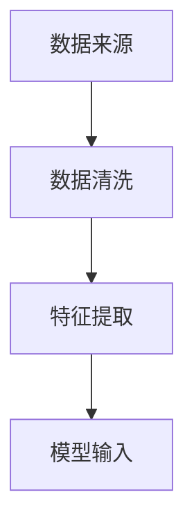
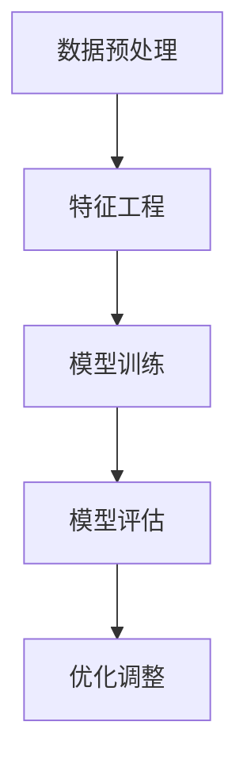
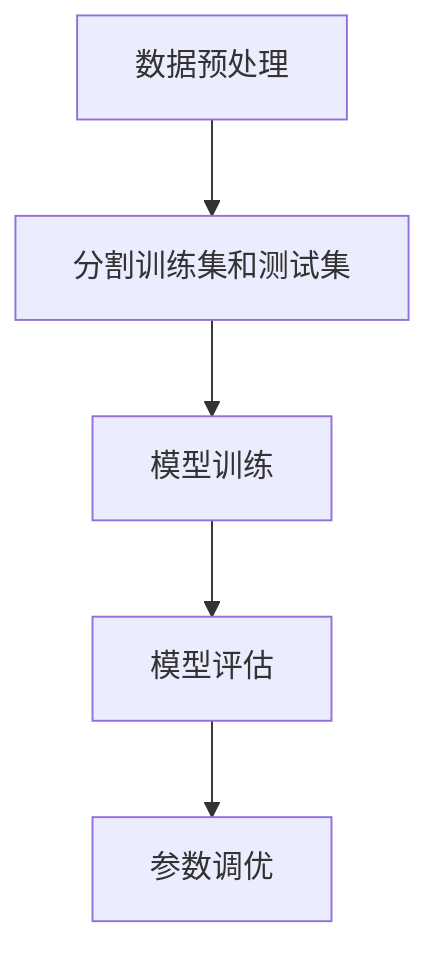
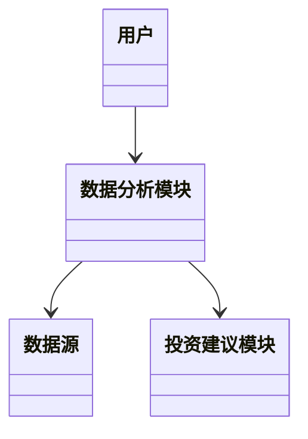

                 


# 投资理财智能助手的基本概念

> 关键词：投资理财、智能助手、人工智能、算法原理、系统架构

> 摘要：本文深入探讨投资理财智能助手的基本概念，从背景介绍、核心概念到算法原理、系统架构，再到项目实战，全面解析其工作原理和实际应用。

---

## 第一章：投资理财智能助手的背景介绍

### 1.1 问题背景

#### 1.1.1 传统投资理财的局限性
传统投资理财依赖人工分析，存在效率低下、决策滞后等问题。普通投资者缺乏专业技能，难以准确把握市场动态。

#### 1.1.2 人工智能在金融领域的应用趋势
AI技术的快速发展，特别是在数据处理和预测分析方面，使其成为金融领域的有力工具。智能助手通过自动化分析，提升投资决策的效率和准确性。

#### 1.1.3 投资理财智能助手的需求与痛点
投资者需要个性化的投资建议，但传统方法难以满足。智能助手通过数据驱动的方法，解决信息不对称和决策复杂性问题。

### 1.2 问题描述

#### 1.2.1 用户的投资理财需求分析
用户希望获得实时市场数据、个性化的投资建议和风险评估。传统方法难以满足这些需求。

#### 1.2.2 当前市场中的信息不对称问题
投资者难以获取全面的市场信息，导致决策失误。智能助手通过整合数据，帮助用户做出明智决策。

#### 1.2.3 理财决策的复杂性与不确定性
市场波动和经济变化使得理财决策复杂。智能助手通过算法分析，提供数据支持，降低不确定性。

### 1.3 问题解决

#### 1.3.1 智能助手如何解决投资理财中的问题
智能助手通过实时数据分析、个性化建议和风险评估，帮助用户做出明智决策。

#### 1.3.2 提供个性化投资建议的实现路径
基于用户的风险承受能力和财务目标，智能助手推荐适合的投资组合。

#### 1.3.3 数据驱动的决策支持方法
利用大数据分析，智能助手提供市场趋势和投资机会，帮助用户优化投资策略。

### 1.4 边界与外延

#### 1.4.1 投资理财智能助手的功能边界
专注于投资建议和风险管理，不涉及实际交易操作。

#### 1.4.2 与其他金融工具的区分
与传统金融顾问不同，智能助手提供自动化、实时的数据分析服务。

#### 1.4.3 未来可能的扩展方向
未来可能扩展至税务优化、遗产规划等领域，成为全方位的理财助手。

### 1.5 概念结构与核心要素

#### 1.5.1 核心概念的层次结构
从数据处理、算法分析到用户交互，构建智能助手的完整体系。

#### 1.5.2 各要素之间的关系分析
数据流驱动算法运行，算法结果反馈至用户界面，形成闭环。

#### 1.5.3 核心要素的详细描述
包括数据来源、分析模型、用户界面等关键组成部分。

---

## 第二章：核心概念与联系

### 2.1 数据流分析

#### 2.1.1 数据来源与处理流程
从金融数据库获取数据，清洗、特征提取后用于模型训练。

#### 2.1.2 数据流的可视化图示



### 2.2 算法流程

#### 2.2.1 算法步骤分解
数据预处理、特征工程、模型训练、评估优化。

#### 2.2.2 算法流程的Mermaid图示



---

## 第三章：算法原理与实现

### 3.1 机器学习模型训练

#### 3.1.1 数据预处理流程
清洗数据，处理缺失值和异常值，标准化和归一化处理。

#### 3.1.2 模型训练的Mermaid流程图



#### 3.1.3 Python代码实现示例

```python
import pandas as pd
from sklearn.model import LinearRegression

# 数据加载与预处理
data = pd.read_csv('data.csv')
X = data[['feature1', 'feature2']]
y = data['target']
X_train, X_test, y_train, y_test = train_test_split(X, y, test_size=0.2)

# 模型训练
model = LinearRegression()
model.fit(X_train, y_train)

# 模型评估
print(model.score(X_test, y_test))
```

#### 3.1.4 损失函数的定义与公式
损失函数衡量预测值与真实值的差异，常用均方误差：

$$
损失函数 = \frac{1}{2m}\sum_{i=1}^{m}(y_i - \hat{y_i})^2
$$

#### 3.1.5 优化器的工作原理与公式
梯度下降优化器通过调整参数减少损失：

$$
\theta := \theta - \alpha \frac{\partial L}{\partial \theta}
$$

---

## 第四章：系统分析与架构设计

### 4.1 应用场景分析

#### 4.1.1 用户使用场景描述
用户通过智能助手获取实时市场数据和投资建议。

#### 4.1.2 系统运行环境分析
支持Web和移动端，后端使用云服务器，前端通过API交互。

### 4.2 功能模块设计

#### 4.2.1 用户界面模块
展示市场数据和投资建议，用户可输入需求。

#### 4.2.2 数据分析模块
处理数据，提取特征，支持模型训练。

#### 4.2.3 投资建议模块
基于模型输出，生成个性化建议。

### 4.3 领域模型设计

#### 4.3.1 领域模型的Mermaid类图



### 4.4 系统架构设计

#### 4.4.1 分层架构的Mermaid图示


---

## 第五章：项目实战

### 5.1 环境安装

#### 5.1.1 安装Python和必要库
安装Python 3.8以上版本，使用pip安装numpy、pandas、scikit-learn。

### 5.2 系统核心实现

#### 5.2.1 核心代码实现

```python
import pandas as pd
from sklearn.model import LinearRegression

# 加载数据
data = pd.read_csv('data.csv')

# 数据预处理
X = data[['feature1', 'feature2']]
y = data['target']

# 划分训练集和测试集
from sklearn.model_selection import train_test_split
X_train, X_test, y_train, y_test = train_test_split(X, y, test_size=0.2)

# 训练模型
model = LinearRegression()
model.fit(X_train, y_train)

# 评估模型
score = model.score(X_test, y_test)
print(f'模型评分：{score}')
```

---

## 总结

投资理财智能助手通过人工智能技术，帮助用户优化投资决策。本文从背景到技术实现，详细解析了其基本概念和应用，为读者提供了全面的视角。

---

## 作者

作者：AI天才研究院/AI Genius Institute & 禅与计算机程序设计艺术 /Zen And The Art of Computer Programming

