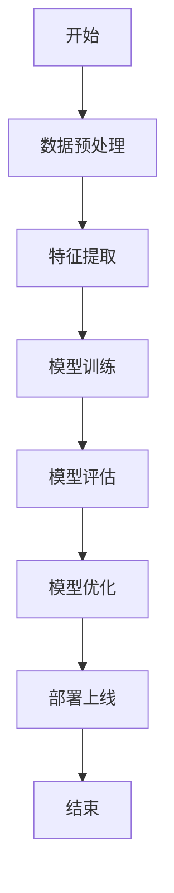
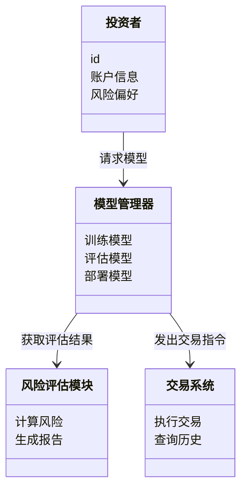
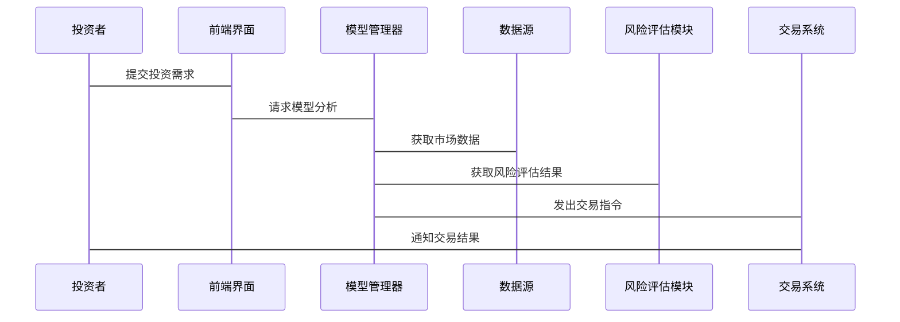

                 


# 投资理财智能助手的机器学习模型管理方法

## 关键词：投资理财，机器学习，模型管理，智能助手，风险管理

## 摘要：本文详细探讨了投资理财智能助手的机器学习模型管理方法，涵盖了背景分析、核心概念、算法原理、系统架构、项目实战以及最佳实践等多个方面。通过深入分析模型管理的重要性、原理及其在投资理财中的应用，本文为构建高效、可靠的智能投资理财系统提供了理论依据和实践指导。

---

# 第1章: 投资理财智能助手的背景与需求

## 1.1 投资理财智能助手的背景

### 1.1.1 传统投资理财的痛点

传统投资理财存在效率低、风险控制难、个性化服务不足等问题。投资者往往难以快速获取市场信息，且决策依赖主观经验，容易受市场波动影响。

### 1.1.2 人工智能在投资理财中的应用前景

人工智能技术，特别是机器学习，能够处理海量数据，发现复杂关系，为投资理财提供科学决策支持。通过预测市场趋势、优化资产配置，AI显著提升了投资效率和收益。

### 1.1.3 投资理财智能助手的核心价值

智能助手通过自动化数据处理、模型构建和实时监控，帮助投资者做出明智决策，降低风险，提高投资收益。

## 1.2 机器学习在投资理财中的应用

### 1.2.1 机器学习的基本概念

机器学习是AI的分支，通过数据训练模型，使其能够进行预测或分类。在投资理财中，主要用于价格预测、风险评估和资产配置。

### 1.2.2 机器学习在投资理财中的具体应用

- **价格预测**：利用历史数据预测股票或基金的价格走势。
- **风险评估**：识别投资组合中的潜在风险，评估投资标的稳定性。
- **资产配置**：根据市场状况和个人偏好，优化资产分配。

### 1.2.3 投资理财智能助手的典型场景

- **实时监控**：随时跟踪市场动态，及时发出预警。
- **个性化建议**：基于用户风险承受能力和财务目标，提供定制化投资策略。
- **交易执行**：根据模型建议自动执行交易指令。

## 1.3 机器学习模型管理的重要性

### 1.3.1 模型管理的定义

模型管理是指对机器学习模型的全生命周期进行规划、监控和优化，确保模型性能稳定，适应市场变化。

### 1.3.2 模型管理在投资理财中的必要性

- **提升决策效率**：通过自动化模型管理，减少人工干预，加快决策速度。
- **降低投资风险**：及时识别和修复模型缺陷，防止错误决策。
- **增强用户体验**：提供精准、及时的投资建议，提升用户满意度。

### 1.3.3 模型管理的挑战与机遇

- **挑战**：数据质量、模型过拟合、市场变化快等问题。
- **机遇**：技术进步带来更高效的工具和方法，推动投资理财智能化。

---

# 第2章: 投资理财智能助手的核心概念与联系

## 2.1 核心概念原理

### 2.1.1 机器学习模型的基本原理

模型通过训练数据学习特征，建立输入与输出的关系，用于预测新数据。

### 2.1.2 投资理财智能助手的功能模块

- **数据采集**：收集市场数据、用户信息。
- **模型训练**：构建和优化预测模型。
- **风险评估**：分析投资组合风险。
- **交易执行**：根据模型建议执行交易。
- **用户交互**：提供可视化界面和投资建议。

### 2.1.3 模型管理的关键环节

- **数据预处理**：清洗、转换数据。
- **模型训练**：选择算法，调整参数。
- **模型评估**：测试性能，评估效果。
- **模型部署**：集成到系统，实时监控。

## 2.2 模型管理的属性特征对比

### 2.2.1 不同模型管理方法的对比分析

| 特性           | 监督学习       | 无监督学习     | 强化学习       |
|----------------|---------------|---------------|---------------|
| 数据需求       | 需标注数据     | 无需标注数据   | 需交互反馈     |
| 模型复杂度     | 较低           | 较高           | 高             |
| 应用场景       | 分类、回归     | 聚类、降维     | 自动驾驶、游戏 |

### 2.2.2 模型性能与管理成本的关系

模型性能越高，通常需要更多的计算资源和管理成本。需在性能与成本之间找到平衡点。

### 2.2.3 模型可解释性与用户信任度的关联

高可解释性的模型更容易被用户信任，特别是在金融领域，透明性至关重要。

## 2.3 ER实体关系图

```mermaid
er
    entity 投资者 {
        id
        名称
        账户余额
    }
    entity 模型 {
        id
        名称
        类型
        特性
    }
    entity 交易记录 {
        id
        时间
        类型
        金额
    }
    entity 风险评估 {
        id
        时间
        评估结果
    }
    relation 投资者 -> 模型 : 使用
    relation 模型 -> 交易记录 : 分析
    relation 模型 -> 风险评估 : 生成
```

---

# 第3章: 机器学习模型管理的算法原理

## 3.1 算法流程图



## 3.2 算法实现代码

```python
import pandas as pd
from sklearn.model_selection import train_test_split
from sklearn.ensemble import RandomForestClassifier
from sklearn.metrics import accuracy_score

# 数据加载
data = pd.read_csv('investment_data.csv')
X = data.drop('target', axis=1)
y = data['target']

# 数据分割
X_train, X_test, y_train, y_test = train_test_split(X, y, test_size=0.2)

# 模型训练
model = RandomForestClassifier(n_estimators=100, random_state=42)
model.fit(X_train, y_train)

# 模型预测
y_pred = model.predict(X_test)

# 模型评估
accuracy = accuracy_score(y_test, y_pred)
print(f'模型准确率: {accuracy:.2f}')
```

## 3.3 数学模型

### 3.3.1 模型评估公式

$$\text{准确率} = \frac{\text{正确预测数}}{\text{总预测数}}$$

### 3.3.2 模型优化公式

$$\text{优化目标} = \min_{\theta} \sum_{i=1}^{n} (y_i - \hat{y}_i)^2$$

---

# 第4章: 投资理财智能助手的系统分析与架构设计

## 4.1 系统功能设计

### 4.1.1 领域模型



## 4.2 系统架构设计


## 4.3 系统接口设计

- **输入接口**：接收投资者的交易请求和数据输入。
- **输出接口**：提供投资建议、交易结果和风险报告。
- **数据接口**：与数据源（如股票市场数据）进行交互。

## 4.4 系统交互流程



---

# 第5章: 投资理财智能助手的项目实战

## 5.1 环境安装

```bash
pip install pandas scikit-learn matplotlib
```

## 5.2 核心功能实现

```python
import pandas as pd
from sklearn.ensemble import RandomForestClassifier
from sklearn.metrics import accuracy_score
import matplotlib.pyplot as plt

# 数据加载与预处理
data = pd.read_csv('investment_data.csv')
data.dropna(inplace=True)

# 特征选择与模型训练
X = data[['feature1', 'feature2']]
y = data['target']
X_train, X_test, y_train, y_test = train_test_split(X, y, test_size=0.2)

model = RandomForestClassifier()
model.fit(X_train, y_train)

# 模型评估
y_pred = model.predict(X_test)
print(f'准确率: {accuracy_score(y_test, y_pred)}')

# 可视化分析
importances = model.feature_importances_
indices = np.argsort(importances)[::-1]
plt.title('特征重要性排序')
plt.xticks(range(len(indices)), [X.columns[indices[i]] for i in range(len(indices))])
plt.show()
```

## 5.3 案例分析

通过实际案例分析，展示模型如何在不同市场条件下优化投资组合，降低风险，提升收益。

---

# 第6章: 最佳实践与小结

## 6.1 最佳实践 tips

- 定期更新模型，适应市场变化。
- 保持数据多样性，避免过拟合。
- 提供可解释的模型结果，增强用户信任。

## 6.2 项目小结

投资理财智能助手通过机器学习模型管理，显著提升了投资效率和风险控制能力，为投资者提供了有力的决策支持。

## 6.3 注意事项

- 数据隐私保护至关重要。
- 模型需定期验证和优化。
- 用户教育不可忽视，帮助用户正确理解模型结果。

## 6.4 拓展阅读

- 推荐书籍：《机器学习实战》、《Python机器学习》
- 推荐博客：深入浅出机器学习系列

---

# 作者

作者：AI天才研究院/AI Genius Institute & 禅与计算机程序设计艺术 /Zen And The Art of Computer Programming

---

通过以上结构，文章系统地介绍了投资理财智能助手的机器学习模型管理方法，从理论到实践，为读者提供了全面的指导。

