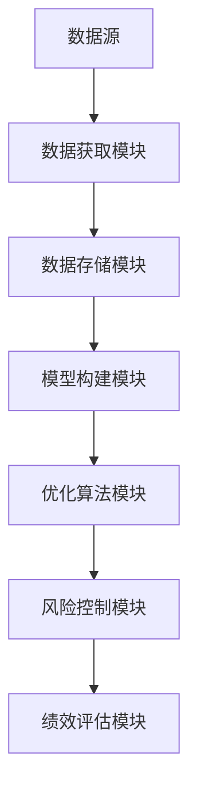

                 


# 投资组合优化模型：现代投资理论的实际应用

> 关键词：投资组合优化，现代投资理论，数学模型，优化算法，资产配置

> 摘要：本文详细探讨了投资组合优化模型在现代投资理论中的实际应用。从基础概念到高级算法，结合数学模型和实际案例，分析了如何通过优化模型实现风险与收益的最佳平衡。文章内容包括投资组合优化的背景、核心概念、数学模型、优化算法、系统架构设计、项目实战以及最佳实践等部分，帮助读者全面理解并掌握投资组合优化的理论与实践。

---

## 第一部分：投资组合优化模型概述

### 第1章：投资组合优化模型的背景与概念

#### 1.1 投资组合优化模型的背景

投资组合优化是现代投资理论的核心内容之一，旨在通过科学的资产配置策略，实现风险与收益的最佳平衡。随着金融市场的发展，投资者面对的不确定性增加，如何在复杂多变的市场环境中制定最优的投资策略，成为亟待解决的问题。

#### 1.2 投资组合优化的基本概念

- **投资组合**：指投资者持有的各种资产的集合，包括股票、债券、基金等。
- **优化目标**：在给定的风险水平下，追求最大收益；或在给定收益水平下，最小化风险。

#### 1.3 现代投资组合理论的核心假设

- 投资者是理性的，追求效用最大化。
- 资产的收益服从正态分布。
- 市场是有效的，即资产价格反映所有可用信息。

---

## 第二部分：投资组合优化的数学模型与算法

### 第2章：投资组合优化的数学模型

#### 2.1 均值-方差模型

马科维茨提出的均值-方差模型是投资组合优化的基础。模型的目标是找到使投资组合的风险（方差）最小化或收益（均值）最大化的资产配置。

数学表达式：
$$
\text{目标函数：} \min_w \sigma^2 = w^T \Sigma w$$
$$\text{约束条件：} \sum_{i=1}^n w_i = 1, \quad w_i \geq 0$$

其中，\(w\) 是资产权重向量，\(\Sigma\) 是协方差矩阵。

#### 2.2 多因子模型

多因子模型基于多个风险因子构建投资组合，如市值、价值、动量等。

$$
\text{收益预测：} R = F \beta + \epsilon$$

其中，\(F\) 是因子载荷矩阵，\(\beta\) 是因子权重，\(\epsilon\) 是残差。

### 第3章：投资组合优化算法

#### 3.1 均值-方差模型的优化算法

- **步骤**：
  1. 确定资产的期望收益和协方差矩阵。
  2. 构建优化问题。
  3. 使用二次规划算法求解。

- **代码示例**：

```python
import numpy as np
from scipy.optimize import minimize

# 示例数据
n_assets = 3
mu = np.array([0.1, 0.2, 0.15])
sigma = np.array([[0.16, 0.05, 0.05],
                  [0.05, 0.20, 0.08],
                  [0.05, 0.08, 0.16]])

# 目标函数：最小化方差
def portfolio_risk(weights, mu, sigma):
    return np.dot(weights.T, np.dot(sigma, weights))

# 约束条件
cons = ({'type': 'eq', 'fun': lambda w: sum(w) - 1},
        {'type': 'ineq', 'fun': lambda w: w})

# 初始猜测：等权配置
initial_guess = np.array([1/3, 1/3, 1/3])

# 求解
result = minimize(portfolio_risk, initial_guess, args=(mu, sigma), constraints=cons)

# 输出结果
print("最优权重：", result.x)
print("最小方差：", result.fun)
```

---

## 第三部分：系统分析与架构设计方案

### 第4章：系统架构设计

#### 4.1 系统功能模块

- 数据获取模块：收集历史价格、收益、风险数据。
- 模型构建模块：基于数据构建优化模型。
- 风险控制模块：监控并调整投资组合风险。
- 绩效评估模块：评估投资组合的表现。

#### 4.2 系统架构图



---

## 第四部分：项目实战

### 第5章：项目实战与案例分析

#### 5.1 环境搭建

- Python环境：建议使用Anaconda。
- 主要库：`numpy`, `pandas`, `scipy.optimize`, `matplotlib`。

#### 5.2 核心代码实现

```python
import numpy as np
import pandas as pd
import matplotlib.pyplot as plt
from scipy.optimize import minimize

# 示例数据：假设有3种资产
mu = np.array([0.1, 0.2, 0.15])
sigma = np.array([[0.16, 0.05, 0.05],
                  [0.05, 0.20, 0.08],
                  [0.05, 0.08, 0.16]])

# 定义目标函数：最小化方差
def portfolio_risk(weights, mu, sigma):
    return np.dot(weights.T, np.dot(sigma, weights))

# 约束条件
constraints = ({'type': 'eq', 'fun': lambda w: sum(w) - 1},
               {'type': 'ineq', 'fun': lambda w: w})

# 初始猜测：等权配置
initial_guess = np.array([1/3, 1/3, 1/3])

# 求解
result = minimize(portfolio_risk, initial_guess, args=(mu, sigma), constraints=constraints)

# 输出结果
print("最优权重：", result.x.round(3))
print("最小方差：", round(result.fun, 4))

# 可视化
plt.figure(figsize=(10,6))
plt.scatter(result.x, result.fun, c='r', marker='o')
plt.xlabel('权重')
plt.ylabel('方差')
plt.title('投资组合优化结果')
plt.show()
```

---

## 第五部分：最佳实践与注意事项

### 第6章：最佳实践与总结

#### 6.1 小结

投资组合优化模型是现代投资理论的重要工具，通过科学的资产配置，帮助投资者在风险与收益之间找到最佳平衡点。

#### 6.2 注意事项

- 数据质量：确保数据的准确性和完整性。
- 模型假设：根据实际情况调整模型假设。
- 风险控制：定期监控并调整投资组合。

#### 6.3 未来扩展

- 引入机器学习模型，提升预测准确性。
- 考虑更多风险因子，如市场风险、流动性风险等。

---

## 作者

作者：AI天才研究院/AI Genius Institute & 禅与计算机程序设计艺术 /Zen And The Art of Computer Programming

---

本文通过系统地介绍投资组合优化模型的理论与实践，帮助读者全面理解如何在实际投资中应用这些模型。从基础概念到高级算法，再到实际案例，文章内容详实，逻辑清晰，适合投资从业者、金融专业学生及相关领域的从业者阅读和参考。

