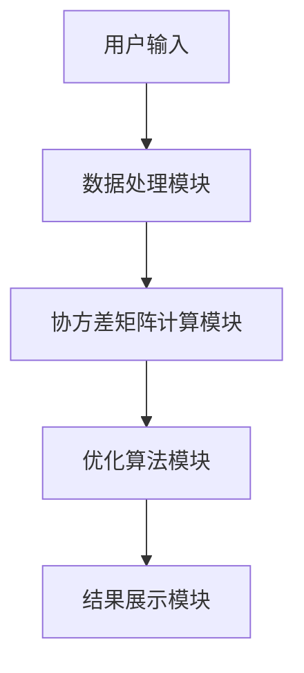

                 


# 投资组合优化：均值-方差模型的实际应用

**关键词：** 投资组合优化，均值-方差模型，现代投资组合理论，风险收益平衡，资产配置

**摘要：**  
投资组合优化是金融领域中的核心问题之一，旨在通过科学的方法构建最优资产组合，以在给定风险下实现最大收益或在给定收益下实现最小风险。本文将深入探讨均值-方差模型的核心原理及其在实际投资中的应用。通过理论分析、算法实现和案例解读，帮助读者全面理解如何利用均值-方差模型优化投资组合，降低风险，提高收益。

---

## 第一部分：均值-方差模型的核心概念

### 第1章：投资组合优化的基本概念

#### 1.1 投资组合优化的背景与意义

投资组合优化是金融学中的一个经典问题，其目标是通过科学的方法构建最优资产组合，以在给定风险下实现最大收益，或在给定收益下实现最小风险。传统的投资决策往往依赖于投资者的直觉和经验，但这种方法往往无法应对复杂的市场环境和多样化的资产选择。

均值-方差模型（Mean-Variance Model）是投资组合优化的核心工具之一，由**Harry Markowitz**于1952年提出，奠定了现代投资组合理论（MPT, Modern Portfolio Theory）的基础。该模型通过优化资产的期望收益和风险（方差）来构建最优投资组合。

#### 1.2 投资组合优化的定义与特点

投资组合优化是指在给定的资产集合中，通过选择合适的资产及其权重，构建一个在特定风险-收益目标下最优的投资组合。其核心特点包括：

1. **风险与收益的平衡**：通过量化资产的期望收益和风险（方差），在两者之间找到最佳平衡点。
2. **最优性**：在给定风险下，找到收益最大的组合；或在给定收益下，找到风险最小的组合。
3. **多目标优化**：可以通过调整目标函数和约束条件，实现不同风险偏好的投资者需求。

#### 1.3 均值-方差模型的背景与应用

均值-方差模型是基于以下假设构建的：

1. 资产的收益率服从正态分布。
2. 投资者是理性的，追求效用最大化。
3. 市场是有效且无摩擦的（无交易成本、无税收、无市场冲击等）。

该模型的应用场景包括：

1. **资产配置**：帮助投资者确定不同资产的权重。
2. **风险控制**：通过优化方差（风险）来降低投资组合的整体风险。
3. **绩效评估**：通过比较实际组合与最优组合的差异，评估投资策略的有效性。

---

### 第2章：均值-方差模型的核心原理

#### 2.1 资产的均值与方差

**均值**（Mean）：资产的期望收益率，表示资产的平均收益水平。

**方差**（Variance）：资产收益的波动性，衡量资产的风险水平。方差越大，资产的收益波动越大，风险越高。

公式表示：
$$ \mu_i = E(r_i) $$
$$ \sigma_i^2 = E[(r_i - E(r_i))^2] $$

其中，$r_i$ 表示资产 $i$ 的收益率，$\mu_i$ 为期望收益率，$\sigma_i^2$ 为方差。

#### 2.2 投资组合的均值与方差

对于一个包含 $n$ 个资产的投资组合，其收益率可以表示为：
$$ r_p = \sum_{i=1}^{n} w_i r_i $$
其中，$w_i$ 是资产 $i$ 的权重（投资比例）。

组合的期望收益率为：
$$ \mu_p = \sum_{i=1}^{n} w_i \mu_i $$

组合的方差为：
$$ \sigma_p^2 = \sum_{i=1}^{n} \sum_{j=1}^{n} w_i w_j \sigma_{ij} $$
其中，$\sigma_{ij}$ 是资产 $i$ 和资产 $j$ 的协方差。

#### 2.3 协方差矩阵的构建

协方差矩阵反映了资产之间的相关性，是均值-方差模型的核心输入。协方差矩阵的元素 $\sigma_{ij}$ 表示资产 $i$ 和资产 $j$ 的协方差：
$$ \sigma_{ij} = \text{Cov}(r_i, r_j) = E[(r_i - E(r_i))(r_j - E(r_j))] $$

协方差矩阵必须是正定矩阵，才能保证方差最小化问题有唯一解。

---

### 第3章：均值-方差模型的数学表示

#### 3.1 优化目标

目标是最小化投资组合的方差，同时满足收益约束：
$$ \min_{w} \sum_{i=1}^{n} \sum_{j=1}^{n} w_i w_j \sigma_{ij} $$
$$ \text{subject to} \quad \sum_{i=1}^{n} w_i \mu_i = \mu_p $$
$$ \quad \quad \quad \sum_{i=1}^{n} w_i = 1 $$
$$ \quad \quad \quad w_i \geq 0 \quad (i=1,2,...,n) $$

其中，$\mu_p$ 是目标收益率。

#### 3.2 求解方法

通过拉格朗日乘数法，构造拉格朗日函数：
$$ L(w, \lambda_1, \lambda_2) = \sum_{i=1}^{n} \sum_{j=1}^{n} w_i w_j \sigma_{ij} - \lambda_1 \left( \sum_{i=1}^{n} w_i \mu_i - \mu_p \right) - \lambda_2 \left( \sum_{i=1}^{n} w_i - 1 \right) $$

对 $w_i$ 求偏导并令其为0，得到权重 $w_i$ 的最优解：
$$ w_i = \frac{\mu_i \Sigma^{-1} \mathbf{1}}{\mathbf{1}^T \Sigma^{-1} \mathbf{1}} $$
其中，$\Sigma$ 是协方差矩阵，$\mathbf{1}$ 是全为1的向量。

---

## 第二部分：均值-方差模型的实际应用

### 第4章：投资组合优化的实现

#### 4.1 环境安装

需要安装的库：
- NumPy
- Pandas
- Scipy
- matplotlib

#### 4.2 核心代码实现

```python
import numpy as np
import pandas as pd
from scipy.optimize import minimize

# 示例数据：资产的收益率和协方差矩阵
mu = np.array([0.1, 0.15, 0.08])
Sigma = np.array([
    [0.04, 0.02, 0.01],
    [0.02, 0.09, 0.03],
    [0.01, 0.03, 0.05]
])

# 定义优化函数
def portfolio_var(weights, Sigma):
    return np.dot(weights.T, np.dot(Sigma, weights))

# 定义约束条件
cons = (
    {'type': 'eq', 'fun': lambda w: np.sum(w) - 1},
    {'type': 'eq', 'fun': lambda w: np.dot(w, mu) - target_return}
)

# 求解优化问题
result = minimize(portfolio_var, np.ones(len(mu))/len(mu), method='SLSQP', constraints=cons)

# 最优权重
weights = result.x
```

#### 4.3 案例分析

假设我们有三个资产，目标收益率为10%。通过代码实现优化，得到各资产的最优权重，并计算投资组合的方差。

---

## 第三部分：系统分析与架构设计

### 第5章：投资组合优化系统的架构

#### 5.1 系统功能设计

- 数据输入与处理
- 模型计算
- 结果展示

#### 5.2 系统架构设计



#### 5.3 接口设计

- 输入接口：接受资产收益率数据。
- 输出接口：返回最优权重和投资组合的方差。

---

## 第四部分：项目实战

### 第6章：投资组合优化的代码实现与案例分析

#### 6.1 环境安装

安装所需的Python库：
```bash
pip install numpy pandas scipy matplotlib
```

#### 6.2 核心代码实现

```python
import numpy as np
from scipy.optimize import minimize

# 示例数据
mu = np.array([0.1, 0.15, 0.08])
Sigma = np.array([
    [0.04, 0.02, 0.01],
    [0.02, 0.09, 0.03],
    [0.01, 0.03, 0.05]
])

# 定义目标函数
def objective(weights):
    return np.dot(weights.T, np.dot(Sigma, weights))

# 定义约束条件
cons = (
    {'type': 'eq', 'fun': lambda w: np.sum(w) - 1},
    {'type': 'eq', 'fun': lambda w: np.dot(w, mu) - 0.1}
)

# 初始猜测
initial_guess = np.array([1/3, 1/3, 1/3])

# 求解优化问题
result = minimize(objective, initial_guess, method='SLSQP', constraints=cons)

# 输出结果
print("最优权重:", result.x)
print("最小方差:", result.fun)
```

#### 6.3 案例分析

假设我们有三个资产，目标收益率为10%。通过上述代码，我们可以计算出各资产的最优权重，并验证其满足约束条件。

---

## 第五部分：最佳实践与小结

### 第7章：总结与注意事项

#### 7.1 总结

均值-方差模型是投资组合优化的重要工具，通过量化资产的收益和风险，帮助投资者构建最优资产组合。本文通过理论分析、算法实现和案例解读，全面介绍了均值-方差模型的核心原理及其在实际投资中的应用。

#### 7.2 注意事项

1. **数据假设**：模型假设收益率服从正态分布，实际中可能需要考虑其他因素。
2. **交易成本**：实际操作中需要考虑交易成本和市场冲击。
3. **模型局限性**：模型假设市场无摩擦，实际中可能需要调整。

#### 7.3 扩展阅读

1. Harry M. Markowitz, "Portfolio Selection," *Journal of Finance*, 1952.
2. 格兰姆-夏普利茨模型（Gram-Charlier Model）：考虑非正态分布的投资组合优化。
3. 风险中性定价（Risk-Neutral Pricing）：将均值-方差模型扩展到衍生品定价。

---

## 作者

**作者：AI天才研究院/AI Genius Institute & 禅与计算机程序设计艺术 /Zen And The Art of Computer Programming**

---

通过本文的详细分析，您应该能够理解均值-方差模型的核心原理，并能够将其应用于实际投资组合优化问题中。希望本文对您在投资组合优化领域的研究和实践有所帮助！

