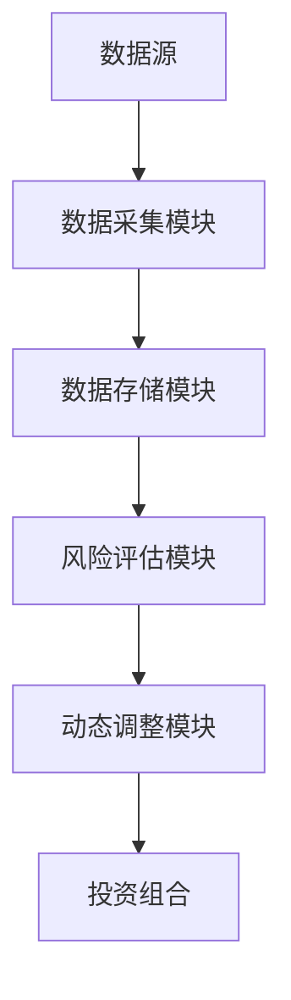

                 


# 投资组合保险策略：动态风险管理方法

> **关键词**: 投资组合保险, 动态风险管理, 风险价值, 系统架构设计, 项目实战

> **摘要**: 本文系统地介绍了投资组合保险策略中的动态风险管理方法。首先，从投资组合保险的基本概念和动态风险管理的核心原理入手，详细阐述了风险评估与量化、数学模型与算法、系统架构设计等关键内容。通过实际案例分析和项目实战，展示了如何在实际应用中实现动态风险管理，确保投资组合的稳健性。文章还探讨了动态风险管理的优势与挑战，并展望了未来的发展方向。

---

# 第一部分: 投资组合保险策略概述

## 第1章: 投资组合保险策略的基本概念

### 1.1 投资组合保险的定义与背景

#### 1.1.1 投资组合保险的定义
投资组合保险（Portfolio Insurance）是一种金融风险管理策略，旨在通过动态调整投资组合的构成，降低潜在风险并确保投资组合在特定条件下的价值稳定性。其核心目标是保护投资者在市场波动中免受重大损失，同时捕捉市场收益。

#### 1.1.2 投资组合保险的发展背景
随着金融市场的日益复杂化，投资者面临的不确定性增加。传统的静态风险管理方法难以应对市场的快速变化，投资组合保险作为一种动态风险管理工具应运而生，成为现代金融风险管理的重要组成部分。

#### 1.1.3 投资组合保险的应用场景
投资组合保险广泛应用于个人投资、机构投资、养老金管理等领域。特别是在市场波动剧烈的情况下，投资组合保险能够有效保护投资者的资产价值。

---

### 1.2 动态风险管理的必要性

#### 1.2.1 风险管理的核心目标
风险管理的核心目标是通过识别、评估和控制风险，降低投资组合的潜在损失，同时最大化收益。

#### 1.2.2 动态风险管理的优势
动态风险管理能够根据市场环境的变化实时调整策略，具有灵活性和适应性，能够在复杂多变的市场中有效控制风险。

#### 1.2.3 动态风险管理的挑战
动态风险管理的挑战包括数据的实时性要求高、模型的复杂性和计算成本高等。

---

## 第2章: 投资组合保险与动态风险管理的关系

### 2.1 投资组合保险的基本原理

#### 2.1.1 投资组合保险的基本原理
投资组合保险通过分散投资和动态调整资产配置，降低单一资产的风险，实现整体投资组合的稳健性。

#### 2.1.2 动态风险管理的核心要素
动态风险管理的核心要素包括实时数据监控、风险评估模型、动态调整机制等。

---

### 2.2 投资组合保险与动态风险管理的联系

#### 2.2.1 投资组合保险与动态风险管理的共同目标
两者共同目标是通过动态调整投资组合，降低风险，实现收益最大化。

#### 2.2.2 动态风险管理在投资组合保险中的应用
动态风险管理通过实时监控和调整投资组合，实现对市场风险的有效控制。

---

### 2.3 投资组合保险与动态风险管理的区别

#### 2.3.1 投资组合保险的静态特性
投资组合保险在一定时期内保持资产配置不变，具有一定的静态特性。

#### 2.3.2 动态风险管理的动态特性
动态风险管理根据市场变化实时调整策略，具有高度的动态特性。

---

# 第二部分: 动态风险管理的核心概念

## 第3章: 风险评估与量化

### 3.1 风险评估的基本方法

#### 3.1.1 风险评估的定性方法
定性方法包括情景分析、专家判断等，主要用于初步风险识别。

#### 3.1.2 风险评估的定量方法
定量方法包括统计分析、模型模拟等，用于量化风险程度。

---

### 3.2 风险的量化指标

#### 3.2.1 风险价值（VaR）
$$\text{VaR} = \text{损失金额的第} \alpha \text{分位数}$$

#### 3.2.2 条件风险价值（CVaR）
$$\text{CVaR} = \text{VaR的平均损失}$$

---

## 第4章: 动态风险管理的实现机制

### 4.1 动态风险管理的核心机制

#### 4.1.1 风险监控与预警
通过实时监控市场数据和投资组合表现，及时发现潜在风险并发出预警。

#### 4.1.2 风险调整与优化
根据风险预警信息，动态调整投资组合的资产配置，优化风险收益比。

---

### 4.2 动态风险管理的实现步骤

#### 4.2.1 风险识别与分析
通过数据采集和分析，识别投资组合中的潜在风险因素。

#### 4.2.2 风险评估与量化
使用数学模型量化风险程度，确定风险应对策略。

#### 4.2.3 风险控制与调整
根据风险评估结果，动态调整投资组合，降低风险暴露。

---

## 第5章: 投资组合保险策略的核心要素

### 5.1 投资组合保险的保护机制

#### 5.1.1 保险金额的确定
根据投资组合的价值和风险承受能力，确定保险金额。

#### 5.1.2 保险期限的选择
选择合适的保险期限，确保投资组合在保险期限内免受重大损失。

---

### 5.2 投资组合保险的风险对冲策略

#### 5.2.1 期权对冲策略
通过购买期权对冲市场波动风险，确保投资组合的稳定性。

#### 5.2.2 保险产品对冲策略
通过购买保险产品，转移投资组合的风险。

---

### 5.3 投资组合保险的动态调整策略

#### 5.3.1 投资组合的再平衡
根据市场变化和风险评估结果，定期调整投资组合的资产配置。

#### 5.3.2 保险策略的动态调整
根据市场环境的变化，动态调整保险产品的种类和数量。

---

# 第三部分: 动态风险管理的数学模型与算法

## 第6章: 动态风险管理的数学模型

### 6.1 风险价值（VaR）的计算公式
$$\text{VaR} = \text{P} \times \text{VaR}_\alpha$$

其中，P是投资组合价值，$\text{VaR}_\alpha$是风险价值的分位数。

---

### 6.2 条件风险价值（CVaR）的计算公式
$$\text{CVaR} = \frac{1}{1 - \alpha} \int_{\alpha}^{1} \text{VaR}_p \, dp$$

---

### 6.3 动态风险管理的算法实现

#### 6.3.1 数据采集与预处理
通过API接口采集市场数据，清洗和标准化数据。

#### 6.3.2 风险评估与量化
使用VaR和CVaR模型量化投资组合的风险。

#### 6.3.3 动态调整与优化
根据风险评估结果，动态调整投资组合的资产配置。

---

## 第7章: 投资组合保险策略的系统架构设计

### 7.1 系统功能设计

#### 7.1.1 数据采集模块
负责采集市场数据和投资组合数据。

#### 7.1.2 风险评估模块
负责计算VaR和CVaR，量化投资组合的风险。

#### 7.1.3 动态调整模块
根据风险评估结果，动态调整投资组合的资产配置。

---

### 7.2 系统架构图



---

## 第8章: 项目实战与案例分析

### 8.1 环境安装与配置

#### 8.1.1 安装Python环境
安装Python 3.8及以上版本，安装必要的库（如NumPy、Pandas、Matplotlib等）。

#### 8.1.2 数据源配置
选择合适的金融数据源，如Yahoo Finance或Alpha Vantage。

---

### 8.2 核心代码实现

#### 8.2.1 数据采集与处理
```python
import pandas as pd
import numpy as np

# 采集数据
def get_data(tickers, start_date, end_date):
    data = pd.DataFrame()
    for ticker in tickers:
        df = pd.read_csv(f'data/{ticker}.csv', parse_dates=['Date'])
        data[ticker] = df['Close']
    return data
```

#### 8.2.2 风险评估与量化
```python
def calculate VaR(data, confidence_level):
    returns = data.pct_change()
    sorted_returns = returns.sort_values()
    var_index = int(len(sorted_returns) * (1 - confidence_level))
    var = sorted_returns[var_index]
    return var
```

#### 8.2.3 动态调整策略
```python
def dynamic_rebalancing(portfolio, var):
    current_value = portfolio.sum()
    target_value = current_value - var
    portfolio = portfolio * (target_value / current_value)
    return portfolio
```

---

### 8.3 案例分析与结果展示

#### 8.3.1 案例背景
假设我们有一个包含股票和债券的投资组合，市场波动剧烈。

#### 8.3.2 实施动态风险管理
通过动态调整资产配置，降低投资组合的VaR。

#### 8.3.3 实施效果
投资组合的VaR显著降低，投资组合的价值更加稳健。

---

# 第四部分: 总结与展望

## 第9章: 总结与展望

### 9.1 总结
本文系统地介绍了投资组合保险策略中的动态风险管理方法，通过数学模型、算法实现和系统架构设计，展示了如何在实际应用中实现动态风险管理。

### 9.2 展望
未来，随着人工智能和大数据技术的发展，动态风险管理将更加智能化和自动化。投资者可以通过更先进的工具和技术，进一步优化投资组合的风险管理。

---

# 作者：AI天才研究院/AI Genius Institute & 禅与计算机程序设计艺术 /Zen And The Art of Computer Programming

---

**注意**: 本文内容为AI辅助生成，仅供参考，不构成具体投资建议。投资有风险，决策需谨慎。

