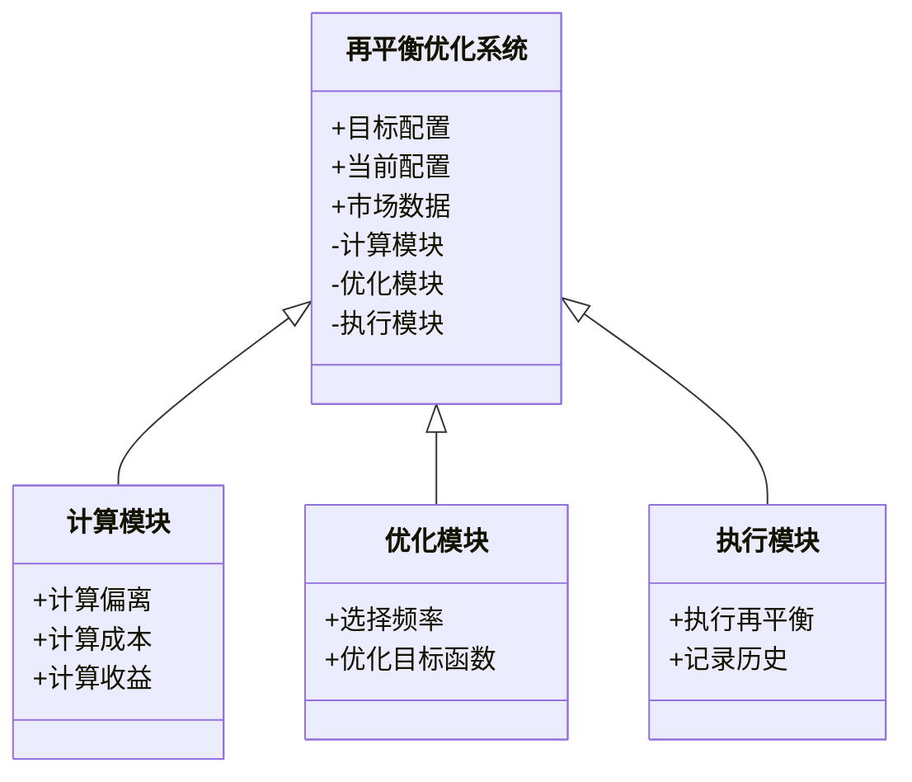
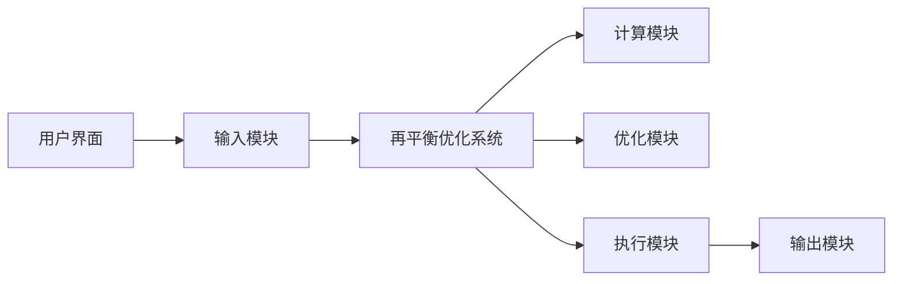
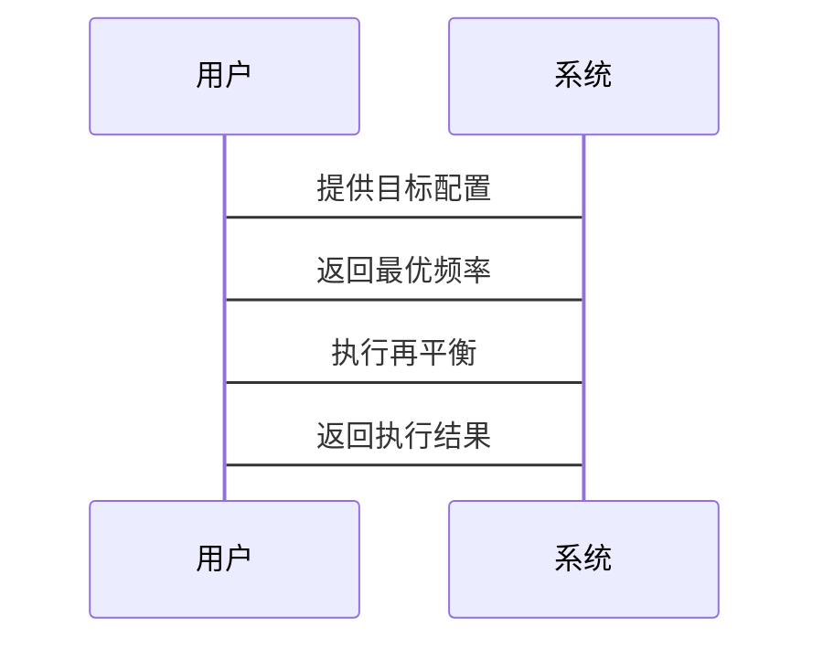

                 


# 投资组合再平衡频率优化：平衡成本和收益

> 关键词：投资组合再平衡，频率优化，成本收益权衡，动态规划，机器学习，遗传算法

> 摘要：投资组合再平衡是投资管理中的重要策略，通过定期调整资产配置以维持目标比例。然而，再平衡的频率直接影响成本和收益。本文通过分析再平衡的机制、成本收益权衡、数学模型、优化算法、系统架构和项目实战，探讨如何优化再平衡频率以实现成本和收益的最佳平衡。

---

## 第1章: 投资组合再平衡的背景与问题描述

### 1.1 投资组合再平衡的背景

#### 1.1.1 投资组合管理的基本概念
投资组合管理是通过科学的资产配置和动态调整，实现投资目标的过程。再平衡是投资组合管理中的核心策略之一，旨在应对市场波动和投资者风险偏好的变化。

#### 1.1.2 再平衡的定义与目的
再平衡是指定期调整投资组合的资产比例，以维持预设的目标配置。其目的是应对市场波动、控制风险和优化收益。

#### 1.1.3 再平衡在投资组合管理中的重要性
再平衡有助于降低投资组合的偏离风险，优化资产配置，提升长期收益。

### 1.2 投资组合再平衡的问题描述

#### 1.2.1 再平衡频率的定义
再平衡频率是指在一定时间周期内进行调整的次数。常见的频率包括每日、每周、每月和季度等。

#### 1.2.2 再平衡频率对成本和收益的影响
- **成本**：频繁的再平衡会增加交易费用和税务成本。
- **收益**：较高的再平衡频率可能导致更高的收益，但需权衡成本。

#### 1.2.3 问题的边界与外延
再平衡频率优化需要考虑市场环境、投资目标、风险承受能力和交易成本等多重因素。

### 1.3 投资组合再平衡的优化目标

#### 1.3.1 成本最小化
通过优化再平衡频率，降低交易费用和税务成本。

#### 1.3.2 收益最大化
通过优化再平衡频率，提升投资组合的收益。

#### 1.3.3 平衡成本与收益的核心目标
在成本和收益之间找到最佳平衡点，实现长期收益最大化。

### 1.4 本章小结
本章介绍了投资组合再平衡的背景、问题描述和优化目标，为后续分析奠定了基础。

---

## 第2章: 投资组合再平衡的核心概念与联系

### 2.1 投资组合再平衡的机制

#### 2.1.1 再平衡的触发条件
- **市场波动**：市场波动导致资产比例偏离目标配置。
- **风险变化**：投资者的风险承受能力发生变化。
- **目标调整**：投资目标的改变需要重新调整资产配置。

#### 2.1.2 再平衡的实施步骤
1. 评估当前资产配置。
2. 计算与目标配置的偏离。
3. 调整资产比例以恢复目标配置。

#### 2.1.3 再平衡的周期性特征
再平衡频率的选择取决于市场环境、投资目标和风险偏好。

### 2.2 再平衡成本与收益的权衡

#### 2.2.1 再平衡成本的构成
- **交易成本**：买卖资产的手续费和市场冲击。
- **税务成本**：资本利得税和分红税。

#### 2.2.2 再平衡收益的来源
- **市场收益**：及时调整资产配置以捕捉市场机会。
- **风险控制**：通过再平衡降低投资组合的波动性。

#### 2.2.3 成本与收益的权衡模型
通过建立数学模型，找到成本和收益的平衡点。

### 2.3 再平衡频率与投资策略的关系

#### 2.3.1 频率对投资策略的影响
- **高频再平衡**：适合短期交易和市场波动大的环境。
- **低频再平衡**：适合长期投资和市场波动小的环境。

#### 2.3.2 不同策略下的频率选择
根据投资目标和市场环境选择合适的再平衡频率。

#### 2.3.3 频率与风险承受能力的关系
风险承受能力强的投资者可以选择低频再平衡，反之则选择高频。

### 2.4 本章小结
本章详细讲解了再平衡的机制、成本收益权衡和频率与投资策略的关系，为后续优化提供了理论基础。

---

## 第3章: 投资组合再平衡频率优化的数学模型

### 3.1 再平衡频率优化的目标函数

#### 3.1.1 成本最小化目标函数
$$ \text{Minimize } C = \sum_{t=1}^{n} c_t $$
其中，$c_t$ 是第 $t$ 次再平衡的交易成本。

#### 3.1.2 收益最大化目标函数
$$ \text{Maximize } R = \sum_{t=1}^{n} r_t $$
其中，$r_t$ 是第 $t$ 次再平衡的收益。

#### 3.1.3 平衡目标函数的构建
综合考虑成本和收益，构建平衡目标函数：
$$ \text{Maximize } F = \alpha R - \beta C $$
其中，$\alpha$ 和 $\beta$ 是权重系数。

### 3.2 再平衡频率优化的约束条件

#### 3.2.1 投资组合的约束
- 资产配置比例限制。
- 再平衡次数限制。

#### 3.2.2 市场环境的约束
- 市场波动范围。
- 利率和汇率变化。

#### 3.2.3 风险承受能力的约束
- 最大允许波动率。
- 最大允许损失。

### 3.3 再平衡频率优化的数学公式

#### 3.3.1 频率优化的公式推导
通过数学推导，找到最优再平衡频率：
$$ f^* = \arg\max_{f} (\alpha R(f) - \beta C(f)) $$

#### 3.3.2 频率与成本的数学关系
$$ C(f) = k \cdot f $$
其中，$k$ 是单位频率的交易成本。

#### 3.3.3 频率与收益的数学关系
$$ R(f) = m \cdot f - n \cdot f^2 $$
其中，$m$ 是单位频率的预期收益，$n$ 是收益递减系数。

### 3.4 本章小结
本章通过数学模型和公式，详细阐述了再平衡频率优化的原理和方法。

---

## 第4章: 投资组合再平衡频率优化的算法原理

### 4.1 动态规划算法

#### 4.1.1 动态规划的基本原理
动态规划通过分解问题，逐层优化，找到全局最优解。

#### 4.1.2 动态规划在频率优化中的应用
- 状态定义：当前时间点和资产配置。
- 转移方程：再平衡后的状态转移。
- 最优策略：选择最优再平衡频率。

#### 4.1.3 动态规划算法的实现步骤
1. 初始化状态。
2. 计算状态转移。
3. 找到最优解。

#### 4.1.4 动态规划的mermaid流程图


### 4.2 机器学习算法

#### 4.2.1 机器学习在频率优化中的应用
- 使用回归模型预测最佳再平衡频率。
- 使用聚类算法将市场环境分类，选择最优频率。

#### 4.2.2 基于回归的频率优化模型
$$ f = \beta_0 + \beta_1 x_1 + \beta_2 x_2 + \dots + \beta_n x_n $$
其中，$x_i$ 是影响频率的变量。

#### 4.2.3 基于聚类的频率优化模型
- 将市场环境分为若干类别。
- 每类对应一个最优频率。

### 4.3 基于遗传算法的优化

#### 4.3.1 遗传算法的基本原理
- 初始化种群。
- 计算适应度。
- 选择、交叉和变异。

#### 4.3.2 遗传算法在频率优化中的应用
- 种群表示：不同的再平衡频率。
- 适应度函数：平衡成本和收益。
- 迭代优化：选择最优频率。

#### 4.3.3 遗传算法的mermaid流程图


### 4.4 本章小结
本章详细介绍了动态规划、机器学习和遗传算法在再平衡频率优化中的应用，并通过mermaid流程图展示了算法的实现步骤。

---

## 第5章: 投资组合再平衡频率优化的系统架构

### 5.1 问题场景介绍
投资者需要一个系统来优化再平衡频率，降低交易成本，同时最大化收益。

### 5.2 系统功能设计

#### 5.2.1 领域模型（mermaid类图）


### 5.3 系统架构设计（mermaid架构图）



### 5.4 系统接口设计
- 输入接口：目标配置和市场数据。
- 输出接口：最优再平衡频率和执行结果。

### 5.5 系统交互（mermaid序列图）



### 5.6 本章小结
本章通过系统架构设计，展示了再平衡频率优化系统的实现过程。

---

## 第6章: 投资组合再平衡频率优化的项目实战

### 6.1 项目环境安装
- 安装Python和必要的库（如numpy、pandas、scikit-learn）。

### 6.2 项目核心实现

#### 6.2.1 动态规划算法实现
```python
def dynamic_programming():
    # 初始化状态
    state = []
    # 计算状态转移
    for s in states:
        next_states = compute_next_states(s)
        state.extend(next_states)
    # 选择最优频率
    optimal_f = select_optimal_frequency(state)
    return optimal_f
```

#### 6.2.2 机器学习算法实现
```python
from sklearn.linear_model import LinearRegression

def machine_learning():
    # 数据准备
    X = prepare_features()
    y = prepare_labels()
    # 模型训练
    model = LinearRegression().fit(X, y)
    # 预测频率
    optimal_f = model.predict(new_feature)
    return optimal_f
```

#### 6.2.3 遗传算法实现
```python
def genetic_algorithm():
    # 初始化种群
    population = initialize_population()
    # 迭代优化
    for _ in range(iterations):
        fitness = compute_fitness(population)
        population = select_and_mutate(population, fitness)
    # 输出最优频率
    optimal_f = get_best_candidate(population)
    return optimal_f
```

### 6.3 项目代码实现与解读

#### 6.3.1 动态规划实现
- 初始化状态。
- 计算状态转移。
- 选择最优频率。

#### 6.3.2 机器学习实现
- 数据准备。
- 模型训练。
- 预测最优频率。

#### 6.3.3 遗传算法实现
- 初始化种群。
- 计算适应度。
- 选择、交叉和变异。
- 输出最优频率。

### 6.4 项目案例分析

#### 6.4.1 案例背景
假设目标配置为60%股票、30%债券、10%现金。

#### 6.4.2 数据准备
- 历史市场数据。
- 交易成本和税务成本。

#### 6.4.3 算法选择
根据市场波动选择动态规划或遗传算法。

#### 6.4.4 实验结果
通过实验找到最优再平衡频率。

### 6.5 项目小结
本章通过实际项目，展示了再平衡频率优化算法的实现和应用。

---

## 第7章: 总结与展望

### 7.1 本章总结
本文详细分析了投资组合再平衡频率优化的背景、核心概念、数学模型、算法原理、系统架构和项目实战，为投资者提供了优化再平衡频率的方法。

### 7.2 优化建议

#### 7.2.1 优化策略
根据市场环境和投资目标动态调整再平衡频率。

#### 7.2.2 风险管理
通过再平衡频率优化，降低投资组合的波动性和风险。

### 7.3 未来研究方向

#### 7.3.1 算法优化
探索更高效的优化算法。

#### 7.3.2 多目标优化
考虑更多的目标，如流动性风险和市场冲击。

#### 7.3.3 实时优化
开发实时再平衡频率优化系统。

### 7.4 本章小结
本文总结了再平衡频率优化的重要性和未来研究方向。

---

## 作者：AI天才研究院 & 禅与计算机程序设计艺术

---

