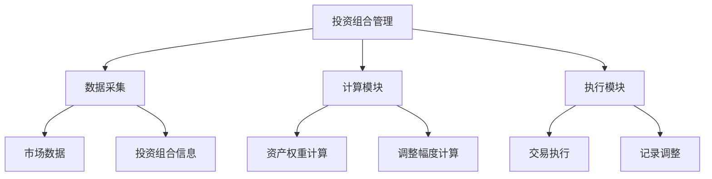

                 


# 投资组合再平衡：何时以及如何调整资产配置

> 关键词：投资组合再平衡, 资产配置, 投资策略, 风险管理, 系统架构设计

> 摘要：投资组合再平衡是投资管理中的关键策略，用于调整资产配置以应对市场变化和优化投资回报。本文详细探讨了再平衡的原理、策略、时机选择，结合数学模型和系统架构设计，分析实际案例并总结最佳实践，为投资者提供科学的指导。

---

## 第一部分：投资组合再平衡的背景与基础

### 第1章：投资组合再平衡概述

#### 1.1 投资组合与资产配置

##### 1.1.1 投资组合的定义与特征
- 投资组合是指将资金分配到不同资产（如股票、债券、房地产等）以分散风险并实现收益最大化的一种方式。
- 特征包括分散性、风险与收益的平衡、动态调整性。

##### 1.1.2 资产配置的核心要素
- 资产类别：股票、债券、现金等。
- 风险承受能力：根据投资者的风险偏好调整各类资产的比例。
- 时间 horizon：投资期限影响资产配置策略。

##### 1.1.3 投资组合的目标与风险
- 目标：实现资产的保值增值，平衡风险与收益。
- 风险：市场波动、流动性风险、通货膨胀风险。

#### 1.2 再平衡的定义与作用

##### 1.2.1 再平衡的定义
- 再平衡是指定期调整投资组合中各资产的权重，以恢复目标配置比例的过程。

##### 1.2.2 再平衡的目的与意义
- 维持目标资产配置比例。
- 优化风险与收益的关系。
- 应对市场变化，防止过度集中风险。

##### 1.2.3 再平衡与投资目标的关系
- 通过调整确保投资目标的实现。
- 适应投资者风险偏好的变化。

#### 1.3 再平衡的必要性

##### 1.3.1 市场波动的影响
- 不同资产价格波动导致权重偏离目标。
- 需要定期调整以应对市场变化。

##### 1.3.2 资产比例偏离目标
- 长期持有会导致资产比例变化，偏离目标配置。
- 再平衡可恢复目标比例。

##### 1.3.3 风险管理的需求
- 防止某类资产过重带来的高风险。
- 通过再平衡分散投资风险。

### 第2章：投资组合再平衡的核心概念

#### 2.1 再平衡的原理

##### 2.1.1 资产权重的变化
- 各资产价格波动导致权重变化，需要调整以恢复目标比例。

##### 2.1.2 再平衡的触发条件
- 权重偏离目标比例（如超过5%）。
- 市场环境变化（如经济周期、利率变化）。
- 投资目标或风险偏好调整。

##### 2.1.3 再平衡的数学模型
- 使用均值-方差优化模型确定最优资产配置。
- 计算各资产的调整比例，确保总和等于目标配置。

#### 2.2 再平衡的类型

##### 2.2.1 定期再平衡
- 按固定时间间隔（如季度、半年）进行调整。
- 适用于市场波动较小的情况，操作简单。

##### 2.2.2 动态再平衡
- 根据市场变化和投资目标动态调整。
- 适用于市场波动较大或投资目标频繁变化的情况。

##### 2.2.3 目标导向再平衡
- 根据特定目标（如收益目标）进行调整。
- 强调投资结果与目标的匹配。

#### 2.3 再平衡的成本与收益

##### 2.3.1 交易成本的影响
- 交易费用、买卖价差增加成本。
- 频繁交易可能导致较高的交易成本。

##### 2.3.2 税务成本的考量
- 资本利得税可能影响再平衡的收益。
- 需要考虑税务优化策略。

##### 2.3.3 再平衡的长期收益
- 通过再平衡实现风险调整后的收益最大化。
- 长期来看，再平衡有助于稳定投资组合的表现。

---

## 第二部分：投资组合再平衡的策略与方法

### 第3章：再平衡的策略选择

#### 3.1 定期再平衡策略

##### 3.1.1 定期再平衡的定义
- 按照固定的时间间隔进行再平衡，如每季度或半年一次。
- 适用于市场波动较小或目标配置稳定的场景。

##### 3.1.2 定期再平衡的优缺点
- 优点：操作简单，成本较低。
- 缺点：可能无法及时应对市场剧烈波动，收益可能不如动态再平衡。

##### 3.1.3 定期再平衡的实施步骤
- 确定再平衡的时间间隔。
- 计算各资产的调整比例。
- 执行交易，调整投资组合。

#### 3.2 动态再平衡策略

##### 3.2.1 动态再平衡的定义
- 根据市场变化和投资目标，随时进行调整。
- 更灵活，但需要更多的市场监控和分析。

##### 3.2.2 动态再平衡的优缺点
- 优点：能够及时应对市场变化，优化投资组合。
- 缺点：操作复杂，交易成本可能增加。

##### 3.2.3 动态再平衡的实施步骤
- 监测市场变化和投资组合表现。
- 根据变化情况调整资产配置。
- 执行交易，完成再平衡。

#### 3.3 目标导向再平衡策略

##### 3.3.1 目标导向再平衡的定义
- 根据特定的投资目标（如收益目标、风险目标）进行调整。
- 强调结果导向，而非固定时间间隔。

##### 3.3.2 目标导向再平衡的优缺点
- 优点：能够更好地实现投资目标。
- 缺点：需要频繁监控和调整，可能增加成本。

##### 3.3.3 目标导向再平衡的实施步骤
- 设定明确的投资目标。
- 根据目标调整资产配置。
- 定期评估和调整，确保目标实现。

### 第4章：再平衡的数学模型与算法

#### 4.1 投资组合优化的数学模型

##### 4.1.1 均值-方差优化模型
- 通过最小化方差（风险）来最大化收益。
- 使用拉格朗日乘数法求解最优资产配置。

##### 4.1.2 现实中的应用
- 示例：考虑三个资产（股票、债券、现金）的配置。
- 使用历史数据计算预期收益和协方差矩阵。

#### 4.2 再平衡算法的实现

##### 4.2.1 算法步骤
1. 计算当前投资组合的各资产权重。
2. 比较实际权重与目标权重的差异。
3. 确定需要调整的资产及其调整幅度。
4. 执行交易，调整投资组合。

##### 4.2.2 算法实现的Python代码
```python
def rebalance_portfolio(current_weights, target_weights):
    # 计算各资产的调整比例
    adjustments = {}
    for asset in target_weights:
        if asset not in current_weights:
            adjustments[asset] = target_weights[asset]
        else:
            adjustment = target_weights[asset] - current_weights[asset]
            adjustments[asset] = adjustment
    return adjustments
```

#### 4.3 系统架构设计

##### 4.3.1 系统功能模块
- 数据采集模块：获取市场数据和投资组合信息。
- 计算模块：计算各资产的权重和调整幅度。
- 执行模块：执行交易，完成再平衡。

##### 4.3.2 系统架构图（Mermaid）


---

## 第三部分：再平衡的时机选择与实际应用

### 第5章：再平衡的时机选择

#### 5.1 市场环境分析

##### 5.1.1 经济周期的影响
- 在经济衰退时增加防御性资产（如债券）。
- 在经济复苏时增加风险资产（如股票）。

##### 5.1.2 利率变化的应对
- 利率上升时减少债券配置，避免资本损失。
- 利率下降时增加债券配置，提高收益。

#### 5.2 风险管理策略

##### 5.2.1 风险承受能力的变化
- 风险承受能力降低时增加防御性资产。
- 风险承受能力增加时增加风险资产。

##### 5.2.2 投资目标的变化
- 投资目标调整时及时进行再平衡。

#### 5.3 税务优化策略

##### 5.3.1 税收影响的考量
- 避免不必要的资本利得税。
- 利用税收优惠进行调整。

##### 5.3.2 税务优化的实施步骤
- 确定税收政策。
- 设计调整方案，最小化税务负担。

### 第6章：再平衡的实际案例分析

#### 6.1 成功案例：2008年金融危机后的再平衡

##### 6.1.1 案例背景
- 金融危机导致股票大幅下跌，债券价格上涨。
- 投资者需要调整资产配置以应对市场变化。

##### 6.1.2 调整策略
- 增加股票配置，恢复目标比例。
- 减少债券配置，锁定收益。

##### 6.1.3 结果分析
- 通过再平衡，投资组合的风险得到控制，收益逐步恢复。

#### 6.2 失败案例：忽视再平衡的成本

##### 6.2.1 案例背景
- 一名投资者长期持有股票，未进行再平衡。
- 市场波动导致资产比例严重偏离目标。

##### 6.2.2 调整策略
- 需要大幅调整资产配置，但交易成本较高。
- 投资者因成本问题放弃调整，导致风险过高。

##### 6.2.3 结果分析
- 投资组合风险过高，可能面临较大损失。
- 说明忽视再平衡成本的风险。

### 第7章：再平衡的技术实现与工具

#### 7.1 技术实现

##### 7.1.1 投资组合管理软件
- 使用如MPT（现代投资组合理论）框架进行优化。
- 软件工具如Excel、Python、Matplotlib等用于数据分析和可视化。

##### 7.1.2 再平衡算法的实现
- 使用数学模型和优化算法，如拉格朗日乘数法、遗传算法。
- 通过API接口与交易平台连接，实现自动化调整。

#### 7.2 工具与平台

##### 7.2.1 数据源
- 使用Yahoo Finance、 Bloomberg等获取市场数据。

##### 7.2.2 计算工具
- Python的Pandas、NumPy库用于数据分析。
- 使用Scipy进行优化计算。

##### 7.2.3 交易平台接口
- 使用API连接交易平台，自动化执行交易。

---

## 第四部分：再平衡的未来展望与挑战

### 第8章：再平衡的未来趋势

#### 8.1 新技术的影响

##### 8.1.1 人工智能与机器学习的应用
- 使用AI预测市场变化，优化再平衡策略。
- 通过机器学习模型进行动态调整，提高效率。

##### 8.1.2 区块链技术的应用
- 提高交易透明度和安全性。
- 降低交易成本，实现更高效的再平衡。

#### 8.2 全球化与多样化投资

##### 8.2.1 全球资产配置的趋势
- 通过全球化投资分散风险，优化资产配置。
- 增加新兴市场资产，提高收益潜力。

##### 8.2.2 多样化投资工具的应用
- 使用ETF、对冲基金等多样化工具。
- 通过多样化降低风险，优化收益。

### 第9章：再平衡的挑战与解决方案

#### 9.1 再平衡的主要挑战

##### 9.1.1 市场波动的不确定性
- 市场波动难以预测，增加再平衡的难度。
- 需要灵活的策略应对不确定性。

##### 9.1.2 交易成本的控制
- 高频交易可能导致较高的交易成本。
- 需要在成本和收益之间找到平衡点。

##### 9.1.3 税务政策的变化
- 税务政策变化可能影响再平衡的成本。
- 需要灵活应对政策变化，优化调整策略。

#### 9.2 应对挑战的解决方案

##### 9.2.1 提高市场预测能力
- 使用先进的数据分析和预测模型，提高市场预测的准确性。
- 结合技术分析和基本面分析，优化决策。

##### 9.2.2 优化交易成本
- 通过批量交易和长期持有降低交易成本。
- 利用交易平台的优惠政策，减少费用。

##### 9.2.3 应对税务政策变化
- 保持对税务政策的敏感性，及时调整策略。
- 与税务顾问合作，制定最优的税务策略。

---

## 附录：投资组合再平衡的术语表

- 投资组合：指投资者持有的各种资产的组合。
- 资产配置：决定投资组合中各类资产的比例。
- 再平衡：调整投资组合中各资产的比例，以恢复目标配置。
- 风险调整收益：考虑风险后的投资收益。
- 现代投资组合理论（MPT）：通过优化资产配置降低风险。

---

## 作者信息

作者：AI天才研究院/AI Genius Institute & 禅与计算机程序设计艺术 /Zen And The Art of Computer Programming

---

以上是一个详细的思考过程和文章结构，涵盖了投资组合再平衡的各个方面，从基础概念到实际应用，再到未来趋势，为投资者和从业者提供了全面的指导。

