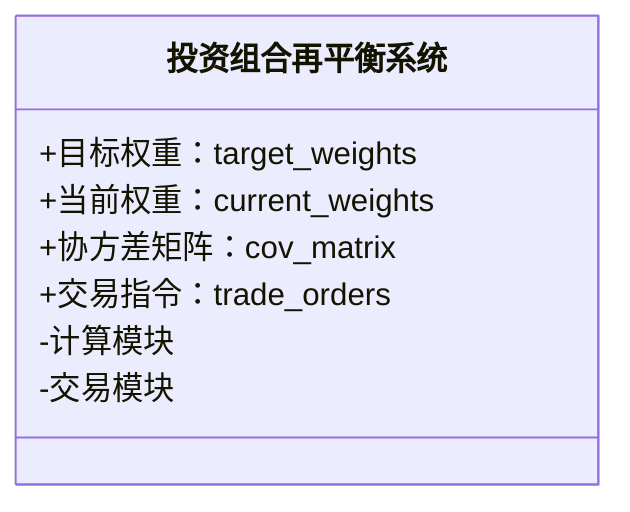

                 


# 投资组合再平衡：维持风险收益目标的关键

## 关键词：投资组合再平衡，风险收益，资产配置，优化算法，系统架构

## 摘要：  
投资组合再平衡是投资管理中的关键策略，旨在维持资产配置以适应市场变化和投资者目标。本文从基本概念到高级算法，全面解析再平衡的原理、方法和实现，帮助读者优化投资组合，实现风险与收益的最佳平衡。

---

# 第一部分: 投资组合再平衡概述

# 第1章: 投资组合再平衡的基本概念

## 1.1 投资组合再平衡的背景与重要性

### 1.1.1 投资组合的基本概念  
投资组合是将资金分配到不同资产（如股票、债券、商品等）的集合，以分散风险并优化收益。随着市场变化，各资产的权重可能偏离初始设定，需要定期调整以维持目标配置。

### 1.1.2 再平衡的定义与目的  
再平衡是指根据市场变化和投资者目标，定期调整投资组合中各资产的比例，以恢复初始配置或适应新的目标。其目的是维持风险收益目标，优化投资表现。

### 1.1.3 再平衡在投资管理中的重要性  
再平衡有助于：  
1. **分散风险**：避免单一资产权重过大导致的高风险。  
2. **优化收益**：通过调整资产配置，捕捉不同资产的收益机会。  
3. **应对市场波动**：及时调整以应对市场变化，避免过度偏离目标。  

---

## 1.2 投资组合再平衡的类型与方法

### 1.2.1 时间驱动的再平衡  
定期（如每月、每季度）调整投资组合，确保各资产比例符合目标配置。  

### 1.2.2 价值驱动的再平衡  
根据资产价值的变化，当某资产的权重偏离目标一定比例时，进行调整。  

### 1.2.3 滑点控制与再平衡策略  
在市场波动较大时，通过再平衡减少投资组合的滑点，提高执行效率。  

---

## 1.3 再平衡的成本与收益分析

### 1.3.1 再平衡的成本构成  
1. **交易成本**：买卖资产产生的佣金、税费等。  
2. **机会成本**：频繁交易可能导致的潜在收益损失。  
3. **时间成本**：研究和执行再平衡所需的时间和资源。  

### 1.3.2 再平衡对收益的影响  
再平衡可以帮助捕捉市场变化带来的收益，但过频的调整可能增加交易成本，影响整体收益。  

### 1.3.3 成本-收益权衡的优化策略  
通过设定合理的再平衡频率和阈值，平衡交易成本和收益优化。  

---

## 1.4 本章小结  
本章介绍了投资组合再平衡的基本概念、类型与方法，以及成本与收益的权衡。再平衡是投资管理中的关键策略，能够有效分散风险、优化收益并应对市场波动。

---

# 第二部分: 投资组合再平衡的核心概念与数学模型

# 第2章: 资产配置与风险收益理论

## 2.1 现代投资组合理论（MPT）

### 2.1.1 MPT的核心假设  
1. 投资者通过资产多样化降低风险。  
2. 资产的回报符合正态分布。  
3. 投资者是理性的，追求效用最大化。  

### 2.1.2 有效前沿的概念  
有效前沿是所有可能投资组合中收益最高、风险最低的集合，代表最优资产配置。  

### 2.1.3 风险与收益的权衡  
投资组合的收益与风险成正比，投资者需要在两者之间找到平衡点。  

---

## 2.2 资产配置的数学模型

### 2.2.1 投资组合的期望收益与方差公式  
$$ E(r_p) = \sum w_i E(r_i) $$  
$$ Var(r_p) = \sum w_i^2 Var(r_i) + \sum w_i w_j Cov(r_i, r_j) $$  

### 2.2.2 优化模型的构建  
$$ \text{Minimize } \sigma^2 \text{ subject to } \sum w_i = 1 \text{ 和 } \sum w_i r_i = T \text{（目标收益）} $$  

---

## 2.3 风险平价与投资组合优化

### 2.3.1 风险平价的定义  
风险平价是一种资产配置方法，使每种资产对组合风险的贡献相等。  

### 2.3.2 风险平价与传统资产配置的对比  

| 对比维度         | 传统资产配置       | 风险平价         |
|------------------|-------------------|-----------------|
| 基础假设         | 收益目标           | 风险贡献         |
| 优势             | 灵活性高           | 平衡风险         |
| 适用场景         | 高收益目标         | 风险控制优先     |

---

## 2.4 本章小结  
本章通过现代投资组合理论和数学模型，探讨了资产配置的核心概念和风险收益的权衡。风险平价作为一种新兴的配置方法，为投资者提供了新的选择。

---

# 第三部分: 投资组合再平衡的算法与实现

# 第3章: 投资组合再平衡的优化算法

## 3.1 优化算法的基本原理

### 3.1.1 二次规划问题  
投资组合优化属于二次规划问题，目标是最小化投资组合的方差，同时满足收益和权重的约束。  

### 3.1.2 拉格朗日乘数法  
通过拉格朗日乘数法求解优化问题，得到最优权重分配。  

---

## 3.2 再平衡算法的实现步骤

### 3.2.1 确定目标配置  
根据投资者目标，设定各资产的目标权重。  

### 3.2.2 计算当前配置  
根据当前市场数据，计算各资产的实际权重。  

### 3.2.3 计算再平衡需求  
确定需要买卖的资产数量，以使实际权重回归目标配置。  

### 3.2.4 执行交易  
根据计算的需求，执行买卖交易，完成再平衡。  

---

## 3.3 投资组合再平衡的Python实现

### 3.3.1 环境安装  
安装必要的Python库，如`numpy`、`pandas`和`scipy`。  

### 3.3.2 核心代码实现  

```python
import numpy as np
import scipy.optimize as opt

# 定义目标函数
def portfolio_variance(weights, covariance_matrix):
    return weights.T @ covariance_matrix @ weights

# 定义约束条件
def constraint(weights, target_weights):
    return weights - target_weights

# 优化问题求解
def optimize_portfolio(n_assets, target_weights, covariance_matrix):
    # 初始化权重向量
    initial_weights = np.array([1/n_assets]*n_assets)
    
    # 使用SLSQP求解器
    result = opt.minimize(
        portfolio_variance,
        initial_weights,
        args=(covariance_matrix,),
        method='SLSQP',
        constraints=[{'type': 'eq', 'fun': lambda w: sum(w) - 1}]
    )
    return result.x

# 示例：优化投资组合权重
n_assets = 3
target_weights = [0.4, 0.3, 0.3]
covariance_matrix = np.array([
    [0.04, 0.02, 0.01],
    [0.02, 0.06, 0.03],
    [0.01, 0.03, 0.08]
])

optimal_weights = optimize_portfolio(n_assets, target_weights, covariance_matrix)
print("Optimal Weights:", optimal_weights)
```

---

## 3.4 本章小结  
本章通过数学推导和Python代码实现，详细讲解了投资组合再平衡的优化算法。从二次规划问题到拉格朗日乘数法，再到具体的代码实现，为读者提供了完整的解决方案。

---

# 第四部分: 投资组合再平衡的系统架构与设计

# 第4章: 投资组合再平衡系统的架构设计

## 4.1 系统功能设计

### 4.1.1 功能模块划分  
1. **输入模块**：接收市场数据和目标配置。  
2. **计算模块**：计算当前权重和再平衡需求。  
3. **交易模块**：模拟或执行实际交易。  
4. **输出模块**：展示优化后的权重和交易指令。  

### 4.1.2 领域模型（领域模型图）  


---

## 4.2 系统架构设计

### 4.2.1 分层架构  
1. **数据层**：存储市场数据和用户输入。  
2. **业务逻辑层**：实现再平衡计算和交易逻辑。  
3. **用户界面层**：展示结果和用户交互。  

### 4.2.2 系统架构图  


---

## 4.3 本章小结  
本章通过分层架构和系统设计图，展示了投资组合再平衡系统的整体架构。从数据层到用户界面层，系统各模块协同工作，实现再平衡功能。

---

# 第五部分: 投资组合再平衡的项目实战

# 第5章: 投资组合再平衡的实现案例

## 5.1 项目背景与目标

### 5.1.1 项目背景  
假设我们管理一个包含股票、债券和商品的投资组合，目标是每月末进行再平衡，维持各资产的目标权重。  

### 5.1.2 项目目标  
1. 实现投资组合再平衡的自动化流程。  
2. 计算再平衡所需的交易指令。  
3. 输出优化后的投资组合权重。  

---

## 5.2 项目核心实现

### 5.2.1 环境安装  
安装必要的Python库，如`numpy`、`pandas`和`backtrader`。  

### 5.2.2 核心代码实现  

```python
import pandas as pd
import numpy as np

# 示例数据：假设的资产价格和目标权重
assets = ['股票', '债券', '商品']
target_weights = [0.4, 0.3, 0.3]
prices = pd.DataFrame({
    '股票': [100, 98, 102],
    '债券': [102, 105, 103],
    '商品': [50, 52, 48]
})

# 计算当前权重
current_weights = (prices.iloc[-1] / prices.iloc[-1].sum()).round(2)

# 计算再平衡需求
rebalance_needed = target_weights - current_weights

# 执行交易（简化版）
def execute_trade(asset, amount):
    # 简化为输出交易指令
    print(f"交易：{asset}，数量：{amount}")

for asset, needed in zip(assets, rebalance_needed):
    if needed > 0:
        execute_trade(asset, needed)
    elif needed < 0:
        execute_trade(asset, -needed)
```

---

## 5.3 项目小结  
本章通过一个实际案例，展示了投资组合再平衡的实现过程。从数据准备到代码实现，再到结果输出，为读者提供了完整的实战指导。

---

# 第六部分: 投资组合再平衡的最佳实践与总结

# 第6章: 投资组合再平衡的最佳实践

## 6.1 再平衡策略的优化

### 6.1.1 定期再平衡 vs. 动态再平衡  
定期再平衡操作简单，但可能错过市场机会；动态再平衡更灵活，但需要更高的交易成本。  

### 6.1.2 交易成本的控制  
通过设定合理的再平衡频率和阈值，降低交易成本。  

---

## 6.2 再平衡系统的设计注意事项

### 6.2.1 数据源的选择  
确保市场数据的准确性和实时性。  

### 6.2.2 系统的可扩展性  
设计灵活的架构，方便未来扩展。  

### 6.2.3 风险控制  
在再平衡过程中，加入风险控制机制，避免重大市场波动带来的损失。  

---

## 6.3 拓展阅读与学习资源

### 6.3.1 推荐书籍  
1. 《投资学》（作者：杰里夫·弗里德曼）  
2. 《Python金融计算》（作者：Yves Hilpisch）  

### 6.3.2 在线资源  
1. [Quant Stack](https://quant.stackexchange.com/)  
2. [QuantInsti](https://www.quantinsti.com/)  

---

## 6.4 本章小结  
本章总结了投资组合再平衡的最佳实践，提供了优化策略和系统设计的建议。通过合理的再平衡策略和系统设计，投资者可以有效管理风险，优化收益。

---

# 结语  
投资组合再平衡是投资管理中的关键策略，通过科学的方法和优化的算法，投资者可以维持风险收益目标，实现长期稳健的投资回报。希望本文的内容能够为读者提供有价值的参考和启发。

---

# 作者：AI天才研究院/AI Genius Institute & 禅与计算机程序设计艺术 /Zen And The Art of Computer Programming

