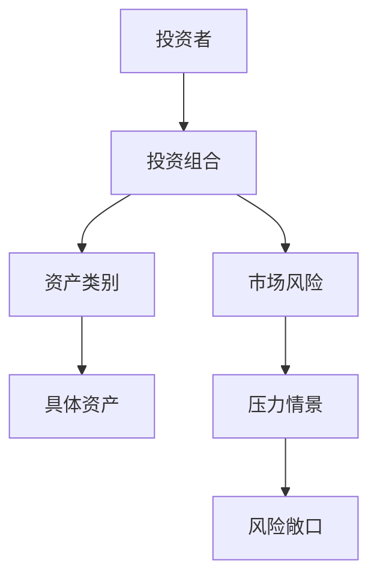
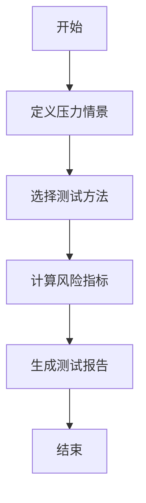

                 


# 投资组合压力测试：评估极端市场情况下的风险

> 关键词：投资组合压力测试，极端市场风险，风险管理，VaR，信用风险

> 摘要：投资组合压力测试是一种评估在极端市场条件下投资组合风险的重要方法。本文详细介绍了压力测试的核心概念、数学模型、系统架构设计以及实际应用案例，帮助读者全面理解如何在极端市场情况下评估和管理投资组合风险。

---

## 第一部分: 投资组合压力测试的背景与概念

### 第1章: 投资组合压力测试概述

#### 1.1 投资组合压力测试的定义与背景

投资组合压力测试是一种用于评估投资组合在极端市场条件下的潜在损失的方法。它通过模拟各种极端市场情景，分析投资组合在这些情景下的表现，从而帮助投资者更好地理解潜在风险并制定相应的风险管理策略。

- **1.1.1 什么是投资组合压力测试？**
  投资组合压力测试通过模拟极端市场条件（如市场崩盘、经济衰退、通货膨胀等），评估投资组合在这些情景下的潜在损失。它不同于传统的风险测量方法（如VaR），因为它更关注极端情况下的损失，而不仅仅是正常情况下的风险。

- **1.1.2 压力测试的必要性与应用场景**
  压力测试在金融领域中具有重要意义，尤其是在金融危机频发的背景下。通过压力测试，投资者可以评估投资组合在极端市场条件下的表现，从而制定更稳健的投资策略。压力测试广泛应用于银行、基金公司、保险公司等金融机构的风险管理中。

- **1.1.3 压力测试与风险管理体系的关系**
  压力测试是风险管理体系中的一个重要组成部分。它帮助机构识别潜在风险，评估在极端情况下的损失，并制定应对策略。压力测试的结果可以为风险管理决策提供重要依据。

#### 1.2 压力测试的历史发展与演变

- **1.2.1 压力测试的起源与发展**
  压力测试的概念起源于20世纪80年代，最初用于评估单个资产的风险。随着金融市场的发展和复杂性的增加，压力测试逐渐扩展到投资组合层面，并成为金融机构风险管理的重要工具。

- **1.2.2 不同时期压力测试的特点**
  - 20世纪80年代：压力测试主要用于评估单个资产的风险。
  - 20世纪90年代：压力测试开始应用于投资组合层面，考虑多种资产类别的风险。
  - 21世纪初：压力测试成为金融机构风险管理的标配工具，尤其是在2008年金融危机后，压力测试成为监管机构评估金融机构稳健性的重要手段。

- **1.2.3 当前压力测试的最新趋势**
  当前，压力测试正在向更复杂和动态的方向发展，结合大数据、人工智能等技术，评估更加复杂和动态的市场情景。同时，压力测试也在向个性化和定制化方向发展，根据不同投资者的需求，提供定制化的压力测试方案。

#### 1.3 投资组合压力测试的核心要素

- **1.3.1 投资组合的基本构成**
  投资组合通常由多种资产组成，包括股票、债券、基金、房地产等。每种资产的风险和收益特性不同，投资组合的压力测试需要考虑这些资产在极端情景下的表现。

- **1.3.2 压力测试的关键指标**
  - **VaR（风险价值）**：在给定置信水平下，投资组合在正常市场条件下可能遭受的最大损失。
  - **CVaR（条件风险价值）**：在VaR的基础上，考虑极端市场情景下投资组合的平均损失。
  - **波动率**：投资组合收益的波动性，反映投资组合在极端市场条件下的波动情况。
  - **相关性**：投资组合中各资产之间的相关性，相关性越高，投资组合在极端市场条件下的风险越大。

- **1.3.3 压力测试的边界与外延**
  压力测试的边界是指测试的范围和限制，通常包括测试的时间范围、测试的情景数量、测试的资产类别等。压力测试的外延则是指压力测试的应用范围，不仅限于投资组合，还可以应用于企业、行业和整个金融系统的风险评估。

---

## 第二部分: 压力测试的核心概念与联系

### 第2章: 压力测试的原理与方法

#### 2.1 压力测试的原理与方法

- **2.1.1 压力测试的基本原理**
  压力测试通过模拟极端市场情景，分析投资组合在这些情景下的表现。常见的压力情景包括市场崩盘、经济衰退、通货膨胀、利率上升、汇率波动等。通过分析投资组合在这些情景下的损失，可以帮助投资者更好地理解潜在风险，并制定相应的风险管理策略。

- **2.1.2 压力测试的主要方法**
  - **历史模拟法**：利用历史市场数据，模拟极端市场情景，分析投资组合在这些情景下的表现。
  - **蒙特卡洛模拟法**：通过生成大量的随机市场情景，模拟投资组合在这些情景下的表现，评估潜在风险。
  - **情景分析法**：基于特定的市场情景（如市场崩盘、经济衰退等），分析投资组合在这些情景下的表现。

- **2.1.3 不同压力测试方法的优缺点对比**

| 方法名称      | 优点                           | 缺点                           |
|---------------|--------------------------------|--------------------------------|
| 历史模拟法     | 数据真实，结果可靠             | 依赖历史数据，可能无法覆盖极端情景 |
| 蒙特卡洛模拟法 | 能够覆盖极端情景               | 计算复杂，需要大量计算资源       |
| 情景分析法     | 情景明确，结果直观             | 情景假设可能不够准确             |

#### 2.2 压力测试的数学模型与公式

- **2.2.1 压力测试中的概率分布模型**
  - 正态分布：常用于描述资产收益率的分布，假设资产收益率服从正态分布。
  - t分布：用于描述资产收益率的分布，具有更厚的尾部，适合描述极端情景。
  - 极度价值-at-风险（VaR）：在给定置信水平下，投资组合在正常市场条件下可能遭受的最大损失。
  
  $$ \text{VaR} = \mu + z \cdot \sigma $$
  
  其中，$\mu$ 是平均收益率，$z$ 是标准正态分布的分位数，$\sigma$ 是收益率的标准差。
  
- **2.2.2 信用风险与市场风险的数学模型**
  - 信用风险模型：用于评估投资组合中信用类资产的风险，如Merton模型。
  - 市场风险模型：用于评估投资组合中市场风险类资产的风险，如VaR模型。

  $$ \text{VaR} = \sqrt{w_1^2 \cdot \sigma_1^2 + w_2^2 \cdot \sigma_2^2 + 2w_1w_2 \cdot \rho_{12} \cdot \sigma_1 \sigma_2} $$

  其中，$w_1$ 和 $w_2$ 是资产权重，$\sigma_1$ 和 $\sigma_2$ 是资产收益的标准差，$\rho_{12}$ 是资产之间的相关系数。

- **2.2.3 压力测试的边界与外延**
  压力测试需要考虑测试的情景数量、资产类别、时间范围等因素。通常，压力测试的情景数量越多，测试结果越准确，但计算复杂性也越高。

#### 2.3 压力测试的ER实体关系图



#### 2.4 压力测试的算法流程图



---

## 第三部分: 压力测试的系统分析与架构设计

### 第3章: 系统分析与架构设计

#### 3.1 系统分析

- **3.1.1 问题场景介绍**
  在当前金融市场中，投资者需要评估投资组合在极端市场条件下的风险。传统的风险管理方法往往无法准确捕捉极端情景下的潜在损失，因此需要一种系统化的压力测试方法来评估投资组合在极端情景下的表现。

- **3.1.2 项目目标与范围**
  - 目标：开发一个投资组合压力测试系统，能够模拟极端市场情景，评估投资组合在这些情景下的潜在损失。
  - 范围：包括系统设计、数据收集、模型实现、结果分析等。

- **3.1.3 系统功能需求**
  - 数据输入：支持多种数据格式，包括历史市场数据、资产配置信息等。
  - 情景生成：能够生成多种极端市场情景，如市场崩盘、经济衰退等。
  - 风险评估：计算投资组合在这些情景下的风险指标，如VaR、CVaR等。
  - 结果输出：生成详细的测试报告，包括风险指标、情景分析、资产配置建议等。

#### 3.2 系统架构设计

- **3.2.1 系统架构图**
  ```mermaid
  graph TD
      A[用户界面] --> B[业务逻辑层]
      B --> C[数据访问层]
      C --> D[数据库]
  ```

- **3.2.2 系统组件与交互**
  ```mermaid
  graph TD
      A[用户] --> B[压力测试模块]
      B --> C[数据处理模块]
      C --> D[结果生成模块]
  ```

---

## 第四部分: 项目实战

### 第4章: 项目实战

#### 4.1 环境安装与工具准备

- **4.1.1 环境安装**
  - 操作系统：Windows 10或更高版本，macOS 10.15或更高版本，Linux（Ubuntu 20.04或更高版本）。
  - Python：3.8或更高版本。
  - 软件工具：Jupyter Notebook、Python库（NumPy、Pandas、Matplotlib、Scipy）。

- **4.1.2 工具准备**
  - 数据来源：历史市场数据（如股票价格、债券收益率等）。
  - 模型实现：压力测试算法的实现，包括VaR、CVaR等。

#### 4.2 核心代码实现

- **4.2.1 压力测试的Python代码实现**
  ```python
  import numpy as np
  import pandas as pd
  import matplotlib.pyplot as plt

  def calculate VaR(returns, confidence_level=0.95):
      sorted_returns = np.sort(returns)
      var_index = int(len(sorted_returns) * (1 - confidence_level))
      var = sorted_returns[var_index]
      return var

  def calculate CVaR(returns, confidence_level=0.95):
      sorted_returns = np.sort(returns)
      var_index = int(len(sorted_returns) * (1 - confidence_level))
      cvar = np.mean(sorted_returns[var_index:])
      return cvar

  # 示例数据
  np.random.seed(42)
  returns = np.random.normal(0, 1, 1000)
  VaR = calculate VaR(returns, 0.95)
  CVaR = calculate CVaR(returns, 0.95)
  print(f"VaR at 95% confidence level: {VaR:.2f}")
  print(f"CVaR at 95% confidence level: {CVaR:.2f}")
  ```

- **4.2.2 代码应用解读**
  以上代码实现了VaR和CVaR的计算。首先，我们生成了1000个随机收益率，然后计算了在95%置信水平下的VaR和CVaR。VaR表示在正常市场条件下，投资组合可能遭受的最大损失，而CVaR表示在极端市场条件下，投资组合的平均损失。

#### 4.3 案例分析与解读

- **4.3.1 案例分析**
  假设我们有一个包含股票和债券的投资组合，股票占60%，债券占40%。我们需要评估这个投资组合在市场崩盘情景下的表现。

- **4.3.2 实施步骤**
  1. 数据收集：收集股票和债券的历史收益率数据。
  2. 情景生成：生成市场崩盘情景，例如股票收益率为-30%，债券收益率为-10%。
  3. 风险评估：计算投资组合在这些情景下的VaR和CVaR。
  4. 结果分析：根据计算结果，评估投资组合在极端情景下的潜在损失。

- **4.3.3 分析结果**
  根据计算结果，投资组合在市场崩盘情景下的VaR为-25%，CVaR为-30%。这意味着在正常市场条件下，投资组合可能遭受的最大损失为25%，而在极端市场条件下，投资组合的平均损失为30%。

#### 4.4 项目小结

通过以上案例分析，我们可以看到，压力测试在评估投资组合在极端市场条件下的风险方面具有重要作用。通过模拟极端情景，我们可以更好地理解投资组合的潜在风险，并制定相应的风险管理策略。

---

## 第五部分: 最佳实践与总结

### 第5章: 最佳实践与总结

#### 5.1 最佳实践

- **选择合适的情景**：根据市场环境和投资组合的特点，选择合适的情景进行压力测试。
- **使用合适的方法**：根据数据和情景的复杂性，选择合适的压力测试方法，如历史模拟法、蒙特卡洛模拟法或情景分析法。
- **定期更新模型**：市场环境不断变化，压力测试模型需要定期更新，以反映最新的市场情况。
- **结合其他风险管理工具**：压力测试可以与其他风险管理工具（如VaR、信用评分等）结合使用，以全面评估投资组合的风险。

#### 5.2 项目小结

通过本文的介绍和分析，我们全面了解了投资组合压力测试的核心概念、数学模型、系统架构设计以及实际应用案例。压力测试在评估极端市场条件下的风险方面具有重要作用，是现代风险管理的重要工具。

#### 5.3 注意事项

- **数据质量**：压力测试的结果依赖于数据的质量和准确性。数据质量差可能导致测试结果不准确。
- **情景假设**：压力测试的结果依赖于情景假设的合理性。情景假设不合理可能导致测试结果偏离实际。
- **模型局限性**：压力测试模型具有一定的局限性，无法覆盖所有可能的极端情景。

#### 5.4 拓展阅读

- 建议读者进一步学习压力测试的高级方法，如基于机器学习的压力测试模型，以及压力测试在金融监管中的应用。

---

## 作者信息

作者：AI天才研究院/AI Genius Institute & 禅与计算机程序设计艺术/Zen And The Art of Computer Programming

---

通过以上内容，读者可以全面了解投资组合压力测试的核心概念、数学模型、系统架构设计以及实际应用案例。希望本文能够帮助读者更好地理解如何在极端市场条件下评估和管理投资组合风险。

