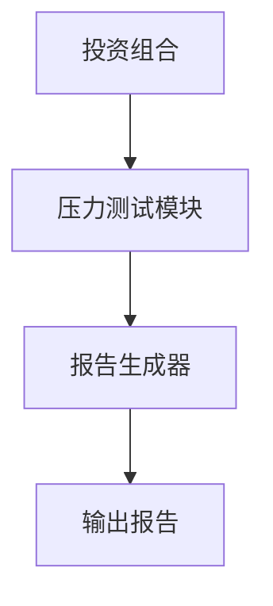

                 


# 投资组合压力测试：评估极端情景下的风险敞口

> 关键词：投资组合，压力测试，风险敞口，极端情景，VaR，CVaR，金融风险管理

> 摘要：本文深入探讨了投资组合压力测试的核心概念、数学模型、系统架构和实际应用，结合具体案例分析，为读者提供全面的理解和实践指导。

---

# 第一部分：投资组合压力测试基础

## 第1章：投资组合压力测试概述

### 1.1 投资组合压力测试的定义与背景

#### 1.1.1 压力测试的定义
压力测试是一种金融风险管理工具，用于评估投资组合在极端市场条件下的表现和潜在损失。通过模拟极端情景，压力测试帮助机构识别和量化潜在风险。

#### 1.1.2 投资组合压力测试的重要性
在金融市场中，极端事件（如金融危机、市场崩盘）可能导致重大损失。压力测试通过模拟这些情景，帮助机构制定应对策略，确保在极端情况下仍能维持稳健的财务状况。

#### 1.1.3 压力测试在金融风险管理中的应用
压力测试广泛应用于银行、基金公司和其他金融机构，用于评估投资组合的稳健性，制定风险缓解策略，并满足监管要求。

### 1.2 压力测试的核心概念

#### 1.2.1 风险敞口的定义
风险敞口是指投资组合在特定市场条件下的潜在损失。它反映了投资组合对市场波动的敏感性。

#### 1.2.2 极端情景的特征
极端情景是指可能导致投资组合重大损失的市场条件，如市场崩盘、流动性危机或黑天鹅事件。

#### 1.2.3 压力测试的分类
压力测试可以分为历史模拟、情景分析和统计模型三种类型，每种方法各有优缺点。

### 1.3 压力测试的流程与方法

#### 1.3.1 压力测试的基本流程
压力测试通常包括定义情景、选择资产组合、计算损失和评估结果四个步骤。

#### 1.3.2 压力测试的主要方法
常用方法包括历史模拟法、Monte Carlo模拟和情景分析法，每种方法适用于不同情况。

#### 1.3.3 压力测试的实施步骤
从数据收集、情景选择到结果分析，详细解释压力测试的每一步骤。

---

## 第2章：压力测试的核心概念与联系

### 2.1 风险敞口的结构化分析

#### 2.1.1 风险敞口的维度分解
从资产类别、行业和地区等多个维度分析风险敞口，帮助识别潜在风险点。

#### 2.1.2 风险敞口的量化方法
通过VaR和CVaR等指标量化风险敞口，提供具体的损失预期。

#### 2.1.3 风险敞口的动态变化
分析市场变化对风险敞口的影响，实时调整投资组合。

### 2.2 极端情景分析的原理

#### 2.2.1 极端情景的识别与选择
基于历史数据和市场分析，选择可能发生的极端情景。

#### 2.2.2 极端情景的模拟方法
通过历史数据模拟和假设情景生成极端市场条件。

#### 2.2.3 极端情景的评估标准
设定明确的评估标准，确保情景的有效性和代表性。

### 2.3 压力测试与风险管理系统的关系

#### 2.3.1 风险管理系统概述
介绍风险管理系统的基本功能和组成部分。

#### 2.3.2 压力测试在风险管理系统中的位置
分析压力测试在风险管理中的作用和与其他工具的关系。

#### 2.3.3 压力测试与其他风险管理工具的协同
探讨压力测试与VaR、信用评分等工具的协同作用。

---

## 第3章：压力测试的数学模型与算法原理

### 3.1 风险测量的数学模型

#### 3.1.1 价值-at-风险（VaR）
VaR是投资组合在给定置信水平下的潜在损失，公式为：
$$ VaR = \alpha \times \sigma $$
其中，$\alpha$ 是置信水平，$\sigma$ 是投资组合的标准差。

#### 3.1.2 穿透风险（CVaR）
CVaR是VaR的扩展，表示在VaR水平以上的平均损失，公式为：
$$ CVaR = \frac{1}{1-\alpha} \int_{\alpha}^{1} VaR d\alpha $$

#### 3.1.3 风险度量的其他方法
介绍其他风险度量方法，如波动率和最大回撤。

### 3.2 压力测试的算法实现

#### 3.2.1 Monte Carlo 方法
通过随机模拟生成大量市场情景，计算投资组合在不同情景下的表现。

#### 3.2.2 历史模拟方法
基于历史市场数据，模拟极端情景并评估投资组合表现。

#### 3.2.3 情景分析法
假设特定市场情景，评估投资组合在这些情景下的表现。

### 3.3 算法原理的数学公式

#### 3.3.1 VaR 的计算公式
$$ VaR = \alpha \times \sigma $$

#### 3.3.2 CVaR 的计算公式
$$ CVaR = \frac{1}{1-\alpha} \int_{\alpha}^{1} VaR d\alpha $$

---

## 第4章：系统分析与架构设计方案

### 4.1 系统分析

#### 4.1.1 问题场景介绍
描述投资组合压力测试的背景和目标，分析市场需求和技术可行性。

#### 4.1.2 项目介绍
介绍项目的目标、范围和主要功能。

#### 4.1.3 系统功能设计
定义系统的主要功能模块，包括情景生成、风险计算和结果分析。

### 4.2 系统架构设计

#### 4.2.1 领域模型设计（Mermaid 类图）


#### 4.2.2 系统架构图


#### 4.2.3 接口设计
定义系统输入和输出接口，确保模块之间的交互顺畅。

---

## 第5章：项目实战

### 5.1 环境安装与配置

#### 5.1.1 Python 环境安装
安装Python和必要的库（如numpy, pandas, matplotlib）。

#### 5.1.2 必要库的安装
```bash
pip install numpy pandas matplotlib
```

### 5.2 核心算法实现

#### 5.2.1 压力测试模块实现
```python
import numpy as np
import pandas as pd

def compute VaR(returns, alpha):
    returns_sorted = sorted(returns)
    var_index = int(alpha * len(returns_sorted))
    VaR = returns_sorted[var_index]
    return VaR
```

#### 5.2.2 风险测量模块实现
```python
def compute CVaR(returns, alpha):
    returns_sorted = sorted(returns)
    var_index = int(alpha * len(returns_sorted))
    cvar = np.mean(returns_sorted[var_index:])
    return cvar
```

#### 5.2.3 案例分析
使用具体数据集进行压力测试，展示结果和分析。

---

## 第6章：总结与展望

### 6.1 总结

#### 6.1.1 小结
回顾压力测试的核心概念和方法，总结其在金融风险管理中的重要性。

#### 6.1.2 注意事项
提醒读者在实际应用中需要注意的问题，如数据质量和模型假设。

#### 6.1.3 拓展阅读
推荐相关书籍和论文，鼓励读者深入学习压力测试技术。

### 6.2 展望

#### 6.2.1 压力测试技术的未来发展
探讨压力测试技术的最新进展和未来趋势。

#### 6.2.2 压力测试在其他领域的应用
分析压力测试在其他领域（如能源和供应链）的应用潜力。

---

# 作者：AI天才研究院/AI Genius Institute & 禅与计算机程序设计艺术 /Zen And The Art of Computer Programming

---

本文通过系统的分析和详细的案例，全面介绍了投资组合压力测试的核心概念、数学模型和实际应用。希望读者通过本文能够深入理解压力测试的重要性和实施方法，并能够在实际中有效应用。

