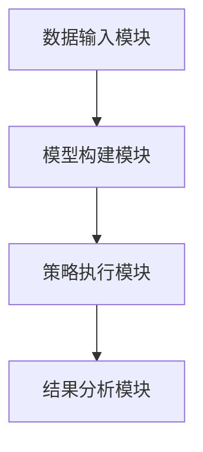
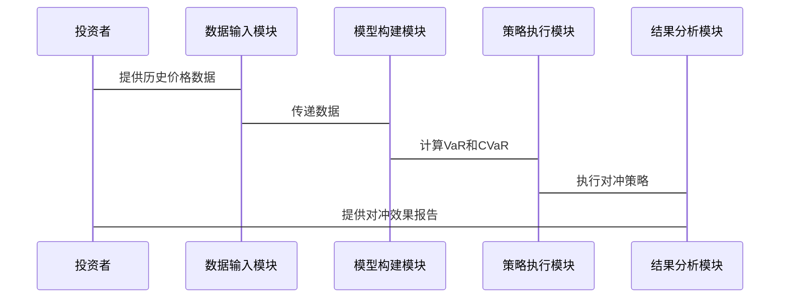

                 


# 投资组合尾部对冲：保护策略在极端市场中的作用

## 关键词：
- 投资组合
- 尾部对冲
- 风险管理
- 极端市场
- 对冲策略

## 摘要：
在极端市场条件下，投资组合的尾部风险可能对投资者造成重大损失。本文详细探讨了尾部对冲策略的核心概念、算法原理、数学模型、系统架构以及实际应用案例。通过分析VaR、CVaR等风险度量指标，结合现代投资组合理论（MPT）和优化算法，本文提出了一种有效的尾部对冲方法，帮助投资者在极端市场中保护投资组合免受重大损失。

---

# 第一部分: 尾部对冲的背景与概念

## 第1章: 投资组合风险管理的背景

### 1.1 传统投资组合管理的局限性
- **问题背景**：传统投资组合管理方法在正常市场条件下表现良好，但在极端市场条件下往往失效。
- **问题描述**：尾部风险难以预测，可能导致投资组合的重大损失。
- **解决方案**：引入尾部对冲策略，降低极端市场条件下的潜在损失。
- **边界与外延**：尾部对冲适用于所有类型的投资组合，尤其适合风险厌恶型投资者。
- **核心要素**：尾部风险、对冲策略、风险管理。

### 1.2 尾部对冲策略的核心概念
- **尾部对冲的定义**：通过特定的金融工具和策略，降低投资组合在极端市场条件下的损失。
- **尾部对冲与传统对冲策略的区别**：
  - 传统对冲：基于市场中性原则，降低市场风险。
  - 尾部对冲：专注于极端市场条件下的风险对冲。
- **尾部对冲的作用**：在极端市场中保护资本，避免重大损失。

### 1.3 本书的核心内容与结构
- **研究框架**：从理论到实践，全面分析尾部对冲的策略和方法。
- **主要内容安排**：
  - 第2章：尾部对冲的理论基础。
  - 第3章：尾部对冲的算法实现。
  - 第4章：尾部对冲的数学模型。
  - 第5章：系统架构设计。
  - 第6章：项目实战与案例分析。
- **读者对象**：投资者、金融从业者、风险管理专家。

---

## 第2章: 尾部对冲策略的理论基础

### 2.1 风险管理的基本原理
- **风险的分类**：
  - 市场风险：市场价格波动带来的风险。
  - 信用风险：债券发行人违约的风险。
  - 操作风险：操作失误或欺诈带来的风险。
- **风险-收益平衡理论**：在投资组合中，收益与风险是相伴而生的，尾部对冲旨在在极端风险下保护收益。
- **现代投资组合理论（MPT）**：通过分散投资降低非系统性风险，但无法完全消除系统性风险。

### 2.2 尾部风险的统计模型
- **值-at-风险（VaR）模型**：
  - VaR定义：在一定置信水平下，投资组合可能遭受的最大损失。
  - 示例：95%置信水平下的VaR为$100万，意味着在95%的概率下，损失不会超过$100万。
- **置信区间与条件VaR（CVaR）**：
  - CVaR定义：在VaR的基础上，考虑超过VaR的平均损失。
  - 示例：95%置信水平下的CVaR为$200万，意味着在5%的概率下，平均损失为$200万。
- **尾部事件的概率分布分析**：
  - 使用统计方法（如极值理论）分析尾部事件的频率和影响。

### 2.3 对冲策略的数学基础
- **线性对冲与非线性对冲**：
  - 线性对冲：基于回归分析，选择相关资产进行对冲。
  - 非线性对冲：使用期权、保险等非线性工具进行对冲。
- **投资组合优化的数学模型**：
  - 均值-方差优化：最小化投资组合的波动性，同时最大化收益。
  - 整数规划：在极端市场条件下，选择最优的对冲资产。

---

## 第3章: 尾部对冲的核心算法与实现

### 3.1 尾部对冲算法的原理
- **基于VaR的对冲算法**：
  - 计算投资组合的VaR。
  - 根据VaR结果选择对冲资产。
- **基于CVaR的优化算法**：
  - 计算投资组合的CVaR。
  - 优化投资组合以最小化CVaR。
- **非参数化对冲策略**：
  - 不依赖于特定的概率分布模型，通过历史数据分析尾部事件。

### 3.2 算法实现的步骤与流程
- **数据收集与预处理**：
  - 收集历史价格数据。
  - 清洗数据，处理缺失值和异常值。
- **风险模型的构建与校准**：
  - 使用VaR或CVaR模型构建风险模型。
  - 校准模型参数，确保模型的准确性。
- **对冲组合的优化与调整**：
  - 使用优化算法选择最优的对冲资产。
  - 定期调整对冲组合，以适应市场变化。

### 3.3 算法实现的代码示例

#### 3.3.1 VaR模型的Python实现
```python
import numpy as np
import scipy.stats as stats

def calculate_var(data, confidence_level=0.95):
    # 计算VaR
    sorted_data = np.sort(data)
    alpha_index = int(len(data) * (1 - confidence_level))
    var = sorted_data[alpha_index]
    return var

# 示例数据
data = np.random.normal(loc=0, scale=1, size=1000)
var = calculate_var(data)
print(f"VaR at {confidence_level} confidence level is: {var}")
```

#### 3.3.2 CVaR优化的代码示例
```python
import numpy as np
import scipy.optimize as optimize

def calculate_cvar(data, confidence_level=0.95):
    # 计算CVaR
    sorted_data = np.sort(data)
    alpha_index = int(len(data) * (1 - confidence_level))
    cvar = np.mean(sorted_data[:alpha_index])
    return cvar

# 示例数据
data = np.random.chi2(df=3, size=1000)
cvar = calculate_cvar(data)
print(f"CVaR at {confidence_level} confidence level is: {cvar}")
```

---

## 第4章: 尾部对冲的数学模型与公式

### 4.1 VaR与CVaR的数学表达
- **VaR的定义与公式**：
  $$ VaR_{\alpha} = \inf\{x | P(L \leq x) \geq \alpha\} $$
  其中，$\alpha$是置信水平，$L$是投资组合的损失。
- **CVaR的定义与公式**：
  $$ CVaR_{\alpha} = \frac{1}{\alpha} \int_{\alpha}^{1} VaR_{\beta} d\beta $$
  其中，$\beta$是累积概率分布函数。

### 4.2 投资组合优化的数学模型
- **均值-方差优化模型**：
  $$ \min_{w} w^T \Sigma w $$
  $$ \text{s.t.} \quad w^T \mu = target\_return $$
  其中，$w$是投资权重，$\Sigma$是资产的协方差矩阵，$\mu$是资产的预期收益向量。
- **基于VaR的优化模型**：
  $$ \min_{w} VaR(w) $$
  $$ \text{s.t.} \quad w^T \mu = target\_return $$

---

## 第5章: 系统分析与架构设计方案

### 5.1 问题场景介绍
- 投资者需要在极端市场条件下保护其投资组合。
- 使用尾部对冲策略，降低投资组合的潜在损失。

### 5.2 系统功能设计
- 数据输入模块：接收历史价格数据和市场数据。
- 模型构建模块：计算VaR和CVaR，构建风险模型。
- 策略执行模块：选择最优的对冲资产，执行对冲交易。
- 结果分析模块：评估对冲效果，调整对冲策略。

### 5.3 系统架构设计


### 5.4 系统接口设计
- 数据接口：提供数据输入和输出的接口。
- 模型接口：提供VaR和CVaR计算的接口。
- 策略接口：提供对冲策略执行的接口。

### 5.5 系统交互序列图


---

## 第6章: 项目实战与案例分析

### 6.1 环境安装
- 安装Python和必要的库：
  ```bash
  pip install numpy scipy pandas
  ```

### 6.2 核心代码实现
- 计算VaR和CVaR的Python代码：
  ```python
  import numpy as np
  import scipy.stats as stats

  def calculate_var(data, confidence_level=0.95):
      sorted_data = np.sort(data)
      alpha_index = int(len(data) * (1 - confidence_level))
      var = sorted_data[alpha_index]
      return var

  def calculate_cvar(data, confidence_level=0.95):
      sorted_data = np.sort(data)
      alpha_index = int(len(data) * (1 - confidence_level))
      cvar = np.mean(sorted_data[:alpha_index])
      return cvar

  # 示例数据
  data = np.random.chi2(df=3, size=1000)
  var = calculate_var(data)
  cvar = calculate_cvar(data)
  print(f"VaR at 95% confidence level is: {var}")
  print(f"CVaR at 95% confidence level is: {cvar}")
  ```

### 6.3 案例分析
- 案例背景：2020年3月的市场崩盘。
- 对冲策略：使用期权对冲投资组合的尾部风险。
- 实施步骤：
  1. 计算投资组合的VaR和CVaR。
  2. 选择合适的期权合约进行对冲。
  3. 执行对冲交易，监控市场变化。
  4. 定期调整对冲组合，确保对冲效果。

### 6.4 项目小结
- 成功实施尾部对冲策略，显著降低了投资组合的潜在损失。
- 在极端市场条件下，对冲策略的有效性得到了验证。

---

## 第7章: 最佳实践与总结

### 7.1 最佳实践
- **模型选择**：根据市场条件选择合适的尾部风险模型。
- **数据质量**：确保数据的完整性和准确性。
- **策略调整**：定期评估和调整对冲策略，适应市场变化。

### 7.2 小结
- 尾部对冲策略在极端市场中起到了重要的保护作用。
- 通过科学的模型和算法，可以有效降低投资组合的潜在损失。

### 7.3 注意事项
- 尾部对冲并不能完全消除极端风险。
- 对冲策略的有效性依赖于模型的准确性和数据的充分性。
- 需要持续监控市场变化，及时调整对冲策略。

### 7.4 拓展阅读
- 建议阅读《投资学》（书籍名称）以深入了解投资组合管理。
- 关注最新的风险管理技术和算法优化方法。

---

# 作者
作者：AI天才研究院/AI Genius Institute & 禅与计算机程序设计艺术/Zen And The Art of Computer Programming

---

通过以上详细的内容，读者可以系统地了解尾部对冲的理论、算法、数学模型、系统架构以及实际应用案例。希望本文能为投资者和金融从业者提供有价值的信息和指导，帮助他们在极端市场中保护投资组合，实现稳健的投资收益。

