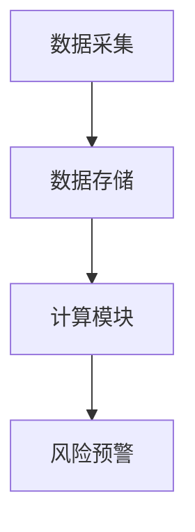

                 


# 投资组合跟踪误差：如何衡量并控制偏离基准的风险

> 关键词：投资组合，跟踪误差，基准风险，风险控制，投资组合优化

> 摘要：本文将详细探讨投资组合跟踪误差的定义、计算方法及其在风险控制中的应用。通过理论分析和实际案例，我们揭示了如何有效衡量和控制投资组合偏离基准的风险，从而优化投资组合的表现。

---

# 第一部分: 投资组合跟踪误差的背景与概念

## 第1章: 投资组合跟踪误差的定义与背景

### 1.1 跟踪误差的定义与核心概念

#### 1.1.1 投资组合跟踪误差的定义
跟踪误差（Tracking Error）是指投资组合的实际收益与基准指数收益之间的差异。它是衡量投资组合偏离其设定目标的程度的重要指标。简单来说，跟踪误差越小，投资组合越接近其基准的表现。

**数学公式：**
跟踪误差的计算公式为：
$$
\text{跟踪误差} = \sigma^2(\mathbf{p} - \mathbf{b})
$$
其中，$\mathbf{p}$ 是投资组合的收益向量，$\mathbf{b}$ 是基准指数的收益向量，$\sigma^2$ 表示方差。

#### 1.1.2 跟踪误差的核心概念与属性
- **可测量性**：跟踪误差可以通过数学公式计算，具有明确的数值表现。
- **风险性**：较大的跟踪误差意味着投资组合偏离基准的风险较高。
- **可控性**：通过调整投资组合的构成或优化策略，可以有效控制跟踪误差。

#### 1.1.3 跟踪误差与投资组合管理的关系
跟踪误差是投资组合管理中的关键指标。它帮助投资经理评估投资组合的表现是否符合预期，并及时调整投资策略以降低风险。

### 1.2 跟踪误差的计算方法

#### 1.2.1 投资组合与基准的收益差异
- 计算投资组合和基准的收益率序列。
- 计算两者的收益差异序列。

#### 1.2.2 跟踪误差的数学公式
$$
\text{跟踪误差} = \sqrt{\frac{1}{N-1} \sum_{i=1}^{N} (r_{p,i} - r_{b,i})^2}
$$
其中，$N$ 是观察的样本数量，$r_{p,i}$ 是投资组合的第 $i$ 期收益，$r_{b,i}$ 是基准的第 $i$ 期收益。

#### 1.2.3 计算跟踪误差的步骤与注意事项
1. 确定投资组合和基准的收益数据。
2. 计算每期的收益差异。
3. 计算收益差异的平均值。
4. 计算收益差异的方差。
5. 开平方得到跟踪误差。

**注意事项：**
- 数据样本应具有代表性。
- 需要考虑时间窗口的选择。

### 1.3 跟踪误差的衡量与投资组合风险

#### 1.3.1 跟踪误差与投资组合风险的关系
跟踪误差是投资组合风险的重要组成部分。较小的跟踪误差意味着投资组合的风险较低，更接近其基准的表现。

#### 1.3.2 跟踪误差在风险控制中的作用
- 通过跟踪误差，投资经理可以评估投资组合的稳定性。
- 跟踪误差是优化投资组合的重要指标。

#### 1.3.3 跟踪误差的局限性与应用场景
- **局限性**：跟踪误差仅衡量收益的偏离，不考虑其他风险因素。
- **应用场景**：适用于被动投资策略，如指数基金。

---

## 第2章: 跟踪误差的核心概念与联系

### 2.1 跟踪误差的原理与属性

#### 2.1.1 跟踪误差的原理
跟踪误差的计算基于投资组合与基准之间的收益差异。通过分析这些差异，我们可以评估投资组合的表现是否稳定。

#### 2.1.2 跟踪误差的属性特征对比表
| 属性       | 跟踪误差               | 波动率                  | 夏普比率         |
|------------|------------------------|------------------------|-----------------|
| 定义       | 收益差异的标准差       | 收益的波动程度         | 风险调整后的收益 |
| 计算公式   | $\sigma(r_p - r_b)$    | $\sigma(r_p)$          | $(\mu_p - r_f)/\sigma_p$ |
| 应用场景   | 评估偏离风险           | 评估资产稳定性         | 评估风险调整收益 |

### 2.2 跟踪误差与相关概念的关系

#### 2.2.1 跟踪误差与投资组合波动率
- 跟踪误差衡量的是偏离基准的波动，而波动率衡量的是资产本身的波动。

#### 2.2.2 跟踪误差与夏普比率
- 夏普比率衡量的是单位风险下的超额收益，而跟踪误差衡量的是偏离基准的风险。

#### 2.2.3 跟踪误差与最大回撤
- 最大回撤衡量的是资产的最大损失，而跟踪误差衡量的是偏离基准的波动。

---

## 第3章: 跟踪误差的算法原理

### 3.1 跟踪误差的计算公式

#### 3.1.1 数学公式推导
假设我们有 $N$ 期的投资组合收益 $\mathbf{p}$ 和基准收益 $\mathbf{b}$，则跟踪误差的计算步骤如下：
1. 计算每期的收益差异：$d_i = p_i - b_i$。
2. 计算差异的平均值：$\bar{d} = \frac{1}{N} \sum_{i=1}^{N} d_i$。
3. 计算差异的方差：$\sigma^2 = \frac{1}{N-1} \sum_{i=1}^{N} (d_i - \bar{d})^2$。
4. 跟踪误差为方差的平方根。

#### 3.1.2 代码实现示例
```python
import numpy as np

# 假设 p 和 b 是投资组合和基准的收益数组
p = np.array([0.05, 0.03, 0.04, 0.06])
b = np.array([0.04, 0.03, 0.03, 0.05])

# 计算收益差异
differences = p - b

# 计算跟踪误差
tracking_error = np.std(differences, ddof=1)
print("跟踪误差:", tracking_error)
```

### 3.2 跟踪误差的优化算法

#### 3.2.1 最小化跟踪误差的优化方法
优化目标：最小化投资组合的跟踪误差。

数学模型：
$$
\min_{\mathbf{w}} \sigma^2(\mathbf{w}^T \mathbf{p} - \mathbf{b})
$$
其中，$\mathbf{w}$ 是投资组合的权重向量，$\mathbf{p}$ 是资产的收益向量，$\mathbf{b}$ 是基准收益向量。

---

## 第4章: 跟踪误差的系统架构

### 4.1 系统架构设计

#### 4.1.1 系统功能设计
- 数据采集模块：获取投资组合和基准的收益数据。
- 计算模块：计算跟踪误差。
- 风险预警模块：根据跟踪误差触发预警。

#### 4.1.2 系统架构图


### 4.2 系统接口设计

#### 4.2.1 数据接口
- 输入：投资组合收益数据、基准收益数据。
- 输出：跟踪误差值。

#### 4.2.2 计算接口
- 输入：收益数据。
- 输出：跟踪误差。

---

## 第5章: 项目实战

### 5.1 环境安装

#### 5.1.1 安装Python库
```bash
pip install numpy pandas
```

### 5.2 核心实现

#### 5.2.1 计算跟踪误差
```python
import numpy as np

def calculate_tracking_error(p, b):
    differences = p - b
    return np.std(differences, ddof=1)
```

#### 5.2.2 应用案例
```python
p = np.array([0.05, 0.03, 0.04, 0.06])
b = np.array([0.04, 0.03, 0.03, 0.05])
print("跟踪误差:", calculate_tracking_error(p, b))
```

---

## 第6章: 最佳实践

### 6.1 小结
跟踪误差是衡量投资组合偏离基准风险的重要指标。通过优化投资组合构成和监控跟踪误差，可以有效降低风险。

### 6.2 注意事项
- 定期监控跟踪误差。
- 选择合适的基准。
- 考虑其他风险指标。

### 6.3 拓展阅读
- 《投资学》
- 《风险管理》

---

作者：AI天才研究院/AI Genius Institute & 禅与计算机程序设计艺术/Zen And The Art of Computer Programming

