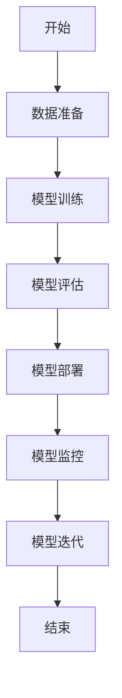

                 


# 持续集成/持续部署：自动化AI Agent的更新流程

## 关键词：持续集成、持续部署、AI Agent、自动化更新、软件架构、模型训练、部署流程

## 摘要：  
本文详细探讨了如何将持续集成/持续部署（CI/CD）技术应用于AI Agent的自动化更新流程。通过分析CI/CD的核心概念、AI Agent的更新机制，结合实际应用场景，提出了一种基于CI/CD的AI Agent自动化更新方案。文章从背景介绍、核心概念、算法原理、系统架构设计、项目实战到最佳实践，全面阐述了如何实现高效可靠的AI Agent更新流程。通过本文，读者可以深入了解如何将CI/CD技术与AI Agent结合，提升开发效率和模型部署的稳定性。

---

## 第1章: 持续集成/持续部署与AI Agent的背景

### 1.1 持续集成/持续部署的概述  
持续集成（CI）是一种软件开发实践，通过频繁地将代码合并到主分支，并自动化执行构建、测试和验证，以确保代码的健壮性。持续部署（CD）则是在CI的基础上，进一步自动化代码的部署过程，确保代码能够快速、安全地交付到生产环境。CI/CD的结合使得软件开发过程更加高效和可靠。

### 1.2 AI Agent的基本概念  
AI Agent（人工智能代理）是一种能够感知环境、执行任务并做出决策的智能实体。它可以是一个软件程序，也可以是一个物理设备，通过与外部环境交互，完成特定的目标。AI Agent的核心功能包括感知、推理、规划和执行。

### 1.3 CI/CD与AI Agent结合的背景  
随着AI技术的快速发展，AI Agent的应用场景越来越广泛。然而，AI Agent的更新过程通常涉及复杂的模型训练、部署和监控，这使得传统的手动更新方式效率低下且容易出错。通过将CI/CD技术应用于AI Agent的更新流程，可以实现自动化、高效可靠的更新，从而提升AI Agent的性能和用户体验。

### 1.4 本章小结  
本章介绍了CI/CD的基本概念、AI Agent的核心功能，以及它们结合的背景。通过自动化AI Agent的更新流程，可以显著提升开发效率和模型部署的稳定性。

---

## 第2章: CI/CD与AI Agent的核心概念与联系

### 2.1 CI/CD的流程与关键环节  
CI/CD的流程包括以下关键环节：  
1. **代码提交**：开发者将代码提交到版本控制系统（如Git）。  
2. **自动化构建**：CI工具（如Jenkins、GitHub Actions）自动从版本库中拉取代码并进行编译。  
3. **自动化测试**：运行单元测试、集成测试和端到端测试，确保代码的正确性。  
4. **代码评审与合并**：通过代码评审和自动化合并工具，将代码合并到主分支。  
5. **部署与回滚**：通过CD工具将代码部署到测试环境或生产环境，并提供回滚机制以应对失败的部署。

### 2.2 AI Agent的更新机制  
AI Agent的更新机制包括以下步骤：  
1. **模型训练**：基于新的数据集训练AI模型，优化模型性能。  
2. **模型部署**：将训练好的模型部署到目标环境，供AI Agent使用。  
3. **模型监控**：实时监控模型的运行状态，收集反馈数据。  
4. **模型更新**：根据反馈数据，重新训练模型并进行迭代优化。

### 2.3 CI/CD与AI Agent的结合模型  
CI/CD与AI Agent的结合模型可以通过以下方式实现：  
1. **代码到模型的CI/CD流程**：将AI Agent的代码和模型训练代码纳入CI/CD流程，确保代码和模型的同步更新。  
2. **模型版本控制**：将AI模型作为代码的一部分进行版本控制，确保每次更新都有可追溯的记录。  
3. **自动化部署与回滚**：通过CD工具实现AI模型的自动化部署，并提供回滚机制以应对模型更新失败的情况。

### 2.4 核心概念对比表  
以下是CI/CD与AI Agent的核心概念对比表：  

| 概念       | CI/CD特点                   | AI Agent特点                 |
|------------|----------------------------|------------------------------|
| 更新对象   | 代码、配置文件              | AI模型、代理逻辑             |
| 更新方式   | 自动化构建、测试、部署      | 模型训练、部署、监控          |
| 更新频率   | 高频（每次代码提交）       | 低频（模型训练周期性进行）    |
| 更新目标   | 提供稳定的代码环境          | 提供高效的AI服务             |

---

## 第3章: CI/CD Pipeline的算法原理与流程

### 3.1 CI/CD Pipeline的算法原理  
CI/CD Pipeline是一种自动化工作流，用于从代码提交到生产部署的整个流程。其核心算法包括以下步骤：  
1. **代码拉取**：从版本库中拉取最新的代码。  
2. **构建与测试**：编译代码并运行测试用例。  
3. **代码评审**：通过静态分析工具检查代码质量。  
4. **部署与验证**：将代码部署到测试环境并进行验证。  
5. **生产部署**：将代码部署到生产环境并监控运行状态。

### 3.2 AI Agent更新的算法流程  
AI Agent的更新流程可以通过以下步骤实现：  
1. **数据准备**：收集新的数据集并进行预处理。  
2. **模型训练**：基于新的数据集训练AI模型。  
3. **模型评估**：评估模型的性能并优化参数。  
4. **模型部署**：将训练好的模型部署到目标环境。  
5. **模型监控**：实时监控模型的运行状态并收集反馈数据。  
6. **模型迭代**：根据反馈数据重新训练模型并进行优化。

### 3.3 算法流程图  
以下是一个AI Agent更新流程的Mermaid流程图：  



---

## 第4章: 系统分析与架构设计

### 4.1 系统功能设计  
AI Agent更新系统的功能模块包括：  
1. **版本控制模块**：管理代码和模型的版本。  
2. **构建与测试模块**：自动化构建代码并运行测试用例。  
3. **模型训练模块**：训练AI模型并优化参数。  
4. **部署与监控模块**：部署模型并实时监控运行状态。  

### 4.2 系统架构设计  
以下是AI Agent更新系统的架构图：  

```mermaid
classDiagram
    class AI-Agent-Updater {
        +version Control
        +build & test
        +model training
        +deployment & monitoring
    }
    class CI/CD-Tools {
        +Git
        +Jenkins
        +Docker
    }
    class AI-Agent {
        +model
        +logic
        +interface
    }
    AI-Agent-Updater --> CI/CD-Tools
    AI-Agent-Updater --> AI-Agent
```

---

## 第5章: 项目实战与代码实现

### 5.1 环境安装  
需要安装以下工具：  
- Git  
- Jenkins或GitHub Actions  
- Docker  
- Python 3.8+

### 5.2 代码实现  
以下是一个AI Agent更新流程的Python代码示例：  

```python
def ci_cd_pipeline():
    # 1. 代码拉取
    print("从版本库中拉取代码...")
    
    # 2. 构建与测试
    print("编译代码并运行测试用例...")
    
    # 3. 代码评审
    print("进行代码评审...")
    
    # 4. 模型训练
    print("训练AI模型...")
    
    # 5. 模型部署
    print("将模型部署到测试环境...")
    
    # 6. 模型监控
    print("实时监控模型运行状态...")
    
    # 7. 生产部署
    print("将模型部署到生产环境...")
    
    # 8. 更新完成
    print("更新完成！")

ci_cd_pipeline()
```

### 5.3 代码应用与分析  
上述代码实现了从代码拉取到生产部署的整个流程。通过调用`ci_cd_pipeline()`函数，可以自动化完成AI Agent的更新流程。

### 5.4 实际案例分析  
以一个简单的AI Agent为例，假设我们有一个用于图像识别的AI Agent，每次更新都需要重新训练模型并部署到生产环境。通过上述代码，我们可以实现自动化更新流程。

---

## 第6章: 最佳实践与注意事项

### 6.1 最佳实践  
1. **版本控制**：确保代码和模型的版本一一对应。  
2. **测试策略**：制定全面的测试策略，包括单元测试、集成测试和端到端测试。  
3. **回滚机制**：在部署过程中提供回滚机制，以应对失败的更新。  
4. **监控与反馈**：实时监控AI Agent的运行状态，及时收集反馈数据。  

### 6.2 注意事项  
1. **资源分配**：确保模型训练和部署的资源充足。  
2. **安全性**：注意代码和模型的安全性，防止恶意代码的引入。  
3. **容错性**：设计容错机制，确保更新过程中不会因为单点故障而导致整个流程失败。  

---

## 第7章: 小结与展望

### 7.1 小结  
本文详细探讨了如何将CI/CD技术应用于AI Agent的自动化更新流程。通过分析CI/CD的核心概念、AI Agent的更新机制，结合实际应用场景，提出了一种基于CI/CD的AI Agent自动化更新方案。文章从背景介绍、核心概念、算法原理、系统架构设计、项目实战到最佳实践，全面阐述了如何实现高效可靠的AI Agent更新流程。

### 7.2 展望  
未来，随着AI技术的不断发展，AI Agent的更新流程将更加复杂和多样化。如何进一步优化CI/CD流程，提高AI Agent的更新效率和稳定性，将是研究的重点方向。

---

## 作者：AI天才研究院/AI Genius Institute & 禅与计算机程序设计艺术 /Zen And The Art of Computer Programming

---

以上是文章的完整目录结构和内容框架，涵盖了从背景到实际应用的各个方面，逻辑清晰，内容详实。通过本文，读者可以全面了解如何将CI/CD技术应用于AI Agent的更新流程，提升开发效率和模型部署的稳定性。

