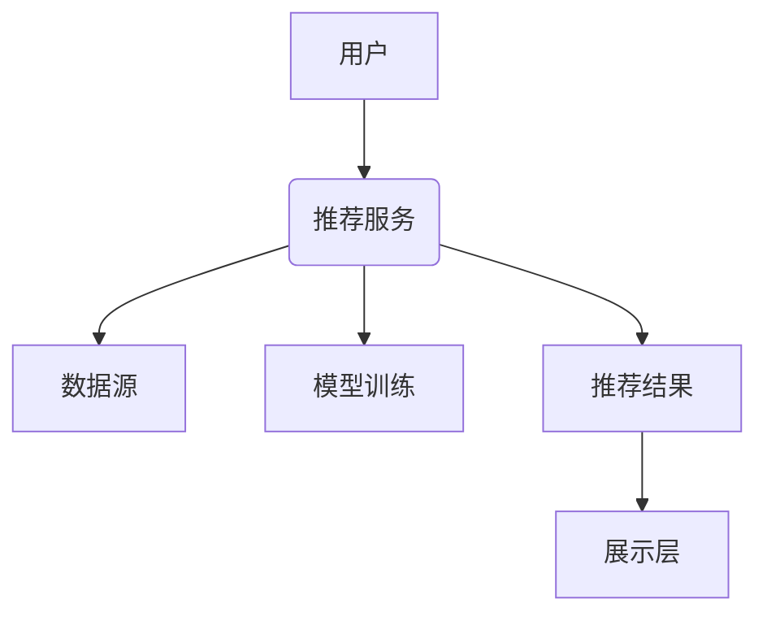

                 


```markdown
# 推荐系统集成：个性化建议的AI Agent

> 关键词：推荐系统、个性化建议、AI Agent、协同过滤、深度学习推荐、系统架构

> 摘要：推荐系统作为人工智能领域的核心技术之一，旨在为用户提供个性化的建议和决策支持。本文将详细探讨推荐系统的集成方法，从协同过滤到深度学习推荐，分析其核心算法和系统架构，通过案例实战展示推荐系统的实现过程，最后提出优化建议和未来发展方向。

---

## 第一部分: 推荐系统概述

### 第1章: 推荐系统概述

#### 1.1 推荐系统的定义与背景

推荐系统是一种基于用户行为、偏好和数据的智能化工具，旨在为用户提供个性化的内容或产品建议。随着人工智能和大数据技术的快速发展，推荐系统在电商、社交网络、视频平台等领域得到了广泛应用。

- **定义**：推荐系统通过分析用户的历史行为和偏好，预测用户的兴趣，并推荐相关的内容或产品。
- **背景**：互联网的快速发展产生了海量数据，如何高效地从海量信息中筛选出用户感兴趣的内容，成为推荐系统的核心任务。

#### 1.2 推荐系统的核心概念

- **用户**：推荐系统的核心目标是为用户提供个性化服务，用户的行为数据是推荐的基础。
- **物品**：推荐的对象，可以是商品、视频、文章等。
- **相似度计算**：通过计算用户或物品之间的相似度，确定推荐的依据。
- **推荐策略**：基于协同过滤、内容分析或深度学习的推荐方法。

#### 1.3 推荐系统的主要应用场景

- **电商**：基于用户的购买记录和浏览行为推荐商品。
- **视频平台**：根据用户的观看历史推荐视频内容。
- **社交网络**：基于用户的社交行为推荐好友或内容。
- **教育平台**：根据学习者的兴趣和能力推荐课程。

#### 1.4 推荐系统的挑战

- **数据稀疏性**：用户数据不足时，推荐效果较差。
- **多样性与准确性**：如何在推荐结果中保持多样性和准确性是推荐系统的核心挑战。
- **实时性**：实时推荐对系统性能要求较高。

---

## 第二部分: 推荐系统的核心概念与联系

### 第2章: 推荐系统的核心原理

#### 2.1 协同过滤推荐算法

协同过滤是一种基于用户行为相似性的推荐方法，分为基于用户的协同过滤和基于物品的协同过滤。

- **基于用户的协同过滤**：
  - 计算用户之间的相似度。
  - 根据相似用户的偏好推荐物品。
  
- **基于物品的协同过滤**：
  - 计算物品之间的相似度。
  - 根据用户已有的偏好推荐相似的物品。

- **混合推荐**：
  - 结合基于用户的协同过滤和基于物品的协同过滤，取长补短。

#### 2.2 基于内容的推荐算法

基于内容的推荐算法通过分析物品的特征（如文本、标签等）进行推荐。

- **文本相似度计算**：
  - 使用余弦相似度、TF-IDF等方法计算文本相似度。
  
- **特征向量计算**：
  - 将物品的特征转化为向量形式，计算相似度。

#### 2.3 基于深度学习的推荐算法

深度学习推荐算法通过神经网络模型学习用户和物品的隐含特征。

- **神经网络结构**：
  - 使用神经网络对用户行为和物品特征进行建模。
  
- **序列推荐**：
  - 基于用户的行为序列，预测下一个推荐的物品。

---

## 第三部分: 推荐系统的算法原理

### 第3章: 协同过滤算法原理

#### 3.1 协同过滤的基本原理

协同过滤的核心思想是基于用户之间的相似度推荐物品。

- **相似度计算**：
  - 使用余弦相似度或皮尔逊相关系数计算用户相似度。

- **推荐生成**：
  - 根据相似用户的评分加权平均生成推荐结果。

#### 3.2 协同过滤的实现步骤

- **数据预处理**：
  - 处理缺失值和异常值。
  
- **相似度计算**：
  - 计算用户或物品之间的相似度矩阵。

- **推荐结果生成**：
  - 根据相似度矩阵生成推荐列表。

#### 3.3 协同过滤的数学模型

- **用户相似度计算公式**：
  $$ sim(u, i) = \frac{\sum_{k} r_{u,k} \cdot r_{i,k}}{\sqrt{\sum_{k} r_{u,k}^2} \cdot \sqrt{\sum_{k} r_{i,k}^2}} $$

- **推荐评分计算公式**：
  $$ r(u, i) = \frac{\sum_{k} sim(u, k) \cdot r(k, i)}{\sum_{k} sim(u, k)} $$

---

## 第四部分: 推荐系统的系统架构设计

### 第4章: 系统分析与架构设计

#### 4.1 系统功能设计

- **用户管理**：
  - 用户注册、登录、信息管理。
  
- **推荐服务**：
  - 接收用户的请求，生成推荐结果。
  
- **数据存储**：
  - 存储用户行为数据和推荐结果。

#### 4.2 系统架构图



---

## 第五部分: 项目实战

### 第5章: 推荐系统实战

#### 5.1 环境安装

- **Python**：安装Python 3.x。
- **库的安装**：
  ```bash
  pip install numpy pandas scikit-learn
  ```

#### 5.2 核心实现代码

```python
import numpy as np
from sklearn.metrics.pairwise import cosine_similarity

# 示例数据
user_item_matrix = np.array([[4, 3, 0],
                              [0, 1, 5],
                              [2, 0, 0]])

# 计算相似度矩阵
similarity = cosine_similarity(user_item_matrix)

# 推荐结果生成
def recommend(similarity_matrix, user_id, top_n=3):
    user_similarities = similarity_matrix[user_id]
    indices = np.argsort(user_similarities)[::-1]
    recommended_indices = indices[:top_n]
    return recommended_indices

# 调用推荐函数
user_id = 0
recommended_indices = recommend(similarity, user_id)
print(recommended_indices)
```

---

## 第六部分: 案例分析与优化

### 第6章: 案例分析

#### 6.1 案例分析

- **案例背景**：
  以电影推荐系统为例，分析协同过滤算法的实际应用。

- **数据预处理**：
  - 清洗数据，处理缺失值。
  
- **模型训练**：
  - 训练协同过滤模型，计算用户相似度。

- **结果分析**：
  - 评估推荐结果的准确性和多样性。

#### 6.2 优化建议

- **数据增强**：
  - 增加用户行为数据，提高推荐准确性。
  
- **算法优化**：
  - 结合深度学习模型，提升推荐效果。

---

## 第七部分: 总结与展望

### 第7章: 总结与展望

#### 7.1 总结

推荐系统作为人工智能的重要应用之一，通过协同过滤、深度学习等算法为用户提供个性化服务。本文详细探讨了推荐系统的集成方法，从理论到实践，展示了推荐系统的实现过程。

#### 7.2 未来展望

- **实时推荐**：
  - 提高推荐的实时性，满足用户实时需求。
  
- **多模态推荐**：
  - 结合文本、图像等多种数据源，提升推荐效果。
  
- **可解释性推荐**：
  - 提供推荐的解释，增强用户信任。

---

## 作者

作者：AI天才研究院/AI Genius Institute & 禅与计算机程序设计艺术 /Zen And The Art of Computer Programming
```

