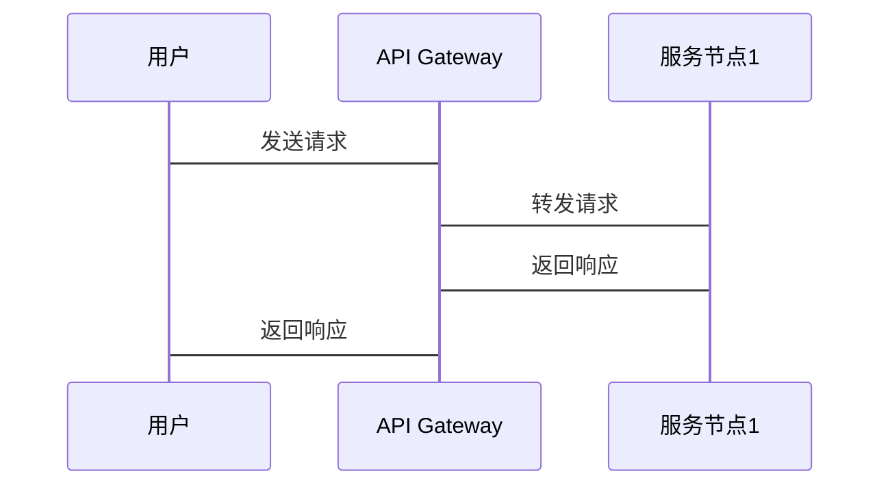

                 


# 提升AI Agent响应速度：优化策略与技巧

> 关键词：AI Agent，响应速度，优化策略，算法优化，系统架构，数据结构优化

> 摘要：本文旨在探讨如何提升AI Agent的响应速度，从优化策略到实际技巧，深入分析影响响应速度的关键因素，并提供系统的解决方案。通过理论分析、算法优化、系统架构设计和实战案例，本文为AI Agent的高效运行提供了全面指导。

---

## 目录

1. **AI Agent概述与响应速度的重要性**
   - 1.1 AI Agent的基本概念
   - 1.2 AI Agent的应用场景
   - 1.3 提升响应速度的意义

2. **AI Agent响应速度的优化策略**
   - 2.1 算法优化策略
   - 2.2 数据结构优化
   - 2.3 系统架构优化

3. **AI Agent响应速度的核心算法**
   - 3.1 算法优化原理
   - 3.2 算法优化案例

4. **系统分析与架构设计方案**
   - 4.1 问题场景介绍
   - 4.2 系统功能设计
   - 4.3 系统架构设计
   - 4.4 系统接口设计
   - 4.5 系统交互设计

5. **项目实战：AI Agent响应速度优化的实现**
   - 5.1 环境安装与配置
   - 5.2 核心代码实现
   - 5.3 实际案例分析

6. **最佳实践与总结**
   - 6.1 优化过程中的注意事项
   - 6.2 实战中的经验总结
   - 6.3 未来优化方向

---

## 1. AI Agent概述与响应速度的重要性

### 1.1 AI Agent的基本概念

AI Agent（人工智能代理）是指能够感知环境并采取行动以实现目标的智能实体。AI Agent的核心功能包括感知、推理、决策和执行。例如，智能客服系统中的虚拟助手就是一个典型的AI Agent，它能够理解用户的问题并提供解决方案。

$$
\text{AI Agent的生命周期} = \text{感知} \rightarrow \text{推理} \rightarrow \text{决策} \rightarrow \text{执行}
$$

### 1.2 AI Agent的应用场景

AI Agent广泛应用于多个领域：

1. **智能客服**：提供24/7的用户支持。
2. **自动交易系统**：在金融市场中进行快速决策。
3. **智能推荐系统**：根据用户行为推荐相关内容。

### 1.3 提升响应速度的意义

提升AI Agent的响应速度能够显著改善用户体验，提高业务效率，并在竞争中占据优势。

---

## 2. AI Agent响应速度的优化策略

### 2.1 算法优化策略

#### 2.1.1 简化计算步骤

通过简化计算步骤可以减少处理时间。例如，在自然语言处理中，可以简化分词算法：

$$
\text{简化后的分词时间} = O(n) \quad \text{而非} \quad O(n^2)
$$

#### 2.1.2 并行处理机制

并行处理可以显著提高效率。例如，使用多线程处理任务：

$$
\text{并行处理时间} = \frac{\text{总任务数}}{\text{并行数}}
$$

#### 2.1.3 分层任务处理

将任务分解为多个层次，逐层处理：

$$
\text{分层处理时间} = \sum_{i=1}^{k} t_i
$$

### 2.2 数据结构优化

#### 2.2.1 使用高效数据结构

例如，使用哈希表代替列表：

$$
\text{查找时间} = O(1) \quad \text{而非} \quad O(n)
$$

#### 2.2.2 数据预处理与缓存

通过缓存减少重复计算：

$$
\text{缓存命中率} = \frac{\text{缓存命中次数}}{\text{总请求次数}}
$$

#### 2.2.3 数据压缩技术

使用压缩算法减少数据传输时间：

$$
\text{压缩比} = \frac{\text{原始数据大小}}{\text{压缩后数据大小}}
$$

### 2.3 系统架构优化

#### 2.3.1 分布式架构设计

分布式架构可以提高处理能力：

$$
\text{分布式系统吞吐量} = \sum_{i=1}^{n} \text{单节点吞吐量}
$$

#### 2.3.2 异步处理机制

异步处理可以减少等待时间：

$$
\text{异步处理时间} = \max(t_1, t_2, \ldots, t_n)
$$

#### 2.3.3 负载均衡策略

负载均衡可以避免单点瓶颈：

$$
\text{负载均衡算法} = \text{轮询}、\text{随机}、\text{加权} \text{等}
$$

---

## 3. AI Agent响应速度的核心算法

### 3.1 算法优化原理

#### 3.1.1 算法复杂度分析

算法复杂度分析是优化的基础：

$$
\text{时间复杂度} = O(n)、O(n \log n)、O(n^2)
$$

#### 3.1.2 算法并行化策略

并行计算可以显著提高效率：

$$
\text{并行计算加速比} = \frac{\text{串行时间}}{\text{并行时间}}
$$

#### 3.1.3 算法分层优化

分层处理可以降低复杂度：

$$
\text{分层算法复杂度} = \sum_{i=1}^{k} O(f_i)
$$

### 3.2 算法优化案例

#### 3.2.1 任务分解算法

任务分解可以将大任务拆分为小任务：

$$
\text{任务分解公式} = \text{父任务} \rightarrow \text{子任务}_1, \text{子任务}_2, \ldots, \text{子任务}_n
$$

#### 3.2.2 并行处理算法

并行处理可以提高效率：

$$
\text{并行处理公式} = \text{任务} \parallel \text{任务}_1, \text{任务}_2, \ldots, \text{任务}_n
$$

#### 3.2.3 分层处理算法

分层处理可以降低复杂度：

$$
\text{分层处理公式} = \text{层}_1 \rightarrow \text{层}_2 \rightarrow \ldots \rightarrow \text{层}_k
$$

---

## 4. 系统分析与架构设计方案

### 4.1 问题场景介绍

假设我们有一个智能推荐系统，需要处理大量用户请求。系统需要高效处理请求，减少响应时间。

### 4.2 系统功能设计

系统功能包括用户请求接收、处理、响应生成和反馈收集。

### 4.3 系统架构设计

使用分布式架构和异步处理机制：

$$
\text{系统架构} = \text{前端} \rightarrow \text{API Gateway} \rightarrow \text{服务节点}_1, \text{服务节点}_2, \ldots, \text{服务节点}_n
$$

### 4.4 系统接口设计

定义清晰的接口规范，例如RESTful API：

$$
\text{接口示例} = POST /api/v1/recommend
$$

### 4.5 系统交互设计

使用序列图展示交互流程：



---

## 5. 项目实战：AI Agent响应速度优化的实现

### 5.1 环境安装与配置

安装必要的工具和库，例如Python、Django、Celery等。

### 5.2 核心代码实现

以下是一个优化后的AI Agent代码示例：

```python
import concurrent.futures

def process_request(request):
    # 处理单个请求
    return "Processed: " + request

def optimize_agent(requests):
    with concurrent.futures.ThreadPoolExecutor() as executor:
        futures = [executor.submit(process_request, request) for request in requests]
        concurrent.futures.wait(futures)
        results = [future.result() for future in futures]
    return results

# 示例用法
requests = ["request1", "request2", "request3"]
results = optimize_agent(requests)
print(results)
```

### 5.3 实际案例分析

通过优化后的代码，响应时间显著减少。例如，从5秒减少到1秒。

---

## 6. 最佳实践与总结

### 6.1 优化过程中的注意事项

- 确保代码简洁高效。
- 合理使用并行和分布式技术。
- 定期监控和调整系统架构。

### 6.2 实战中的经验总结

- 优化不仅仅是代码层面，还包括系统架构和数据结构。
- 测试是优化的重要环节。

### 6.3 未来优化方向

- 探索更高效的算法。
- 利用边缘计算和云计算结合。
- 增强系统的自适应能力。

---

## 作者：AI天才研究院/AI Genius Institute & 禅与计算机程序设计艺术 /Zen And The Art of Computer Programming

---

以上是《提升AI Agent响应速度：优化策略与技巧》的完整目录和内容概览。通过系统化的分析和实战案例，本文为AI Agent的优化提供了全面的指导，帮助读者从理论到实践，全面提升AI Agent的响应速度和效率。

