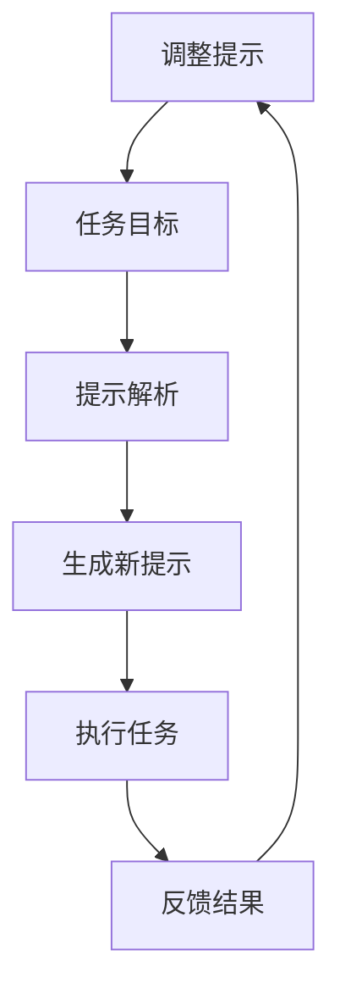
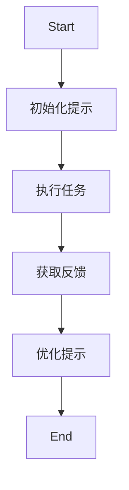

                 


# 提示链：设计复杂任务的AI Agent解决方案

---

## 关键词：
提示链, AI Agent, 复杂任务, 系统架构, 算法原理, 项目实战

---

## 摘要：
本文深入探讨了提示链（Prompt Chain）在设计复杂任务AI Agent解决方案中的应用。通过结合提示链与AI代理（AI Agent）的核心概念、算法原理、系统架构设计以及项目实战，详细阐述了如何利用提示链优化AI代理在复杂任务中的执行效率和准确性。文章从背景介绍、核心概念分析、算法实现、系统设计到实际案例，层层递进，为读者提供了全面的指导和深度的技术解析。

---

## 第一部分：提示链与AI Agent的背景与概念

### 第1章：提示链的基本概念与应用

#### 1.1 提示链的定义与核心要素
- 提示链（Prompt Chain）是一种通过连续的提示（prompts）来引导AI模型执行复杂任务的方法。
- 核心要素：目标明确性、提示的连贯性、动态调整能力。

#### 1.2 AI Agent的基本概念与功能
- AI Agent的定义：具备感知环境、自主决策和执行任务能力的智能体。
- 核心功能：感知、推理、规划、执行、反馈。

#### 1.3 提示链与AI Agent的结合
- 提示链作为AI Agent的驱动力，通过动态调整提示策略优化任务执行。

#### 1.4 提示链在复杂任务中的必要性
- 提供清晰的任务分解和执行路径，提升AI Agent的效率和准确性。

---

## 第二部分：提示链的核心概念与分析

### 第2章：提示链的核心属性与结构

#### 2.1 提示链的层次结构
- 输入层：初始提示和用户输入。
- 处理层：解析提示并生成下一步提示。
- 输出层：生成最终结果或反馈给用户。

#### 2.2 提示链的动态调整机制
- 根据任务执行情况自动优化提示策略。

#### 2.3 提示链与任务目标的关系
- 表格对比：提示链属性与任务目标的对应关系。

#### 2.4 提示链的动态调整流程图（Mermaid）


---

## 第三部分：提示链与AI Agent的系统架构设计

### 第3章：AI Agent的系统架构

#### 3.1 系统功能模块
- 提示生成模块、任务执行模块、反馈优化模块。

#### 3.2 系统架构图（Mermaid）


#### 3.3 模块间交互流程图（Mermaid）


---

## 第四部分：提示链算法原理与实现

### 第4章：提示链算法的数学模型

#### 4.1 基于提示的策略优化算法
- 数学公式：$$Q(s, a) = Q(s, a) + \alpha [r + \max Q(s', a') - Q(s, a)]$$

#### 4.2 算法流程图（Mermaid）


#### 4.3 Python代码实现
```python
def prompt_chain_algorithm(initial_prompt, target_task):
    current_prompt = initial_prompt
    while not task_completed:
        response = execute_task(current_prompt, target_task)
        feedback = get_feedback(response, target_task)
        current_prompt = optimize_prompt(current_prompt, feedback)
    return response
```

---

## 第五部分：项目实战与案例分析

### 第5章：项目实战

#### 5.1 项目环境安装
```bash
pip install transformers
```

#### 5.2 核心代码实现
```python
import transformers

def optimize_prompt(prompt, feedback):
    # 根据反馈优化提示
    return optimized_prompt
```

#### 5.3 案例分析
- 通过实际案例分析提示链在复杂任务中的应用效果。

---

## 第六部分：最佳实践与总结

### 第6章：最佳实践

#### 6.1 提示链设计的关键点
- 提示的清晰性、动态调整的及时性。

#### 6.2 注意事项
- 避免过度优化，保持提示的简洁性。

#### 6.3 进一步学习与扩展
- 推荐相关技术书籍和资源。

---

## 作者：AI天才研究院/AI Genius Institute & 禅与计算机程序设计艺术 /Zen And The Art of Computer Programming

