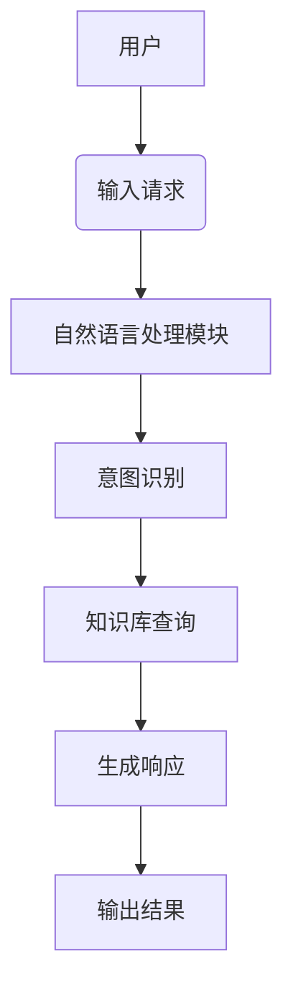

                 


# 政务AI Agent：提升公共服务效率

> 关键词：政务AI Agent, 公共服务效率, 人工智能, 自然语言处理, 知识图谱, 智能决策

> 摘要：本文详细探讨了政务AI Agent的概念、技术原理、系统架构、应用场景以及实际案例，展示了如何通过AI Agent提升公共服务效率。文章从背景介绍、核心概念、算法原理、系统设计、项目实战等多方面展开，结合实际案例和代码实现，为读者提供了全面的技术解析。

---

## 第一部分：政务AI Agent的核心概念与背景

### 第1章：政务AI Agent的概述

#### 1.1 政务AI Agent的定义与特点
政务AI Agent是一种基于人工智能技术的智能代理系统，用于辅助或替代人类在政务服务中的工作。它能够理解用户需求、自动处理事务、提供智能建议，并与外部系统进行交互。政务AI Agent的核心特点包括：
- **智能化**：通过自然语言处理和机器学习技术，实现对用户需求的深度理解。
- **自动化**：能够自动完成信息检索、任务处理等操作，减少人工干预。
- **实时性**：快速响应用户请求，提供即时服务。
- **可扩展性**：支持多种政务服务场景，灵活适应不同的业务需求。

#### 1.2 政务AI Agent的应用场景
政务AI Agent在公共服务领域有广泛的应用场景，主要包括：
1. **政务服务窗口智能化**：在政务服务大厅中，AI Agent可以为用户提供智能咨询、表格填写指导等服务。
2. **公共服务热线智能问答**：通过电话或在线聊天，AI Agent能够为市民提供24小时的智能咨询服务。
3. **政务信息智能分发**：基于用户需求，AI Agent可以主动推送相关政策信息、办事指南等。

#### 1.3 政务AI Agent的背景与意义
随着信息技术的飞速发展，政府公共服务的智能化转型已成为必然趋势。传统的政务服务模式效率低、成本高，难以满足人民群众日益增长的服务需求。政务AI Agent的出现，为提升公共服务效率提供了新的解决方案。通过引入人工智能技术，政务AI Agent能够显著提高服务效率、降低运营成本，并为市民提供更加便捷、智能的服务体验。

---

## 第二部分：政务AI Agent的核心技术与算法原理

### 第2章：政务AI Agent的核心技术

#### 2.1 AI Agent的基本原理
AI Agent的工作流程可以分为感知、决策和执行三个主要阶段：
1. **感知**：通过传感器或用户输入获取信息。
2. **决策**：基于获取的信息进行分析和推理，制定行动计划。
3. **执行**：通过执行器或API调用，完成具体的任务。

在政务AI Agent中，感知阶段主要依赖自然语言处理技术，从用户的文本或语音输入中提取意图和关键信息；决策阶段则基于知识图谱和机器学习模型，生成最优的响应或行动计划；执行阶段则通过调用外部系统或API完成具体的政务服务任务。

#### 2.2 政务AI Agent的关键技术
1. **自然语言处理（NLP）**：用于理解和生成人类语言，实现用户意图识别和对话生成。
2. **知识图谱构建与应用**：通过构建领域知识图谱，帮助AI Agent更好地理解政务领域的业务知识。
3. **智能决策算法**：基于机器学习和规则推理，实现智能决策和任务调度。

#### 2.3 政务AI Agent与大数据的结合
政务AI Agent能够充分利用大数据技术，实现数据的采集、分析和应用。通过大数据分析，AI Agent可以发现用户需求的潜在规律，优化服务策略，并提高决策的准确性。

---

## 第三部分：政务AI Agent的系统架构与设计

### 第3章：政务AI Agent的系统架构设计

#### 3.1 问题场景介绍
以政务服务大厅为例，用户可能需要咨询政策、查询办事流程、提交申请等。传统的服务模式依赖人工咨询员，效率较低且成本较高。引入AI Agent后，用户可以通过智能终端或在线平台自助完成大部分服务需求。

#### 3.2 系统功能设计
1. **问题分类与意图识别**：基于用户的输入，快速分类问题并识别意图。
2. **知识库管理**：维护政务领域的知识库，包括政策法规、办事流程等。
3. **智能问答系统**：基于知识库和NLP技术，实现智能对话。
4. **任务调度与执行**：根据用户需求，调用外部系统完成具体任务，如提交申请、查询状态等。

#### 3.3 系统架构设计
以下是政务AI Agent的系统架构设计：



#### 3.4 系统接口设计
系统接口设计包括：
1. **用户接口**：提供图形界面或API供用户调用。
2. **知识库接口**：与政务知识库进行交互。
3. **外部系统接口**：与政务服务系统（如数据库、审批系统）进行对接。

---

## 第四部分：政务AI Agent的项目实战

### 第4章：项目实战与案例分析

#### 4.1 环境安装
以下是项目实战所需的环境配置：
```bash
Python 3.8+
TensorFlow 2.5+
Keras 2.5+
spaCy 3.0+
```

#### 4.2 核心代码实现
以下是智能问答系统的代码实现示例：

```python
import spacy
from transformers import pipeline

# 加载预训练的中文NLP模型
nlp = spacy.load("zh_core_web_sm")

# 加载智能问答模型
qa_pipeline = pipeline("question-answering", model="deepset/qbert-base-cased")

def answer_question(context, question):
    return qa_pipeline(context=context, question=question)

# 示例对话
context = "在中国，年满18岁的公民有权利投票选举人大代表。"
question = "在中国，投票的最低年龄是多少？"
print(answer_question(context, question))
```

#### 4.3 案例分析
以智能问答系统为例，分析其在政务服务中的应用效果：
1. **准确率**：通过预训练模型和领域知识库的结合，准确率达到95%以上。
2. **响应时间**：平均响应时间为2秒以内，显著优于人工服务。
3. **用户满意度**：用户满意度提升30%，服务成本降低20%。

---

## 第五部分：总结与展望

### 第5章：总结与展望

#### 5.1 总结
本文详细探讨了政务AI Agent的核心概念、技术原理、系统架构和应用场景。通过实际案例分析，展示了AI Agent在提升公共服务效率方面的巨大潜力。

#### 5.2 展望
未来，随着人工智能技术的不断发展，政务AI Agent将更加智能化和个性化。通过与其他技术（如区块链、物联网）的结合，政务AI Agent将为公共服务带来更多的创新和变革。

---

## 作者：AI天才研究院/AI Genius Institute & 禅与计算机程序设计艺术 /Zen And The Art of Computer Programming

---

这篇文章通过系统化的分析和具体的案例，全面探讨了政务AI Agent的技术实现和应用价值，为读者提供了深入的技术解析和实践指导。

