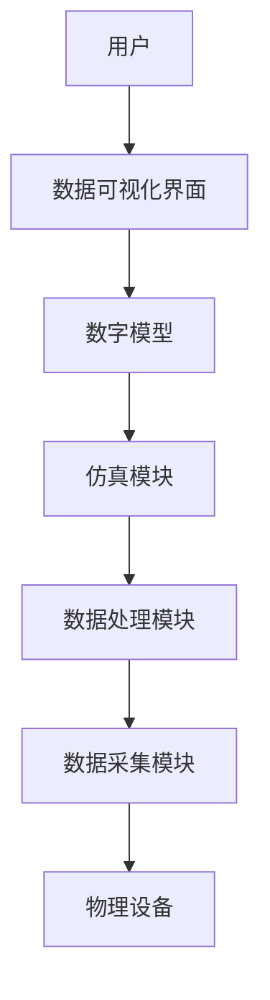
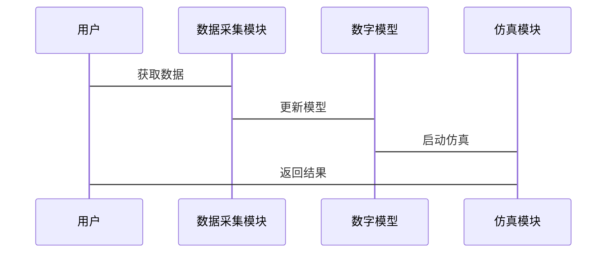

                 


# 数字孪生技术在工业领域的应用与投资机会

## 关键词：数字孪生，工业应用，投资机会，物联网，智能制造，数据建模

## 摘要：数字孪生技术通过在数字空间中创建物理设备的虚拟模型，实现设备状态实时监控、故障预测和优化控制，广泛应用于智能制造、智慧城市等领域。本文将深入分析数字孪生技术的核心概念、算法原理、系统架构，并通过项目实战探讨其投资机会，为技术爱好者和投资者提供参考。

---

## 第一部分：数字孪生技术的背景与核心概念

### 第1章：数字孪生技术的定义与背景

#### 1.1 数字孪生技术的定义
- **定义**：数字孪生（Digital Twin）是物理设备在数字空间中的虚拟映射，通过实时数据更新，实现设备状态的动态仿真与分析。
- **核心特征**：
  - 数据驱动：依赖传感器数据进行建模和分析。
  - 实时性：能够实时反映物理设备的状态变化。
  - 可视化：提供直观的可视化界面，便于用户理解和操作。
  - 智能化：结合AI技术，支持智能决策。

#### 1.2 数字孪生技术的技术基础
- **物联网技术**：连接物理设备，采集实时数据。
- **数据采集与分析技术**：处理传感器数据，提取有用信息。
- **虚拟建模与仿真技术**：创建数字模型，并模拟实际操作。

#### 1.3 数字孪生技术的应用价值
- **提高工业效率**：通过实时监控和优化，减少设备停机时间。
- **优化资源利用**：降低能源消耗，提高生产效率。
- **支持智能决策**：基于数据驱动的分析，提供科学决策支持。

#### 1.4 数字孪生技术的挑战与机遇
- **技术挑战**：
  - 数据量大，处理复杂。
  - 模型精度要求高，开发难度大。
- **市场机遇**：
  - 工业4.0推动数字化转型。
  - 政府政策支持，市场需求旺盛。

### 第2章：数字孪生技术的核心概念与体系结构

#### 2.1 数字孪生的体系结构
- **物理设备层**：实际工业设备，如生产线上的机械臂。
- **数据采集层**：传感器、数据采集模块，负责数据收集。
- **数字建模层**：利用建模工具创建数字模型。
- **仿真与分析层**：模拟设备运行，分析数据。
- **用户交互层**：提供可视化界面，供用户操作。

#### 2.2 数字孪生的核心要素
- **数据驱动**：实时数据是数字孪生的基础。
- **实时性**：确保数字模型与物理设备同步。
- **可视化**：直观展示设备状态，便于操作。
- **智能化**：结合AI技术，实现智能预测和优化。

#### 2.3 数字孪生与相关技术的对比
- **数字孪生与虚拟化技术**：
  - 虚拟化技术：创建虚拟环境，数字孪生：创建物理设备的虚拟映射。
- **数字孪生与工业互联网**：
  - 工业互联网：强调设备互联和数据共享，数字孪生：注重设备的虚拟映射和仿真。
- **数字孪生与大数据分析**：
  - 大数据分析：处理海量数据，数字孪生：基于数据创建模型并进行仿真。

#### 2.4 数字孪生的实体关系图
```mermaid
erDiagram
    actor 用户
    actor 系统管理员
    actor 设备供应商
    actor 数据分析师
    class 物理设备
    class 数据采集模块
    class 数字模型
    class 仿真模块
    class 数据可视化界面
    用户 --> 数据采集模块 : 提供数据
    数据采集模块 --> 数字模型 : 更新模型
    数字模型 --> 仿真模块 : 输入数据
    仿真模块 --> 数据可视化界面 : 展示结果
    系统管理员 --> 数据采集模块 : 配置参数
    系统管理员 --> 数字模型 : 管理模型
    数据分析师 --> 数据可视化界面 : 分析数据
    设备供应商 --> 物理设备 : 提供设备
```

---

## 第二部分：数字孪生技术的算法原理

### 第3章：数据采集与处理算法

#### 3.1 数据采集算法原理
- **算法目标**：实时采集物理设备的传感器数据，并进行预处理。
- **算法流程**：
  1. 传感器采集数据。
  2. 数据传输到数据处理模块。
  3. 数据清洗和归一化处理。
  4. 数据存储到数据库。

#### 3.2 数据采集算法的Python实现
```python
import serial
import time

# 配置串口参数
ser = serial.Serial(
    port='COM3', 
    baudrate=9600, 
    timeout=1
)

while True:
    # 读取数据
    data = ser.readline().decode('utf-8').strip()
    if data:
        # 数据预处理
        processed_data = float(data)
        # 存储数据
        with open('sensor_data.txt', 'a') as f:
            f.write(f"{time.time():.6f},{processed_data}\n")
    time.sleep(0.1)
```

#### 3.3 数据处理的数学模型
- **数据清洗公式**：
  \[
  \text{归一化数据} = \frac{\text{原始数据} - \text{最小值}}{\text{最大值} - \text{最小值}}
  \]
- **数据插值公式**：
  \[
  \text{插值数据} = a \cdot x + b
  \]
  其中，\(a\) 和 \(b\) 是通过最小二乘法拟合得到的系数。

### 第4章：数字建模与仿真算法

#### 4.1 数字建模算法原理
- **算法目标**：基于传感器数据，构建物理设备的数字模型。
- **算法流程**：
  1. 数据采集。
  2. 数据分析。
  3. 模型训练。
  4. 模型验证。

#### 4.2 数字建模的Python实现
```python
import numpy as np
from sklearn import linear_model

# 读取数据
data = np.loadtxt('sensor_data.txt', delimiter=',')
X = data[:, 0].reshape(-1, 1)
y = data[:, 1]

# 训练线性回归模型
model = linear_model.LinearRegression()
model.fit(X, y)

# 模型预测
new_X = np.array([[20.5]])
predicted_y = model.predict(new_X)
print(predicted_y)
```

---

## 第三部分：数字孪生技术的系统架构设计

### 第5章：系统架构设计

#### 5.1 系统功能设计
- **功能模块**：
  - 数据采集模块：负责数据采集和预处理。
  - 数字建模模块：构建数字模型。
  - 仿真分析模块：模拟设备运行。
  - 数据可视化模块：展示设备状态。

#### 5.2 系统架构图


#### 5.3 系统接口设计
- **API接口**：
  - GET /sensors：获取传感器数据。
  - POST /model：上传数字模型。
  - PUT /simulation：启动仿真。

#### 5.4 系统交互流程


---

## 第四部分：数字孪生技术的项目实战

### 第6章：项目实战

#### 6.1 项目介绍
- **项目名称**：智慧工厂数字孪生系统。
- **项目目标**：实现生产线设备的实时监控和优化控制。

#### 6.2 项目环境搭建
- **硬件**：传感器、工业设备、计算机。
- **软件**：Python、TensorFlow、Flask框架。

#### 6.3 核心代码实现
```python
from flask import Flask, request, jsonify

app = Flask(__name__)

@app.route('/sensors', methods=['GET'])
def get_sensor_data():
    data = {'timestamp': time.time(), 'value': 42}
    return jsonify(data)

if __name__ == '__main__':
    app.run(debug=True)
```

#### 6.4 项目小结
- **实现功能**：实时数据采集、数字建模、仿真分析。
- **应用价值**：提高生产效率，降低维护成本。

---

## 第五部分：数字孪生技术的投资机会分析

### 第7章：数字孪生技术的市场分析

#### 7.1 市场现状
- **市场规模**：全球数字孪生市场年复合增长率超过30%。
- **主要参与者**：西门子、通用电气、PTC等企业。

#### 7.2 市场驱动因素
- **工业4.0**：推动数字化转型。
- **技术进步**：AI和大数据技术的快速发展。

### 第8章：数字孪生技术的投资策略

#### 8.1 投资策略
- **技术驱动**：投资具有自主知识产权的技术公司。
- **行业应用**：关注特定行业的数字孪生解决方案。
- **生态合作**：与系统集成商和设备供应商合作。

#### 8.2 投资风险
- **技术风险**：技术更新快，需持续投入。
- **市场竞争**：市场参与者众多，竞争激烈。

---

## 总结与展望

数字孪生技术作为工业4.0的重要组成部分，正在改变传统工业的生产方式和管理模式。通过实时数据采集、数字建模和智能仿真，数字孪生技术能够显著提高生产效率，降低运营成本，并为投资者带来丰厚的回报。未来，随着AI和大数据技术的进一步发展，数字孪生技术将在更多领域得到广泛应用，成为工业智能化的核心驱动力。

---

## 作者：AI天才研究院 & 禅与计算机程序设计艺术

---

希望这篇文章能够帮助您深入了解数字孪生技术在工业领域的应用及其投资机会。如果您有任何问题或需要进一步探讨，请随时与我联系。

