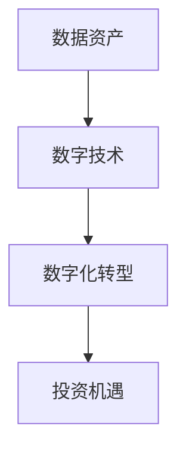
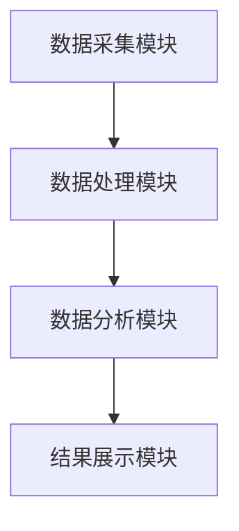

                 


# 数字经济时代的投资机遇识别

> 关键词：数字经济，投资机遇，数字技术，数据分析，投资策略

> 摘要：本文探讨了数字经济时代下投资机遇识别的核心概念、方法和策略。通过分析数字经济的特点、数据资产的价值以及数字技术的驱动作用，本文提出了基于数据分析的投资策略，并结合实际案例进行了详细阐述。

---

## 第1章 数字经济的背景与定义

### 1.1 数字经济的定义与内涵

#### 1.1.1 数字经济的核心概念
数字经济是指以数字技术为核心驱动力，以数据为关键生产要素的经济形态。其核心在于通过数字技术的广泛应用，实现资源的优化配置和效率的提升。

#### 1.1.2 数字经济与传统经济的区别
- **数据驱动 vs. 资源驱动**：数字经济依赖数据资产，而传统经济依赖自然资源。
- **技术创新 vs. 技术相对稳定**：数字经济以快速迭代的技术为基础，传统经济技术更新较慢。
- **全球化 vs. 地方化**：数字经济具有更强的全球化特征。

#### 1.1.3 数字经济的特征与发展趋势
- **数据化**：万物皆可数据化。
- **智能化**：人工智能和机器学习的应用普及。
- **网络化**：互联网和物联网的深度融合。

### 1.2 数字经济的现状与挑战

#### 1.2.1 全球数字经济的发展概况
- **发展速度**：数字经济在全球GDP中的占比逐年提升。
- **区域差异**：发达国家数字经济较为发达，发展中国家仍在追赶。

#### 1.2.2 数字经济面临的机遇与挑战
- **机遇**：技术创新带来的投资机会。
- **挑战**：数据安全、隐私保护等问题。

#### 1.2.3 数字经济对投资的影响
- **投资标的扩展**：从实体资产转向数字资产。
- **投资方式变化**：从传统金融工具转向科技股、数字货币等。

### 1.3 投资机遇识别的核心问题

#### 1.3.1 投资机遇识别的定义
投资机遇识别是指通过分析市场趋势、技术发展等因素，发现潜在的投资机会。

#### 1.3.2 数字经济时代投资机遇的特点
- **数据驱动**：投资决策基于大数据分析。
- **技术驱动**：技术创新催生新的投资机会。
- **动态变化**：市场变化快，投资机会也随之变化。

#### 1.3.3 投资机遇识别的边界与外延
- **边界**：仅限于数字经济领域。
- **外延**：涵盖数据资产、数字技术等多个方面。

### 1.4 数字经济时代投资机遇的核心要素

#### 1.4.1 数据资产的价值
数据资产是数字经济的核心资源，其价值体现在对数据的收集、存储、分析和利用上。

#### 1.4.2 数字技术的驱动作用
数字技术（如人工智能、区块链等）是数字经济发展的主要驱动力。

#### 1.4.3 数字化转型对企业的影响
数字化转型帮助企业提升效率、降低成本，并创造新的商业模式。

---

## 第2章 数字经济时代投资机遇的核心概念与联系

### 2.1 核心概念的定义与属性

#### 2.1.1 数据资产
- **定义**：数据资产是指能够为企业创造价值的数据资源。
- **属性**：可量化、可存储、可分析。

#### 2.1.2 数字技术
- **定义**：数字技术是指利用数字手段进行信息处理和传输的技术。
- **属性**：高速、高效、可扩展。

#### 2.1.3 数字化转型
- **定义**：数字化转型是指企业利用数字技术改变业务模式、流程和文化。
- **属性**：系统性、长期性、创新性。

### 2.2 核心概念的对比分析

#### 2.2.1 核心概念的属性对比表格
| 概念     | 定义                                   | 属性       |
|----------|--------------------------------------|------------|
| 数据资产 | 数据资源，为企业创造价值             | 可量化、可存储、可分析 |
| 数字技术 | 利用数字手段进行信息处理和传输技术   | 高速、高效、可扩展 |
| 数字化转型 | 利用数字技术改变企业模式             | 系统性、长期性、创新性 |

#### 2.2.2 核心概念的ER实体关系图


### 2.3 核心概念的联系与影响

#### 2.3.1 数据资产对投资的影响
数据资产是数字经济的核心资源，能够为企业创造价值。

#### 2.3.2 数字技术对企业价值的影响
数字技术的应用能够提升企业的效率和竞争力。

#### 2.3.3 数字化转型对投资机会的推动作用
数字化转型能够催生新的商业模式，为投资者提供新的机会。

---

## 第3章 数字经济时代投资机遇识别的算法原理

### 3.1 算法选择与原理

#### 3.1.1 算法选择
选择回归分析作为例子，用于分析投资机会。

#### 3.1.2 回归分析的原理
回归分析是一种统计学方法，用于分析变量之间的关系。

### 3.2 回归分析的数学模型

#### 3.2.1 线性回归模型
$$ y = \beta_0 + \beta_1 x + \epsilon $$

#### 3.2.2 最小二乘法
通过最小化残差平方和来估计回归系数。

### 3.3 回归分析的实现步骤

#### 3.3.1 数据准备
收集相关数据，进行清洗和预处理。

#### 3.3.2 模型训练
使用训练数据拟合回归模型。

#### 3.3.3 模型评估
通过R²值评估模型的拟合程度。

### 3.4 回归分析的Python实现

```python
import numpy as np
import pandas as pd
from sklearn.linear_model import LinearRegression
from sklearn.metrics import r2_score

# 数据准备
data = pd.DataFrame({
    'x': [1, 2, 3, 4, 5],
    'y': [2, 4, 5, 4, 5]
})

# 模型训练
model = LinearRegression()
model.fit(data[['x']], data['y'])

# 模型评估
y_pred = model.predict(data[['x']])
r2 = r2_score(data['y'], y_pred)
print(f'R²: {r2}')
```

### 3.5 回归分析的应用实例

#### 3.5.1 实例场景
分析某科技公司的股价与研发投入的关系。

#### 3.5.2 代码实现
```python
import numpy as np
import pandas as pd
from sklearn.linear_model import LinearRegression
from sklearn.metrics import r2_score

# 数据准备
data = pd.DataFrame({
    '研发投入': [100, 200, 150, 300, 250],
    '股价': [50, 100, 80, 150, 120]
})

# 模型训练
model = LinearRegression()
model.fit(data[['研发投入']], data['股价'])

# 模型评估
y_pred = model.predict(data[['研发投入']])
r2 = r2_score(data['股价'], y_pred)
print(f'R²: {r2}')
print(f'回归系数：{model.coef_}')
print(f'截距：{model.intercept_}')
```

#### 3.5.3 结果解读
- R²值高，说明模型拟合度好。
- 回归系数为正，说明研发投入与股价正相关。

---

## 第4章 系统分析与架构设计方案

### 4.1 问题场景介绍

#### 4.1.1 问题描述
识别数字经济时代下的投资机会，需要构建一个数据分析系统。

### 4.2 项目介绍

#### 4.2.1 项目目标
构建一个投资机会评估系统。

### 4.3 系统功能设计

#### 4.3.1 领域模型


### 4.4 系统架构设计

#### 4.4.1 系统架构


### 4.5 系统接口设计

#### 4.5.1 接口描述
- 数据采集模块接口：从数据库中读取数据。
- 数据处理模块接口：对数据进行清洗和预处理。
- 数据分析模块接口：对数据进行分析并生成报告。
- 结果展示模块接口：将分析结果以可视化形式展示。

### 4.6 系统交互设计

#### 4.6.1 交互流程
1. 用户输入数据源。
2. 数据采集模块读取数据。
3. 数据处理模块清洗数据。
4. 数据分析模块生成分析结果。
5. 结果展示模块显示结果。

---

## 第5章 项目实战：基于数据分析的投资机会识别

### 5.1 环境安装

#### 5.1.1 环境要求
- Python 3.8+
- Jupyter Notebook
- Pandas、NumPy、Scikit-learn

### 5.2 系统核心实现

#### 5.2.1 核心代码
```python
import pandas as pd
from sklearn.linear_model import LinearRegression
from sklearn.metrics import r2_score

# 数据加载
data = pd.read_csv('investment_opportunity.csv')

# 数据处理
data = data.dropna()
X = data[['研发投入', '市场增长率']]
y = data['股价']

# 模型训练
model = LinearRegression()
model.fit(X, y)

# 预测与评估
y_pred = model.predict(X)
r2 = r2_score(y, y_pred)
print(f'R²: {r2}')

# 重要性分析
importances = pd.DataFrame({
    '特征': X.columns,
    '重要性': model.coef_
})
importances = importances.sort_values(by='重要性', ascending=False)
print(importances)
```

#### 5.2.2 代码解读
- 数据加载：读取CSV文件中的数据。
- 数据处理：删除缺失值。
- 模型训练：使用线性回归模型进行训练。
- 预测与评估：计算R²值，评估模型性能。
- 重要性分析：分析各个特征对股价的影响程度。

### 5.3 实际案例分析

#### 5.3.1 案例背景
分析某科技公司的投资机会。

#### 5.3.2 数据分析
- 通过回归分析，发现研发投入和市场增长率是影响股价的主要因素。

#### 5.3.3 结果解读
- 高研发投入和高市场增长率的公司具有较高的投资价值。

### 5.4 项目小结

#### 5.4.1 项目总结
通过回归分析，识别出具有投资价值的企业。

#### 5.4.2 经验与教训
- 数据质量影响模型性能。
- 特征选择对结果至关重要。

---

## 第6章 最佳实践与未来展望

### 6.1 本章小结

#### 6.1.1 投资机遇识别的关键点
- 数据资产的价值。
- 数字技术的驱动作用。
- 数字化转型对企业的影响。

### 6.2 投资机遇识别的注意事项

#### 6.2.1 数据隐私与安全
确保数据的隐私和安全。

#### 6.2.2 技术风险
关注数字技术的风险和不确定性。

#### 6.2.3 市场变化
及时调整投资策略，应对市场变化。

### 6.3 未来展望

#### 6.3.1 人工智能的进一步应用
人工智能在投资分析中的应用将更加广泛。

#### 6.3.2 区块链技术的发展
区块链技术将推动数字资产的安全和可信度。

#### 6.3.3 数字经济的全球化
数字经济的全球化将进一步加深，跨国投资机会将增加。

### 6.4 拓展阅读

#### 6.4.1 推荐书籍
- 《数字经济：重构全球经济的新模式》
- 《数据驱动的投资决策》

#### 6.4.2 推荐博客
- [TechCrunch](https://techcrunch.com/)
- [VentureBeat](https://venturebeat.com/)

---

## 作者

作者：AI天才研究院/AI Genius Institute & 禅与计算机程序设计艺术/Zen And The Art of Computer Programming

---

通过以上结构化的内容，您可以根据需要进一步扩展和补充细节，以完成一篇完整的技术博客文章。

