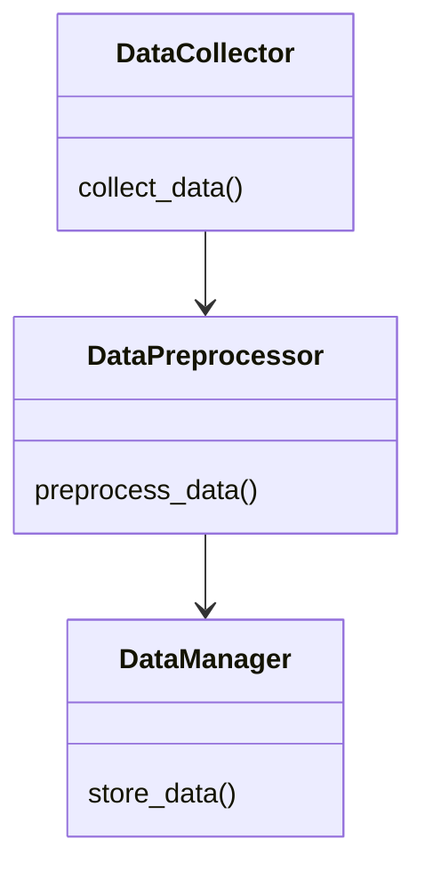
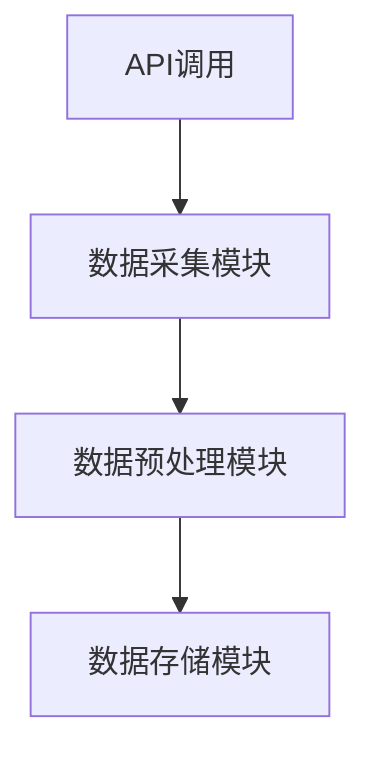

                 


# 数据收集与预处理：为AI Agent准备高质量训练集

> 关键词：数据收集，数据预处理，AI Agent，训练集，数据清洗，数据增强

> 摘要：  
在AI Agent的开发过程中，高质量的训练数据是模型性能的核心保障。本文将深入探讨数据收集与预处理的关键步骤，从背景知识到实际操作，帮助读者掌握如何为AI Agent准备高质量的训练集。我们将涵盖数据收集的方法、预处理的核心概念、清洗与增强的算法原理，以及系统设计与实战案例，最终为读者提供一份完整的数据处理指南。

---

## 第1章 数据收集与预处理概述

### 1.1 数据在AI Agent中的重要性

AI Agent的性能高度依赖于训练数据的质量。数据是模型学习的基础，直接影响模型的泛化能力和准确性。高质量的数据能够帮助模型更好地理解任务需求，从而实现更智能的决策和交互。

#### 1.1.1 数据在AI训练中的核心地位  
数据是AI模型的“燃料”。在AI Agent中，数据不仅需要涵盖多样化的场景，还需要具备高度的相关性和一致性。例如，在自然语言处理任务中，高质量的文本数据能够帮助模型更好地理解语义和上下文。

#### 1.1.2 数据质量对模型性能的影响  
数据质量直接影响模型的表现。低质量的数据可能导致模型过拟合、欠拟合，甚至无法完成基本的训练任务。例如，噪声数据可能会干扰模型的特征提取过程，导致分类错误率上升。

#### 1.1.3 数据收集与预处理的定义与目标  
数据收集是指从各种来源（如数据库、网络爬取、传感器等）获取原始数据的过程。预处理则是对这些数据进行清洗、转换和增强，以满足模型训练的需求。目标是将原始数据转化为高质量、结构化的数据集。

---

### 1.2 数据收集的基本方法

数据收集是数据处理的第一步，方法多样且各有优劣。

#### 1.2.1 数据来源的多样性  
数据来源可以是结构化的数据库、非结构化的文本文件，也可以是图像、音频等多媒体数据。例如，图像数据可以来自摄像头采集，文本数据可以来自网页爬取。

#### 1.2.2 数据采集的常见方式  
- **API接口获取**：通过调用第三方API获取实时数据（如天气数据）。
- **文件导入**：从本地文件（如CSV、JSON）中读取数据。
- **传感器数据采集**：通过物联网设备获取实时数据（如温度、湿度）。

#### 1.2.3 数据收集的挑战与解决方案  
- **数据缺失**：可以通过数据插值或删除策略解决。
- **数据冗余**：通过数据去重和特征降维处理。
- **数据污染**：通过数据清洗和异常值检测解决。

---

### 1.3 数据预处理的必要性

预处理是数据处理的核心步骤，确保数据适合模型训练。

#### 1.3.1 数据清洗的概念与作用  
数据清洗是指识别和处理数据中的噪声、冗余和不一致的过程。例如，删除重复数据、填充缺失值、去除异常值。

#### 1.3.2 数据转换与标准化的重要性  
数据转换（如归一化、标准化）可以提高模型的训练效率。例如，将不同量纲的特征缩放到相同范围。

#### 1.3.3 数据增强的原理与应用  
数据增强通过增加数据的多样性和丰富性，提高模型的鲁棒性。例如，在图像数据中，可以通过旋转、翻转等方式生成更多样本。

---

## 第2章 数据收集与预处理的核心概念

### 2.1 数据收集的原理与流程

数据收集的过程包括数据识别、获取和存储。

#### 2.1.1 数据采集的步骤与方法  
- **识别数据源**：确定数据的来源和格式。
- **获取数据**：通过API、爬虫等方式获取数据。
- **存储数据**：将数据存储到数据库或文件中。

#### 2.1.2 数据清洗的详细流程  
- **识别重复数据**：使用去重算法。
- **处理缺失值**：使用填充或删除策略。
- **处理异常值**：使用统计方法或机器学习模型检测异常值。

#### 2.1.3 数据转换与标准化的数学模型  
归一化公式：  
$$ x' = \frac{x - \mu}{\sigma} $$  
其中，$\mu$是均值，$\sigma$是标准差。

---

### 2.2 数据预处理的核心要素

#### 2.2.1 数据清洗的关键点  
- **去重**：通过哈希或唯一标识符去重。
- **填充缺失值**：使用均值、中位数或插值方法。
- **去除异常值**：使用Z-score或IQR方法。

#### 2.2.2 数据增强的技术与应用  
- **图像增强**：旋转、翻转、裁剪等操作。
- **文本增强**：同义词替换、句式变换。

#### 2.2.3 数据标注的流程与方法  
- **标注工具**：使用Label Studio等工具进行标注。
- **标注规范**：制定统一的标注标准。

---

## 第3章 数据预处理的算法原理

### 3.1 数据清洗算法原理

#### 3.1.1 数据去重的实现方法  
- 使用Python的pandas库：  
```python
import pandas as pd
data.drop_duplicates(inplace=True)
```

#### 3.1.2 数据填充的策略与算法  
- 使用均值填充缺失值：  
```python
from sklearn.impute import SimpleImputer
imputer = SimpleImputer(strategy='mean')
imputed_data = imputer.fit_transform(data)
```

#### 3.1.3 数据标准化的数学公式  
标准化公式：  
$$ x' = \frac{x - \mu}{\sigma} $$

---

### 3.2 数据增强的算法原理

#### 3.2.1 图像数据增强的实现  
- 使用Keras的ImageDataGenerator进行数据增强：  
```python
from tensorflow.keras.preprocessing.image import ImageDataGenerator
datagen = ImageDataGenerator(rotation_range=40, horizontal_flip=True)
```

---

## 第4章 系统分析与架构设计

### 4.1 系统功能设计

#### 4.1.1 领域模型  


#### 4.1.2 系统架构设计  


---

## 第5章 项目实战

### 5.1 环境安装

安装必要的库：  
```bash
pip install pandas numpy scikit-learn tensorflow
```

---

### 5.2 核心实现代码

数据清洗代码示例：  
```python
import pandas as pd
import numpy as np

# 创建示例数据
data = pd.DataFrame({
    'id': [1, 2, 3, 4, 5],
    'value': [np.nan, 2, 3, 4, 5]
})

# 去除重复值
data.drop_duplicates(inplace=True)

# 填充缺失值
data['value'].fillna(data['value'].mean(), inplace=True)
```

---

## 第6章 最佳实践与总结

### 6.1 最佳实践

- **数据安全**：确保数据处理过程中的隐私保护。
- **数据版本控制**：记录数据处理的每一步，便于回溯。

### 6.2 小结

数据收集与预处理是AI Agent开发的关键步骤。通过系统的数据处理流程，可以显著提高模型的性能和鲁棒性。

---

## 作者

作者：AI天才研究院/AI Genius Institute & 禅与计算机程序设计艺术 /Zen And The Art of Computer Programming

