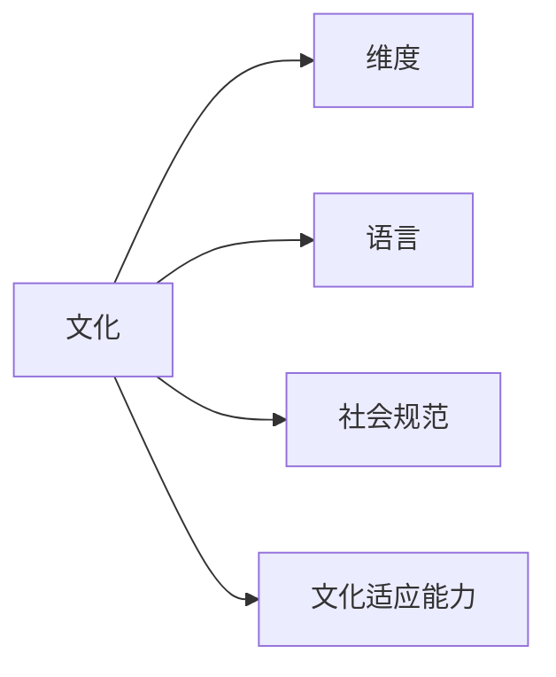
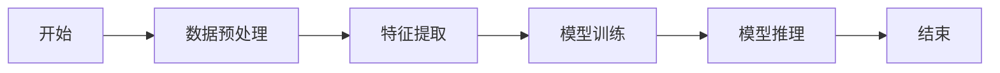
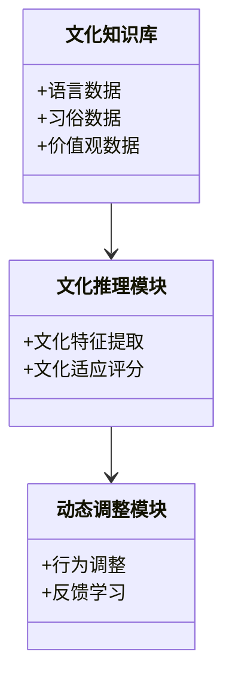
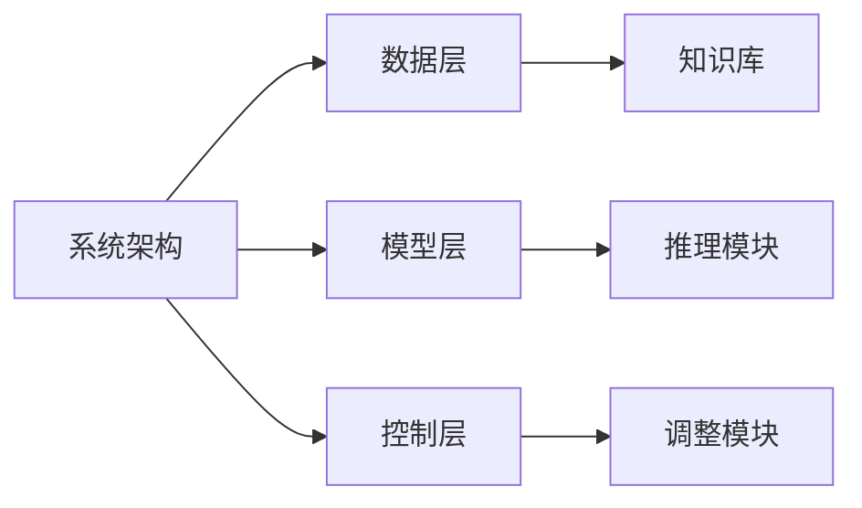
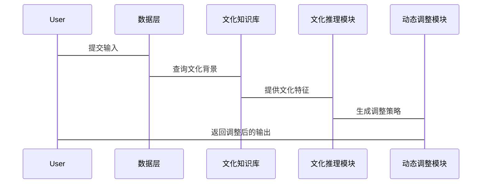

                 


# 文化适应：让AI Agent理解不同文化背景

> 关键词：文化适应，AI Agent，跨文化交际，文化维度理论，迁移学习，对比学习

> 摘要：本文将深入探讨如何让AI Agent理解并适应不同文化背景的挑战。通过分析文化适应的核心概念、算法原理、系统架构以及项目实战，我们将为AI Agent在跨文化场景中的应用提供理论支持和实践指导。

---

# 第一部分: 文化适应与AI Agent的背景介绍

## 第1章: 文化适应的核心概念

### 1.1 问题背景与定义

#### 1.1.1 什么是文化适应
文化适应是指个体或系统在不同文化背景下调整自身行为以适应环境变化的能力。对于AI Agent而言，文化适应意味着其能够理解和响应不同文化背景下的用户需求、行为模式和语境。

#### 1.1.2 AI Agent在文化适应中的作用
AI Agent作为智能化系统的核心组件，需要具备文化适应能力，以在跨文化场景中提供更精准的服务。例如，在多语言对话系统中，AI Agent需要根据用户的语言习惯和文化背景调整回复内容。

#### 1.1.3 文化适应的重要性
在全球化背景下，文化适应能力是AI Agent实现高效人机交互的关键。缺乏文化适应能力的AI系统往往难以满足不同文化用户的多样化需求，导致用户体验下降甚至误解。

---

### 1.2 问题描述与外延

#### 1.2.1 不同文化背景的差异性
不同文化背景在语言、习俗、价值观等方面存在显著差异。例如，西方文化倾向于直接表达，而东方文化更注重含蓄和间接沟通。

#### 1.2.2 AI Agent在跨文化场景中的挑战
AI Agent需要处理多种文化背景下的数据，理解文化差异，并在交互过程中动态调整行为策略。

#### 1.2.3 文化适应的边界与范围
文化适应的边界包括语言、习俗、价值观等多个维度，而其范围则涵盖从个体行为到系统架构的各个方面。

---

### 1.3 问题解决与核心要素

#### 1.3.1 文化适应的目标与方法
文化适应的目标是使AI Agent能够在不同文化背景下实现高效、准确的交互。方法包括数据收集、模型训练和行为调整等。

#### 1.3.2 AI Agent文化适应的核心要素
文化适应的核心要素包括文化知识库、文化推理算法和动态调整机制。

#### 1.3.3 文化适应的实现路径
实现文化适应的路径包括数据驱动、规则驱动和混合驱动三种方式。

---

## 第2章: 文化适应的核心概念与联系

### 2.1 文化适应的理论基础

#### 2.1.1 文化维度理论
文化维度理论是理解文化差异的重要工具。例如，霍夫斯泰德的文化维度理论包括个体主义与集体主义、权力距离等维度。

#### 2.1.2 跨文化交际理论
跨文化交际理论强调在不同文化背景下有效沟通的策略和技巧。

#### 2.1.3 文化适应的模型
文化适应模型通常包括感知、认知、行为调整等阶段。

---

### 2.2 核心概念的属性特征对比

#### 2.2.1 文化维度对比表
| 文化维度 | 西方文化 | 东方文化 |
|----------|----------|----------|
| 个体主义 | 强调个人 | 强调集体 |

#### 2.2.2 不同文化背景下的语言特征
例如，英语中的直接表达与日语中的间接表达。

#### 2.2.3 文化适应能力的评估指标
评估指标包括文化敏感性、文化知识储备和文化推理能力。

---

### 2.3 ER实体关系图架构



---

## 第3章: AI Agent文化适应的算法原理

### 3.1 文化适应的迁移学习算法

#### 3.1.1 迁移学习的基本原理
迁移学习是一种通过将已有的知识迁移到新任务中的学习方法。

#### 3.1.2 文化适应的迁移学习框架
在文化适应中，迁移学习用于将一种文化背景下的知识迁移到另一种文化背景。

#### 3.1.3 迁移学习的实现步骤
1. 数据预处理：收集不同文化背景的数据。
2. 特征提取：提取文化相关的特征。
3. 迁移学习：将知识迁移到新任务。

---

### 3.2 对比学习算法

#### 3.2.1 对比学习的基本概念
对比学习通过比较不同样本的相似性来学习特征表示。

#### 3.2.2 文化适应的对比学习方法
在文化适应中，对比学习用于区分不同文化背景下的特征。

#### 3.2.3 对比学习的优缺点
优点：能够有效提取文化差异特征。缺点：需要大量标注数据。

---

### 3.3 算法流程



---

## 第4章: 数学模型与公式

### 4.1 文化适应评分模型

#### 4.1.1 模型公式
$$ S = \sum_{i=1}^{n} w_i \cdot f_i $$

其中，$S$ 是文化适应评分，$w_i$ 是特征权重，$f_i$ 是特征值。

#### 4.1.2 公式推导
通过分析文化特征的重要性，确定各特征的权重，并对特征值进行加权求和。

#### 4.1.3 示例
假设权重为 $w_1=0.5$，$w_2=0.3$，特征值为 $f_1=0.8$，$f_2=0.6$，则评分 $S = 0.5 \times 0.8 + 0.3 \times 0.6 = 0.4 + 0.18 = 0.58$。

---

## 第5章: 系统架构与实现

### 5.1 系统架构设计

#### 5.1.1 问题场景介绍
设计一个跨文化对话系统，支持多语言和文化适应。

#### 5.1.2 系统功能设计
- 文化知识库构建
- 文化推理模块
- 动态调整模块

#### 5.1.3 领域模型（Mermaid类图）



---

### 5.2 系统架构设计

#### 5.2.1 系统架构图（Mermaid架构图）



---

### 5.3 系统接口与交互

#### 5.3.1 系统接口设计
- 数据接口：接收用户输入和文化背景信息。
- 模型接口：提供文化适应评分和行为调整建议。

#### 5.3.2 系统交互流程（Mermaid序列图）



---

## 第6章: 项目实战与案例分析

### 6.1 项目环境与配置

#### 6.1.1 开发工具
- Python 3.8+
- TensorFlow 2.0+
- Jupyter Notebook

#### 6.1.2 数据集
- 多语言对话数据集
- 文化特征标签数据集

---

### 6.2 核心代码实现

#### 6.2.1 文化适应评分模型

```python
def cultural_adaptation_score(features, weights):
    return sum(w * f for w, f in zip(weights, features))

# 示例
features = [0.8, 0.6]
weights = [0.5, 0.3]
score = cultural_adaptation_score(features, weights)
print(score)  # 输出: 0.58
```

#### 6.2.2 文化推理模块

```python
class CulturalInference:
    def __init__(self, knowledge_base):
        self.knowledge_base = knowledge_base

    def infer_culture(self, input_data):
        # 实现文化推理逻辑
        pass
```

---

### 6.3 案例分析与解读

#### 6.3.1 案例背景
设计一个跨文化对话系统，支持中英文两种语言。

#### 6.3.2 案例分析
在中文语境下，用户倾向于间接表达，AI Agent需要调整回复策略以适应这种文化特征。

#### 6.3.3 案例总结
通过文化适应评分模型和动态调整模块，系统能够有效提升跨文化对话的准确性和用户体验。

---

## 第7章: 最佳实践与总结

### 7.1 小结

文化适应是AI Agent实现跨文化交互的关键能力。通过理论分析、算法设计和系统实现，我们能够显著提升AI Agent在不同文化背景下的适应能力。

---

### 7.2 注意事项

- 数据质量：确保文化数据的多样性和准确性。
- 算法选择：根据具体场景选择合适的文化适应算法。
- 模型优化：定期更新文化知识库和调整模型参数。

---

### 7.3 拓展阅读

- 霍夫斯泰德文化维度理论
- 迁移学习与对比学习的经典论文
- 跨文化交际学的研究现状

---

## 作者

作者：AI天才研究院/AI Genius Institute & 禅与计算机程序设计艺术 /Zen And The Art of Computer Programming

