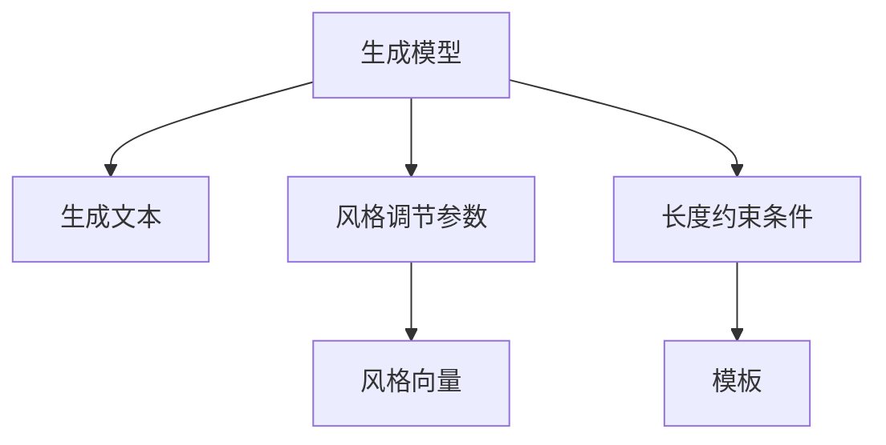
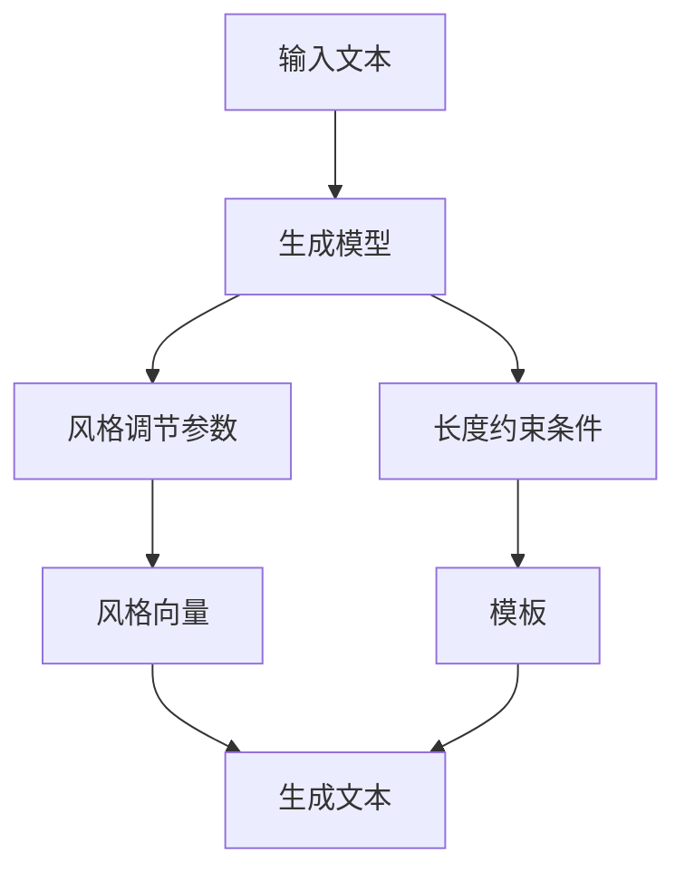
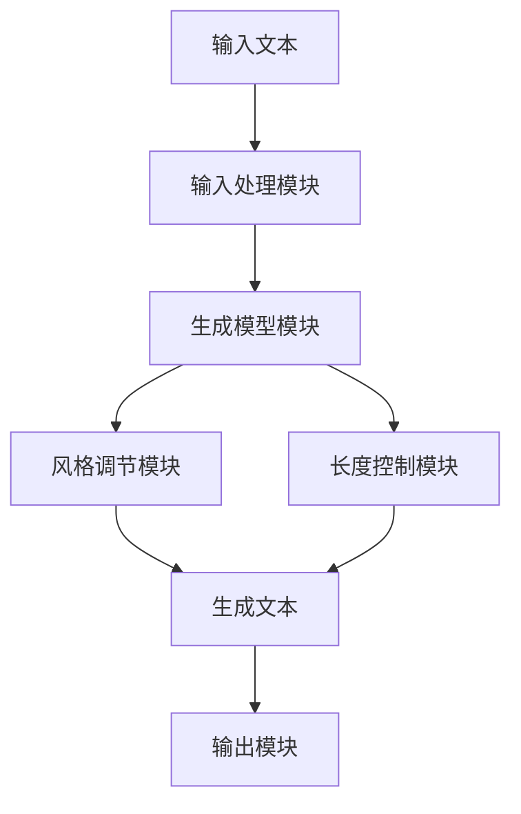

                 


# 文本生成控制：调节AI Agent的输出风格和长度

---

## 关键词：
文本生成控制，AI Agent，输出风格，文本长度，自然语言处理，生成模型，风格调节，长度控制，系统架构

---

## 摘要：
本文深入探讨了如何调节AI Agent生成文本的风格和长度，分析了文本生成控制的核心概念、算法原理、系统架构及实际应用。通过背景介绍、核心概念对比、算法流程图、数学模型公式、系统架构设计、项目实战案例等多维度内容，帮助读者全面理解并掌握文本生成控制的技术与方法。

---

## 第1章：引言

文本生成控制是自然语言处理领域的重要研究方向之一，旨在通过调节AI Agent生成文本的风格和长度，满足不同场景下的多样化需求。随着AI技术的不断发展，文本生成的应用场景越来越广泛，例如智能客服、内容创作、自动化报告生成等。然而，生成文本的质量和适用性往往受到风格和长度的限制，如何有效控制这些因素成为亟待解决的问题。

本文将从背景介绍、核心概念、算法原理、系统架构、项目实战等多个维度，全面解析文本生成控制的技术与方法，帮助读者从理论到实践，系统性地掌握这一领域的核心知识。

---

## 第2章：文本生成控制的背景介绍

### 2.1 问题背景

随着自然语言处理技术的快速发展，AI Agent在文本生成领域的应用日益广泛。然而，生成文本的质量和适用性往往受到以下问题的限制：

1. **风格单一**：生成的文本缺乏多样性，无法满足不同场景下的风格需求。
2. **长度失控**：生成文本的长度难以精确控制，导致信息冗余或关键信息缺失。

### 2.2 问题描述

文本生成控制的核心目标是通过调节生成文本的风格和长度，使其更符合用户需求。具体包括以下两个方面：

1. **风格调节**：通过调整生成文本的语言风格（如正式、口语、简洁、详细等），使其更贴近目标场景。
2. **长度控制**：通过参数调节或模板约束，生成符合预期长度的文本。

### 2.3 问题解决思路

文本生成控制的实现思路可以分为以下几个步骤：

1. **需求分析**：明确用户对文本风格和长度的具体需求。
2. **模型选择**：选择适合的生成模型（如GPT、BERT等）并进行微调。
3. **参数调节**：通过模型参数或外部约束实现风格和长度的控制。
4. **结果优化**：对生成文本进行后处理，进一步优化其风格和长度。

### 2.4 核心概念组成

文本生成控制的核心概念包括以下几个方面：

1. **AI Agent生成模型**：基于预训练语言模型的生成器，能够根据输入生成自然语言文本。
2. **文本生成控制的调节机制**：通过参数或模板约束生成文本的风格和长度。

---

## 第3章：文本生成控制的核心概念与联系

### 3.1 核心概念原理

文本生成控制的核心原理是通过对生成模型的参数调节或外部约束，实现对生成文本风格和长度的控制。具体包括以下两种方式：

1. **基于参数的风格调节**：通过调整生成模型的参数或引入风格向量，实现对生成文本风格的控制。
2. **基于模板的长度控制**：通过引入模板或约束条件，限制生成文本的长度。

### 3.2 核心概念对比表

表3-1：风格调节与长度调节的对比

| 对比维度 | 风格调节 | 长度调节 |
|----------|----------|----------|
| 调节方式 | 参数或风格向量 | 模板或约束条件 |
| 调节目标 | 文本风格（如正式、口语） | 文本长度（如100字、500字） |
| 实现难度 | 较高，需模型微调 | 较低，可通过后处理实现 |
| 适用场景 | 内容创作、智能客服 | 简洁报告、短信通知 |

### 3.3 ER实体关系图

图3-1：文本生成控制的实体关系图（Mermaid格式）



---

## 第4章：文本生成控制的算法原理

### 4.1 算法概述

文本生成控制的实现通常基于预训练语言模型（如GPT、BERT等），并通过以下步骤实现风格和长度的调节：

1. **预训练模型**：使用大规模文本数据对生成模型进行预训练。
2. **微调模型**：根据具体任务需求，对模型进行微调，使其适应特定的生成风格。
3. **参数调节**：通过调整模型参数或引入风格向量，实现对生成文本风格的控制。
4. **长度约束**：通过引入模板或约束条件，生成符合预期长度的文本。

### 4.2 算法流程图

图4-1：文本生成控制的算法流程图（Mermaid格式）



### 4.3 数学模型

文本生成控制的数学模型通常基于生成模型的条件概率公式：

$$ P(y|x) = \frac{P(x,y)}{P(x)} $$

其中，$x$ 表示输入文本，$y$ 表示生成的文本，$P(y|x)$ 表示在输入$x$条件下生成文本$y$的概率。

通过引入风格向量$s$和长度约束$l$，可以进一步优化生成模型的条件概率：

$$ P(y|x, s, l) = \frac{P(x,y, s, l)}{P(x)} $$

---

## 第5章：文本生成控制的系统架构设计

### 5.1 系统功能设计

文本生成控制的系统功能设计包括以下几个模块：

1. **输入处理模块**：接收用户的输入文本和生成需求。
2. **生成模型模块**：基于预训练语言模型生成候选文本。
3. **风格调节模块**：根据需求调整生成文本的风格。
4. **长度控制模块**：根据需求生成符合预期长度的文本。
5. **输出模块**：将生成的文本返回给用户。

### 5.2 系统架构图

图5-1：文本生成控制的系统架构图（Mermaid格式）



---

## 第6章：项目实战

### 6.1 环境安装

为了实现文本生成控制，需要安装以下环境：

1. Python 3.8+
2. PyTorch或TensorFlow
3. Hugging Face的Transformers库

安装命令：

```bash
pip install torch transformers
```

### 6.2 系统核心实现

以下是基于GPT-2模型实现文本生成控制的代码示例：

```python
from transformers import AutoModelForCausalLM, AutoTokenizer
import torch

# 加载预训练模型
model_name = "gpt2"
model = AutoModelForCausalLM.from_pretrained(model_name)
tokenizer = AutoTokenizer.from_pretrained(model_name)

# 定义风格调节参数
def generate_with_style_control(prompt, style_vector):
    inputs = tokenizer.encode(prompt, return_tensors="pt")
    outputs = model.generate(
        inputs,
        max_length=50,
        temperature=0.7,
        style_vector=style_vector
    )
    return tokenizer.decode(outputs[0], skip_special_tokens=True)

# 定义长度约束
def generate_with_length_control(prompt, length):
    inputs = tokenizer.encode(prompt, return_tensors="pt")
    outputs = model.generate(
        inputs,
        max_length=length,
        do_sample=True,
        temperature=0.7
    )
    return tokenizer.decode(outputs[0], skip_special_tokens=True)
```

### 6.3 代码应用解读

上述代码示例展示了如何通过风格向量和长度约束实现文本生成控制。具体包括以下步骤：

1. **加载预训练模型**：使用Hugging Face的Transformers库加载预训练的GPT-2模型。
2. **风格调节**：通过引入风格向量，实现对生成文本风格的控制。
3. **长度控制**：通过设置最大长度参数，生成符合预期长度的文本。

### 6.4 实际案例分析

假设用户希望生成一段长度为100字的简洁新闻稿，可以使用以下代码：

```python
prompt = "The latest AI breakthrough has been achieved in natural language processing."
result = generate_with_length_control(prompt, length=100)
print(result)
```

输出结果可能为：

"The latest AI breakthrough has been achieved in natural language processing. Researchers have developed a new model that significantly improves text generation capabilities."

---

## 第7章：最佳实践

### 7.1 小结

文本生成控制是实现AI Agent智能化的重要技术之一。通过调节生成文本的风格和长度，可以更好地满足不同场景下的需求。本文从背景介绍、核心概念、算法原理、系统架构到项目实战，全面解析了文本生成控制的技术与方法。

### 7.2 注意事项

1. **模型选择**：选择适合的生成模型是实现文本生成控制的关键。
2. **参数调节**：参数调节需要根据具体任务需求进行多次实验。
3. **系统优化**：系统架构设计需要考虑性能和扩展性。

### 7.3 拓展阅读

1. [Hugging Face的Transformers库](https://huggingface.co/transformers)
2. [GPT-2模型论文](https://arxiv.org/abs/1910.00359)
3. [文本生成控制的最新研究](https://arxiv.org/abs/2105.06709)

---

## 作者：AI天才研究院/AI Genius Institute & 禅与计算机程序设计艺术 /Zen And The Art of Computer Programming

---

通过本文的详细解读，读者可以系统性地掌握文本生成控制的核心技术与实现方法，并在实际应用中灵活运用这些知识，进一步提升AI Agent的智能化水平。

