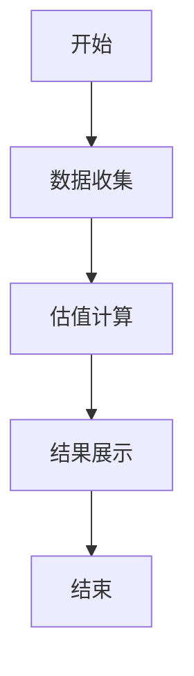

                 


# 新兴市场 vs 发达市场：股市估值比较

## 关键词：新兴市场，发达市场，股市估值，市盈率，市净率，市场比较

## 摘要：本文深入分析新兴市场与发达市场在股市估值方面的差异，探讨影响估值的主要因素，并通过具体案例和数学模型进行详细解读，帮助读者更好地理解两者的异同及投资策略。

---

## 第一章：背景介绍

### 1.1 新兴市场与发达市场的定义

#### 1.1.1 新兴市场的定义
新兴市场是指那些经济快速增长、工业化程度较高、但尚未达到发达经济体水平的国家。这些市场通常具有较高的增长潜力，但同时也伴随着较高的风险。

#### 1.1.2 发达市场的定义
发达市场是指经济高度发达、工业化成熟、市场体系完善、法治健全的国家。这些市场通常具有稳定的政治环境和成熟的资本市场。

### 1.2 市场特点对比

| 特性          | 新兴市场             | 发达市场             |
|---------------|----------------------|----------------------|
| 经济增长率     | 高                  | 低或稳定            |
| 市场规模       | 较小                | 较大                |
| 投资者结构     | 以散户为主          | 以机构投资者为主     |

---

## 第二章：核心概念与联系

### 2.1 市场估值的核心概念

#### 2.1.1 市盈率（PE）的定义与计算
市盈率是衡量股票估值的重要指标，计算公式为：
$$ PE = \frac{\text{股价}}{\text{每股收益}} $$

#### 2.1.2 市净率（PB）的定义与计算
市净率是另一个常用的估值指标，计算公式为：
$$ PB = \frac{\text{股价}}{\text{每股净资产}} $$

### 2.2 新兴市场与发达市场估值差异的对比

#### 2.2.1 PE与PB的对比
新兴市场的PE通常较高，因为市场预期较高；而发达市场的PE相对稳定。

#### 2.2.2 估值差异的驱动因素
新兴市场的估值差异主要受增长预期和风险因素影响，而发达市场的估值差异则主要受盈利能力和稳定性影响。

---

## 第三章：算法原理讲解

### 3.1 估值方法的选择

#### 3.1.1 常用的估值方法
1. 市盈率法
2. 市净率法
3. 现金流折现法

### 3.2 数学模型

#### 3.2.1 市盈率模型
$$ PE = \frac{\text{股价}}{\text{每股收益}} $$

#### 3.2.2 市净率模型
$$ PB = \frac{\text{股价}}{\text{每股净资产}} $$

---

## 第四章：系统分析与架构设计方案

### 4.1 问题场景介绍

#### 4.1.1 问题背景
分析新兴市场和发达市场的估值差异，为投资者提供决策支持。

#### 4.1.2 系统功能设计
1. 数据收集模块
2. 估值计算模块
3. 结果展示模块

### 4.2 系统架构设计



---

## 第五章：项目实战

### 5.1 数据收集与处理

#### 5.1.1 数据来源
使用公开的金融数据API获取新兴市场和发达市场的股票数据。

#### 5.1.2 数据预处理
清洗数据，处理缺失值和异常值。

### 5.2 代码实现

```python
import pandas as pd
import numpy as np

# 假设我们已经获取了新兴市场和发达市场的PE和PB数据
em_pe = [15, 20, 25]
dm_pe = [12, 14, 16]

em_pb = [2.5, 3.0, 3.5]
dm_pb = [1.8, 2.0, 2.2]

# 计算平均值
em_pe_mean = np.mean(em_pe)
dm_pe_mean = np.mean(dm_pe)
em_pb_mean = np.mean(em_pb)
dm_pb_mean = np.mean(dm_pb)

print(f"新兴市场PE均值：{em_pe_mean}")
print(f"发达市场PE均值：{dm_pe_mean}")
print(f"新兴市场PB均值：{em_pb_mean}")
print(f"发达市场PB均值：{dm_pb_mean}")
```

### 5.3 案例分析

#### 5.3.1 新兴市场案例
分析某新兴市场的科技公司，计算其PE和PB，与发达市场同类公司对比。

#### 5.3.2 发达市场案例
分析某发达市场的金融公司，计算其PE和PB，与新兴市场同类公司对比。

---

## 第六章：结论与展望

### 6.1 研究总结
新兴市场和发达市场的估值差异显著，主要受经济增长预期和市场风险的影响。

### 6.2 未来研究方向
进一步分析行业差异对估值的影响，引入更多因素如ROE、增长率等进行综合评估。

---

## 作者：AI天才研究院/AI Genius Institute & 禅与计算机程序设计艺术 /Zen And The Art of Computer Programming

---

这篇文章通过详细分析新兴市场和发达市场的股市估值差异，结合理论、算法和实际案例，为读者提供了全面的理解和实用的工具。

