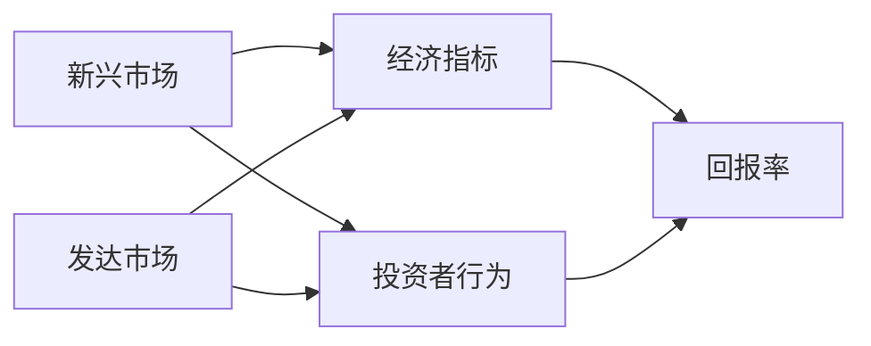
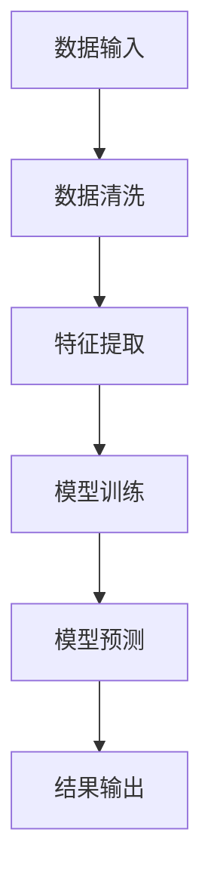
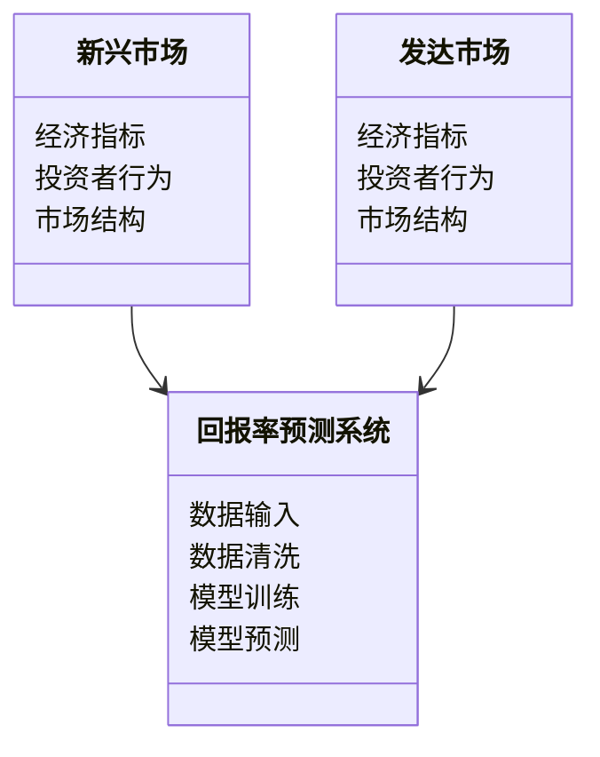

                 


# 新兴市场与发达市场未来回报率预测的差异

> 关键词：新兴市场，发达市场，回报率预测，时间序列分析，回归模型，系统架构

> 摘要：本文探讨新兴市场与发达市场在投资回报率预测上的差异，通过分析两者的经济特征、投资者行为和市场结构，结合时间序列分析和回归模型，提出预测方法，并通过实际案例验证模型的有效性。

---

## 第1章：背景介绍与核心概念

### 1.1 问题背景

#### 1.1.1 新兴市场与发达市场的概念
- 新兴市场：指经济发展迅速、但基础较为薄弱的国家，如中国、印度等。
- 发达市场：指经济高度发达、市场成熟的国家，如美国、日本等。

#### 1.1.2 为什么研究回报率差异？
- 投资者在全球范围内配置资产时，需要了解不同市场的回报潜力。
- 新兴市场与发达市场的经济结构和风险特征存在显著差异。

#### 1.1.3 回报率预测的现实意义
- 帮助投资者制定更有效的投资策略。
- 为政策制定者提供市场分析依据。

### 1.2 核心概念与问题描述

#### 1.2.1 新兴市场与发达市场的核心特征对比
- 经济增长速度：新兴市场通常快于发达市场。
- 市场流动性：发达市场流动性更高，新兴市场可能较为有限。
- 风险水平：新兴市场风险较高，波动性大。

#### 1.2.2 回报率预测的边界与外延
- 时间范围：短期 vs. 长期预测。
- 数据来源：历史数据、经济指标、市场情绪等。

#### 1.2.3 核心要素组成与概念结构图
- 经济指标、投资者行为、市场结构是主要影响因素。

---

## 第2章：核心概念的原理与对比

### 2.1 核心概念原理

#### 2.1.1 经济发展阶段对回报率的影响
- 新兴市场处于工业化阶段，投资回报率可能较高。
- 发达市场处于后工业化阶段，回报率相对稳定。

#### 2.1.2 投资者行为差异的原理
- 新兴市场投资者可能更趋同于短期投资。
- 发达市场投资者更倾向于长期投资。

#### 2.1.3 市场结构对回报率的影响
- 新兴市场可能受政策影响较大。
- 发达市场更依赖市场机制。

### 2.2 核心概念属性对比

#### 2.2.1 经济指标对比（表格）
| 指标 | 新兴市场 | 发达市场 |
|------|----------|----------|
| GDP增长率 | 高 | 低至中等 |
| 通胀率 | 较高 | 较低 |

#### 2.2.2 投资风险对比（表格）
| 风险类型 | 新兴市场 | 发达市场 |
|----------|----------|----------|
| 市场风险 | 高 | 中等 |
| 利率风险 | 中等 | 低 |

#### 2.2.3 市场流动性对比（表格）
| 流动性指标 | 新兴市场 | 发达市场 |
|------------|----------|----------|
| 交易量 | 低 | 高 |

### 2.3 ER实体关系图



---

## 第3章：时间序列分析与回归模型

### 3.1 时间序列分析

#### 3.1.1 基本原理
- 时间序列分析用于预测未来值，基于历史数据。
- 常用模型：ARIMA。

#### 3.1.2 ARIMA模型的数学公式
$$ ARIMA(p, d, q) $$

### 3.2 回归分析

#### 3.2.1 线性回归模型
$$ y = \beta_0 + \beta_1x + \epsilon $$

#### 3.2.2 案例分析：发达市场回报率预测

### 3.3 算法流程图



---

## 第4章：系统分析与架构设计方案

### 4.1 系统架构设计

#### 4.1.1 系统功能设计（领域模型）


#### 4.1.2 系统架构设计


---

## 第5章：项目实战

### 5.1 环境安装与代码实现

#### 5.1.1 安装依赖
```bash
pip install pandas numpy sklearn
```

#### 5.1.2 回归模型实现
```python
from sklearn.linear_model import LinearRegression
import pandas as pd
import numpy as np

# 示例数据
data = pd.DataFrame({
    'GDP_growth': np.random.rand(100),
    'return': np.random.rand(100)
})

model = LinearRegression()
model.fit(data[['GDP_growth']], data['return'])
print(model.coef_)
```

---

## 第6章：总结与展望

### 6.1 内容回顾
- 新兴市场与发达市场的回报率差异显著。
- 时间序列分析和回归模型是有效的预测工具。

### 6.2 未来展望
- 动态模型：考虑市场变化。
- 机器学习：引入深度学习方法。

### 6.3 最佳实践 Tips
- 数据质量至关重要。
- 模型需结合实际情况调整。

---

作者：AI天才研究院/AI Genius Institute & 禅与计算机程序设计艺术 /Zen And The Art of Computer Programming

