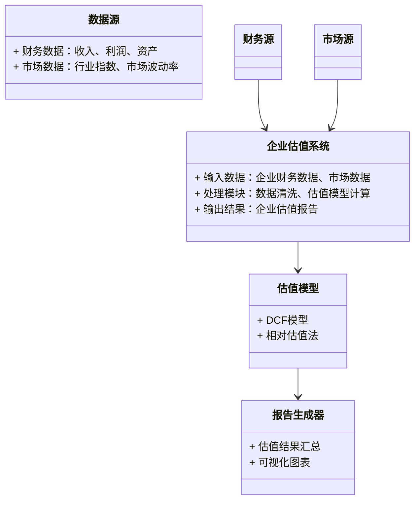

                 


# 新兴市场企业估值的特殊考虑

> **关键词**：新兴市场、企业估值、DCF模型、相对估值法、数据质量、市场波动

> **摘要**：新兴市场的经济环境和企业特点使得企业估值面临特殊挑战。本文从背景介绍、核心概念、算法原理、系统分析、项目实战到最佳实践，详细探讨新兴市场企业估值的关键问题。通过实例分析和代码实现，帮助读者掌握新兴市场企业估值的独特方法和注意事项。

---

## 第一章：新兴市场企业估值的背景与挑战

### 1.1 新兴市场的定义与特征

新兴市场是指那些经济增长迅速但尚未完全工业化的国家或地区。这些市场通常具有以下特征：

1. **经济多样性**：新兴市场涵盖不同阶段的经济发展水平，从快速发展阶段到相对稳定的阶段。
2. **市场规模**：新兴市场的市场规模通常较小，但增长潜力巨大。
3. **政策环境**：政策环境复杂多变，可能受到政府干预和监管的影响较大。
4. **行业结构**：行业集中度较低，中小企业数量较多，市场竞争激烈。

### 1.2 企业估值的基本概念

企业估值是通过对企业的财务状况、市场地位、未来盈利能力等多方面因素进行综合分析，确定其价值的过程。常见的企业估值方法包括：

1. **绝对估值法**：如现金流折现模型（DCF）。
2. **相对估值法**：如市盈率法、市净率法等。
3. **混合估值法**：结合绝对估值和相对估值的方法。

### 1.3 新兴市场企业估值的特殊性

新兴市场企业在估值时面临以下特殊挑战：

1. **数据获取难度**：新兴市场的财务数据可能不完整或不可靠，影响估值的准确性。
2. **市场波动性**：新兴市场的股市波动较大，影响估值结果的稳定性。
3. **行业差异**：新兴市场的行业结构与成熟市场存在显著差异，需要调整估值方法。
4. **政策风险**：政策变化可能对企业经营和估值产生重大影响。

---

## 第二章：企业估值的核心概念与联系

### 2.1 企业估值的关键要素

1. **资产与负债**：企业的资产和负债状况直接影响其估值。资产越多，负债越少，企业价值通常越高。
2. **收入与利润**：企业的收入和利润是衡量其盈利能力的重要指标，直接影响估值结果。
3. **市场地位与竞争优势**：企业的市场地位和竞争优势决定了其未来的增长潜力，从而影响估值。

### 2.2 估值方法的分类与对比

以下是几种常见的估值方法及其特点：

| **估值方法** | **优点** | **缺点** |
|--------------|----------|----------|
| DCF模型      | 精确性高  | 计算复杂  |
| 市盈率法      | 简单易用  | 易受市场波动影响 |
| 市净率法      | 稳定性好  | 适用于资产密集型行业 |

### 2.3 新兴市场与成熟市场的差异

| **维度**       | **新兴市场**                              | **成熟市场**                              |
|----------------|------------------------------------------|------------------------------------------|
| 数据质量       | 数据可能不完整或不透明                   | 数据通常完整且透明                       |
| 市场波动性       | 波动较大，受政策和经济因素影响           | 波动较小，市场相对稳定                   |
| 行业结构       | 行业集中度低，中小企业较多               | 行业集中度高，大企业占主导地位           |
| 政策影响       | 政策变化频繁，对企业影响较大           | 政策相对稳定，对企业影响较小           |

---

## 第三章：企业估值的算法原理与数学模型

### 3.1 现金流折现模型（DCF）

#### 3.1.1 DCF模型的原理

DCF模型的核心思想是将企业未来现金流折现，以确定其当前价值。公式如下：

$$
\text{企业价值} = \sum_{t=1}^{n} \frac{\text{现金流}_t}{(1 + r)^t} + \frac{\text{残值}}{(1 + r)^n}
$$

其中，$r$ 是折现率，$n$ 是预测期数，$\text{现金流}_t$ 是第$t$年的现金流。

#### 3.1.2 DCF模型的数学公式

现金流折现模型的关键公式包括：

1. **自由现金流公式**：
   $$
   \text{自由现金流} = \text{净利润} + \text{折旧与摊销} - \text{资本支出}
   $$

2. **加权平均资本成本（WACC）公式**：
   $$
   \text{WACC} = \left( \frac{D}{D+E} \right) \times r_d \times (1 - t) + \left( \frac{E}{D+E} \right) \times r_e
   $$

其中，$D$ 是债务，$E$ 是权益，$r_d$ 是债务成本，$r_e$ 是权益成本，$t$ 是税率。

### 3.2 相对估值法

相对估值法是通过比较同类企业的估值倍数来确定目标企业价值的方法。常用的指标包括市盈率（P/E）和市净率（P/B）。

#### 3.2.1 市盈率法

市盈率法的计算公式为：

$$
\text{目标企业价值} = \text{行业平均市盈率} \times \text{目标企业净利润}
$$

#### 3.2.2 市净率法

市净率法的计算公式为：

$$
\text{目标企业价值} = \text{行业平均市净率} \times \text{目标企业净资产}
$$

---

## 第四章：系统分析与架构设计方案

### 4.1 问题场景介绍

在新兴市场进行企业估值时，数据获取困难、市场波动大、政策风险高等问题需要系统化的解决方案。

### 4.2 系统功能设计

#### 4.2.1 领域模型（Mermaid 类图）



### 4.3 系统架构设计

#### 4.3.1 系统架构（Mermaid 架构图）

```mermaid
server
    [企业估值系统]
    ...
```

---

## 第五章：项目实战

### 5.1 环境安装

#### 5.1.1 安装Python环境

```bash
# 使用Anaconda安装Python
conda install python=3.8
```

### 5.2 系统核心实现源代码

#### 5.2.1 DCF模型实现

```python
def calculate_dcf(cash_flows, discount_rate, terminal_value):
    """
    计算现金流折现值
    """
    present_value = 0
    for t in range(len(cash_flows)):
        if t == 0:
            pv = cash_flows[t]
        else:
            pv = cash_flows[t] / (1 + discount_rate) ** t
        present_value += pv
    present_value += terminal_value / (1 + discount_rate) ** len(cash_flows)
    return present_value

# 示例数据
cash_flows = [100, 150, 200]
discount_rate = 0.1
terminal_value = 500

# 计算DCF值
DCF_value = calculate_dcf(cash_flows, discount_rate, terminal_value)
print("DCF Value:", DCF_value)
```

### 5.3 代码应用解读与分析

上述代码实现了一个简单的DCF模型，用于计算企业的现值。通过调整现金流和折现率，可以得到不同情景下的企业估值结果。

### 5.4 实际案例分析和详细讲解剖析

以一家新兴市场的科技公司为例，假设其未来三年的现金流分别为100万元、150万元和200万元，终端价值为500万元，折现率为10%。计算其DCF价值：

$$
\text{DCF Value} = \frac{100}{1.1^1} + \frac{150}{1.1^2} + \frac{200}{1.1^3} + \frac{500}{1.1^3}
$$

计算结果为：

$$
\text{DCF Value} \approx 410.59 \text{万元}
$$

---

## 第六章：最佳实践

### 6.1 小结

新兴市场企业估值的关键在于数据质量和模型选择。DCF模型适用于数据较为完整的公司，而相对估值法适用于行业数据较为透明的情况。

### 6.2 注意事项

1. **数据质量**：确保数据的准确性和完整性。
2. **模型适用性**：根据具体情况选择合适的估值方法。
3. **政策风险**：密切关注政策变化对企业的影响。

### 6.3 拓展阅读

1. 《企业价值评估：方法与案例》
2. 《投资学原理》

---

## 作者：AI天才研究院 & 禅与计算机程序设计艺术

---

通过本文的详细讲解，读者可以掌握新兴市场企业估值的核心方法和注意事项，为实际投资决策提供有力支持。

