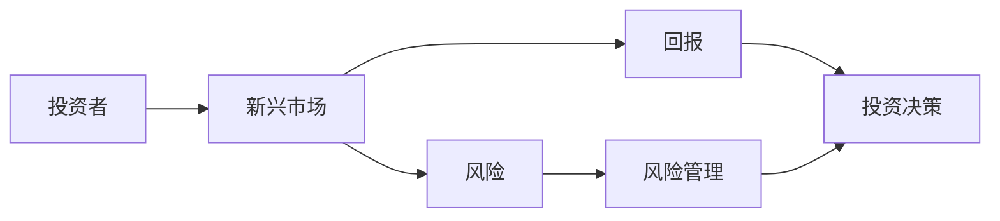

                 


# 新兴市场投资：高风险高回报的机遇与挑战

## 关键词：
新兴市场，高风险高回报，投资策略，风险管理，经济增长，技术驱动，政治风险

## 摘要：
新兴市场作为全球经济增长的重要驱动力，为投资者提供了高回报的潜力，但也伴随着高风险。本文将深入分析新兴市场的定义、特点、投资机遇与挑战，并探讨如何通过科学的投资策略和风险管理来抓住这些机遇。通过数学模型、算法原理和实际案例的分析，本文为投资者提供了全面的理论和实践指导，帮助其在全球化背景下做出明智的投资决策。

---

## 第1章: 新兴市场的定义与特点

### 1.1 新兴市场的定义与背景
#### 1.1.1 新兴市场的定义
新兴市场是指那些经济快速增长、但尚未完全工业化或市场化的国家或地区。这些市场通常具有较大的发展潜力，但也伴随着较高的不确定性。

#### 1.1.2 新兴市场的核心特征
- 经济快速增长：新兴市场国家的GDP增速通常高于发达市场。
- 市场规模扩大：随着人口增长和城市化进程加快，市场规模迅速扩大。
- 产业结构升级：从劳动密集型产业向技术密集型产业转型。

#### 1.1.3 新兴市场与发达市场的区别
| 特性         | 新兴市场                     | 发达市场                     |
|--------------|------------------------------|------------------------------|
| 经济增速      | 快速增长                   | 缓慢或稳定                   |
| 市场成熟度    | 较低                       | 较高                       |
| 技术依赖度    | 依赖外部技术输入             | 自主创新能力较强             |

### 1.2 新兴市场的经济与政治环境
#### 1.2.1 经济增长的潜力
新兴市场的经济增长主要依赖于以下几个方面：
1. **人口红利**：年轻人口比例高，劳动力成本低。
2. **工业化进程**：从劳动密集型产业向技术密集型产业转型。
3. **技术创新**：通过引进技术或自主创新推动经济增长。

#### 1.2.2 政治稳定性与政策风险
新兴市场的政治环境往往不够稳定，政策变化频繁，这给投资者带来了较大的不确定性。例如：
- **政策波动**：政府可能频繁调整货币政策、财政政策或行业监管政策。
- **地缘政治风险**：国际关系紧张可能导致市场波动。

#### 1.2.3 基础设施与市场成熟度
新兴市场的基础设施建设相对落后，市场成熟度较低，这可能限制其发展潜力，但也意味着巨大的增长空间。

---

## 第2章: 新兴市场投资的机遇与挑战

### 2.1 新兴市场的投资机遇
#### 2.1.1 经济增长带来的投资机会
新兴市场的经济增长为投资者提供了以下机会：
1. **消费市场扩张**：随着中产阶级的崛起，消费市场需求增长迅速。
2. **制造业升级**：从劳动密集型产业向高附加值产业转型，带来产业升级的投资机会。
3. **技术创新**：新兴市场在某些领域（如数字经济、人工智能）具有后发优势。

#### 2.1.2 行业发展的潜力
新兴市场在以下几个行业具有较大的发展潜力：
- **科技行业**：互联网、人工智能、大数据等领域。
- **消费行业**：食品饮料、零售、家电等领域。
- **基础设施**：交通、能源、通信等领域。

#### 2.1.3 技术创新与数字化转型
随着全球化的推进，新兴市场在技术创新和数字化转型方面具有较大的潜力。例如，印度的数字支付系统、东南亚的电子商务平台等。

### 2.2 新兴市场的投资挑战
#### 2.2.1 高风险的市场波动
新兴市场的市场波动较大，主要原因包括：
- **经济基本面不稳定**：新兴市场国家的经济结构脆弱，容易受到外部冲击。
- **货币贬值风险**：新兴市场货币容易受到资本外流的影响，导致货币贬值。

#### 2.2.2 政治与政策风险
新兴市场的政治环境不稳定，政策变化频繁，这给投资者带来了较大的不确定性。例如：
- **政策干预**：政府可能限制外资流动或限制某些行业的投资。
- **地缘政治风险**：国际关系紧张可能导致市场波动。

#### 2.2.3 基础设施与法律环境的限制
新兴市场的基础设施建设相对落后，法律环境不完善，这可能限制投资者的投资活动。

---

## 第3章: 新兴市场投资的核心概念与联系

### 3.1 核心概念原理
#### 3.1.1 投资回报与风险的平衡
新兴市场的投资回报与风险密切相关。投资者需要在风险可控的前提下追求较高的投资回报。

#### 3.1.2 市场流动性与资产价格的关系
新兴市场的流动性较低，资产价格容易受到市场情绪的影响，导致价格波动较大。

#### 3.1.3 经济周期与投资策略的调整
新兴市场的经济周期波动较大，投资者需要根据经济周期调整投资策略。

### 3.2 核心概念对比分析
| 特性         | 新兴市场                     | 发达市场                     |
|--------------|------------------------------|------------------------------|
| 投资回报     | 较高                       | 较低                       |
| 风险水平     | 较高                       | 较低                       |
| 市场流动性    | 较低                       | 较高                       |

### 3.3 实体关系图


---

## 第4章: 新兴市场投资的算法原理

### 4.1 投资组合优化算法
#### 4.1.1 现代投资组合理论（MPT）
现代投资组合理论（MPT）由哈里·马科维茨提出，旨在通过优化投资组合的风险和收益。

#### 4.1.2 马科维茨均值-方差优化
马科维茨均值-方差优化的目标是找到最优的投资组合，使得在给定风险水平下，预期收益最大化。

#### 4.1.3 算法实现与代码示例
以下是一个简单的投资组合优化算法的Python代码示例：

```python
import numpy as np
import pandas as pd

# 假设我们有两支股票的收益率数据
returns = np.array([[0.1, 0.15], [0.05, 0.08], [0.12, 0.1]])

# 计算协方差矩阵
cov_matrix = np.cov(returns.T)

# 定义目标函数
def portfolio_var(weights, cov_matrix):
    return np.dot(weights.T, np.dot(cov_matrix, weights))

# 定义约束条件
def constraint(weights):
    return np.sum(weights) - 1

# 使用优化算法求解最优权重
from scipy.optimize import minimize

weights = np.array([0.5, 0.5])
result = minimize(portfolio_var, weights, args=cov_matrix, method='SLSQP', constraints=[{'type': 'eq', 'fun': constraint}])

print("最优权重：", result.x)
print("最小方差：", result.fun)
```

### 4.2 风险管理算法
#### 4.2.1 值在风险（VaR）计算
VaR是衡量投资组合风险的一种方法，表示在一定置信水平下，投资组合可能遭受的最大损失。

#### 4.2.2 等尾风险（CVaR）分析
CVaR是VaR的扩展，表示在VaR水平上的平均损失。

#### 4.2.3 压力测试模型
压力测试用于评估投资组合在极端市场条件下的表现。

### 4.3 投资策略优化
#### 4.3.1 动态资产分配模型
动态资产分配模型根据市场环境的变化调整投资组合的权重。

#### 4.3.2 因子投资策略
因子投资策略通过分析多个因子（如市值、价值、动量等）来选择投资标的。

#### 4.3.3 时间序列分析与预测
时间序列分析用于预测市场趋势，帮助投资者做出投资决策。

---

## 第5章: 数学模型与公式

### 5.1 投资回报与风险模型
#### 5.1.1 投资回报公式
$$ r = \frac{P_{t+1} - P_t}{P_t} $$

#### 5.1.2 风险公式
$$ \sigma = \sqrt{\frac{1}{n}\sum_{i=1}^{n}(r_i - \mu)^2} $$

### 5.2 投资组合优化公式
#### 5.2.1 均值-方差优化
$$ \min \sigma^2 $$
$$ \text{subject to } \mu = \text{target return} $$

---

## 第6章: 系统架构与投资策略

### 6.1 系统架构设计
#### 6.1.1 系统功能模块
- 数据采集模块：采集新兴市场的数据。
- 风险评估模块：评估投资组合的风险。
- 投资决策模块：根据风险评估结果做出投资决策。

#### 6.1.2 系统架构图


### 6.2 投资策略实现
#### 6.2.1 数据采集与处理
使用Python的pandas库处理新兴市场的数据。

#### 6.2.2 风险评估与管理
使用VaR和CVaR模型评估投资组合的风险。

#### 6.2.3 投资决策与优化
根据优化算法选择最优投资组合。

---

## 第7章: 项目实战与案例分析

### 7.1 环境安装与配置
安装必要的Python库，如numpy、pandas、scipy等。

### 7.2 核心代码实现
实现投资组合优化算法和风险管理模型。

### 7.3 实际案例分析
以印度和东南亚市场为例，分析新兴市场的投资机会和风险。

---

## 第8章: 总结与展望

### 8.1 总结
新兴市场具有高风险高回报的特点，投资者需要通过科学的投资策略和风险管理来抓住这些机遇。

### 8.2 未来展望
随着技术的进步和全球化的深入，新兴市场将继续在全球经济中扮演重要角色。投资者需要关注新兴市场的技术创新和政策变化，以应对未来的挑战。

---

## 附录

### 附录A: 数据来源与工具
- 数据来源：世界银行、国际货币基金组织（IMF）、彭博终端等。
- 工具：Python、pandas、numpy、scipy等。

### 附录B: 相关公式与代码

---

## 参考文献
1. 哈里·马科维茨. 《投资组合选择》
2. 杰里米·里德. 《新兴市场的投资策略》
3. 彭博终端. 《全球市场数据报告》

---

## 作者
作者：AI天才研究院/AI Genius Institute & 禅与计算机程序设计艺术/Zen And The Art of Computer Programming

