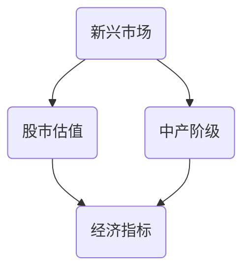

                 

# 新兴市场股市估值与中产阶级崛起的互动

> 关键词：新兴市场、股市估值、中产阶级、经济互动、数据驱动分析

> 摘要：本文探讨了新兴市场股市估值与中产阶级崛起之间的互动关系，分析了两者如何相互影响，并通过数据驱动的方法，提出了优化股市估值的策略和方法。

---

# 第一部分: 引言

## 第1章: 背景介绍

### 1.1 问题背景

#### 1.1.1 新兴市场股市估值的现状
新兴市场股市估值近年来呈现出快速增长的趋势。随着经济全球化和区域经济一体化的推进，新兴市场的股市逐渐成为全球投资者关注的焦点。然而，这些市场的估值波动较大，受到内外部多种因素的影响，如政策变化、国际经济环境、国内经济结构调整等。

#### 1.1.2 中产阶级崛起的经济背景
中产阶级的崛起是新兴市场经济发展的重要特征。随着经济的增长，中产阶级的收入水平不断提高，消费能力增强，成为推动经济增长的重要力量。中产阶级的崛起不仅影响着经济结构，还对股市估值产生了深远的影响。

#### 1.1.3 问题的提出与研究意义
本文旨在探讨新兴市场股市估值与中产阶级崛起之间的互动关系。通过分析两者之间的相互作用，我们可以更好地理解新兴市场的经济动态，并为投资者和政策制定者提供有价值的参考。

### 1.2 问题描述

#### 1.2.1 新兴市场股市估值的核心问题
新兴市场股市估值的核心问题是如何准确评估股市的价值。由于新兴市场本身的不确定性和波动性，传统的估值方法可能不再适用。我们需要找到适合新兴市场的估值模型。

#### 1.2.2 中产阶级崛起的驱动因素
中产阶级的崛起主要由经济发展、教育水平提高、城市化进程加快等因素驱动。这些因素共同作用，推动了中产阶级的扩大。

#### 1.2.3 问题的边界与外延
本文的研究边界限定在新兴市场，重点关注股市估值与中产阶级崛起的互动关系。外延则包括政策、经济、社会等多个方面。

### 1.3 问题解决

#### 1.3.1 新兴市场股市估值的解决方案
提出一种结合市场特征和经济指标的估值模型，用于更准确地评估新兴市场的股市价值。

#### 1.3.2 中产阶级崛起的推动策略
通过政策支持、教育投资、产业升级等措施，进一步推动中产阶级的崛起。

#### 1.3.3 问题解决的路径与方法
通过数据驱动的方法，结合定量分析和定性研究，系统分析新兴市场股市估值与中产阶级崛起的互动关系。

### 1.4 核心概念与联系

#### 1.4.1 核心概念的定义与属性特征对比表

| 概念       | 定义                                                                 | 属性特征                                                                 |
|------------|----------------------------------------------------------------------|--------------------------------------------------------------------------|
| 新兴市场   | 经济发展水平较低但增长潜力大的国家或地区                                         | 经济结构转型、政策支持、人口红利等                                       |
| 股市估值   | 对股票价格的评估，反映市场对公司的未来盈利能力的预期                         | 市盈率、市净率、市值等                                                     |
| 中产阶级   | 收入处于社会中间水平的群体                                                     | 消费能力较强、教育水平较高、社会影响力大等                               |

#### 1.4.2 ER实体关系图

---

# 第二部分: 理论基础

## 第2章: 股市估值的基本原理

### 2.1 股市估值的核心方法
#### 2.1.1 市盈率（P/E比率）
市盈率是衡量股票估值的重要指标，计算公式为：
$$ P/E = \frac{股价}{每股收益} $$

#### 2.1.2 市净率（P/B比率）
市净率是另一个常用的估值指标，计算公式为：
$$ P/B = \frac{股价}{每股净资产} $$

### 2.2 中产阶级的经济特性
#### 2.2.1 收入结构
中产阶级的收入主要来自工资、投资收益等，消费能力较强。

#### 2.2.2 消费行为
中产阶级更倾向于消费高端产品和服务，推动经济增长。

---

# 第三部分: 新兴市场的特点与影响因素

## 第3章: 新兴市场股市的特点

### 3.1 股市波动性
新兴市场的股市波动较大，受政策和外部环境影响显著。

### 3.2 市场流动性
新兴市场股市的流动性相对较弱，投资者结构以散户为主。

## 第4章: 中产阶级崛起的影响因素

### 4.1 经济增长
经济增长是中产阶级崛起的根本动力。

### 4.2 教育水平
教育水平的提高是中产阶级崛起的重要推手。

### 4.3 城市化
城市化加快了中产阶级的崛起，推动了股市的发展。

---

# 第四部分: 股市估值与中产阶级的互动模型

## 第5章: 模型构建

### 5.1 股市估值与中产阶级的双向影响
#### 5.1.1 中产阶级对股市估值的影响
中产阶级的消费能力和投资行为直接影响股市的流动性。

#### 5.1.2 股市估值对中产阶级的影响
股市估值的波动影响中产阶级的财富变化。

### 5.2 数学模型

#### 5.2.1 市盈率模型
$$ P/E = \alpha \times \text{GDP增长率} + \beta \times \text{中产阶级规模} $$

#### 5.2.2 股价预测模型
$$ 股价 = \gamma \times \text{中产阶级收入} + \delta \times \text{政策支持} $$

### 5.3 模型验证

#### 5.3.1 数据来源
使用新兴市场国家的GDP数据、中产阶级收入数据和股市数据进行验证。

#### 5.3.2 实证分析
通过回归分析验证模型的准确性。

---

# 第五部分: 案例分析

## 第6章: 典型新兴市场的股市表现与中产阶级变化

### 6.1 印度股市与中产阶级的互动
#### 6.1.1 印度股市的估值变化
近年来，印度股市的市盈率持续上升，反映了中产阶级的崛起。

#### 6.1.2 中产阶级的规模变化
印度中产阶级的规模从2010年的不到1亿人增长到2020年的超过3亿人。

### 6.2 巴西股市与中产阶级的互动
#### 6.2.1 巴西股市的估值变化
巴西股市在2010-2020年间经历了波动，反映了中产阶级的不稳定增长。

#### 6.2.2 中产阶级的规模变化
巴西中产阶级的规模从2010年的约1.5亿人增长到2020年的超过2亿人。

---

# 第六部分: 政策与投资策略

## 第7章: 政策与投资策略

### 7.1 政策建议
#### 7.1.1 支持中产阶级发展
通过税收政策、教育投资等措施支持中产阶级的发展。

#### 7.1.2 优化股市环境
通过改善市场流动性、加强监管等措施优化股市环境。

### 7.2 投资策略
#### 7.2.1 估值驱动投资
关注市盈率和市净率等估值指标，选择低估的股票。

#### 7.2.2 中长期投资
中长期投资是应对新兴市场股市波动的有效策略。

---

# 第七部分: 结论与展望

## 第8章: 结论

### 8.1 核心发现
本文通过分析新兴市场股市估值与中产阶级崛起的互动关系，提出了优化股市估值的策略和方法。

### 8.2 未来展望
未来研究可以进一步探讨新兴市场股市估值与中产阶级互动的动态变化，并提出更具前瞻性的解决方案。

---

作者：AI天才研究院/AI Genius Institute & 禅与计算机程序设计艺术 /Zen And The Art of Computer Programming

