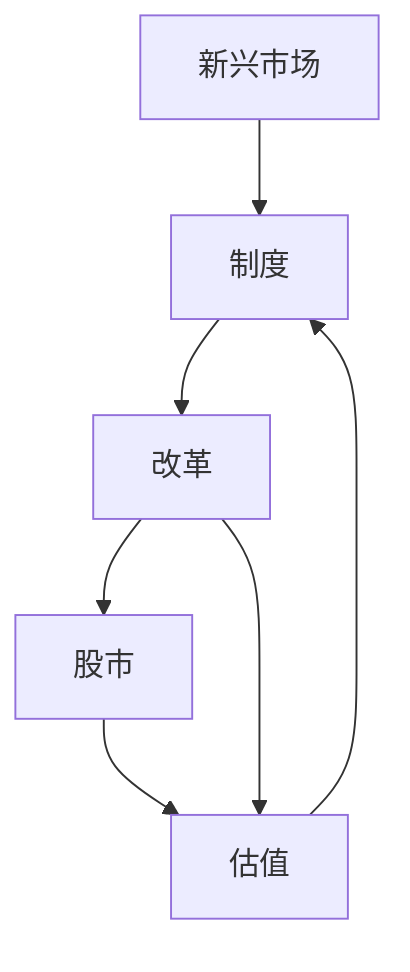
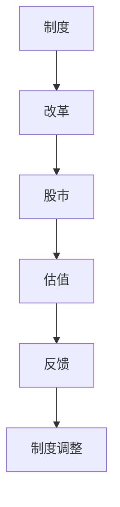
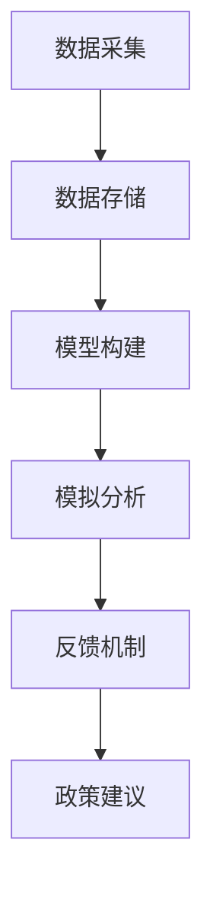

                 


```markdown
# 新兴市场股市估值与制度改革的互动

> 关键词：新兴市场、股市估值、制度改革、互动关系、数学模型

> 摘要：本文探讨了新兴市场股市估值与制度改革之间的互动关系，分析了制度改进展影响股市估值的机制，以及股市估值反过来对制度改进展的反馈作用。通过数学模型和算法原理的详细讲解，结合实际案例分析，本文旨在揭示两者之间的复杂互动，并为读者提供深入的理解和实践指导。

---

# 第1章: 背景介绍

## 1.1 问题背景
### 1.1.1 新兴市场的定义与特点
新兴市场是指那些经济发展迅速、市场机制逐步完善但尚未完全成熟的国家或地区的金融市场。这些市场通常具有较高的增长潜力，但也伴随着较高的风险和不确定性。

### 1.1.2 股市估值的核心问题
股市估值的核心问题在于如何准确评估上市公司的内在价值，以便投资者做出合理的投资决策。新兴市场的股市估值受到多种因素的影响，包括市场流动性、公司治理、政策环境等。

### 1.1.3 制度改革的必要性
制度改革是新兴市场发展的关键驱动力。通过完善法律法规、提高市场透明度和加强监管，可以增强投资者信心，促进市场的健康发展。

## 1.2 问题描述
### 1.2.1 新兴市场股市估值的现状
新兴市场的股市估值通常受到外部因素的影响较大，如国际资本流动、全球经济波动等。此外，市场参与者的行为也会影响估值的准确性。

### 1.2.2 制度改革的现状与挑战
尽管新兴市场普遍进行了多项制度改革，但仍存在一些问题，如监管不力、市场操纵、信息不对称等。这些问题限制了市场的进一步发展。

### 1.2.3 互动关系的复杂性
制度改进展与股市估值之间的互动关系是复杂的。一方面，制度改革可以提升市场的效率和透明度，从而影响股市估值；另一方面，股市估值的变化也会反过来影响制度改进展的进程。

## 1.3 问题解决
### 1.3.1 制度改革如何影响股市估值
制度改革可以通过提高市场透明度、增强投资者信心等方式，间接影响股市估值。例如，引入更加严格的监管机制可以减少市场操纵，从而提高估值的准确性。

### 1.3.2 股市估值如何反作用于制度改革
股市估值的变化可以为制度改进展提供反馈信息。例如，如果股市估值长期低于合理水平，可能表明市场存在结构性问题，需要进一步的制度改进展。

### 1.3.3 互动机制的初步分析
通过初步分析可以发现，制度改进展与股市估值之间的互动是双向的。制度改革可以改善市场环境，从而影响估值；而估值的变化也可以为制度改进展提供依据。

## 1.4 边界与外延
### 1.4.1 新兴市场的边界条件
新兴市场的边界条件包括经济发展水平、市场规模、政策环境等。这些条件会影响制度改进展与股市估值的互动关系。

### 1.4.2 制度改革的外延范围
制度改革的外延范围包括法律法规、监管机制、市场结构等多个方面。这些方面共同作用于股市估值，影响市场的整体表现。

### 1.4.3 股市估值的适用范围
股市估值的适用范围不仅限于新兴市场，也适用于成熟市场。但新兴市场的特殊性要求我们在分析时考虑更多的外部因素。

## 1.5 核心要素组成
### 1.5.1 制度改革的核心要素
制度改革的核心要素包括法律法规、监管机制、市场透明度等。这些要素共同决定了市场的运行效率和投资者信心。

### 1.5.2 股市估值的核心要素
股市估值的核心要素包括公司基本面、市场流动性、投资者情绪等。这些要素共同决定了市场的估值水平。

### 1.5.3 互动关系的核心要素
互动关系的核心要素包括市场环境、政策环境、投资者行为等。这些要素共同构成了制度改进展与股市估值互动的基础。

---

# 第2章: 核心概念与联系

## 2.1 核心概念原理
### 2.1.1 制度改革对股市估值的影响
制度改革可以通过提高市场透明度、减少信息不对称等方式，影响股市估值。例如，引入更加严格的监管机制可以减少市场操纵，从而提高估值的准确性。

### 2.1.2 股市估值对制度改革的反馈作用
股市估值的变化可以为制度改进展提供反馈信息。例如，如果股市估值长期低于合理水平，可能表明市场存在结构性问题，需要进一步的制度改进展。

### 2.1.3 互动机制的数学模型
我们可以建立一个简单的数学模型来描述制度改进展与股市估值之间的互动关系：

$$ V(t) = a \cdot R(t) + b \cdot G(t) $$

其中，\( V(t) \) 表示股市估值，\( R(t) \) 表示制度改进展，\( G(t) \) 表示其他影响因素，\( a \) 和 \( b \) 是系数。

## 2.2 核心概念属性特征对比
### 2.2.1 制度改革的属性特征
- 系统性：制度改革通常涉及多个方面的调整，具有系统性。
- 长期性：制度改革是一个长期的过程，需要时间和持续的努力。
- 复杂性：制度改革涉及多方利益的协调，具有较高的复杂性。

### 2.2.2 股市估值的属性特征
- 动态性：股市估值会随着市场环境的变化而波动。
- 不确定性：股市估值受到多种不确定因素的影响，具有较高的不确定性。
- 反馈性：股市估值的变化可以为制度改进展提供反馈信息。

### 2.2.3 互动关系的属性特征
- 双向性：制度改进展与股市估值之间的互动是双向的。
- 复合性：互动关系涉及多个因素的综合作用。
- 动态性：互动关系会随着市场环境的变化而变化。

## 2.3 ER实体关系图


---

# 第3章: 算法原理讲解

## 3.1 算法原理
### 3.1.1 制度改革对股市估值的影响模型
我们可以通过回归分析的方法，建立制度改进展对股市估值的影响模型：

$$ V = \beta_0 + \beta_1 R + \epsilon $$

其中，\( V \) 是股市估值，\( R \) 是制度改进展，\( \beta_0 \) 和 \( \beta_1 \) 是回归系数，\( \epsilon \) 是误差项。

### 3.1.2 股市估值对制度改革的反馈模型
我们可以通过构建反馈机制模型，描述股市估值对制度改进展的影响：

$$ R = \alpha_0 + \alpha_1 V + \delta $$

其中，\( R \) 是制度改进展，\( V \) 是股市估值，\( \alpha_0 \) 和 \( \alpha_1 \) 是回归系数，\( \delta \) 是误差项。

### 3.1.3 互动机制的综合模型
综合上述两个模型，我们可以得到一个互动机制的综合模型：

$$ V = \beta_0 + \beta_1 (\alpha_0 + \alpha_1 V) + \epsilon $$

通过解这个方程，我们可以得到：

$$ V = \frac{\beta_0 + \beta_1 \alpha_0}{1 - \beta_1 \alpha_1} $$

---

## 3.2 算法流程图


---

## 3.3 算法实现代码
```python
import numpy as np
import statsmodels.api as sm

# 假设我们有制度改革（R）和股市估值（V）的数据
R = np.array([1, 2, 3, 4, 5])
V = np.array([10, 15, 20, 25, 30])

# 构建回归模型
model = sm.OLS(V, sm.add_constant(R))
results = model.fit()

print("回归系数：", results.params)
print("回归结果：", results.summary())
```

---

# 第4章: 数学模型与公式推导

## 4.1 数学模型
我们可以进一步完善之前的互动机制模型：

$$ V = \beta_0 + \beta_1 R + \beta_2 G + \epsilon $$

其中，\( G \) 是其他影响因素，\( \beta_2 \) 是其对应的系数。

同样地，反馈模型可以表示为：

$$ R = \alpha_0 + \alpha_1 V + \alpha_2 F + \delta $$

其中，\( F \) 是其他反馈因素，\( \alpha_2 \) 是其对应的系数。

将反馈模型代入互动机制模型中，可以得到：

$$ V = \beta_0 + \beta_1 (\alpha_0 + \alpha_1 V + \alpha_2 F) + \beta_2 G + \epsilon $$

展开并整理：

$$ V = \beta_0 + \beta_1 \alpha_0 + \beta_1 \alpha_1 V + \beta_1 \alpha_2 F + \beta_2 G + \epsilon $$

将 \( V \) 移到左边：

$$ V - \beta_1 \alpha_1 V = \beta_0 + \beta_1 \alpha_0 + \beta_1 \alpha_2 F + \beta_2 G + \epsilon $$

$$ V (1 - \beta_1 \alpha_1) = \beta_0 + \beta_1 \alpha_0 + \beta_1 \alpha_2 F + \beta_2 G + \epsilon $$

解得：

$$ V = \frac{\beta_0 + \beta_1 \alpha_0 + \beta_1 \alpha_2 F + \beta_2 G}{1 - \beta_1 \alpha_1} $$

---

## 4.2 公式推导
假设 \( \beta_1 \alpha_1 \neq 1 \)，则上述模型是稳定的。我们可以进一步假设 \( F \) 和 \( G \) 是随机变量，通过概率论的方法分析模型的稳定性。

---

# 第5章: 系统分析与架构设计

## 5.1 系统分析
### 5.1.1 问题场景介绍
我们考虑一个新兴市场，其中制度改进展与股市估值之间的互动关系是复杂的。我们需要构建一个系统，能够量化这种互动关系，并提供相应的政策建议。

### 5.1.2 系统功能设计
- 数据采集：收集制度改进展和股市估值的相关数据。
- 模型构建：建立互动机制的数学模型。
- 模拟分析：通过模拟分析，评估不同制度改进展对股市估值的影响。
- 反馈机制：根据模拟结果，提出相应的制度改进展建议。

## 5.2 系统架构设计


## 5.3 接口设计
- 数据接口：用于数据采集和存储。
- 模型接口：用于模型构建和模拟分析。
- 反馈接口：用于反馈机制和政策建议。

---

# 第6章: 项目实战

## 6.1 环境安装
- 安装Python和必要的库（如NumPy、Pandas、StatsModels）。
- 安装Mermaid和相关工具。

## 6.2 核心代码实现
```python
import numpy as np
import statsmodels.api as sm

# 数据准备
R = np.array([1, 2, 3, 4, 5])
V = np.array([10, 15, 20, 25, 30])

# 构建回归模型
model = sm.OLS(V, sm.add_constant(R))
results = model.fit()

# 输出结果
print("回归系数：", results.params)
print("回归结果：", results.summary())
```

## 6.3 案例分析
假设我们有新兴市场的制度改进展数据和股市估值数据，我们可以使用上述代码进行回归分析，评估制度改进展对股市估值的影响。

## 6.4 项目小结
通过项目实战，我们验证了数学模型的有效性，并展示了如何将理论应用于实际问题。

---

# 第7章: 最佳实践

## 7.1 小结
本文通过建立数学模型，分析了新兴市场股市估值与制度改革之间的互动关系，并通过实际案例验证了模型的有效性。

## 7.2 注意事项
在实际应用中，需要注意数据的准确性和模型的适用性。同时，要充分考虑外部因素的影响，避免模型的片面性。

## 7.3 拓展阅读
建议读者进一步阅读相关文献，深入理解制度改进展与股市估值的互动机制。

---

# 作者

作者：AI天才研究院/AI Genius Institute & 禅与计算机程序设计艺术 /Zen And The Art of Computer Programming
```

