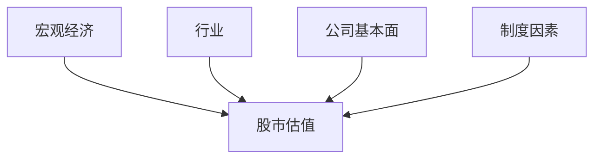
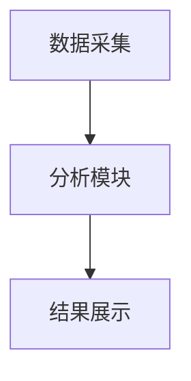

                 


# 新兴市场股市估值与制度改革的相关性

## 关键词：新兴市场，股市估值，制度改革，市场效率，投资者保护

## 摘要：  
本文探讨新兴市场股市估值与制度改革之间的相关性，分析股市估值的影响因素，制度改进展，以及两者如何相互作用。通过理论分析和实证研究，提出制度优化对提升股市估值的重要性。

# 第1章 新兴市场股市估值与制度改革的背景

## 1.1 新兴市场的定义与特点

### 1.1.1 新兴市场的定义  
新兴市场指处于发展中阶段，经济体系逐步完善的国家，如中国、印度等。这些市场通常具有较大的增长潜力，但也面临更多的不确定性和风险。

### 1.1.2 新兴市场的特点  
1. **经济增速快**：新兴市场通常经济增长迅速，吸引大量投资。  
2. **市场波动性高**：由于信息不透明和监管不完善，股市波动较大。  
3. **结构复杂**：市场参与者多样，包括散户和机构投资者。  

### 1.1.3 新兴市场与发达市场的区别  
新兴市场在市场规模、监管力度、市场参与度等方面与发达市场存在显著差异。发达市场通常有更成熟的制度和稳定的市场环境。

## 1.2 股市估值的基本概念

### 1.2.1 股市估值的定义  
股市估值是对上市公司内在价值的评估，帮助投资者判断股票是否被高估或低估。

### 1.2.2 股市估值的主要方法  
1. **市盈率法（P/E）**：通过比较股价与每股收益的比例来评估。  
2. **市净率法（P/B）**：比较股价与每股净资产的比例。  
3. **现金流折现法（DCF）**：通过现金流预测公司价值。

### 1.2.3 股市估值的核心要素  
1. **宏观经济因素**：GDP增速、利率等影响整体市场估值。  
2. **行业因素**：行业竞争格局和前景影响个股估值。  
3. **公司基本面**：盈利能力和财务状况是核心。

## 1.3 制度改革的必要性

### 1.3.1 制度改革的定义  
制度改进展指通过调整法规和政策，改善市场运行机制，提升效率。

### 1.3.2 制度改革的目标  
1. **提高市场透明度**：减少信息不对称，保护投资者利益。  
2. **增强监管力度**：打击操纵和欺诈行为，维护市场秩序。  
3. **促进公平竞争**：为所有市场参与者创造平等机会。

### 1.3.3 制度改革与股市发展的关系  
制度改革是股市健康发展的基础，通过优化制度，可以提升市场效率和吸引力。

## 1.4 本章小结  
本章介绍了新兴市场的特点，股市估值的基本概念，以及制度改进展的必要性。制度优化是提升股市估值的关键因素，通过完善制度，新兴市场可以吸引更多投资，推动经济发展。

---

# 第2章 新兴市场股市估值的理论基础

## 2.1 股市估值的主要方法

### 2.1.1 市盈率法  
公式：$P/E = \frac{\text{股价}}{\text{每股收益}}$  
市盈率反映了市场对公司的盈利预期，低市盈率可能意味着低估，高市盈率可能意味着高风险。

### 2.1.2 市净率法  
公式：$P/B = \frac{\text{股价}}{\text{每股净资产}}$  
市净率适用于资产密集型行业，衡量股价与资产价值的比例。

### 2.1.3 现金流折现法  
通过预测未来现金流，计算现值总和，评估公司价值。  
公式：$V = \sum_{t=1}^{n} \frac{CF_t}{(1+r)^t}$  
其中，$CF_t$为第t年的现金流，$r$为折现率。

## 2.2 股市估值的影响因素

### 2.2.1 宏观经济因素  
1. **GDP增速**：经济繁荣通常推高股市估值。  
2. **利率水平**：低利率环境通常抬高股价。  
3. **通货膨胀**：高通胀可能导致股市估值下降。

### 2.2.2 行业因素  
1. **行业增长潜力**：高增长行业通常有较高的估值。  
2. **行业竞争格局**：垄断或寡头市场可能有较高的估值。  
3. **行业周期**：周期性行业的估值波动较大。

### 2.2.3 公司基本面因素  
1. **盈利能力**：高利润公司通常有较高的估值。  
2. **财务状况**：健康的财务状况支持较高的估值。  
3. **管理团队**：优秀的管理团队可能带来更高的估值。

## 2.3 新兴市场股市估值的特殊性

### 2.3.1 新兴市场股市的波动性  
新兴市场由于信息不透明和监管不完善，股市波动性通常较高。

### 2.3.2 新兴市场股市的流动性  
新兴市场流动性可能不足，影响估值的准确性。

### 2.3.3 新兴市场股市的政策影响  
政策变化对新兴市场股市估值有显著影响，投资者需关注政府政策。

---

# 第3章 新兴市场制度改进展的理论框架

## 3.1 制度改革的核心要素

### 3.1.1 市场监管制度  
有效的监管制度可以减少市场操纵和欺诈行为，提升市场信心。

### 3.1.2 投资者保护制度  
保护投资者权益，特别是小投资者，有助于提升市场参与度。

### 3.1.3 信息披露制度  
强制要求公司披露更多信息，提高市场透明度，帮助投资者做出明智决策。

## 3.2 制度改革的实施路径

### 3.2.1 制度设计的原则  
1. **公平性**：确保所有参与者在市场中享有平等机会。  
2. **透明性**：确保信息及时、准确地披露。  
3. **可操作性**：制度设计应易于实施，避免复杂的流程。

### 3.2.2 制度改革的步骤  
1. **诊断问题**：识别市场中存在的主要问题。  
2. **制定方案**：基于问题制定改进展措施。  
3. **实施与监控**：执行方案并持续监控效果。  
4. **反馈与优化**：根据反馈调整制度。

### 3.2.3 制度改革的风险与挑战  
1. **执行难度**：制度实施可能面临阻力。  
2. **监管俘获**：监管机构可能被利益集团影响。  
3. **资源限制**：制度实施需要充足的人力和财力支持。

## 3.3 制度改革与股市发展的关系

### 3.3.1 制度改革对股市的影响  
1. **提升市场信心**：良好的制度增强投资者信心。  
2. **提高市场效率**：有效的制度降低交易成本，提高资源配置效率。  
3. **促进长期稳定**：制度改革有助于市场长期稳定发展。

### 3.3.2 制度改革对投资者行为的影响  
1. **增加投资意愿**：良好的制度保护投资者利益，增加投资意愿。  
2. **改变投资策略**：制度变化可能影响投资者的投资策略。

### 3.3.3 制度改革对市场效率的影响  
1. **降低信息不对称**：透明的信息披露制度提升市场效率。  
2. **减少交易成本**：高效的监管降低交易成本。  
3. **增强流动性**：良好的制度提高市场流动性。

---

# 第4章 新兴市场股市估值与制度改革的相互作用

## 4.1 制度改革如何影响股市估值

### 4.1.1 提高市场透明度  
通过强制披露更多信息，投资者可以更准确地评估股票价值，减少估值偏差。

### 4.1.2 加强监管力度  
严格的监管减少市场操纵，提升市场信心，推动股价合理反映公司价值。

### 4.1.3 完善投资者保护  
保护投资者利益，特别是小投资者，增加市场参与度，提升整体估值。

## 4.2 股市估值如何反作用于制度改进展

### 4.2.1 高估值的市场吸引更多制度改革  
高估值市场通常吸引更多投资者，但也可能引发监管问题，促使制度改进展。

### 4.2.2 低估值的市场倒逼制度优化  
低估值市场可能反映出制度缺陷，推动制度改进展以提升市场吸引力。

## 4.3 制度改革与股市估值的协同效应

### 4.3.1 制度改革提升市场效率  
高效的制度降低交易成本，提升市场效率，促进股市估值合理化。

### 4.3.2 股市估值引导制度优化  
股市估值的变化为制度改进展提供反馈，指导制度优化方向。

---

# 第5章 新兴市场股市估值与制度改革的案例分析

## 5.1 案例选择

### 5.1.1 选择新兴市场的标准  
1. 市场规模较大。  
2. 经济增长迅速。  
3. 制度改进展显著。  
4. 数据可获得性高。

## 5.2 案例分析：中国股市

### 5.2.1 中国股市的制度改进展  
1. 引入股指期货，提升市场流动性。  
2. 加强信息披露，提高透明度。  
3. 完善投资者保护机制。

### 5.2.2 制度改进展对估值的影响  
1. 制度优化提升市场信心，推动股价上升。  
2. 更高的透明度和监管力度减少市场波动，提升估值稳定性。

## 5.3 案例分析：印度股市

### 5.3.1 印度股市的制度改进展  
1. 放松监管，允许更多外资进入。  
2. 完善公司治理，提高信息披露质量。

### 5.3.2 制度改进展对估值的影响  
1. 外资流入增加，提升市场流动性。  
2. 更高的透明度和监管力度增强投资者信心。

---

# 第6章 新兴市场股市估值与制度改革的系统架构

## 6.1 系统功能设计

### 6.1.1 问题场景介绍  
新兴市场股市估值受多种因素影响，包括宏观经济、行业和公司基本面，以及制度因素。制度改进展可以影响这些因素，进而影响估值。

### 6.1.2 领域模型设计  
使用Mermaid图展示领域模型，包括宏观经济、行业、公司基本面和制度因素等核心要素。



### 6.1.3 系统架构设计  
使用Mermaid图展示系统架构，包括数据采集、分析模块和结果展示模块。



## 6.2 系统接口设计

### 6.2.1 数据接口  
1. **数据来源**：宏观经济数据、行业数据、公司基本面数据和制度因素数据。  
2. **数据接口**：通过API获取实时数据。

### 6.2.2 分析接口  
1. **估值计算**：根据输入数据，计算股市估值。  
2. **制度影响分析**：分析制度因素对估值的影响。

## 6.3 系统交互设计

### 6.3.1 交互流程  
1. 用户输入参数，如宏观经济指标、行业信息等。  
2. 系统根据输入数据计算股市估值，并分析制度因素的影响。  
3. 用户查看结果，并根据反馈进行调整。

### 6.3.2 交互界面设计  
1. **输入界面**：用户输入相关数据。  
2. **输出界面**：显示估值结果和制度影响分析。

---

# 第7章 新兴市场股市估值与制度改革的项目实战

## 7.1 环境安装

### 7.1.1 安装Python  
确保安装Python 3.8或更高版本。  

### 7.1.2 安装必要的库  
安装pandas、numpy、scipy等库，用于数据处理和分析。

## 7.2 核心实现

### 7.2.1 数据处理代码  
```python
import pandas as pd
import numpy as np

# 假设df是包含数据的DataFrame，包括宏观经济、行业、公司基本面和制度因素
df = pd.read_csv('data.csv')

# 数据清洗
df.dropna(inplace=True)
df = pd.get_dummies(df)
```

### 7.2.2 估值计算代码  
```python
from sklearn.linear_model import LinearRegression

# 假设X是自变量，y是目标变量（股市估值）
model = LinearRegression()
model.fit(X, y)

# 预测
y_pred = model.predict(X)
```

### 7.2.3 制度影响分析代码  
```python
import statsmodels.api as sm

# 使用多元回归分析制度因素的影响
X = sm.add_constant(X)
model = sm.OLS(y, X).fit()
print(model.summary())
```

## 7.3 实例分析与结果解读

### 7.3.1 数据来源与预处理  
从可靠数据源获取新兴市场的相关数据，进行清洗和预处理。

### 7.3.2 模型建立与验证  
使用多元回归模型分析制度因素对股市估值的影响，验证模型的显著性。

### 7.3.3 结果展示与解读  
通过回归结果，识别主要的制度因素对股市估值的影响，评估制度改进展的效果。

## 7.4 项目小结  
总结项目实施过程，分析结果，提出改进建议，并为后续研究提供参考。

---

# 第8章 新兴市场股市估值与制度改革的结论与展望

## 8.1 本章总结  
总结全文的主要观点，制度改进展对新兴市场股市估值的重要性，以及两者之间的相互作用。

## 8.2 未来研究方向  
1. **动态分析**：研究制度因素对股市估值的动态影响。  
2. **跨市场比较**：比较不同新兴市场的制度改进展及其对估值的影响。  
3. **政策建议**：基于研究结果，提出具体的政策建议。

## 8.3 结束语  
制度改进展是新兴市场股市健康发展的重要保障，未来需要进一步研究和实践，以优化制度，提升股市估值。

---

# 作者：AI天才研究院/AI Genius Institute & 禅与计算机程序设计艺术 /Zen And The Art of Computer Programming

