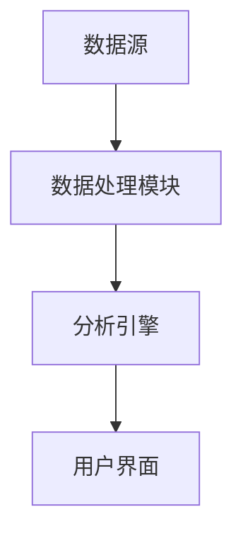

                 


# 新兴市场股市估值与城市更新项目的互动

## 关键词：新兴市场，股市估值，城市更新，互动关系，数学模型，系统架构

## 摘要

本文探讨新兴市场中股市估值与城市更新项目之间的互动关系。通过分析股市估值的核心要素、城市更新项目的关键属性，以及它们之间的互动机制，结合数学模型和系统架构设计，提供理论和实践指导。文章还包括项目实战和最佳实践，帮助读者更好地理解和应用这些概念。

---

## 第一部分：背景介绍

### 第1章：问题背景与研究意义

#### 1.1 新兴市场的定义与特点

- **1.1.1 新兴市场的经济特征**  
  新兴市场是指那些经济增长迅速但尚未达到发达国家水平的国家，如中国、印度和巴西。这些市场通常具有较高的潜在增长率，但也伴随着较高的经济和政治不确定性。

- **1.1.2 新兴市场的股市特点**  
  新兴市场的股市通常波动性较大，交易量增长迅速，市场参与者多元化。与成熟市场相比，新兴市场的股市更容易受到政策变化和地缘政治因素的影响。

- **1.1.3 城市更新在新兴市场中的作用**  
  城市更新项目通过重新开发和改造城市区域，提升城市功能和形象，促进经济发展。在新兴市场，城市更新常伴随着工业化和城市化进程的加速，对当地经济和就业有显著影响。

#### 1.2 股市估值的重要性

- **1.2.1 股市估值的基本概念**  
  股市估值是通过分析公司的财务数据和市场因素来确定股票的合理价格。常用的指标包括市盈率（P/E Ratio）、市净率（P/B Ratio）和股息率（Dividend Yield）。

- **1.2.2 股市估值在经济中的作用**  
  股市估值帮助投资者做出决策，影响市场资金流动。在新兴市场，准确的股市估值对吸引外资和促进经济增长至关重要。

- **1.2.3 新兴市场股市估值的独特性**  
  新兴市场的股市估值受政策、经济波动和市场情绪的影响更大，且数据质量和完整性可能不如成熟市场。

#### 1.3 城市更新项目的影响

- **1.3.1 城市更新的定义**  
  城市更新是指通过重新开发和改造城市区域，提升其经济和社会价值。这通常涉及改善基础设施、优化土地使用和提升城市功能。

- **1.3.2 城市更新对经济和社会的影响**  
  城市更新项目可以增加就业机会，促进经济增长，同时改善居民生活质量。在新兴市场，城市更新常伴随着工业化和城市化进程的加速。

- **1.3.3 城市更新与股市的关系**  
  城市更新项目可能提升相关企业的业绩，从而影响股市估值。例如，房地产开发公司和相关服务行业可能因城市更新项目而受益。

#### 1.4 问题解决与研究目标

- **1.4.1 问题的提出**  
  新兴市场的股市估值受到城市更新项目的影响，但缺乏系统研究。了解两者之间的互动机制对投资者和政策制定者具有重要意义。

- **1.4.2 研究目标**  
  本文旨在分析新兴市场中股市估值与城市更新项目的互动机制，提供理论和实践指导。

- **1.4.3 研究方法与框架**  
  本文采用定量分析、案例研究和比较分析方法，结合数学模型和系统架构设计，系统研究两者之间的互动关系。

---

## 第二部分：核心概念与联系

### 第2章：核心概念解析

#### 2.1 股市估值的核心要素

- **市盈率（P/E Ratio）**  
  市盈率是公司股价与每股收益的比率，反映市场对公司的评价。计算公式为：
  $$P/E = \frac{\text{股价}}{\text{每股收益}}$$

- **市净率（P/B Ratio）**  
  市净率是公司股价与每股净资产的比率，用于评估股票价格是否合理。计算公式为：
  $$P/B = \frac{\text{股价}}{\text{每股净资产}}$$

- **股息率（Dividend Yield）**  
  股息率是股息与股价的比率，衡量投资回报。计算公式为：
  $$\text{股息率} = \frac{\text{股息}}{\text{股价}} \times 100\%$$

#### 2.2 城市更新项目的关键属性

- **项目规模**  
  项目规模决定了投资和收益的规模。较大的项目通常涉及更多的资金和更长的时间跨度。

- **项目周期**  
  城市更新项目通常具有较长的周期，涉及多个阶段，如规划、设计、施工和运营。

- **资金来源**  
  资金来源可能包括政府补贴、私人投资和国际援助。多元化的资金来源有助于降低项目的财务风险。

#### 2.3 互动关系的定义与特征

- **互动关系的定义**  
  股市估值与城市更新项目的互动关系是指两者之间的相互作用，影响彼此的价值和表现。

- **互动关系的特征**  
  互动关系具有复杂性、双向影响和动态变化的特点。股市估值的变化可能影响城市更新项目的融资能力，而城市更新项目的结果又可能反过来影响股市估值。

- **边界与外延**  
  研究范围限于新兴市场的股市和城市更新项目，避免超出主题。

### 第3章：概念对比与关系分析

#### 3.1 概念对比

| 概念       | 股市估值             | 城市更新项目       |
|------------|----------------------|---------------------|
| 定义       | 通过分析确定股票价格 | 重新开发城市区域   |
| 关键指标   | 市盈率、市净率、股息率 | 项目规模、周期、资金来源 |
| 影响因素   | 市场情绪、政策、经济数据 | 政策支持、资金、社会需求 |

#### 3.2 实体关系图

```mermaid
erd
  left(公司) -[拥有]-> 右(股票)
  公司 -[参与]-> 项目(城市更新项目)
  项目(城市更新) -[影响]-> 股市(估值)
```

---

## 第三部分：算法原理与数学模型

### 第4章：算法原理

#### 4.1 算法概述

- **算法目标**  
  量化分析股市估值与城市更新项目之间的互动关系。

- **算法步骤**  
  1. 数据收集：收集相关股市数据和城市更新项目信息。
  2. 数据预处理：清洗和转换数据，确保数据质量。
  3. 模型构建：建立数学模型，分析互动关系。
  4. 结果分析：解释模型结果，验证假设。

- **流程图**  
  ```mermaid
  graph TD
    A[数据收集] --> B[数据预处理]
    B --> C[模型构建]
    C --> D[结果分析]
  ```

#### 4.2 数学模型与公式

- **股市估值模型**  
  使用CAPM模型计算股票的预期回报：
  $$R_i = R_f + \beta_i (R_m - R_f)$$
  其中，\(R_i\) 是股票的预期回报，\(R_f\) 是无风险利率，\(\beta_i\) 是股票的贝塔系数，\(R_m\) 是市场预期回报。

- **城市更新项目评估模型**  
  使用净现值法评估项目经济可行性：
  $$NPV = \sum_{t=1}^{n} \frac{CF_t}{(1 + r)^t} - I$$
  其中，\(CF_t\) 是第 \(t\) 年的现金流，\(r\) 是贴现率，\(I\) 是初始投资。

---

## 第五部分：系统架构设计

### 第5章：系统架构设计

#### 5.1 系统功能设计

- **问题场景**  
  新兴市场中，城市更新项目如何影响股市估值？

- **功能模块**  
  1. 数据采集：收集股市数据和城市更新项目信息。
  2. 数据分析：应用数学模型分析互动关系。
  3. 结果展示：生成可视化报告。

- **领域模型类图**  
  ```mermaid
  classDiagram
    class 公司 {
        员工; 股票;
    }
    class 股票 {
        价格; 涨跌幅;
    }
    class 项目 {
        名称; 状态;
    }
    公司 --> 股票: 拥有
    公司 --> 项目: 参与
  ```

#### 5.2 系统架构图



---

## 第六部分：项目实战

### 第6章：项目实战

#### 6.1 环境安装

- 安装Python、Pandas、Scikit-learn等工具。

#### 6.2 核心实现

- 编写Python代码，实现模型分析。

```python
import pandas as pd
from sklearn.linear_model import LinearRegression

# 加载数据
data = pd.read_csv('data.csv')

# 训练模型
model = LinearRegression()
model.fit(data[['市盈率', '项目规模']], data['股价'])

# 预测结果
predictions = model.predict(data[['市盈率', '项目规模']])
```

#### 6.3 案例分析

- 以某新兴市场为例，分析城市更新项目对股市的影响。

#### 6.4 项目小结

- 总结项目成果，提出改进建议。

---

## 第七部分：最佳实践

### 第7章：最佳实践

#### 7.1 小结

- 总结文章的主要内容和研究成果。

#### 7.2 注意事项

- 数据质量的重要性。
- 模型的选择与调整。
- 结果的验证与解释。

#### 7.3 拓展阅读

- 推荐相关书籍和资源，供读者深入学习。

---

## 结语

通过本文的系统分析，读者可以深入了解新兴市场中股市估值与城市更新项目的互动关系，并通过实际案例和系统架构设计，掌握如何将理论应用于实践。希望本文能为投资者和政策制定者提供有价值的参考。

---

## 作者

作者：AI天才研究院/AI Genius Institute & 禅与计算机程序设计艺术 /Zen And The Art of Computer Programming

