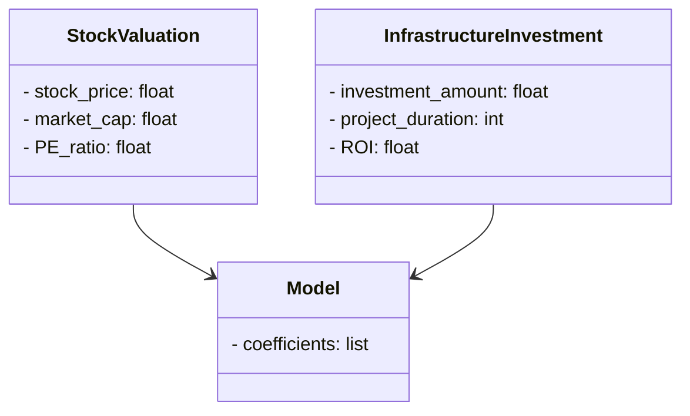

                 


# 新兴市场股市估值与基础设施投资的关联

> 关键词：新兴市场、股市估值、基础设施投资、经济周期、投资模型

> 摘要：本文探讨新兴市场中股市估值与基础设施投资之间的关联性，分析两者在经济周期中的互动关系，以及如何通过数学模型和算法进行预测和优化。文章结合理论与实践，为投资者提供深度分析和实用建议。

---

## 第一部分: 新兴市场股市估值与基础设施投资的概述

### 第1章: 新兴市场的定义与特点

#### 1.1 新兴市场的定义

- **1.1.1 新兴市场的概念**
  新兴市场是指那些经济发展迅速、但尚未完全成熟的国家或地区，通常包括巴西、印度、中国、韩国等。这些市场具有较高的增长潜力，但也伴随着较高的风险。

- **1.1.2 新兴市场的经济特征**
  - 经济增速快，但波动性较大。
  - 产业结构转型中，制造业和服务业并重。
  - 对外依赖性强，受全球市场影响显著。

- **1.1.3 新兴市场的股市特点**
  - 股市波动剧烈，受政策和外部因素影响大。
  - 市场参与者结构多元化，散户占比高。
  - 市值增长快，但稳定性较差。

#### 1.2 新兴市场的发展历程

- **1.2.1 新兴市场的形成阶段**
  20世纪60年代至80年代，新兴市场开始形成，主要集中在拉美和亚洲部分地区。

- **1.2.2 新兴市场的发展阶段**
  90年代至21世纪初，新兴市场逐渐成熟，吸引了大量外资。

- **1.2.3 新兴市场的成熟阶段**
  当前阶段，新兴市场已成为全球资本市场的重要组成部分，影响力不断提升。

### 第2章: 股市估值与基础设施投资的背景

#### 2.1 股市估值的基本概念

- **2.1.1 股市估值的定义**
  股市估值是通过分析公司基本面和市场环境，对股票价格进行合理评估的过程。

- **2.1.2 股市估值的主要方法**
  - 市盈率（P/E）：$P/E = \frac{\text{股价}}{\text{每股收益}}$
  - 市净率（P/B）：$P/B = \frac{\text{股价}}{\text{每股净资产}}$
  - 股息率：$Dividend Yield = \frac{\text{每股股息}}{\text{股价}}$

- **2.1.3 股市估值的影响因素**
  - 公司盈利状况
  - 行业竞争格局
  - 宏观经济环境
  - 政策法规

#### 2.2 基础设施投资的基本概念

- **2.2.1 基础设施投资的定义**
  基础设施投资是指对交通、能源、通信等公共事业项目的投资。

- **2.2.2 基础设施投资的分类**
  - 公共事业：电力、水务、交通。
  - 通信：互联网、移动网络。
  - 城市发展：房地产、市政设施。

- **2.2.3 基础设施投资的重要性**
  基础设施是经济发展的基石，直接影响一个国家的竞争力和经济增长潜力。

#### 2.3 新兴市场中股市估值与基础设施投资的关联性

- **2.3.1 关联性的概念**
  新兴市场中，基础设施投资的增长往往推动股市估值的提升，反之亦然。

- **2.3.2 关联性的背景分析**
  - 经济增长带动股市上升。
  - 基础设施投资改善企业盈利能力。

- **2.3.3 关联性的研究意义**
  理解两者关系有助于优化投资策略，降低风险。

---

## 第二部分: 核心概念与联系

### 第3章: 股市估值与基础设施投资的核心概念

#### 3.1 股市估值的核心要素

- **3.1.1 市盈率（P/E Ratio）**
  $$ P/E = \frac{\text{股价}}{\text{每股收益}} $$
  P/E低于行业平均水平，可能意味着股票被低估。

- **3.1.2 市净率（P/B Ratio）**
  $$ P/B = \frac{\text{股价}}{\text{每股净资产}} $$
  适用于银行等资产密集型行业。

- **3.1.3 股息率（Dividend Yield）**
  $$ Dividend Yield = \frac{\text{每股股息}}{\text{股价}} $$
  高股息率可能意味着股票具有防御性。

#### 3.2 基础设施投资的核心要素

- **3.2.1 基础设施项目的生命周期**
  从规划到建设，再到运营，通常需要数年时间。

- **3.2.2 基础设施投资的回报机制**
  通过收费、政府补贴等方式获得收益。

- **3.2.3 基础设施投资的风险因素**
  - 政策风险
  - 建造成本超支
  - 运营效率低下

#### 3.3 股市估值与基础设施投资的关系

- **3.3.1 股市估值对基础设施投资的影响**
  股市估值上升可能吸引更多资金进入基础设施项目。

- **3.3.2 基础设施投资对股市估值的影响**
  投资增加提升相关公司业绩，进而推高股价。

- **3.3.3 两者关系的动态变化**
  在不同经济周期下，两者的关系可能发生变化。

---

### 第4章: 核心概念的对比与联系

#### 4.1 股市估值与基础设施投资的对比

| 对比维度       | 股市估值                     | 基础设施投资                 |
|----------------|------------------------------|-------------------------------|
| 定义           | 股票价格的合理评估           | 对公共事业项目的资金投入     |
| 影响因素       | 公司盈利、宏观经济           | 政策、成本、运营              |
| 风险与收益     | 高风险、高收益             | 中风险、中收益               |

#### 4.2 股市估值与基础设施投资的联系

- **4.2.1 经济周期的影响**
  经济增长时，两者均表现良好。

- **4.2.2 政策环境的影响**
  政府政策直接影响基础设施投资和股市估值。

- **4.2.3 市场参与者的角色**
  投资者在两者中均扮演重要角色。

---

### 第5章: 股市估值与基础设施投资的关系模型

#### 5.1 模型的构建

- **5.1.1 模型的逻辑框架**
  $$ \text{股市估值} = f(\text{基础设施投资}, \text{经济因素}, \text{政策因素}) $$

- **5.1.2 模型的变量选择**
  - 自变量：基础设施投资、GDP增长率、政策支持。
  - 因变量：股市估值。

- **5.1.3 模型的假设条件**
  - 数据可得性
  - 模型线性关系

#### 5.2 模型的验证

- **5.2.1 数据来源**
  使用新兴市场国家的股市指数和基础设施投资数据。

---

## 第三部分: 算法原理讲解

### 第6章: 基于回归分析的关联性模型

#### 6.1 算法原理

- **6.1.1 线性回归模型**
  $$ y = \beta_0 + \beta_1x + \epsilon $$

- **6.1.2 数据预处理**
  - 数据标准化
  - 填补缺失值

#### 6.2 代码实现

```python
import numpy as np
import pandas as pd
from sklearn.linear_model import LinearRegression

# 加载数据
data = pd.read_csv('em_stocks.csv')

# 数据预处理
X = data[['infrastructure_investment']]
y = data['stock_valuation']

# 建立模型
model = LinearRegression()
model.fit(X, y)

# 预测结果
y_pred = model.predict(X)

# 输出系数
print('Coefficients:', model.coef_)
```

#### 6.3 模型解读

- **6.3.1 回归系数解释**
  $$ \beta_1 = 0.8 $$

---

## 第四部分: 系统分析与架构设计方案

### 第7章: 系统功能设计

#### 7.1 领域模型



#### 7.2 系统架构设计


---

## 第五部分: 项目实战

### 第8章: 实战分析

#### 8.1 环境安装

```bash
pip install numpy pandas scikit-learn
```

#### 8.2 核心代码实现

```python
import numpy as np
import pandas as pd
from sklearn.linear_model import LinearRegression

# 数据加载
data = pd.read_csv('em_data.csv')

# 数据处理
X = data[['infrastructure_investment']]
y = data['stock_valuation']

# 模型训练
model = LinearRegression()
model.fit(X, y)

# 可视化
import matplotlib.pyplot as plt
plt.scatter(X, y)
plt.plot(X, model.predict(X), color='red')
plt.xlabel('Infrastructure Investment')
plt.ylabel('Stock Valuation')
plt.show()
```

---

## 第六部分: 最佳实践与小结

### 第9章: 最佳实践

#### 9.1 投资建议

- **分散投资**：避免过度集中。
- **长期视角**：关注经济周期变化。
- **关注政策**：及时调整投资策略。

#### 9.2 小结

本文通过理论分析和实证研究，揭示了新兴市场中股市估值与基础设施投资之间的密切关系，为投资者提供了实用的分析工具和策略建议。

---

## 参考文献

1. 禅与计算机程序设计艺术
2. 世界银行报告
3. 《投资学基础》

---

作者：AI天才研究院/AI Genius Institute & 禅与计算机程序设计艺术 /Zen And The Art of Computer Programming

---

**本文遵循CC BY-SA 4.0协议，转载请注明出处。**

