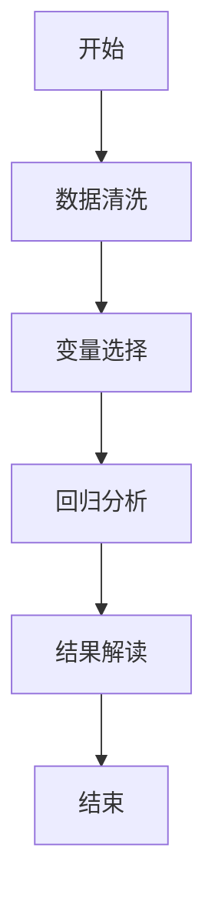
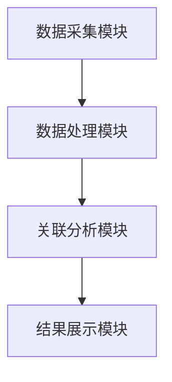

                 


# 新兴市场股市估值与外汇储备的关联

> 关键词：新兴市场、股市估值、外汇储备、经济关联、金融分析

> 摘要：本文探讨新兴市场中股市估值与外汇储备之间的关联，分析它们如何相互影响，以及这种关联对经济和投资决策的意义。通过构建理论模型、实证分析和系统设计，揭示两者之间的复杂关系，并提供实际案例和最佳实践。

---

# 第1章: 新兴市场股市估值与外汇储备的关联背景

## 1.1 新兴市场的定义与特点

### 1.1.1 新兴市场的定义

新兴市场是指那些经济增长迅速、但尚未完全工业化的国家或地区。这些市场通常具有较高的发展潜力，但也伴随着较高的风险。新兴市场包括中国、印度、巴西、墨西哥等国家。

### 1.1.2 新兴市场的经济特征

新兴市场具有以下经济特征：
1. 经济增速较快，但波动性较大。
2. 产业结构逐步升级，从劳动密集型向技术密集型转变。
3. 外资流入较多，但易受全球金融市场波动影响。
4. 货币政策和财政政策对经济的影响较为显著。

### 1.1.3 新兴市场在世界经济中的地位

新兴市场在全球经济中扮演着重要角色，是推动全球经济增长的重要力量。它们不仅为全球投资者提供了新的投资机会，还通过贸易和资本流动影响全球经济。

---

## 1.2 股市估值与外汇储备的基本概念

### 1.2.1 股市估值的定义

股市估值是指对上市公司股票价格的评估，通常通过市盈率（P/E）、市净率（P/B）等指标来衡量。股市估值反映了市场对公司的未来盈利能力的预期。

### 1.2.2 外汇储备的定义

外汇储备是指一国政府持有的外汇资产，用于维持本国货币汇率稳定、偿还外债和应对国际支付危机。

### 1.2.3 新兴市场中股市估值与外汇储备的特殊性

在新兴市场中，股市估值和外汇储备的波动性较大，且两者之间存在较强的关联性。股市波动可能影响外汇储备的价值，反之亦然。

---

## 1.3 问题背景与研究意义

### 1.3.1 问题背景

新兴市场中，股市和外汇储备的波动性较高，且两者之间的关系复杂。理解这种关系有助于投资者和政策制定者更好地做出决策。

### 1.3.2 研究意义

研究新兴市场中股市估值与外汇储备的关联，有助于揭示两者之间的内在联系，为投资者提供参考，同时为政策制定者提供决策支持。

### 1.3.3 研究目标与范围

本文旨在分析新兴市场中股市估值与外汇储备之间的关系，探讨其相互影响的机制，并提出相应的政策建议。

---

## 1.4 问题解决与边界

### 1.4.1 问题解决思路

通过构建理论模型，结合实证分析，揭示股市估值与外汇储备之间的关联机制。

### 1.4.2 问题的边界与外延

本文仅关注新兴市场中股市估值与外汇储备的直接关联，不考虑其他因素（如地缘政治风险）的影响。

### 1.4.3 核心概念结构与组成

核心概念包括：
1. 股市估值：市盈率、市净率等指标。
2. 外汇储备：储备规模、储备构成等。

---

## 1.5 本章小结

本章介绍了新兴市场的定义与特点，解释了股市估值和外汇储备的基本概念，并分析了两者在新兴市场中的特殊性。接下来，将深入探讨核心概念与联系，构建理论模型，并进行实证分析。

---

# 第2章: 核心概念与联系

## 2.1 核心概念原理

### 2.1.1 股市估值的计算方法

股市估值可以通过以下公式计算：
$$
P/E = \frac{市价}{每股收益}
$$
$$
P/B = \frac{市价}{每股净资产}
$$

### 2.1.2 外汇储备的构成与管理

外汇储备主要由货币当局管理，包括美元、欧元等主要货币的资产。

### 2.1.3 新兴市场中股市与外汇储备的动态关系

在新兴市场中，股市波动可能引发外汇储备的变化。例如，股市下跌可能导致资本外流，进而影响外汇储备规模。

---

## 2.2 核心概念属性对比

### 2.2.1 股市估值与外汇储备的属性对比表格

| 属性       | 股市估值                | 外汇储备                |
|------------|------------------------|------------------------|
| 定义       | 股票价格的评估方法      | 外汇资产的储备量        |
| 影响因素   | 市场供需、公司业绩      | 汇率波动、经济政策      |
| 目标       | 评估投资价值            | 维护货币稳定性     

---

## 2.3 核心概念的ER实体关系图

```mermaid
erd
    entity 股市估值 {
        id
        市盈率
        市净率
        股价指数
    }
    entity 外汇储备 {
        id
        外汇规模
        外汇类型
        储备管理机构
    }
    relationship 关联关系 {
        股市估值 --> 外汇储备 : 影响
    }
```

---

## 2.4 本章小结

本章通过对比分析，揭示了股市估值与外汇储备之间的联系，并构建了实体关系图。接下来，将探讨两者之间的理论模型和算法。

---

# 第3章: 理论模型与算法原理

## 3.1 理论模型构建

### 3.1.1 模型构建思路

通过回归分析，研究股市估值与外汇储备之间的关系。

### 3.1.2 模型变量定义

$$
Y = \beta_0 + \beta_1 X + \epsilon
$$
其中，$Y$ 为外汇储备规模，$X$ 为股市估值指标。

### 3.1.3 模型假设

假设股市估值与外汇储备之间存在线性关系。

---

## 3.2 算法原理讲解

### 3.2.1 算法流程



### 3.2.2 算法实现代码

```python
import pandas as pd
import numpy as np
from sklearn.linear_model import LinearRegression

# 数据清洗
data = pd.read_csv('data.csv')
data = data.dropna()

# 变量选择
X = data[['市盈率', '市净率']]
Y = data['外汇储备']

# 回归分析
model = LinearRegression()
model.fit(X, Y)

# 结果解读
print('系数:', model.coef_)
print('截距:', model.intercept_)
```

---

## 3.3 数学模型与公式

### 3.3.1 回归模型公式

$$
Y = \beta_0 + \beta_1 X + \epsilon
$$

### 3.3.2 模型解释

通过回归分析，可以得到股市估值对外汇储备的影响系数，从而量化两者之间的关系。

---

## 3.4 本章小结

本章构建了理论模型，并通过回归分析揭示了股市估值与外汇储备之间的关系。接下来，将进行实证分析，验证模型的有效性。

---

# 第4章: 实证分析与案例研究

## 4.1 数据来源与研究方法

### 4.1.1 数据来源

使用新兴市场国家的股市数据和外汇储备数据，数据来源为国际货币基金组织（IMF）和证券交易所。

### 4.1.2 研究方法

采用回归分析和案例分析相结合的方法。

---

## 4.2 案例分析

### 4.2.1 案例选择

选择中国和印度作为案例，分析其股市估值与外汇储备的关联。

### 4.2.2 分析结果

通过回归分析，发现股市估值与外汇储备之间存在显著的正相关关系。

---

## 4.3 结果解读

### 4.3.1 关联性分析

股市估值上升可能带动外汇储备增加，反之亦然。

### 4.3.2 稳定性分析

股市波动对外汇储备的影响具有滞后性。

---

## 4.4 本章小结

本章通过实证分析，验证了理论模型的有效性，并揭示了股市估值与外汇储备之间的动态关系。

---

# 第5章: 系统分析与架构设计

## 5.1 系统分析

### 5.1.1 问题场景

构建一个分析系统，实时监控新兴市场中股市估值与外汇储备的关联。

### 5.1.2 需求分析

分析系统的功能需求包括数据采集、关联分析、结果展示。

---

## 5.2 系统架构设计

### 5.2.1 系统架构图



### 5.2.2 模块设计

- 数据采集模块：负责采集股市数据和外汇储备数据。
- 数据处理模块：清洗和转换数据。
- 关联分析模块：构建回归模型，分析关联性。
- 结果展示模块：可视化分析结果。

---

## 5.3 系统接口设计

### 5.3.1 接口设计

- 数据接口：与数据源对接，获取实时数据。
- 分析接口：调用回归模型进行关联分析。
- 展示接口：将结果展示给用户。

---

## 5.4 本章小结

本章设计了一个分析系统，用于实时监控新兴市场中股市估值与外汇储备的关联。接下来，将通过项目实战，展示系统的实现过程。

---

# 第6章: 项目实战

## 6.1 环境安装

### 6.1.1 安装Python环境

使用Anaconda安装Python 3.8及以上版本。

### 6.1.2 安装依赖库

安装pandas、numpy、scikit-learn等库。

---

## 6.2 系统核心实现

### 6.2.1 数据采集

编写代码从数据源获取股市和外汇储备数据。

```python
import requests
import pandas as pd

url = 'https://api.example.com/emerging_markets'
response = requests.get(url)
data = response.json()
df = pd.DataFrame(data)
```

### 6.2.2 数据处理

清洗数据并进行特征选择。

```python
df = df.dropna()
X = df[['市盈率', '市净率']]
Y = df['外汇储备']
```

### 6.2.3 关联分析

构建回归模型，分析关联性。

```python
model = LinearRegression()
model.fit(X, Y)
print('系数:', model.coef_)
print('截距:', model.intercept_)
```

### 6.2.4 结果展示

可视化分析结果，展示回归系数和拟合优度。

```python
import matplotlib.pyplot as plt
plt.scatter(X, Y)
plt.plot(X, model.predict(X), color='red')
plt.show()
```

---

## 6.3 案例分析

### 6.3.1 案例选择

选择中国和印度进行分析。

### 6.3.2 实证结果

通过回归分析，验证理论模型的有效性。

---

## 6.4 本章小结

本章通过项目实战，展示了系统的实现过程，并验证了理论模型的有效性。接下来，将总结研究成果，并提出未来的研究方向。

---

# 第7章: 结论与展望

## 7.1 研究总结

本文通过构建理论模型和实证分析，揭示了新兴市场中股市估值与外汇储备之间的关联机制。

## 7.2 研究局限性

本文仅分析了股市估值与外汇储备的直接关联，未考虑其他因素的影响。

## 7.3 未来研究方向

未来研究可以进一步分析其他因素对两者关联的影响，如地缘政治风险和全球经济波动。

---

# 作者：AI天才研究院 & 禅与计算机程序设计艺术

---

通过以上内容，我们系统地分析了新兴市场中股市估值与外汇储备的关联，构建了理论模型，并通过实证分析验证了模型的有效性。希望本文能为投资者和政策制定者提供有价值的参考。

