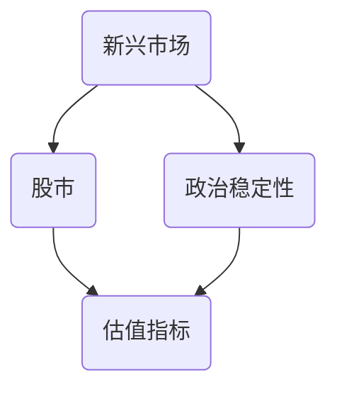
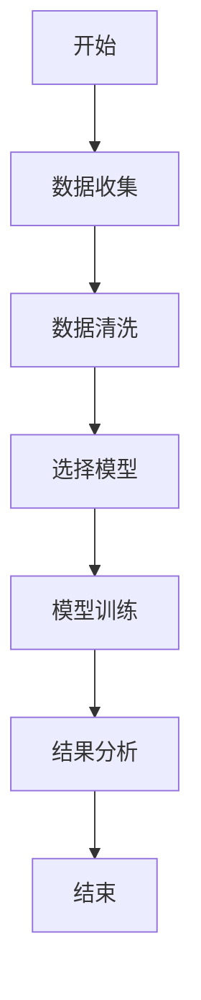
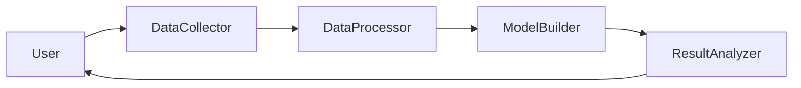

                 


# 新兴市场股市估值与政治稳定性的关联

> 关键词：新兴市场、股市估值、政治稳定性、关联分析、经济影响

> 摘要：本文探讨新兴市场股市估值与政治稳定性的关联，分析两者之间的相互作用机制。通过背景介绍、核心概念、算法原理、系统架构设计、项目实战等部分，深入剖析新兴市场股市估值受政治稳定性影响的内在逻辑，揭示两者之间的复杂关系，为投资者和政策制定者提供有价值的参考。

---

## 第一部分: 新兴市场股市估值与政治稳定性的背景介绍

### 第1章: 新兴市场股市估值与政治稳定性的背景介绍

#### 1.1 新兴市场的定义与特征
- **1.1.1 新兴市场的定义**  
  新兴市场指经济快速发展但尚未完全工业化的国家，通常包括巴西、印度、中国、南非等。这些市场具有高增长潜力，但也面临较高的经济和政治风险。

- **1.1.2 新兴市场的特征**  
  - 经济结构多元化，但制造业和服务业占比较大。  
  - 政治环境复杂，政策变化频繁。  
  - 金融市场逐步完善，但波动性较高。  

- **1.1.3 新兴市场与发达市场的区别**  
  发达市场如美国、欧盟等，经济结构以服务业为主，金融市场成熟稳定，政治风险较低。

#### 1.2 股市估值的核心概念
- **1.2.1 股市估值的定义**  
  股市估值是指对股票价格的评估，通常通过市盈率（P/E）、市净率（P/B）等指标衡量。

- **1.2.2 股市估值的主要指标**  
  - 市盈率（P/E）：股价与每股收益的比率。  
  - 市净率（P/B）：股价与每股净资产的比率。  
  - 市销率（P/S）：股价与每股收入的比率。  

- **1.2.3 股市估值与市场情绪的关系**  
  市场情绪会影响投资者对股票的估值，牛市时估值偏高，熊市时估值偏低。

#### 1.3 政治稳定性的定义与衡量
- **1.3.1 政治稳定性的定义**  
  政治稳定性指政府的持续性和政治环境的稳定程度，反映在一个国家内政治动荡的风险。

- **1.3.2 政治稳定性的衡量因素**  
  - 政治体制的稳定性：如民主制、威权制等。  
  - 政府更迭的频率：政府更迭频繁可能带来政策不确定性。  
  - 社会动荡：如抗议、骚乱等事件的影响。  

- **1.3.3 政治稳定性与经济发展关系**  
  政治稳定是经济发展的基础，政治动荡可能导致经济衰退和股市下跌。

#### 1.4 问题背景与研究意义
- **1.4.1 新兴市场股市波动的现状**  
  新兴市场股市波动剧烈，受国内外多种因素影响。

- **1.4.2 政治稳定性对股市的影响**  
  政治动荡可能导致股市下跌，而政治稳定则有助于股市上涨。

- **1.4.3 研究新兴市场股市估值与政治稳定性的意义**  
  通过分析两者的关系，为投资者提供决策依据，也为政策制定者提供参考。

---

## 第二部分: 股市估值与政治稳定性的核心概念与联系

### 第2章: 股市估值与政治稳定性的核心概念与联系

#### 2.1 核心概念的原理分析
- **2.1.1 股市估值的驱动因素**  
  - 宏观经济指标：GDP增长率、通货膨胀率等。  
  - 行业状况：行业周期性影响企业盈利。  
  - 公司基本面：企业盈利、财务状况等。  

- **2.1.2 政治稳定性的驱动因素**  
  - 政府政策：财政政策、货币政策等。  
  - 社会因素：社会动荡、民族问题等。  
  - 国际关系：国际局势、外交关系等。  

- **2.1.3 两者之间的相互作用**  
  政治稳定性影响投资者信心，进而影响股市估值；股市估值的变化也可能反馈到政治稳定性，影响政府政策。

#### 2.2 核心概念的属性特征对比
- **2.2.1 股市估值的属性特征**  
  - 数值化：通过指标量化评估。  
  - 动态性：随市场波动实时变化。  
  - 复杂性：受多种因素影响，难以预测。  

- **2.2.2 政治稳定性的属性特征**  
  - 定性化：主要通过事件和指标评估。  
  - 稳定性：长期稳定或短期波动。  
  - 外部性：可能受外部事件影响。  

- **2.2.3 两者属性特征对比分析**  
  | 特性 | 股市估值 | 政治稳定性 |  
  |------|----------|------------|  
  | 数值化 | 是       | 否         |  
  | 动态性 | 是       | 是         |  
  | 复杂性 | 是       | 是         |  

#### 2.3 ER实体关系图架构


---

## 第三部分: 股市估值与政治稳定性关联的算法原理

### 第3章: 股市估值与政治稳定性关联的算法原理

#### 3.1 算法原理概述
- **3.1.1 回归分析**  
  回归分析用于研究变量之间的关系，通过建立模型预测股市估值的变化。

- **3.1.2 时间序列分析**  
  时间序列分析用于研究数据随时间的变化趋势，适用于股市和政治稳定性的时间依赖性分析。

- **3.1.3 联合分析**  
  联合分析用于同时考虑多个因素对股市估值的影响，如政治稳定性、经济指标等。

#### 3.2 算法流程图


#### 3.3 回归分析的数学模型
- 简单线性回归模型：
  $$ y = \beta_0 + \beta_1 x + \epsilon $$
  - \( y \)：股市估值  
  - \( x \)：政治稳定性指标  
  - \( \beta_0 \)：截距  
  - \( \beta_1 \)：回归系数  
  - \( \epsilon \)：误差项  

- 多元回归模型：
  $$ y = \beta_0 + \beta_1 x_1 + \beta_2 x_2 + \cdots + \beta_n x_n + \epsilon $$
  - \( x_1, x_2, \ldots, x_n \)：其他影响股市估值的因素  

#### 3.4 时间序列分析
- 自回归积分滑动平均模型（ARIMA）：
  $$ ARIMA(p, d, q) $$
  - \( p \)：自回归阶数  
  - \( d \)：差分阶数  
  - \( q \)：移动平均阶数  

---

## 第四部分: 系统分析与架构设计方案

### 第4章: 系统分析与架构设计方案

#### 4.1 问题场景介绍
- 新兴市场股市估值受政治稳定性影响，需构建一个分析框架，评估两者之间的关系。

#### 4.2 项目介绍
- 开发一个分析系统，整合股市数据和政治稳定性指标，评估两者关联。

#### 4.3 系统功能设计
- 功能模块：
  - 数据采集：获取股市数据和政治稳定性指标。  
  - 数据处理：清洗和预处理数据。  
  - 模型建立：建立回归模型或时间序列模型。  
  - 结果分析：输出分析结果和可视化图表。  

#### 4.4 系统架构设计


#### 4.5 系统交互


---

## 第五部分: 项目实战

### 第5章: 项目实战

#### 5.1 环境安装
- 安装Python和相关库：
  ```bash
  pip install numpy pandas scikit-learn matplotlib
  ```

#### 5.2 系统核心实现源代码
- 数据处理代码：
  ```python
  import pandas as pd
  import numpy as np

  # 读取数据
  df = pd.read_csv('data.csv')
  # 数据清洗
  df.dropna(inplace=True)
  # 标准化处理
  from sklearn.preprocessing import StandardScaler
  scaler = StandardScaler()
  df_scaled = scaler.fit_transform(df)
  ```

- 模型训练代码：
  ```python
  from sklearn.linear_model import LinearRegression
  model = LinearRegression()
  model.fit(X_train, y_train)
  ```

#### 5.3 代码应用解读与分析
- 数据处理：清洗数据，去除缺失值，标准化处理。  
- 模型训练：建立线性回归模型，训练数据集。  
- 结果分析：预测股市估值，分析模型准确性。  

#### 5.4 实际案例分析
- 以某新兴市场为例，分析政治稳定性变化对股市估值的影响。  
- 使用回归模型预测股市估值，评估模型的准确性。  

#### 5.5 项目小结
- 新兴市场股市估值与政治稳定性密切相关，模型可有效预测股市波动。  
- 政治稳定性是影响股市估值的重要因素，需密切关注。

---

## 第六部分: 结论与展望

### 第6章: 结论与展望

#### 6.1 研究结论
- 新兴市场股市估值受政治稳定性影响显著。  
- 政治稳定性是预测股市波动的重要指标。  

#### 6.2 未来研究方向
- 探讨更多影响股市估值的因素。  
- 提升模型的预测准确性。  

#### 6.3 对投资者和政策制定者的建议
- 投资者需关注政治稳定性，合理配置资产。  
- 政府需维护政治稳定，促进经济健康发展。  

---

## 作者：AI天才研究院/AI Genius Institute & 禅与计算机程序设计艺术 /Zen And The Art of Computer Programming

